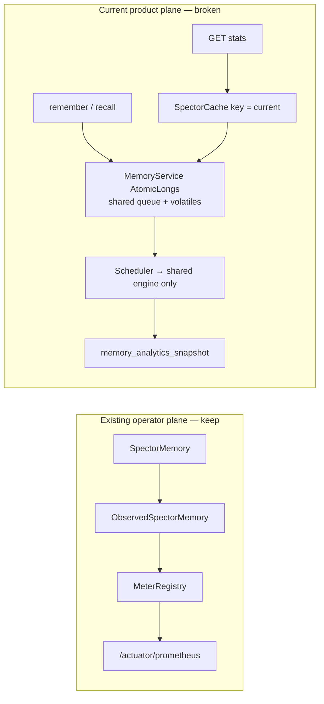
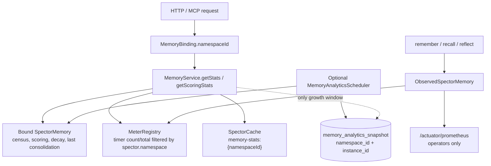

# ADR-0083: Namespace-Isolated Memory Analytics and Stats Telemetry

| Field | Value |
|:---|:---|
| **Status** | Accepted |
| **Date** | 2026-09-18 |
| **Authors** | Spector Maintainers & Architecture Working Group |
| **Deciders** | Spector Technical Steering Committee (TSC) |
| **Supersedes** | None |
| **Superseded By** | None |
| **Last Verified** | 2026-09-18 (Verified against `main`) |

---

## 1. Context

Synapse already isolates cognitive state per catalog namespace. `MemoryRegistry` is a façade over `NamespaceResolver`; the hot cache is keyed by `namespaceId`, and request threads bind a `MemoryBinding` (`accountId`, `namespaceId`, `SpectorMemory`) via `RequestAttributes` (ADR-0062, ADR-0034). Auth-disabled and anonymous traffic still resolve to the shared instance under the sentinel id `default`.

Operator observability is also already built. `memory/spector-metrics` (ADR-0080) wraps engines with `ObservedSpectorMemory`, emits Micrometer Observations (`spector.memory.remember`, `recall`, `forget`, `reinforce`, `reflect`, `consolidate`, plus pathway and scoring names), and binds `SpectorMemoryGauges`. Synapse ships `micrometer-registry-prometheus` and exposes `/actuator/prometheus`. Observation conventions already declare `spector.namespace` as a low-cardinality tag; `ObservableComponent` sets it from `MemoryScope.namespaceId()`.

The Cortex / Synapse **product stats plane did not follow either of those designs**. `MemoryService` is a process-wide Spring singleton that keeps a second set of activity counters (`recallCount`, `rememberCount`, `totalLatencyMs`, `consolidationCount`), consolidation volatiles, and a shared `similarityScores` queue. `getStats()` / `getScoringStats()` cache under the literal key `"current"`. `MemoryAnalyticsScheduler` still resolves the shared `ObjectProvider<SpectorMemory>` and `INSERT`s into `memory_analytics_snapshot` (`PK = snapshot_time`, no namespace column).

That duplication is the remaining gap in issue [#355](https://github.com/spectrayan/spector/issues/355).



## 2. Problem Statement

Live stats, activity rates, and optional history must be correct when more than one principal, namespace, or Synapse replica is active — without inventing a third telemetry stack.

1. **Duplicate activity accounting.** `MemoryService` counters copy what `ObservedSpectorMemory` already records on the `MeterRegistry`. The copies are process-global; the Observations are at least *designed* to carry `spector.namespace`.
2. **Cross-namespace product leakage.** The shared queue, consolidation volatiles, and `"current"` cache key let one namespace’s dashboard serve another’s payload.
3. **Gauges are bound to one engine.** `SpectorMemoryGauges` registers `spector.memory.count` (and index gauges) against a single `SpectorMemory` with no namespace tag. Multi-namespace Synapse either overwrites the meter or only publishes the shared instance.
4. **Namespace tags can go missing on workers.** Observations read `MemoryScope.namespaceId()`, not `delegate.namespaceId()`. An async remember/recall that does not restore `MemoryScope` collapses every tenant into an unlabeled series.
5. **Scheduler and schema are still global.** Capture uses the shared bean; `snapshot_time` as sole PK cannot isolate or fan-in replicas.
6. **Prometheus is not a tenant API.** `/actuator/prometheus` is an operator scrape surface. It has no `MemoryBinding` ACL, dumps every namespace in one text file, and has **no history** unless a Prometheus server exists. Micrometer’s in-process registry is a current snapshot only — it cannot answer “max total memories per day for 30 days” on a laptop/H2 deployment.

Constraints: do not add a parallel Spring Cache stack (ADR-0076). Do not put unbounded `user_id` / `session_id` on more meters (`TokenUsageTracker` already does this; do not spread it). Stats APIs must honor the bound namespace.

## 3. Decision Drivers

- **One activity pipeline.** Delete hand-rolled `AtomicLong`s; activity rates and latency come from Micrometer Observations already defined in ADR-0080.
- **Namespace is the isolation unit** for both meters that are safe to tag and the Cortex stats API — not principal `user_id`.
- **Two planes, two consumers.** `spector-metrics` + Prometheus = operators / Grafana. Synapse stats API + bound `SpectorMemory` = Cortex tenants.
- **Live engine state stays on the engine.** Tier counts, index health, decay forecast, scoring averages, last-consolidation details are not Prometheus time series.
- **History is optional.** A snapshot table exists only if Cortex must ship 30-day growth without a Prometheus server. It is not the source of truth for “now.”
- **Cardinality discipline.** `spector.namespace` on meters is acceptable only while namespace count stays bounded. High-cardinality ids (`session_id`, raw query, memory id) stay on traces, not meters.
- **Scope propagation.** Async work must restore `MemoryScope` (ADR-0026) or Observations must fall back to `SpectorMemory.namespaceId()`.

## 4. Considered Options

### Option 1: Keep process-global `MemoryService` counters and `"current"` cache

- **Description**: Leave the singleton fields, scheduler, and V2 table unchanged.
- **Advantages**: No migration.
- **Disadvantages**: Cross-tenant leakage; duplicates ADR-0080; wrong under replicas.

### Option 2: DB-first product stats keyed by `user_id`, Spring `@Cacheable`

- **Description**: Interval counters flush to SQL; `getStats()` becomes a repository read behind a new Spring Cache manager.
- **Advantages**: Durable history; multi-replica `SUM` if the database is shared.
- **Disadvantages**: Wrong isolation grain (user vs namespace). Makes SQL the source of live engine census. Second cache stack next to `SpectorCache`. Duplicates Micrometer for activity.

### Option 3: Prometheus as the only store — Cortex queries scrape/query_range

- **Description**: Tag every meter with `namespace`, drop `memory_analytics_snapshot` and the hand-rolled counters, have Cortex (or Synapse) query Prometheus for both live values and history.
- **Advantages**: One pipeline; replicas fan-in in Prometheus; no Flyway work.
- **Disadvantages**: No Prometheus server means no history and weak “yesterday” charts. `/actuator/prometheus` leaks every tenant. Product UI becomes coupled to an optional ops backend. Consolidation details, scoring composites, and decay forecasts are not meters. Unbounded namespace cardinality will burn the scrape endpoint.

### Option 4: Micrometer for activity, engine for live stats, optional namespaced snapshot for product history (selected)

- **Description**: Remove `MemoryService` activity fields. Make Observations and per-namespace gauges correct. Compose Cortex `getStats()` / `getScoringStats()` from the bound `SpectorMemory` plus `MeterRegistry` filters. Keep or slim `memory_analytics_snapshot` **only** as an optional first-party growth log, keyed by namespace + instance — never as the live source of truth.
- **Advantages**: Reuses ADR-0080; fixes isolation; works on H2 without Prometheus; does not turn actuator into a tenant API.
- **Disadvantages**: Two read paths to document (ops vs product). Optional table still needs a PK migration if growth charts stay in Synapse.

## 5. Decision Outcome

**Chosen Option**: Option 4.

### 5.1 Three sources, one consumer each

| Data | Source of truth | Consumer |
|:---|:---|:---|
| Recall / remember / consolidate **counts and latency** | `MeterRegistry` via `ObservedSpectorMemory` (`spector.memory.*`) | Grafana / actuator; Cortex live “activity” fields via in-process `MeterRegistry.find(...).tag("spector.namespace", ns)` |
| Tier counts, index stats, decay forecast, scoring averages, last consolidation | Bound `SpectorMemory` + last reflect/consolidate result on that engine | Cortex `GET` stats / scoring |
| 30-day growth when no Prometheus server is deployed | Optional `memory_analytics_snapshot` filtered by bound `namespace_id` | Cortex growth chart only |



### 5.2 Isolation key

The product API and any snapshot rows key by `namespaceId` from `MemoryBinding` (fallback `default`).

`account_id` may be stored on optional snapshot rows for rollups. It is not the meter tag and not the stats-cache key.

Do not key this plane by principal `user_id`. Do not add `user_id` / `session_id` as Micrometer tags on these series.

### 5.3 Changes in `spector-metrics` (required, not optional)

1. **Bind gauges per cached engine.** When `NamespaceResolver` opens a `SpectorMemory`, register `SpectorMemoryGauges` (or a slim census binder) with `.tag("spector.namespace", namespaceId)`. On eviction, remove those meters so stale gauges do not linger.
2. **Always attach namespace on Observations.** Prefer `MemoryScope.namespaceId()` when bound; otherwise `delegate.namespaceId()`. Never emit activity series with a blank namespace when the engine knows its id.
3. **Restore `MemoryScope` on async remember/recall** (already required by ADR-0026). Observations and logs then agree.
4. **Do not treat `spector.namespace` as unbounded.** If a deployment hosts very large catalog cardinalities, aggregate unused namespaces off the scrape (drop series on eviction; do not keep one meter per historical namespace forever).

JVM-global gauges (pinned bytes, page faults, process CPU) stay untagged. They are host metrics.

### 5.4 Changes in `MemoryService`

- Delete `recallCount`, `rememberCount`, `totalLatencyMs`, `consolidationCount`, the shared `similarityScores` queue, and the process-wide consolidation volatiles (`lastConsolidationTimestamp`, `consolidatedMergedCount`, `consolidatedTombstonedCount`, `consolidatedPartitions`).
- Delete `getAndReset*()` as a global scheduler API.
- **Replace `similarityScores` `ConcurrentLinkedQueue<Double>`** with a Micrometer `DistributionSummary` (`spector.memory.recall.similarity`) tagged with `spector.namespace`. `getScoringStats()` reads the distribution snapshot from the registry instead of a hand-rolled rolling queue.
- `getStats()` / `getScoringStats()`:
  - resolve the bound engine
  - cache under `memory-stats:{namespaceId}` / `scoring-stats:{namespaceId}` via existing `SpectorCache` (ADR-0076)
  - **cache TTL is configurable** via `spector.memory.stats.cache-ttl` property (default `5s`)
  - pull activity from `MeterRegistry` filtered by `spector.namespace`
  - **safe fallback to zero on cold start**: if `registry.find(...)` returns `null` (no recall/remember yet), all activity fields default to `0` / `0.0` — no `NullPointerException`
  - pull census / scoring / decay from the engine
  - last consolidation from engine-local state (reflect report / admin), not a singleton volatile
- Growth queries hit the snapshot table **only if history is enabled** (see §5.5); otherwise omit the series or document "history requires Prometheus."

### 5.4.1 Changes in `TelemetryBroadcasterService`

`TelemetryBroadcasterService` maintains its own duplicate set of global `AtomicLong` counters (`recallCount`, `rememberCount`, `reinforceCount`, `forgetCount`) for the Cortex SSE heartbeat ops/sec calculation. These duplicate what `ObservedSpectorMemory` already records.

- Delete all four `AtomicLong` counters and `recordRecall()` / `recordRemember()` / `recordReinforce()` / `recordForget()` methods.
- Remove the corresponding `incrementAndGet()` call sites in `MemoryService` that feed these counters.
- Replace the rolling ops/sec calculation in `broadcastHeartbeat()` with `MeterRegistry` queries:
  ```java
  double recallRate = registry.find("spector.memory.recall")
      .tag("spector.namespace", namespaceId)
      .timer().map(t -> t.count() - lastRecallSnapshot) / dtSec;
  ```
- The heartbeat broadcast should resolve the current namespace from `MemoryScope` or iterate cached namespaces to broadcast per-namespace telemetry.

### 5.5 Property-gated snapshot table

**Decision: keep the table, gate it behind a property.** The snapshot table exists solely for first-party growth charts in Cortex when no Prometheus server is deployed (laptop/H2 standalone mode). It is never the source of truth for live stats.

```yaml
# application.yml
spector:
  memory:
    analytics:
      history:
        enabled: true          # default: true
        interval: 10000        # flush interval in ms (default 10s)
```

When `spector.memory.analytics.history.enabled=true`:

- `MemoryAnalyticsScheduler` iterates `MemoryRegistry` namespace entries (not `ObjectProvider<SpectorMemory>`).
- Writes census + interval **deltas derived from `MeterRegistry`** (or a last-scrape watermark), not from deleted `AtomicLong`s.
- Flyway next version alters `memory_analytics_snapshot`: add `namespace_id` (default `'default'`), `account_id` nullable, `instance_id` (default `'local'`); replace PK with `(snapshot_time, namespace_id, instance_id)`; index `(namespace_id, snapshot_time)`.
- Embedded H2 history is single-process. Shared JDBC can `SUM` interval columns across `instance_id`.

When `spector.memory.analytics.history.enabled=false`:

- The scheduler bean is not created (`@ConditionalOnProperty`).
- Growth charts in Cortex show "History requires Prometheus" or are hidden.
- The V2 table schema remains in place (no destructive migration); it simply receives no new rows.

### 5.6 What Prometheus does *not* become

- Not a Cortex backend.
- Not an authorization boundary.
- Not the store for scoring composites, decay forecasts, or consolidation reports.
- Not required for single-binary correctness of “now.”

Operators who run Prometheus already get replica fan-in and long-range graphs in Grafana. That does not retire the stats API.

### 5.7 Authorization

Stats, scoring, and growth endpoints read `MemoryBinding.current()` and return only that namespace. Actuator prometheus stays an operator endpoint (existing security config). Account-wide rollups are out of scope.

## 6. Pros and Cons of the Options

| Option | Pros | Cons |
|:---|:---|:---|
| **1. Status quo** | No work | Leakage; duplicate counters |
| **2. DB-first + `user_id` + Spring Cache** | Durable log | Wrong grain; second cache; ignores Micrometer |
| **3. Prometheus-only product store** | One ops pipeline | No ACL; no history without Prometheus; bad fit for derived stats; cardinality risk |
| **4. Micrometer + engine + optional snapshot** | Reuses ADR-0080; tenant-safe API; H2 still works | Two documented planes; optional PK migration |

### Positive Consequences

- One implementation of recall/remember timing (ADR-0080).
- Cortex cannot see another namespace’s cache entry or consolidation details.
- Operator scrape remains useful without becoming a product dependency.
- Laptop/H2 deployments still have live dashboards.

### Negative Consequences & Trade-offs

- Namespace-tagged meters increase scrape cardinality; must unbind on eviction.
- If the snapshot table is kept, the V2 primary key still has to change.
- Cortex “activity since process start” follows Micrometer lifetime (restart resets counters) unless history is read from Prometheus or the optional table.

## 7. Implementation Plan

1. **Phase 1 — Metrics correctness.** Per-namespace gauge bind/unbind in `NamespaceResolver`. Observation namespace fallback to `delegate.namespaceId()`. Add `spector.memory.recall.similarity` `DistributionSummary` with namespace tag. Tests that two engines produce two tagged series and that an unbound `MemoryScope` still tags the engine id.
2. **Phase 2 — Delete duplicate counters.** Remove `MemoryService` activity fields (`recallCount`, `rememberCount`, `totalLatencyMs`, `consolidationCount`, `similarityScores`, consolidation volatiles) and `getAndReset*()`. Remove `TelemetryBroadcasterService` duplicate counters (`recallCount`, `rememberCount`, `reinforceCount`, `forgetCount`) and `record*()` methods. Point live activity/ops-sec at `MeterRegistry`. Namespace-scope `SpectorCache` keys with configurable TTL (`spector.memory.stats.cache-ttl`). Add safe cold-start fallbacks (null meter → zero). Move last-consolidation onto engine-local state.
3. **Phase 3 — Property-gated history.** Add `spector.memory.analytics.history.enabled` property (default `true`). Refactor `MemoryAnalyticsScheduler` with `@ConditionalOnProperty`. Migrate `memory_analytics_snapshot` to composite PK (`snapshot_time`, `namespace_id`, `instance_id`). Scheduler iterates `MemoryRegistry` cached entries and derives deltas from `MeterRegistry`.
4. **Phase 4 — Verification and docs.** Isolation tests for stats API. Actuator sample output with two namespaces. Synapse ops note: prometheus is operator-only. Update Cortex growth chart to handle `history.enabled=false`. Close #355 from the implementing PR. Reopen #923 (HNSW `MeterBinder` not implemented).

## 8. Code Reference & Verification

- **Primary Module(s)**: `memory/spector-metrics`, `synapse/spector-synapse`
- **Key Packages**:
  - `com.spectrayan.spector.metrics`
  - `com.spectrayan.spector.metrics.observation`
  - `com.spectrayan.spector.synapse.memory`
  - `com.spectrayan.spector.synapse.platform.events`
- **Classes (current, to change)**:
  - `ObservedSpectorMemory.java` / `ObservableComponent.java` — namespace tag source
  - `SpectorMemoryGauges.java` — bind per engine with `spector.namespace`
  - `MemoryService.java` — delete global counters; namespace cache keys; configurable TTL
  - `TelemetryBroadcasterService.java` — delete duplicate `AtomicLong` counters; read from `MeterRegistry`
  - `MemoryAnalyticsScheduler.java` — `@ConditionalOnProperty`, namespace iteration
  - `MemoryRegistry.java` / `NamespaceResolver.java` — gauge lifecycle + `cachedEntries()`
  - `MemoryBinding.java` / `MemoryScope.java` — request vs scoped identity
- **Schema**: `V2__memory_analytics.sql` (baseline); next migration for namespace composite PK
- **Related records**: ADR-0026, ADR-0034, ADR-0062, ADR-0076, ADR-0079, ADR-0080
- **Related issues**: #355 (close), #923 (reopen — `HnswIndexMetricsBinder` not implemented)
- **Verification Tests** (to add or extend):
  - Two-namespace Observation series (`spector.namespace` distinct)
  - Gauge unbind on registry eviction
  - `getStats()` for namespace A does not return B's cache or census
  - `MeterRegistry` activity matches remember/recall on that engine
  - `TelemetryBroadcasterService` ops/sec reads from `MeterRegistry` (no manual counters)
  - Snapshot query filters `namespace_id` when history enabled
  - Snapshot scheduler does not start when `history.enabled=false`
  - Cold-start: `getStats()` returns zeros before any remember/recall calls

