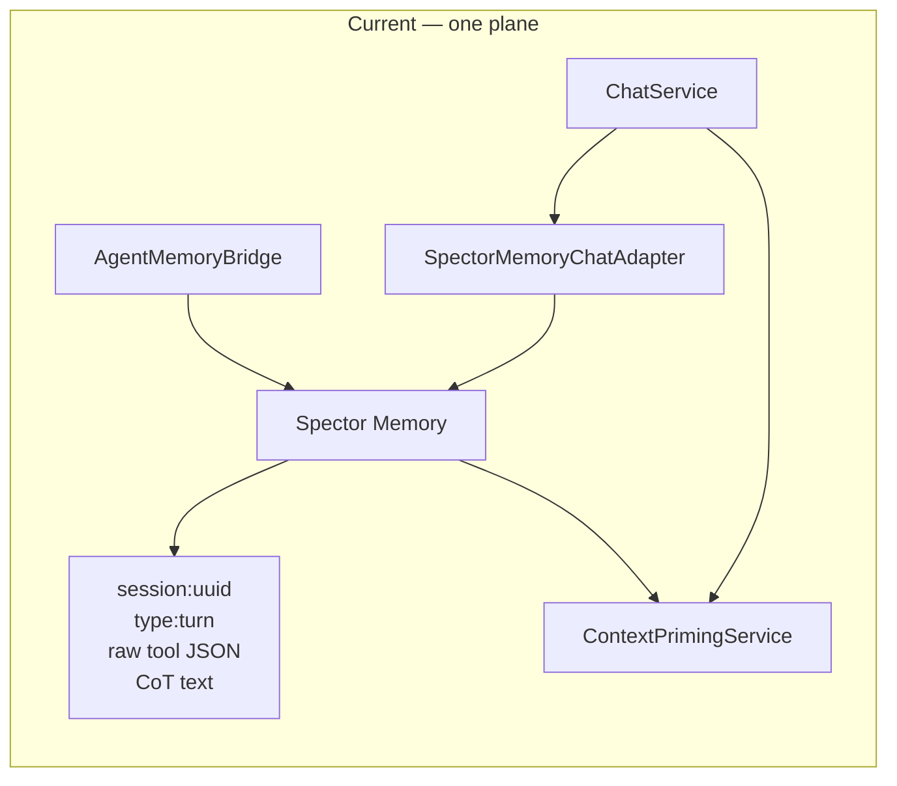
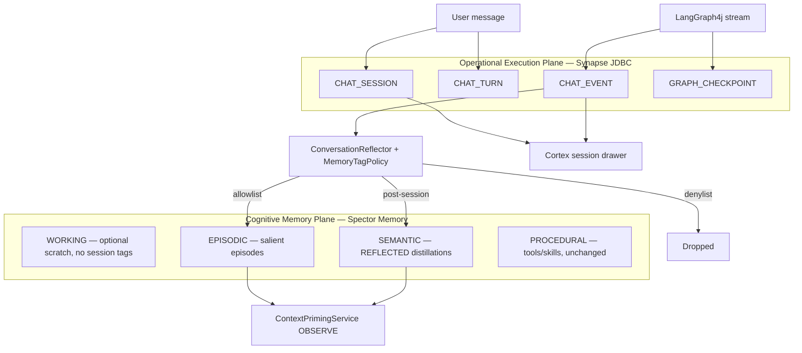
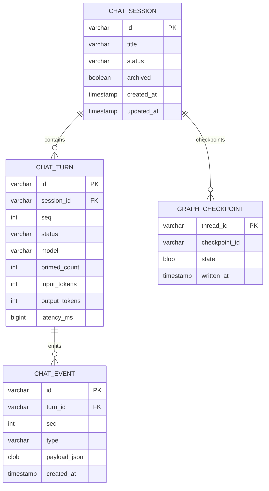
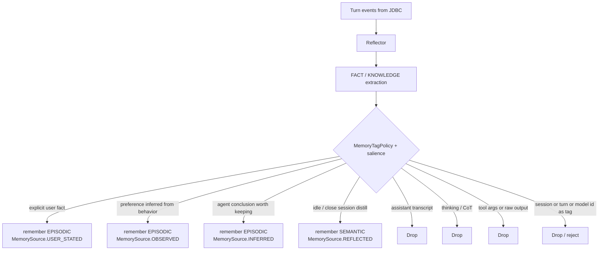
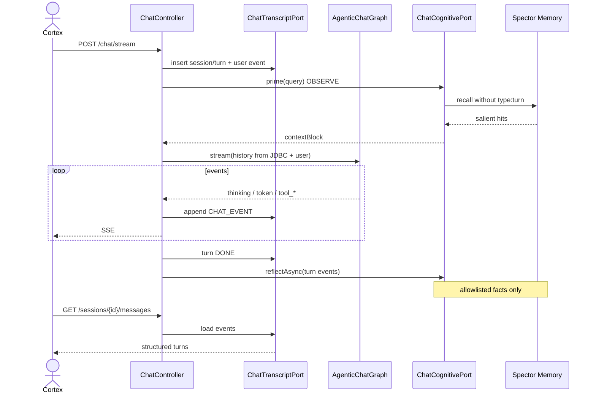
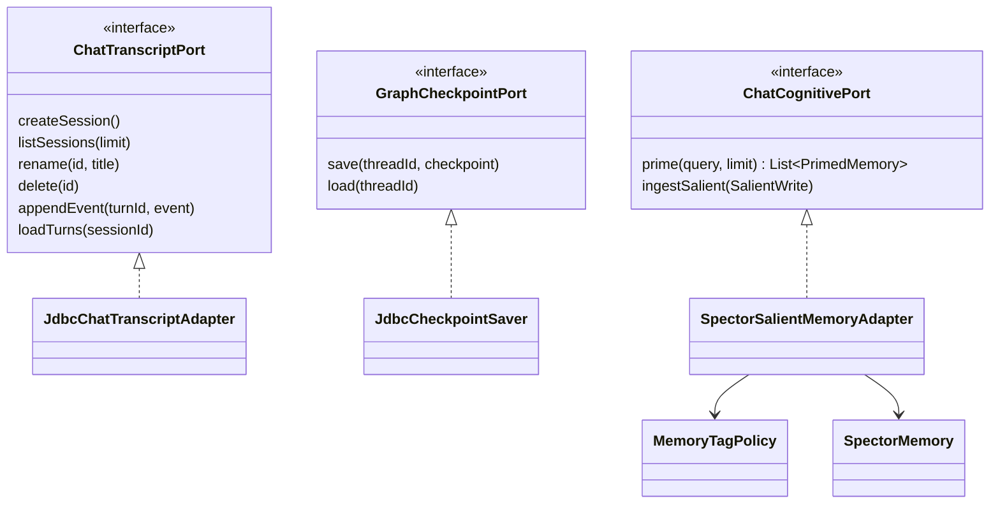

# ADR-0084: Dual-Plane Conversation Persistence

| Field | Value |
|:---|:---|
| **Status** | Proposed |
| **Date** | 2026-09-19 |
| **Authors** | Spector Maintainers & Architecture Working Group |
| **Deciders** | Spector Technical Steering Committee (TSC) |
| **Supersedes** | Operational interpretation of ADR-0006 for Synapse chat transcripts |
| **Superseded By** | None |
| **Related** | ADR-0006 (episodic conversation), ADR-0046 / ADR-0047 (engram model), ADR-0074 (reflect / sleep), ADR-0079 (memory event bus), Issue #263 |
| **Last Verified** | 2026-09-19 (Verified against `main` @ `c06fee8`) |

---

## 1. Context

Synapse chat today persists conversation state by writing raw turns into Spector Memory.

`SpectorMemoryChatAdapter` stores each user and assistant message as an engram tagged `chat`, `session:{sessionId}`, `role:*`, `type:turn`, and lists sessions via further engrams tagged `session_summary` / `id:{sessionId}`. `AgentMemoryBridge` additionally writes thoughts, tool arguments, and tool observations into WORKING and EPISODIC memory with `session_{sessionId}` tags.

That design collapses two different problems onto one store:

1. **Operational execution** — replay this thread, show thinking and tool cards, resume an interrupted LangGraph4j turn, delete a chat, measure tokens.
2. **Cognitive memory** — recall what is true about the user and the world across threads, with decay, provenance, and association.

ADR-0006 correctly models *salient* conversational episodes as off-heap episodic engrams with role and temporal structure. It does not say that every token, CoT scratchpad, and tool JSON dump is an engram. The Synapse adapter treated it that way anyway.

Issue #263 and the streaming-agentic-chat requirements make the collision load-bearing: the UI must replay thinking traces and tool executions, the graph must checkpoint mid-turn, and Spector Memory must not be poisoned by high-cardinality session tags or raw tool payloads.

---

## 2. Problem Statement

Using Spector Memory as the chat database creates four architectural failures:

1. **Tag-index pollution.** Session UUIDs are high-cardinality. The inverted tag index is built for low-cardinality synaptic labels (`preference`, `people`, `project`). `session:{uuid}` explodes the tag dictionary and makes `browse()` a session table scan by another name.
2. **Vector-space poisoning.** Raw assistant transcripts, `<think>` traces, and tool JSON are embedded. Recall then surfaces procedure noise (“Action: Called tool `memory_recall` with args …”) instead of facts.
3. **Missing operational fidelity.** `ChatMemoryPort.saveToSession(user, assistant, model)` drops thinking traces, tool calls, tool outputs, token usage, and graph checkpoints. `GET /sessions/{id}/messages` cannot satisfy the new UI contract.
4. **No interrupt/resume.** LangGraph4j state is not checkpointed. A dropped SSE connection loses the turn. Memory engrams cannot hold compiled graph blobs.

Cognitive provenance already exists (`MemorySource.USER_STATED | OBSERVED | INFERRED | REFLECTED`) and is underused by the chat path. Reflection writes through `memory_remember` without a stable source or an allowlist.

---

## 3. Decision Drivers

- **Separation of concerns**: transcripts are logs; engrams are memories.
- **Replay parity**: live SSE events and historical turns share one durable event log.
- **Memory hygiene**: no high-cardinality identifiers in synaptic tags; no raw tool or CoT payloads in the vector space.
- **Provenance discipline**: every engram written from chat has an explicit `MemorySource`.
- **Resumability**: interrupted agent turns resume from a JDBC checkpoint, not from a reconstructed prompt guess.
- **Store fitness**: H2/JDBC is the right tool for CRUD sessions; Spector Memory is the right tool for fused recall.
- **Continuity with ADR-0006 / ADR-0047**: episodic *episodes* remain first-class in memory — they are distilled from the operational log, not identical to it.
- **Compatibility**: H2 for local/dev, ANSI SQL that can move to Postgres without a rewrite.

---

## 4. Considered Options

### Option 1: Keep Spector Memory as the transcript store (status quo)

- **Description**: Add more tags (`type:thinking`, `type:tool`) and browse them for replay.
- **Advantages**: No new database; one “everything is memory” story.
- **Disadvantages**: Deepens tag pollution; tool JSON remains embedded; checkpoints still have no home; delete-session becomes `forget()` across unbounded ids; contradicts the #263 dual-plane requirement.

### Option 2: Dual-write every event to JDBC and Memory

- **Description**: Durable JDBC log plus an engram per event.
- **Advantages**: Replay and recall both “just work.”
- **Disadvantages**: Doubles write amplification; still poisons recall; session tags still pollute the index. The cognitive plane is not a backup of the operational plane.

### Option 3: Dual-plane persistence with gated cognitive ingestion (selected)

- **Description**: JDBC is the system of record for sessions, events, and graph checkpoints. Spector Memory receives only salient episodes and distilled facts, tagged with domain vocabulary and formal provenance. Session identifiers never enter the tag index.
- **Advantages**: Fits each store; enables UI replay and graph resume; protects recall quality; aligns with ReflectPathway / ADR-0074.
- **Disadvantages**: Two write paths to reason about; migration off existing `session:` engrams; Cortex must stop treating Memory browse as a session list.

### Option 4: Operational plane only (no chat-driven remember)

- **Description**: JDBC for everything; priming uses only memories created by explicit user/`memory_remember` tools.
- **Advantages**: Simplest hygiene.
- **Disadvantages**: Throws away automatic episodic learning — the product differentiator. Rejected as the steady state; acceptable only as a temporary feature flag while the reflector is built.

---

## 5. Decision Outcome

**Chosen Option**: Option 3 — Dual-plane persistence with gated cognitive ingestion.

### 5.1 Plane definitions

| Plane | Store | Owns | Does not own |
|:---|:---|:---|:---|
| Operational | H2/JDBC in `spector-synapse` | session CRUD, chronological events, thinking, tool payloads, token usage, LangGraph4j checkpoints | semantic truth, association graphs, decay |
| Cognitive | Spector Memory | salient user facts, observed preferences, inferred insights, reflected summaries | thread replay, tool traces, graph blobs, session lists |

### 5.2 Operational schema

`CHAT_EVENT.type` is the same vocabulary as SSE: `user`, `thinking`, `token`, `tool_call`, `tool_result`, `done`, `error`.

`GRAPH_CHECKPOINT.thread_id` equals `CHAT_SESSION.id`. The saver implements LangGraph4j `BaseCheckpointSaver`.

Delete session deletes operational rows and checkpoints only. Cognitive engrams are not cascade-deleted; they are knowledge, not thread UI state.

### 5.3 Cognitive ingestion policy

**Allowlist tags**: domain labels only (`preference`, `people`, `decision`, `project`, …).

**Denylist tags** (reject or strip with error metric):

- `session:`, `session_`, `id:<sessionId>`
- `type:turn`, `role:user`, `role:assistant` as a substitute for a transcript store
- `model:<name>`

**Denylist payloads**: tool JSON dumps, CoT / `<think>` blocks, full assistant messages, graph checkpoints.

Correlation from an engram back to a thread, if ever needed, is an operational attribute on JDBC (`source_turn_id` on a side table) — not a synaptic tag.

### 5.4 Read paths

- **Thread history** always comes from JDBC.
- **Cross-session priming** always comes from Spector Memory in `RecallMode.OBSERVE` (no LTP side effects).
- **Graph messages channel** is the last N operational user/assistant texts (optionally compacted by `ConversationSummarizer`), not a Memory browse of `type:turn`.

### 5.5 Port split

`ChatMemoryPort` / `SpectorMemoryChatAdapter.saveToSession` become deprecated shims. `AgentMemoryBridge` is removed from the chat path. Other graphs may keep WORKING scratch **without** session-id tags.

### 5.6 Relationship to prior ADRs

| ADR | Relationship |
|:---|:---|
| ADR-0006 | Remains valid for *salient* episodic conversation structure (role, temporal chain). Synapse will not persist every operational turn as an engram. This ADR supersedes that misuse. |
| ADR-0046 / 0047 | Engram / store hierarchy unchanged. Chat writes go through `MemoryRemember` with `MemoryType` + `MemorySource`, never a second write API. |
| ADR-0074 | `ConversationReflector` is the Synapse-side feeder into ReflectPathway-style distillation (`MemorySource.REFLECTED`). |
| ADR-0079 | Dashboard SSE may observe `chat.done` / memory mutations. Per-token chat transport is request-scoped and is not the memory event bus. |

### Positive Consequences

- Session list/delete/rename become ordinary SQL.
- Thinking and tool cards can be replayed bit-identically from `CHAT_EVENT`.
- Interrupted turns resume via `threadId = sessionId`.
- Tag index and vector space stay reserved for cognition.
- Provenance on recalled facts is trustworthy enough to show in Cortex source chips.

### Negative Consequences & Trade-offs

- Two stores to operate, back up, and document.
- Existing `session:` engrams must be migrated or forgotten.
- Reflector quality becomes the bottleneck for “the agent remembers me,” instead of dumping the whole transcript into recall.
- H2 file durability is weaker than Postgres; production Synapse should plan a datasource upgrade, not a memory-as-DB fallback.

---

## 6. Pros and Cons of the Options

| Option | Pros | Cons |
|:---|:---|:---|
| **1. Memory-as-transcript** | One store | Tag pollution, no checkpoints, weak replay |
| **2. Dual-write everything** | Redundant copies | Write amp + still poisons recall |
| **3. Dual-plane + gate (selected)** | Store fit, replay, hygiene, resume | Migration + two ports |
| **4. JDBC only** | Simplest hygiene | Loses automatic episodic learning |

---

## 7. Implementation Plan

1. **Phase 1 — Schema and ports.** Flyway tables; `ChatTranscriptPort` / `JdbcCheckpointSaver`; session list/rename/delete/load on `ChatController`. Stop `saveToSession` writes.
2. **Phase 2 — Event log as source of truth.** Every SSE event appends `CHAT_EVENT`. `GET .../messages` reconstructs structured turns.
3. **Phase 3 — Tag policy.** `MemoryTagPolicy` rejects denylist tags on all Synapse remember paths. Detach `AgentMemoryBridge` from chat.
4. **Phase 4 — Gated reflector.** Map FACT → `USER_STATED`/`OBSERVED`, KNOWLEDGE → `INFERRED`, post-session summary → `REFLECTED`. No tool/CoT payloads.
5. **Phase 5 — Migration.** Optional dual-read of old `session:` engrams; copy into JDBC; `forget()` migrated turns; metric `chat.memory.session_tag_writes` must stay at zero.
6. **Phase 6 — Verification.** Tests listed in §8. Update ADR-0006 “Last Verified” note to point here for Synapse chat.

---

## 8. Code Reference & Verification

- **Primary Module(s)**: `synapse/spector-synapse`, `memory/spector-memory` (policy only)
- **Key Packages**:
  - `com.spectrayan.spector.synapse.agent.chat.service`
  - `com.spectrayan.spector.synapse.agent.chat.infrastructure`
  - `com.spectrayan.spector.synapse.agent.cognitive`
  - `com.spectrayan.spector.kernel.api` (`MemorySource`, `MemoryType`)
- **Current classes this ADR changes**:
  - `SpectorMemoryChatAdapter.java` — remove transcript writes
  - `ChatMemoryPort.java` — split / deprecate
  - `ChatService.java` — dual ports
  - `ConversationReflector.java` — provenance + allowlist
  - `AgentMemoryBridge.java` — detach from chat
  - `ChatController.java` — session mutate + structured GET
- **New classes**:
  - `JdbcChatTranscriptAdapter`, `JdbcCheckpointSaver`
  - `SpectorSalientMemoryAdapter`, `MemoryTagPolicy`
  - Flyway `Vxxx__chat_operational_plane.sql`
- **Verification Tests**:
  - `JdbcChatTranscriptAdapterTest` — CRUD + event order
  - `MemoryTagPolicyTest` — reject `session:` / tool JSON
  - `ConversationReflectorProvenanceTest` — sources and denylist
  - `ChatSessionApiIT` — list / rename / delete / messages
  - `NoSessionTagsInMemoryIT` — browse after a chat turn finds zero `session:` tags
  - `CheckpointResumeIT` — interrupt and resume a compiled graph thread

### Invariants (must remain true)

1. No engram written by Synapse chat carries a tag matching `session[:_].+` or `id:<tsid>`.
2. No engram payload written by Synapse chat is a raw tool argument object, tool result blob, or thinking scratchpad.
3. Every chat-originated engram has `MemorySource ∈ {USER_STATED, OBSERVED, INFERRED, REFLECTED}`.
4. `GET /api/v1/chat/sessions/{id}/messages` does not call `SpectorMemory.browse`.
5. `ContextPrimingService` does not call `ChatTranscriptPort`.
6. Deleting a session does not call `SpectorMemory.forget` for reflected facts.
