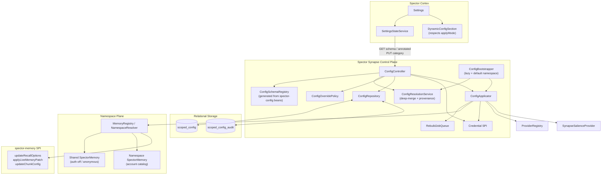
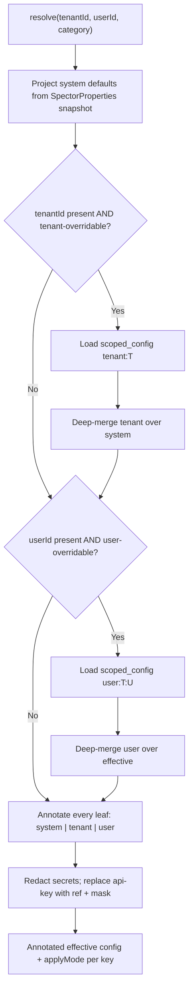
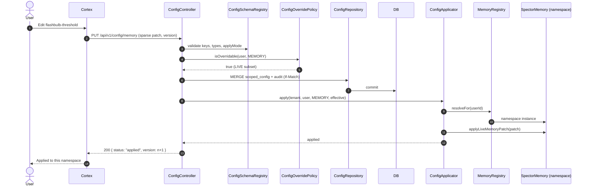

# ADR-0085: Dynamic Synapse Configuration Overrides and SpectorMemory Runtime Propagation Architecture

| Field | Value |
|:---|:---|
| **Status** | Proposed |
| **Date** | 2026-09-19 |
| **Authors** | Spector Maintainers & Architecture Working Group |
| **Deciders** | Spector Technical Steering Committee (TSC) |
| **Supersedes** | None |
| **Superseded By** | None |
| **Extends** | [ADR-0031](0031-unified-configuration-architecture.md) |
| **Related** | ADR-0029 (namespace / catalog plane), ADR-0034 / ADR-0067 (cell HA & sticky sharding) |
| **Last Verified** | 2026-09-19 (verified against `main` at `ConfigCategory`, `ConfigApplicator`, `ConfigResolutionService`, `ConfigController`, `ConfigBootstrapper`, `ConfigRepository`, `MemoryRegistry`, `HnswIndex`, `HnswProperties`, `SpectorMemory`) |

---

## 1. Context

In [ADR-0031](0031-unified-configuration-architecture.md), Spector unified static bootstrap configuration across the reactor under the aggregate root `SpectorProperties` and the loader seam `SpectorConfigSource`. ADR-0031 eliminated ad-hoc post-bootstrap calls to `System.getProperty("spector.*")` and established `spector-defaults.yml`, environment variables, and `spector.yml` as the immutable **system baseline** for the engine.

ADR-0031 does **not** make every property live-tunable. It makes the baseline deterministic. That distinction is load-bearing for this ADR.

Modern autonomous-agent deployments (Spector Cortex UI, multi-agent swarms, companion personalization, multi-tenant Synapse) still need a control plane that can:

1. Persist overrides across process restarts without rewriting `spector.yml` (read-only containers, Kubernetes, multi-replica cells).
2. Scope overrides hierarchically: system baseline → tenant / workspace → user / agent, with provenance on every key.
3. Push *some* of those overrides into a running cognitive kernel without restarting the JVM or unmapping Panama slabs.
4. Refuse to pretend that *all* of `SpectorProperties` is a live slider. Construction-time index geometry, arena capacity, persistence mode, embedding dimensionality, and virtual-thread topology are not the same kind of thing as `flashbulb-threshold`.

Synapse already has a prototype of this plane: `ConfigController`, `ConfigResolutionService`, `ConfigApplicator`, `ConfigRepository` (`scoped_config` + `MERGE`), `ConfigOverridePolicy`, and `ConfigBootstrapper`. The prototype is the right skeleton. It is not yet a complete architecture.

Synapse also already has per-namespace memory. `MemoryRegistry` is a façade over `NamespaceResolver` / `AccountCatalog`: anonymous / auth-off traffic uses the shared `SpectorMemory` bean; authenticated traffic opens a namespace-scoped instance. Any runtime applicator that targets only the shared bean is applying the wrong instance as soon as tenancy is on.

---

## 2. Problem Statement

An audit of the prototype against `SpectorProperties` and against the namespace plane found eight defects. The original draft of this ADR diagnosed (1)–(4) and under-specified (5)–(8). All eight are in scope.

### 2.1 Category blind-spot

`ConfigCategory` is five enum constants: `LLM_PROVIDER`, `INGESTION`, `RAG`, `SALIENCE`, `SOUL`. Memory engine (`memory.*`), recall pipeline (`recall.*`), vector indexes (`hnsw.*`, `spectrum.*`), embedding providers, multimodal, telemetry, concurrency, and the ADR-0031 sub-beans (dream, two-factor, WAL, vacuum, session, hardware, events) are invisible to Cortex.

### 2.2 Applicator is write-mostly theatre

`ConfigApplicator` handles LLM activation via `ProviderRegistry`, ingestion via `spectorMemory.updateChunkConfig`, and salience/soul via `SynapseSalienceProvider`. RAG is a log line. There is no `updateRecallOptions` / typed memory patch on `SpectorMemory`. Saving a memory setting through the API has zero engine effect.

`apply()` enqueues a `PendingChange` onto a `ConcurrentLinkedQueue` and immediately calls `drainPending()` on the caller thread. There is no worker, no retry, no poison handling. Failures are logged and dropped after the row is already committed. The HTTP response still returns `200 { status: "saved", appliedAt }`.

### 2.3 Incomplete schema contract

`GET /api/v1/config/schema/{category}` describes fields only for `LLM_PROVIDER` and `INGESTION`. RAG / salience / soul return empty lists even though the applicator consumes those maps. Schema defaults already drift from the engine (`chunk-size` 800/100 in the controller vs 2500/200 projected from `SpectorProperties` in `ingestionDefaults()`). Hand-maintaining schema maps next to beans next to applicator handlers is three sources of truth.

### 2.4 Policy deadlock at user scope — and the wrong proposed fix

`ConfigOverridePolicy.DEFAULT` restricts user overrides to the five prototype categories. Cortex users on default installs cannot persist memory or index documents.

The wrong fix is “open DEFAULT to every category.” The policy type already has `LOCKED`, `DEFAULT`, and `OPEN`. Collapsing DEFAULT into OPEN destroys the policy engine.

### 2.5 Scoped resolution applied to a process-global kernel

`ConfigApplicator` injects `ObjectProvider<SpectorMemory>` (the shared bean). `ConfigBootstrapper` rehydrates only `"default"` / `"default"`. User-scoped `flashbulb-threshold` or `text-search.mode` would mutate whoever holds the shared instance, or never reach the namespace that `MemoryRegistry.resolveFor(userId)` already knows how to find.

Three-tier scoped resolution and a single in-process kernel with volatile fields cannot both be true unless knobs are classified as *request/namespace policy* vs *instance topology*.

### 2.6 Construction-time parameters sold as hot-swap

`HnswIndex` takes `m` and `efConstruction` at construction; neighbor arrays bake graph shape. `ef-search` is the only honestly query-time HNSW parameter. Spectrum `n-centroids` / `kmeans-iterations`, embedding `dimensions`, `memory.capacity`, `persistence-mode`, WAL geometry, and `concurrency.virtual-threads.enabled` are slab / VMA / bootstrap topology. Promising “no unmap of Panama slabs” and listing those keys on a live apply path is how Cortex grows sliders that either no-op or corrupt the arena.

### 2.7 Untyped `Map<String, Object>` crossing into `spector-memory`

ADR-0031 banned post-bootstrap `spector.*` lookups so defaults could not drift. An SPI of `updateMemoryConfig(Map<String, Object>)` reintroduces stringly-typed parsing at the hottest boundary. Maps belong in the JSON column and at the HTTP edge. They do not belong inside the memory kernel.

### 2.8 Overlay semantics, secrets, and audit are underspecified

- Shallow merge on nested objects (`reranker.enabled` vs `reranker.depth`) lets a partial Cortex autosave wipe sibling keys.
- Provider `api-key` values are stored in `config_json` in cleartext. Masking is GET-only.
- `updated_at` / `updated_by` overwrite in place. There is no history table, no document version, no `If-Match`.
- `ConfigRepository.save` evicts the entire scoped-config cache (`allEntries = true`).

---

## 3. Decision Drivers

- **ADR-0031 compatibility**: `SpectorProperties.load()` remains the immutable system baseline. `scoped_config` is an overlay. The overlay may not invent keys the aggregate does not model.
- **Honesty about mutability**: every exposed key has an `applyMode`. Cortex never presents a construction-time parameter as a live slider.
- **Correct apply target**: runtime patches go through `MemoryRegistry` / `NamespaceResolver`, never only the shared `SpectorMemory` bean (except auth-off / anonymous `"default"`).
- **Zero-downtime for keys that are actually live**: query-time and policy knobs take effect on the next recall/remember without JVM restart or slab unmap.
- **Hierarchical scoped resolution with provenance**: deterministic `system → tenant → user` with source badges (`system` / `tenant` / `user`).
- **Typed kernel SPI**: `spector-memory` accepts typed snapshots (`RecallOptions`, `LiveMemoryPatch`, `ChunkConfig`), not property bags.
- **Schema is generated, not hand-written**: one descriptor per key, derived from `spector-config` beans.
- **Durable overlay without DDL per key**: JSON documents in `scoped_config` via atomic `MERGE`.
- **Persist ≠ applied**: HTTP status tells the truth. Apply failure after a successful upsert is a first-class result.
- **Least-privilege defaults**: `ConfigOverridePolicy.DEFAULT` stays conservative. `OPEN` is the lab / single-user escape hatch.
- **Secrets stay out of JSON**: API keys use the Credential SPI already recognized by ADR-0031.

---

## 4. Considered Options

### Option 1: File-watching and hot-reloading of `spector.yml`

- **Description**: Synapse watches `spector.yml` with `WatchService`. Cortex writes YAML; the process reloads `SpectorProperties`.
- **Advantages**: One file; changes are visible in local checkouts.
- **Disadvantages**: Incompatible with read-only containers; process-global only (no tenant/user scope); partial writes and YAML corruption; silently violates ADR-0031’s “snapshot at bootstrap” rule by mutating the aggregate in place.

### Option 2: Generic key-value property bag

- **Description**: `PUT /api/v1/config/property?key=…&val=…` into a flat table.
- **Advantages**: Tiny backend.
- **Disadvantages**: No types, no constraints, no coarse-grained category updates, no UI discoverability, no permission gating per domain, no apply-mode metadata.

### Option 3: Hierarchical overlays with generated schemas, apply-mode classification, and typed namespace dispatch (Selected)

- **Description**:
  1. Keep `scoped_config` JSON documents per `(scope, category)` with atomic `MERGE`.
  2. Resolve `system → tenant → user` from the ADR-0031 snapshot plus overlays.
  3. Classify every key with `applyMode` ∈ { `LIVE`, `POLICY`, `REBUILD`, `BOOT` }.
  4. Generate schemas from `spector-config` beans; do not hand-write field lists in `ConfigController`.
  5. Dispatch live/policy patches through `MemoryRegistry` onto typed kernel hooks. Queue rebuild jobs for `REBUILD`. Persist-only for `BOOT`.
  6. Keep `ConfigOverridePolicy.DEFAULT` conservative; do not silently become `OPEN`.
- **Advantages**: Cloud-native; multi-scope; UI-complete; engine-honest; compatible with ADR-0031 and the namespace plane.
- **Disadvantages**: Requires a mutability catalog and generated schema metadata. Rebuild/boot keys need explicit operator UX. Slightly more control-plane code than a KV bag.

### Option 4: Mutate `SpectorProperties` in place and broadcast a global reload

- **Description**: Treat the aggregate as a live object; every save replaces the snapshot and rebuilds subsystems.
- **Advantages**: One object graph.
- **Disadvantages**: Breaks ADR-0031 determinism; no per-namespace divergence; forces slab rebuilds onto the shared kernel; cannot express user-level soul/salience without forking the whole aggregate.

---

## 5. Decision Outcome

**Chosen Option**: **Option 3 — Hierarchical overlays with generated schemas, apply-mode classification, and typed namespace dispatch.**

`SpectorProperties` remains the system baseline (ADR-0031). Synapse stores overlays. The applicator projects overlays onto the *correct* `SpectorMemory` instance using a typed SPI whose surface area is limited to keys that can actually move at runtime.

### 5.1 Relationship to ADR-0031

| Plane | Owner | Mutability | Source |
|:---|:---|:---|:---|
| System baseline | `SpectorProperties` / `SpectorConfigSource` | Immutable after process bootstrap | `spector-defaults.yml`, `SPECTOR_*`, `-Dspector.*`, `spector.yml` |
| Overlay documents | `scoped_config` | Durable, scoped, versioned | Cortex / REST / agents |
| Live kernel state | `DefaultSpectorMemory` volatile snapshots | Atomic reference swap | Applicator, on `LIVE` / `POLICY` keys only |
| Index / slab topology | `HnswIndex`, Spectrum, Panama arenas | Rebuild or next `getOrOpen` | `REBUILD` job or namespace reopen |

Overlays may only contain keys declared on the aggregate (or on an explicit compatibility alias such as legacy `rag` → `recall`). Unknown keys are rejected at save time, not stored.

### 5.2 Architecture & component topology



### 5.3 Apply-mode classification

Every schema field carries `applyMode`. Cortex uses it to choose the control, the helper text, and whether a save claims “applied now.”

| applyMode | Meaning | When it takes effect | HTTP `status` on save |
|:---|:---|:---|:---|
| `LIVE` | Scalar / snapshot the open kernel can swap without rebuild | Next request on that instance | `applied` if the instance is open; `persisted_pending_open` if not |
| `POLICY` | Request- or namespace-scoped behavior (recall mode, soul, salience, provider selection) | Next request resolved for that tenant/user | `applied` |
| `REBUILD` | Changes index or embedding geometry | Explicit rebuild job against that namespace | `persisted_rebuild_required` |
| `BOOT` | Arena / persistence / threading topology | Next `NamespaceResolver.getOrOpen` (or process start for the shared bean) | `persisted_reboot_required` |

Changing a `REBUILD` or `BOOT` key must **not** call a live setter that no-ops. The document is stored, the namespace is marked dirty, and the UI shows the pending action.

#### Catalog (normative starting set)

Keys not listed inherit `BOOT` (fail closed). Adding a live key is an explicit schema annotation, not an accident of “it was in the map.”

| Category | Key | applyMode | Notes |
|:---|:---|:---|:---|
| `memory` | `decay-enabled`, `surprise-warmup`, `flashbulb-threshold`, `valence-learning-rate`, `deduplication-radius`, `inhibition-ttl-ms`, `habituation-decay-rate`, `ltp-cooldown-ms`, `hebbian-max-degree`, `hebbian-decay-factor`, `graph-expansion-mode`, `circadian-volume-trigger`, `vacuum-threshold` | `LIVE` | Atomic field-set on an immutable `LiveMemoryPatch` snapshot |
| `memory` | `capacity`, `persistence-mode`, tier segment sizes, WAL geometry | `BOOT` | Panama / VMA |
| `recall` | `text-search.mode`, `scoring-mode`, `strictness-coefficient`, `reranker.*`, `mmr.*`, `lateral.*`, `valence-alignment.*` | `POLICY` | Whole `RecallOptions` object swap (`volatile` / `AtomicReference`) |
| `hnsw` | `ef-search` | `LIVE` | Query-time only |
| `hnsw` | `m`, `ef-construction` | `REBUILD` | Baked into `HnswIndex` neighbor arrays |
| `spectrum` | `n-probe`, `oversampling-factor` | `LIVE` | Search-time |
| `spectrum` | `n-centroids`, `shard-threshold`, `kmeans-iterations` | `REBUILD` | Training-time |
| `llm_provider` | `provider`, `model`, `base-url`, `temperature`, `timeout`, `fallback-model` | `POLICY` | `ProviderRegistry` + request binding |
| `llm_provider` | `api-key` | `POLICY` | Stored via Credential SPI, never raw JSON |
| `embedding_provider` | `provider`, `model`, `base-url`, `batch-size`, `max-retries`, `cache.enabled` | `POLICY` | |
| `embedding_provider` | `dimensions` | `REBUILD` | Invalidates every vector slab |
| `ingestion` | `chunk-size`, `chunk-overlap`, `parent-child-linking`, `file-pattern`, `skip-dirs` | `LIVE` | Existing `updateChunkConfig`; applies to subsequent remember calls |
| `ingestion` | `parallelism` | `POLICY` | |
| `salience`, `soul` | all current fields | `POLICY` | Already instance/user scoped via `SynapseSalienceProvider` |
| `multimodal` | `enabled`, model names, keyframe interval | `POLICY` | |
| `multimodal` | `asset-store.type` | `BOOT` | |
| `telemetry` | `sample-ratio` | `LIVE` | |
| `telemetry` | `enabled`, `exporter`, tracing on/off | `BOOT` | Exporter pipeline is bootstrap |
| `concurrency` | all keys | `BOOT` | Structured concurrency / virtual threads are process topology |
| `dream`, `twofactor`, `wal`, `vacuum`, `session`, `hardware`, `events` | per-key annotations in `spector-config` | default `BOOT` | Exposed as categories so Cortex can *see* them; live promotion is a later delta |
| `rag` | compatibility alias | — | Writes redirect to `recall`; reads merge with a deprecation header |

### 5.4 Three-tier resolution and deep merge

For category \(C\), tenant \(T\), user \(U\):

\[
\text{Config}_{\text{effective}}(T, U, C) = \text{Defaults}_{\text{system}}(C) \oplus \text{Overrides}_{\text{tenant}}(T, C) \oplus \text{Overrides}_{\text{user}}(T, U, C)
\]

1. \(\text{Defaults}_{\text{system}}(C)\): projection of the process-immutable `SpectorProperties` snapshot. Never re-read env/`-D` after bootstrap (ADR-0031 D1).
2. Tenant overlay loaded iff `scope = 'tenant:' + T` and `policy.isTenantOverridable(C)`.
3. User overlay loaded iff `scope = 'user:' + T + ':' + U` and `policy.isUserOverridable(C)`.
4. \(\oplus\) is a **deep merge** on maps and a **replace** on scalars / arrays. JSON `null` means “inherit, do not override.” Absent key means inherit. Empty object does **not** wipe siblings.
5. Documents are stored **sparse**: only keys the editor actually changed. Cortex autosave must PUT a patch, not a full snapshot of the rendered form, unless the client sends `mode=replace` (operator-only).

Provenance: each leaf records the winning scope. Nested objects do not get a single badge; each leaf does.



### 5.5 Policy defaults (do not collapse to OPEN)

`ConfigOverridePolicy` keeps three stock policies. DEFAULT is expanded **selectively**, not universally.

| Policy | Tenant | User |
|:---|:---|:---|
| `LOCKED` | none | none |
| `DEFAULT` | all categories that exist in the schema registry | `llm_provider`, `embedding_provider`, `ingestion`, `recall`, `salience`, `soul`, plus the `LIVE` subset of `memory` listed in §5.3 |
| `OPEN` | all | all (lab / single-user Cortex; still cannot live-apply `REBUILD`/`BOOT` keys) |

Explicitly **not** user-overridable under DEFAULT: `hnsw` (except a tenant-level `ef-search`), `spectrum` geometry, `concurrency`, `telemetry.exporter`, `wal`, `hardware`, `capacity`, `persistence-mode`, embedding `dimensions`.

A fourth optional policy, `OPERATOR`, may allow tenant-scope `REBUILD`/`BOOT` writes without opening them to `user`. It is not the default.

`isOverridable` continues to gate **writes**. Reads of system defaults always succeed.

### 5.6 Typed kernel SPI

`spector-memory` does not accept `Map<String, Object>`.

```java
public interface SpectorMemory extends AutoCloseable {
    default void updateChunkConfig(ChunkConfig config) {}
    default void updateRecallOptions(RecallOptions options) {}
    default void applyLiveMemoryPatch(LiveMemoryPatch patch) {}
    default void updateHnswEfSearch(int efSearch) {}
}
```

- `updateRecallOptions` replaces `defaultRecallOptions` via `volatile` or `AtomicReference<RecallOptions>`. In-flight recalls keep the instance they loaded at entry. No field-by-field mutation of a shared mutable `RecallOptions`.
- `applyLiveMemoryPatch` is an immutable record of the `LIVE` memory scalars. `DefaultSpectorMemory` swaps the record and reads it on the next remember/reflect/dream tick. Mid-pathway reads pin the reference they started with.
- `updateHnswEfSearch` is the only HNSW live hook. `m` / `ef-construction` are not methods on this interface.
- Default methods remain no-ops so tests and non-Synapse embeddings do not depend on Synapse.

Synapse maps JSON → typed records in `ConfigApplicator` using the same beans `spector-config` already owns. Parse failures fail the apply (see §5.8), they do not silently default.

`LiveMemoryPatch` and schema descriptors live in `nucleus/spector-config` (or a small `spector-config-schema` package) so Cortex generation, Synapse validation, and the kernel share one catalog.

### 5.7 Apply target: MemoryRegistry, not the shared bean

```text
ConfigApplicator.apply(tenantId, userId, category, effective)
  → target = memoryRegistry.resolveFor(userId == null ? "default" : userId)
  → if target == null: persist succeeded, status = persisted_pending_open
  → else dispatch typed hook / provider / salience on that instance
```

- Auth-off or `userId == "default"`: shared bean, current behavior.
- Authenticated: the namespace instance `NamespaceResolver` already caches.
- Tenant-scope `LIVE` patches apply to every **currently open** namespace under that tenant, and are replayed on the next `getOrOpen` for namespaces not resident.
- User-scope `POLICY` patches apply only to that user/namespace. They never mutate a sibling tenant’s kernel.

`ConfigBootstrapper` stops being “loop categories, resolve default/default, apply to the shared bean.” New contract:

1. Apply overlays for the shared / `"default"` namespace (auth-off path).
2. Register a `NamespaceOpenListener` on `NamespaceResolver`: when a namespace opens, resolve overlays for its tenant/user and apply `LIVE` + `POLICY` before the instance is published to callers.
3. Do not eagerly open every namespace in the catalog just to push config.

### 5.8 Persist vs apply is an explicit result

`PUT /api/v1/config/{category}` is two steps with two outcomes.

1. Validate: known keys only, types/ranges from the schema registry, policy, merge mode, secret handling.
2. Upsert `scoped_config` **and** append `scoped_config_audit` in one DB transaction. Documents carry `version` (monotonic integer). Updates require `If-Match: <version>` or `version` in the body. Mismatch → `409`.
3. Attempt apply. Apply exceptions do **not** roll back the upsert (the overlay is the source of truth across restarts). They **do** change the HTTP body.

| Result | HTTP | Body `status` |
|:---|:---|:---|
| Validated + stored + live/policy hooks succeeded | 200 | `applied` |
| Stored; instance not resident | 200 | `persisted_pending_open` |
| Stored; keys include `REBUILD` | 202 | `persisted_rebuild_required` |
| Stored; keys include `BOOT` | 202 | `persisted_reboot_required` |
| Stored; apply threw | 200 | `persisted_not_applied` + `error` |
| Policy / schema / version failure | 4xx | not stored |

`appliedAt` is present only when `status == applied`. Cortex copy must follow `status`. The current phrase “Saved to database & applied to SpectorMemory” is reserved for `applied`.

The in-process `ConcurrentLinkedQueue` is removed as a correctness mechanism. Apply runs on the request thread for `LIVE`/`POLICY` (those swaps are cheap and must be visible before 200). `REBUILD` is a job, not a drain of the same queue. If a future out-of-process applicator is needed, it is a real worker with retry and an outbox row, not a decorative queue.

Cache eviction on save is keyed (`scope + ':' + category`), not `allEntries = true`.

### 5.9 Secrets

`api-key` and any field annotated `secret = true` in the schema:

- Accepted on write.
- Handed to the Credential SPI; `config_json` stores `{ "api-key": { "ref": "cred:…", "set": true } }`.
- GET / annotated returns a mask (`****` or the existing prefix/suffix mask) and never the raw secret.
- Apply resolves the ref at dispatch time.

Cleartext keys already in `scoped_config` are migrated on first write after this ADR lands.

### 5.10 Schema registry (single source of truth)

`ConfigSchemaRegistry` walks `SpectorProperties` sub-beans and emits:

```json
{
  "key": "flashbulb-threshold",
  "type": "number",
  "defaultValue": 3.0,
  "min": 0,
  "max": 10,
  "description": "…",
  "applyMode": "LIVE",
  "secret": false,
  "userOverridableDefault": true
}
```

Rules:

- A key that is not on a bean is not in the UI and is rejected on PUT.
- `ConfigController.schema()` is a thin read of the registry. No more `switch (cat)` field lists.
- Category enum is generated from the same catalog so adding `dream` / `wal` is a bean annotation, not a three-file edit.
- Legacy `rag` remains as an alias category that projects the `recall` schema with `deprecated: true`.

Cortex `DynamicConfigSection` must render `applyMode`:

- `LIVE` / `POLICY`: normal control + “applies immediately to this namespace.”
- `REBUILD`: control + confirm + “requires index rebuild.”
- `BOOT`: control + “takes effect when this namespace is next opened.”

### 5.11 End-to-end save sequence



### 5.12 What this ADR deliberately does not do

- It does not make `SpectorProperties` itself mutable.
- It does not hot-rebuild HNSW or Spectrum as a side effect of a slider.
- It does not unmap or grow Panama arenas in response to a capacity edit.
- It does not give every Cortex user tenant-admin rights over concurrency or exporters.
- It does not introduce a second configuration language. YAML remains bootstrap; JSON overlays remain the control plane.

---

## 6. Pros and Cons of the Options

| Dimension | Option 1: Watch `spector.yml` | Option 2: Generic KV | Option 3: Overlays + applyMode + typed dispatch (Selected) | Option 4: Live `SpectorProperties` |
|:---|:---|:---|:---|:---|
| ADR-0031 compatibility | ❌ Mutates baseline | ⚠️ Parallel untyped plane | ✅ Overlay on immutable snapshot | ❌ Destroys snapshot rule |
| Multi-scope hierarchy | ❌ Process-global | ⚠️ Prefix hacks | ✅ `system → tenant → user` | ❌ One aggregate |
| Namespace-correct apply | ❌ | ❌ | ✅ via `MemoryRegistry` | ❌ Shared kernel |
| Honest mutability | ❌ | ❌ | ✅ `LIVE`/`POLICY`/`REBUILD`/`BOOT` | ❌ Everything looks live |
| Container / cloud native | ❌ Read-only FS | ✅ | ✅ | ⚠️ |
| UI contract | ❌ Static forms | ❌ Blind inputs | ✅ Generated schema + applyMode | ⚠️ |
| Type safety at kernel boundary | ⚠️ YAML | ❌ | ✅ Typed SPI | ⚠️ |
| Implementation effort | Medium | Low | Medium-High | Medium |

---

## 7. Implementation Plan

1. **Phase 1 — Catalog and typed SPI (no new live lies)**
   - Add `applyMode` / `secret` / category annotations on `spector-config` beans.
   - Introduce `ConfigSchemaRegistry` and `LiveMemoryPatch`.
   - Add `updateRecallOptions(RecallOptions)` and `applyLiveMemoryPatch(LiveMemoryPatch)` to `SpectorMemory` with volatile/AR swap in `DefaultSpectorMemory`.
   - Add `updateHnswEfSearch(int)` only. Do **not** add `updateMemoryConfig(Map)`.
   - Unit tests: snapshot swap is visible to the next recall; in-flight recall is stable; unknown keys rejected.

2. **Phase 2 — Policy, merge, persistence hygiene**
   - Expand `ConfigCategory` from the registry (keep `rag` as alias).
   - Retarget `ConfigOverridePolicy.DEFAULT` as specified in §5.5. Leave `OPEN` alone.
   - Switch resolver merge from shallow to deep; store sparse patches; add `version`.
   - Add `scoped_config_audit`; fix cache eviction to the document key.
   - Credential-SPI wrap for `api-key`.
   - `PUT` returns the status enum in §5.8. Delete the decorative pending queue.

3. **Phase 3 — Namespace-correct applicator**
   - `ConfigApplicator` depends on `MemoryRegistry`, not only `ObjectProvider<SpectorMemory>`.
   - Handlers: recall → `updateRecallOptions`; memory LIVE subset → `applyLiveMemoryPatch`; ingestion → existing `updateChunkConfig`; providers / salience / soul as today; `ef-search` → `updateHnswEfSearch`.
   - `REBUILD` enqueues a job and marks the namespace dirty. `BOOT` persists only.
   - `ConfigBootstrapper` applies default namespace + registers `NamespaceOpenListener`.

4. **Phase 4 — Schema API and Cortex**
   - Replace `ConfigController.schema()` switch with the registry. Fix the chunk-size default drift as a side effect.
   - Cortex fetches schema + annotated values for every registered category.
   - `DynamicConfigSection` renders applyMode, disables user writes the policy forbids, and shows `persisted_rebuild_required` / `persisted_reboot_required` instead of a green “applied.”
   - Debounced autosave sends sparse patches with `If-Match`.

5. **Phase 5 — Verification**
   - `ConfigResolutionServiceTest`: deep merge, null-inherit, provenance leaves, unknown-key reject.
   - `ConfigApplicatorTest`: apply hits `resolveFor(userId)`, not the shared bean, when auth is on.
   - `SpectorMemoryConfiguratorTest` / new `LiveMemoryPatchTest`: runtime swap.
   - `ConfigAndObservabilityTest`: HTTP status matrix in §5.8.
   - Policy tests: user cannot write `hnsw.m` or `concurrency.*` under DEFAULT.
   - Full Maven reactor for `spector-config`, `spector-memory`, `spector-synapse`; Vitest + production bundle for Cortex.

---

## 8. Code Reference & Verification

- **Primary Module(s)**:
  - `synapse/spector-synapse` — control plane, policy, repository, applicator, bootstrap
  - `memory/spector-memory` — typed runtime hooks
  - `nucleus/spector-config` — aggregate + schema annotations + `LiveMemoryPatch`
  - `nucleus/spector-index` — `ef-search` live path only
  - `cortex/spector-cortex` — schema-driven settings
- **Key Packages**:
  - `com.spectrayan.spector.synapse.config.api`
  - `com.spectrayan.spector.synapse.config.model`
  - `com.spectrayan.spector.synapse.config.service`
  - `com.spectrayan.spector.synapse.config.repository`
  - `com.spectrayan.spector.synapse.memory` (`MemoryRegistry`, `NamespaceResolver`)
  - `com.spectrayan.spector.memory`
  - `com.spectrayan.spector.config.properties`
- **Classes (current `main`, to be extended — not replaced wholesale)**:
  - `ConfigCategory.java`
  - `ConfigOverridePolicy.java`
  - `ConfigResolutionService.java`
  - `ConfigApplicator.java`
  - `ConfigController.java`
  - `ConfigRepository.java`
  - `ConfigBootstrapper.java`
  - `MemoryRegistry.java`
  - `SpectorMemory.java`
  - `DefaultSpectorMemory.java`
  - `RecallOptions.java`
  - `HnswProperties.java` / `HnswIndex.java`
  - `SpectorProperties.java`
- **Verification Tests**:
  - `ConfigResolutionServiceTest.java`
  - `ConfigAndObservabilityTest.java`
  - `SpectorMemoryConfiguratorTest.java`
  - new: `LiveMemoryPatchTest.java`, `ConfigSchemaRegistryTest.java`, `ConfigApplicatorNamespaceTest.java`

---

## 9. Consequences

### Positive

- Cortex can steer the parts of the engine that are actually steerable, without a JVM bounce.
- Operators get an honest UI for topology keys instead of a slider that lies.
- Multi-tenant installs stop writing user soul/recall policy onto the shared bean.
- ADR-0031’s typed aggregate stays the source of truth; the control plane cannot invent keys.
- Persist/apply split-brain is visible instead of hidden behind `appliedAt`.

### Negative / trade-offs

- Schema annotations and applyMode catalog are a new maintenance surface — smaller than three hand-synchronized lists, larger than “just dump the map.”
- `REBUILD` / `BOOT` UX is more work than a single green toast.
- Deep merge + sparse patches require a disciplined Cortex client (`If-Match`, patch vs replace).
- Credential SPI wiring for keys already sitting in JSON is a migration, not a flag flip.
- Per-namespace replay on `getOrOpen` adds a small amount of open-path work; it is cheaper than opening every namespace at boot.

### Compatibility

- Existing `scoped_config` rows remain valid. Unknown extra keys are ignored on read and stripped on next write.
- Existing five categories keep their keys. `rag` continues to resolve.
- `updateChunkConfig` remains the ingestion hook.
- `ConfigOverridePolicy.OPEN` and `LOCKED` keep their meanings.
- Auth-off single-node installs keep applying to the shared `SpectorMemory` bean.
