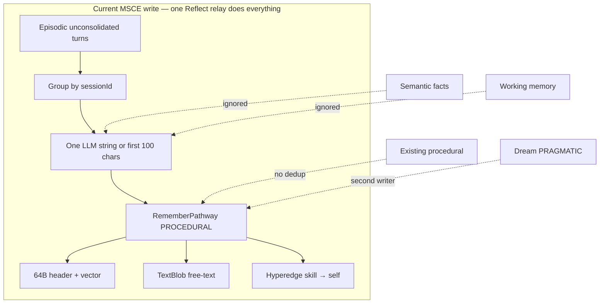
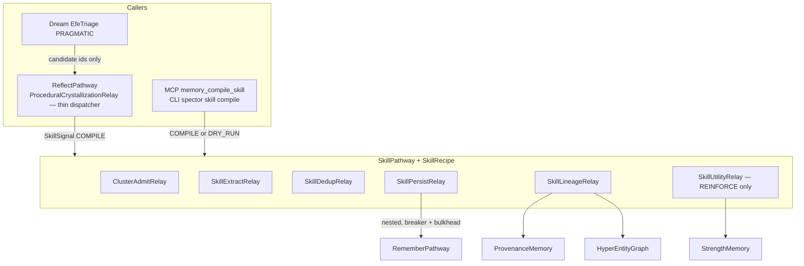
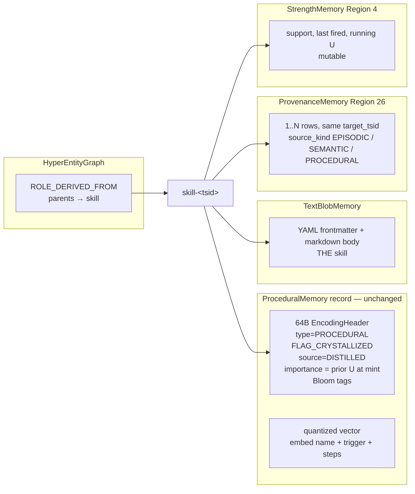
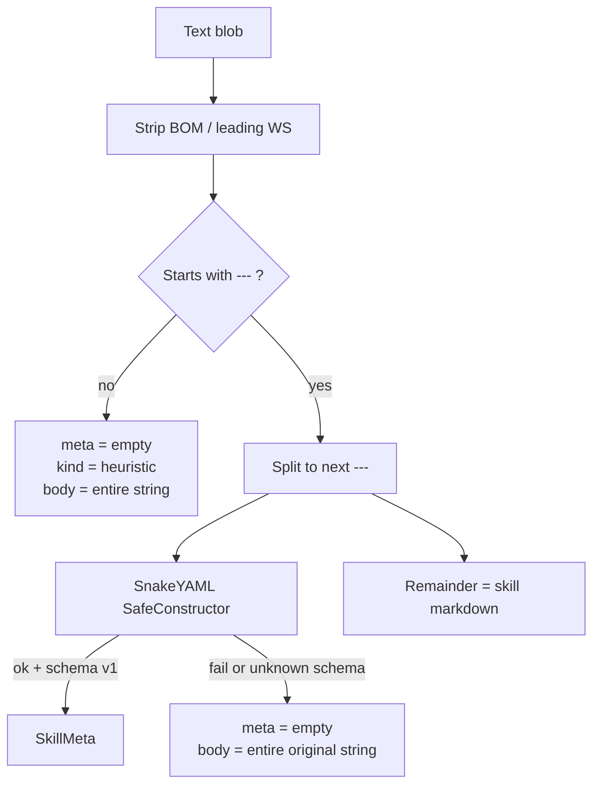
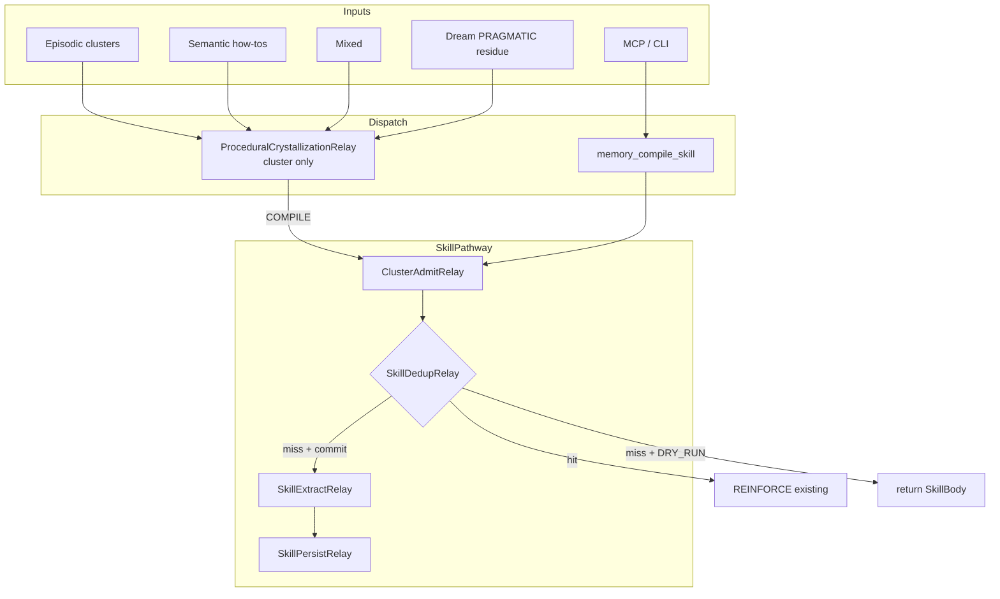
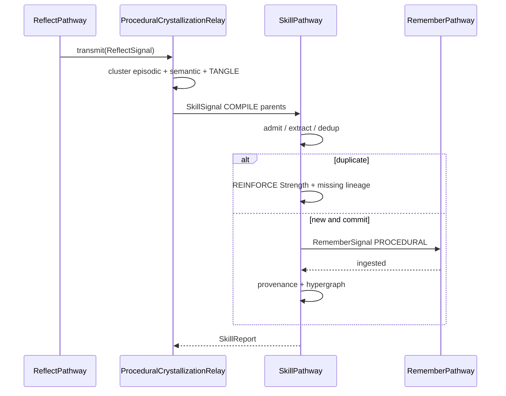
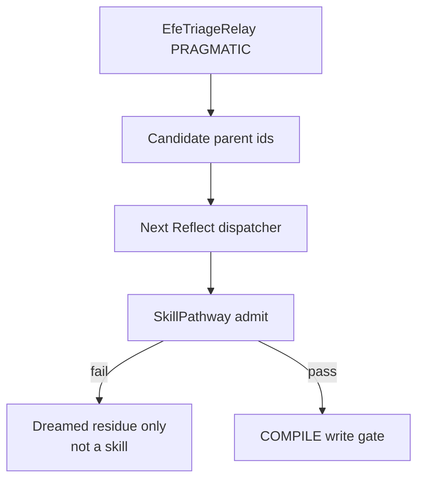
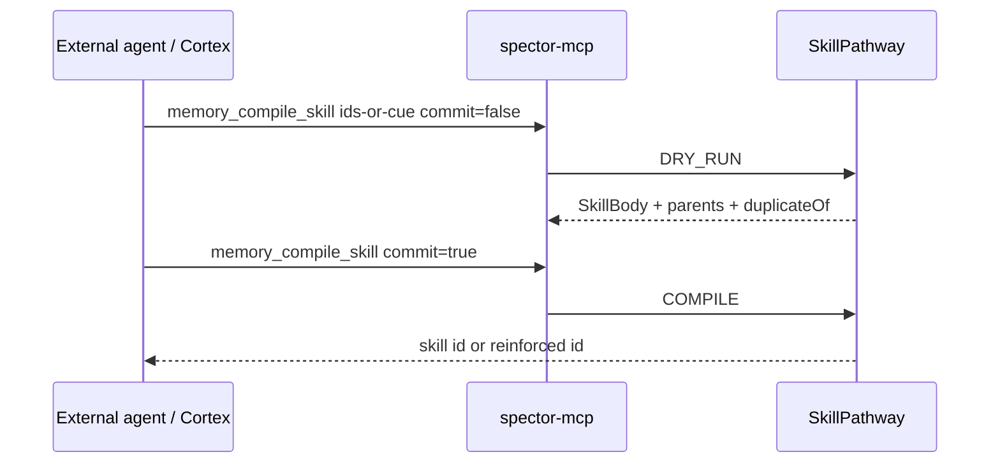
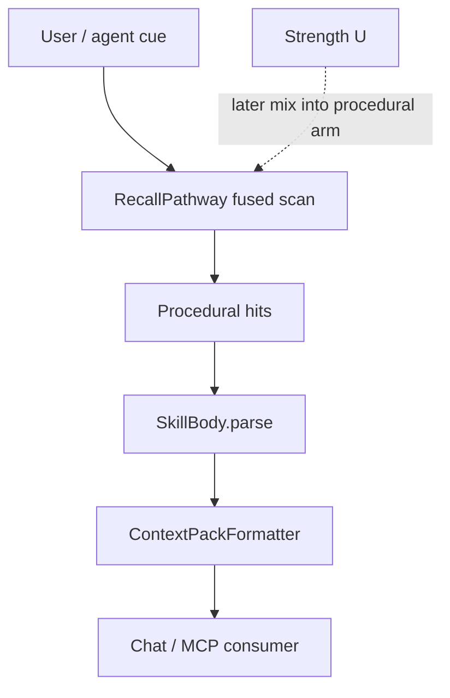
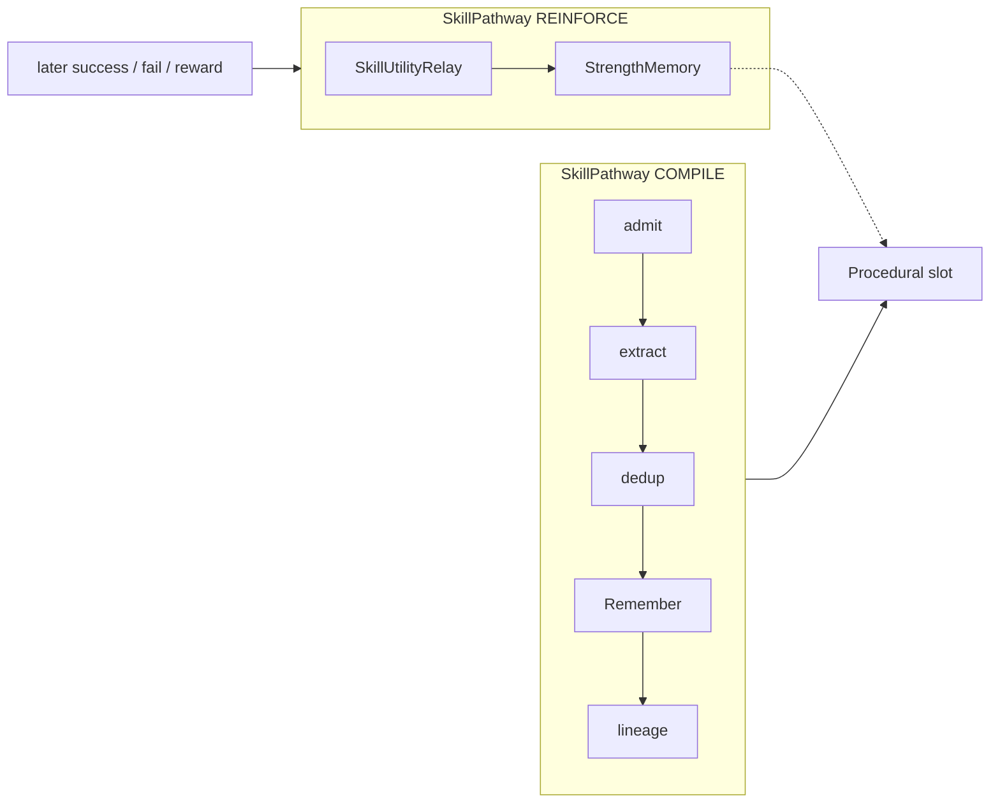

# ADR-0086: Procedural Skill Crystallization and Consumption

| Field | Value |
|:---|:---|
| **Status** | Accepted (Implemented) |
| **Date** | 2026-09-22 |
| **Authors** | Spector Maintainers & Architecture Working Group |
| **Deciders** | Spector Technical Steering Committee (TSC) |
| **Supersedes** | Operational interpretation of ADR-0008 MSCE skill formation (free-text distill in `ProceduralCrystallizationRelay`) |
| **Superseded By** | None |
| **Related** | ADR-0008 (TANGLE / GPM / MSCE), ADR-0028 (pure encoding header), ADR-0029 (provenance region), ADR-0030 (unified engram header), ADR-0032 (persona enactment / `ConfidenceLevel`), ADR-0033 (kernel decoupling to `spector-core`), ADR-0035 (pathway catalog / recipes), ADR-0054 (lifespan-adaptive forgetting), ADR-0068 (Phileas PII), ADR-0069 (Synapse tool access policy), ADR-0071 (Remember pathway), ADR-0072 (fused scoring), ADR-0074 (Reflect sleep consolidation), ADR-0080 / ADR-0083 (pathway telemetry), ADR-0084 (dual-plane chat), ADR-0085 (dynamic configuration). Agentic recall and remember is a **separate** forthcoming ADR. |
| **Last Verified** | 2026-09-22 (Verified against `main` @ `62eace7`) |

---

## 1. Context

Spector already treats procedural memory as the procedural heuristics tier: a small, durable, append-only `RecordMemory` of crystallized habits, looked up in microseconds and injected into LLM context as skills.

ADR-0008 introduced GPM (Goal & Procedural Memory) and MSCE (Multi-Scale Crystallization). The production writer is `ProceduralCrystallizationRelay` on `ReflectPathway` (ADR-0074). Dream's `EfeTriageRelay` already classifies `PRAGMATIC` simulations as procedural-rule candidates. Synapse already *consumes* procedural hits: `ContextPackFormatter` budgets 25% of a context pack for `## 2. PROCEDURAL HEURISTICS & DECISION CADENCE` and labels each hit `[Skill #id]`. MCP `memory_remember` already accepts `tier=PROCEDURAL` as “skills, patterns, how-to.”

Cognitive work in Spector is **pathways + relays**, not god-methods (ADR-0035). `ReflectRecipe` is a 14-relay sleep pipeline. When it needs to persist an abstraction it **nests** `RememberPathway` behind a shared breaker/bulkhead (ADR-0074 §5.2). `ProceduralCrystallizationRelay` violates that grain: it clusters, prompts, writes, and hangs a hyperedge in one class.

What the relay actually writes today is not a skill. It:

1. Reads **unconsolidated episodic turns only**.
2. Groups by `sessionId`.
3. Requires ≥2 non-blank turns.
4. Calls the LLM with a hardcoded prompt, or falls back to the first 100 characters of the first turn.
5. Remembers a free-text string as `MemoryType.PROCEDURAL` with tags `procedural`, `crystallized`, `skill`, `FLAG_CRYSTALLIZED`, `MemorySource.REFLECTED`.
6. Adds a hyperedge whose only node is the newly interned `skill:<id>` with `ROLE_DERIVED_FROM` — a self-edge, not lineage.

Semantic facts, working scratch, existing procedural near-duplicates, TANGLE chains, and ADR-0029 provenance rows are unused. `templateEngine` is probed and ignored. Dream's `PRAGMATIC` path can mint a second, uncoordinated procedural write.

The 64-byte procedural header (ADR-0030 / `ProceduralHeaderLayout` → `SemanticProceduralHeaderLayout`) is an index card shared with semantic. Variable skill structure cannot live there. The body already lives in `TextBlobMemory`. Mutable support already has a home in `StrengthMemory` (Region 4). Lineage already has a home in `ProvenanceMemory` (Region 26), whose `target_kind` enumerates `PROCEDURAL` but whose `source_kind` was originally only `EPISODIC = 1` (formerly `EPISODIC_LOG`).

ACT-R is useful as a **separation of concerns**, not as a single crystallization formula. In ACT-R, knowledge compilation *creates* a production; utility learning *ranks* it later; conflict resolution *selects* among matching productions. Those three jobs must not collapse into one Reflect relay or one `SkillCompiler` method.

Agentic recall / remember — an online tool loop that reframes a cue until the right trace surfaces — is a **different** problem and is explicitly out of scope.



---

## 2. Problem Statement

Procedural memory is advertised as compiled “when X happens, do Y” policy. The implementation stores un-gated session summaries inside a single Reflect relay. That creates seven architectural failures:

1. **No admission control.** Any two-turn session becomes a pinned, high-persistence engram in a small store (`ProceduralMemory` default capacity 1,000; throws when full). Failures crystallize the same as successes.
2. **Importance is hardcoded, not computed.** Every skill is written at `importance = 1.0` through a relay-built synthetic header. The importance calculator that governs every other tier is bypassed, so procedural rows are uniformly pinned at maximum salience regardless of content.
3. **Unstructured payload.** Context pack injects `r.text()`. There is no trigger, no steps, no success criterion, no kind, no evidence list.
4. **Broken lineage.** Hypergraph self-edges and Bloom tags (`session-<hex>`) are not ADR-0029 provenance. Semantic parents have no `source_kind`.
5. **Latent duplicate writer.** Dream has a `PROCEDURAL` insight type and a `PRAGMATIC` triage outcome with no rule saying they may not become a second procedural writer. Nothing enforces one write gate.
6. **Wrong instinct to add an agent.** A live agent looping MCP `memory_recall` to “author a skill” would overfit the current turn and fight the sleep pipeline.
7. **Wrong instinct to add a mega-compiler.** Packing admit + extract + persist + lineage + utility + verify/retry into one `SkillCompiler` method repeats the relay bloat ADR-0035 removed. Spector already has pathways for small tasks.

The header must not grow. Formation must be a **pathway** that Reflect and MCP can both trigger. Utility learning, when it exists, is not a compile gate.

---

## 3. Decision Drivers

- **Pathways over god-methods.** Compilation is `SkillPathway` + `SkillRecipe` relays. Reflect does not grow a 15th mega-stage.
- **Two legal triggers.** Reflect (batch sleep) and MCP/CLI (one-shot). Dream proposes; it does not write.
- **Nested Remember only.** SkillPathway never writes slabs itself. Persist nests `RememberPathway` behind the existing ADR-0074 breaker/bulkhead.
- **ACT-R split, not ACT-R formulas.** Compile ≠ utility ≠ conflict resolution. Do not implement \(P(a|s)\cdot V\) as the admit gate.
- **Formation is offline.** Not during the chat token loop. Not via `AgentMemoryBridge` sequence tracking (ADR-0084).
- **No agent for minting.** An optional LLM inside `SkillExtractRelay` is an extractor, not a think-loop. Agentic recall / remember is a later ADR.
- **No procedural header / stride change.** ADR-0028 / ADR-0030 stay intact.
- **Multi-tier parents.** Episodic, semantic, and mixed evidence.
- **Markdown is the skill.** YAML frontmatter for machine fields. JSON is extract IR only. SnakeYAML, not CommonMark.
- **Lineage is not a tag.** ADR-0029 rows + hypergraph `ROLE_DERIVED_FROM`.
- **Dedup over mint.** Near-duplicates reinforce Strength; they do not append a slot.
- **Utility is post-outcome.** New skills start weak (ACT-R compiled-production prior). \(U\) lives in Strength, updated only when a success/fail bit exists.

---

## 4. Considered Options

### Option 1: Status quo — free-text distill in the Reflect relay

- **Description**: Keep `distillSkills()` as one LLM string per session.
- **Advantages**: Zero new types.
- **Disadvantages**: Unusable skills; store fill; Reflect remains a god-stage.

### Option 2: Skill-generation agent on Synapse graphs

- **Description**: LangGraph4j node that loops recall/remember until a skill “looks right.”
- **Advantages**: Interactive authoring.
- **Disadvantages**: Online, duplicate writer, fights ADR-0084.

### Option 3: Widen `ProceduralLayout` / spend `_reserved`

- **Description**: Pack kind / support / confidence into the 64B header.
- **Advantages**: Hot-path fields.
- **Disadvantages**: Shared header with semantic; cannot hold steps; violates ADR-0028.

### Option 4: One `SkillCompiler` god-class called from the existing relay

- **Description**: Extract logic out of the relay into a single compiler method that admits, extracts, writes, lines, and scores.
- **Advantages**: Faster to type than a pathway.
- **Disadvantages**: Reintroduces facade bloat. Cannot be triggered cleanly from MCP without Reflect. Utility and compile share a stack frame. Hard to circuit-break extract separately from persist.

### Option 5: `SkillPathway` + thin relays; Reflect and MCP are callers (selected)

- **Description**: First-class pathway in the ADR-0035 catalog. Relays: admit, extract, dedup, persist (nested Remember), lineage. Optional `REINFORCE` mode for utility. `ProceduralCrystallizationRelay` shrinks to cluster-and-dispatch. MCP `memory_compile_skill` calls the same pathway.
- **Advantages**: Matches how Remember is nested from Reflect today; one write gate; MCP does not need Reflect; utility cannot pollute compile.
- **Disadvantages**: New catalog entry, signal type, recipe tests.

---

## 5. Decision Outcome

**Chosen Option**: Option 5 — `SkillPathway` as the only compilation unit. Reflect and MCP trigger it. Dream does not. Utility is a later `REINFORCE` mode on the same pathway, not a compile relay.

Agentic recall / remember, when specified, may discover parents and then **must** call `SkillPathway`. It does not own schema, layout, or persist.

### 5.1 ACT-R mapping onto Spector verbs

ACT-R 5 utility is \(U = PG - C\) with Bayesian \(P = S/(S+F)\). ACT-R 6 replaced that with \(U \leftarrow U + \alpha(R - U)\) and time-discounted reward. Conflict resolution is softmax over matching productions. Compiled productions start with **low** utility and earn the right to fire.

None of those equations are implemented as a single crystallization threshold. They split like this:

| ACT-R job | Spector | When |
|:---|:---|:---|
| Knowledge compilation | `SkillPathway` `COMPILE` | Reflect sweep or MCP commit |
| Persist production | nested `RememberPathway` | `SkillPersistRelay` |
| Utility learning | `SkillPathway` `REINFORCE` → `StrengthMemory` | Only with an outcome bit |
| Conflict resolution | `RecallPathway` fused score + context pack | Every cue |

Admit on support × valence (existing header fields). Do **not** use \(P(a|s)\cdot V(a,s)\) as \(U_{\text{compile}}\). Do **not** put \(U\) in the 64B encoding header.

### 5.2 `SkillPathway` in the catalog

```text
catalog.register(SkillPathway.class, skillPathway);
```

`DefaultSpectorMemory.skillPathway()` sits next to `rememberPathway()` / `reflectPathway()`. No new kernel store.



`SkillSignal`:

| Field | Role |
|:---|:---|
| `mode` | `COMPILE` \| `DRY_RUN` \| `REINFORCE` |
| `parents` | list of `{tsid, MemoryType}` |
| `cue` | optional text used as embed / name seed |
| `commit` | false → `DRY_RUN` (preview body + duplicate-of, no Remember) |
| `skillId` + `reward` / `{success, cost}` | `REINFORCE` only |

Relays — one job each:

| Relay | Does | Does not |
|:---|:---|:---|
| `ClusterAdmitRelay` | \(k\) sessions, valence / resolved, reject working-only and ADR-0084 denylist payloads | LLM |
| `SkillExtractRelay` | LLM JSON IR → markdown + YAML frontmatter; algorithmic n-gram / tool-sequence fallback; `templateEngine` | Remember |
| `SkillDedupRelay` | cosine + tag near-duplicate; rewrite signal to `REINFORCE` if hit | mint a second slot |
| `SkillPersistRelay` | nested Remember `PROCEDURAL` + `FLAG_CRYSTALLIZED` + `SOURCE_DISTILLED` | parse parents |
| `SkillLineageRelay` | one provenance row per parent + hypergraph `ROLE_DERIVED_FROM` | encode header |
| `SkillUtilityRelay` | Strength \(N_{\text{ok}}/N_{\text{fail}}\); optional \(U \leftarrow U+\alpha((R-c)-U)\) | rewrite blob or header identity |

`DRY_RUN` stops after extract+dedup and returns the would-be `SkillBody` plus `duplicateOf`.

Circuit-break extract separately from persist. Persist shares Remember’s breaker/bulkhead with Dream and Reflect (ADR-0074).

### 5.3 Object model — where each field lives

The skill is **not** the 64-byte slot. The slot is the retrieval card. The skill is the blob body.



| Field | Plane | Notes |
|:---|:---|:---|
| `id` | Index key | Prefix `skill-`. Register in ADR-0029 D5 `prefix_kind`. |
| `name`, `kind`, `trigger`, `steps`, `tools`, `success`, `schema` | Text blob frontmatter | Authoritative machine fields. |
| Markdown below `---` | Text blob body | What the LLM follows. Legacy rows: entire blob is body. |
| Embed text | Vector in slot | `name + trigger + joined steps`. |
| Confidence / prior \(U\) at mint | Header `importance` *and* frontmatter | Header used by SIMD scoring. New skills start **weak** (compiled-production prior). |
| Support / last-fired / running \(U\) | Strength region | Mutable. Never freeze `n=` in the encoding header. |
| Parents / evidence | Provenance + hypergraph | Never parent TSIDs in the 64B header. |
| Crystallized | `FLAG_CRYSTALLIZED` | Means “compiled procedure,” any allowed parent tier. |
| Distilled vs dreamed | Header `source` + flags | Committed skills are `SOURCE_DISTILLED`. Uncommitted dream residue may be `FLAG_DREAMED` / `SOURCE_SIMULATED` and is **not** a skill. |

`kind` values: `heuristic` (default, semantic-only or legacy), `playbook` (ordered steps; prefer mixed parents), `graph_template` (deferred Phase 6).

### 5.4 On-disk skill body

New writes always emit `spector.skill.v1`:

```markdown
---
schema: spector.skill.v1
name: null-check-auth-validator
kind: playbook
confidence: 0.35
tools: []
parents:
  episodic: ["<episode-tsid>"]
  semantic: ["rem-log-<tsid>"]
---
# Null-check auth validator

When a login endpoint throws NPE on missing principal:

1. Reproduce with a request that has no auth context
2. Guard the principal in the validator
3. Add a regression test

Done when the NPE is gone and the test is green.
```

`confidence` at mint is a **prior**, not a claim of reliability. Strength / `REINFORCE` moves the live score.

**Parser** (`SkillBody.parse(String)` owned by the skill module, shared with Synapse formatter):



Rules:

- Add BOM-managed `org.yaml:snakeyaml` to the module that owns the parser. Do **not** add `org.commonmark` / `commonmark-ext-yaml-front-matter`. That extension’s default `YamlSubsetParser` cannot represent nested `parents`.
- Do **not** reuse `MarkdownDocumentReader`. It strips list markers and fences.
- Cortex HTML preview may keep using `marked`. Storage and recall paths never HTML-render.
- JSON may be used *inside* `SkillExtractRelay`. The Remember boundary always serializes markdown + frontmatter.

### 5.5 Provenance extension — semantic and procedural parents

Lock ordinals to `ProvenanceLayout.java` / `docs/kernel/regions/provenance.md` and typed via `ProvenanceSourceKind` (`EPISODIC = 1`, `SEMANTIC = 2`, `PROCEDURAL = 3`):

| Field | Canonical value |
|:---|:---|
| `source_kind` | `EPISODIC = 1` (formerly `EPISODIC_LOG`), **`SEMANTIC = 2` (new)**, **`PROCEDURAL = 3` (new)**, `WORKING = 4` reserved, unused in v1 |
| `target_kind` | `SEMANTIC = 2`, `PROCEDURAL = 3` |

Use the existing 12-byte `_reserved` block at offset 56 of the 72-byte provenance row. **Do not change stride.**

| When | Offset 56–63 | Offset 64–67 |
|:---|:---|:---|
| `source_kind = EPISODIC` | remain zero | remain zero |
| `source_kind ∈ {SEMANTIC, PROCEDURAL}` | `source_tsid` int64 | `source_partition` int32, or zero |

Mixed skills = **multiple rows**, same `target_tsid`. Write order: persist success → lineage rows → hyperedges → then mark source episodic turns consolidated if they were members of this compile. On provenance exhaustion: keep the skill, metric `skill.provenance.dropped` (ADR-0029 D6 fail-open).

### 5.6 Trigger flows

All writers funnel through `SkillPathway`. Relays outside SkillPathway do not call `RememberPathway` with procedural free text.



#### 5.6.1 Reflect — dispatcher, not compiler



Admission defaults (config, not header fields): `k_sessions = 3`, or `k = 2` plus valence / `FLAG_RESOLVED`. Reject working-only clusters and tool-JSON / CoT dumps.

Semantic-only clusters default to `heuristic`. Mixed axiom + episodic proof default to `playbook`. Working memory may cue clustering; it is not a v1 `source_kind`.

#### 5.6.2 Dream — propose only



Dream must not call Remember for procedural skills. `spector.memory.skill.dream-auto-commit` defaults **false**: PRAGMATIC hits wait for Reflect unless an operator flips the flag.

#### 5.6.3 MCP / CLI — same pathway



Single-shot tool, not a think-loop. Searching for better parents is the forthcoming agentic-recall ADR.

### 5.7 Use flows — consumption, not formation

Using a skill is ordinary recall plus formatting. Conflict resolution stays here.



`ContextPackFormatter` already allocates 25% of the token budget to procedural. Item renderer:

```text
- [Skill #skill-…] null-check-auth-validator  (playbook, conf 0.35)
  When: login NPE / missing auth context
  Do:
    1. Reproduce …
    2. Guard principal …
  Done: NPE gone and test green
```

v1 meta → short When/Do/Done; clip full markdown while budget remains; never dump raw YAML fences when meta parsed. Legacy blobs emit `r.text()` as today.

`THE_EXECUTOR` recall profile remains the scorer bias for “apply the habit.” Optional later: softmax over Strength \(U\) among matching skills (`P(i)=e^{U_i/\tau}/\sum e^{U_j/\tau}`). Not required to close this ADR.

`explain(skillId)` reads provenance + hypergraph, not tags.

Chat priming (ADR-0084) calls Recall + pack only. The graph may *follow* a playbook. It does not write one.

### 5.8 Utility / `REINFORCE` — separate mode



Without an outcome signal, `REINFORCE` is a no-op. There is no Voyager env by default. Do not add verify/retry on `COMPILE`.

If a later episode that lists this skill as parent is `FLAG_RESOLVED`, Reflect may emit `REINFORCE` with `success=true`. That is a dispatcher line, not a new Reflect stage that recomputes the skill.

Mint prior: low `importance` (compiled-child analog of ACT-R \(U_0 \approx 0\) or \(U_0 = -G\)). Live \(U\) never writes back into the encoding header.

### 5.9 What does *not* change

- `ProceduralLayout.SCHEMA_VERSION` remains 1. Encoding-header `_reserved` stays unused.
- `ProceduralMemory` capacity, SWMR append, throw-on-full.
- Fused SIMD scorer: still scores header + vector. YAML parse is off the scan path.
- Remember / Recall contracts (ADR-0071 / ADR-0072), with one additive change: `RememberSignal` gains a `consolidationFlagsOverlay` byte that `CorticalWriteTransactionRelay` ORs into a Remember-built header. Verified against `main`: the existing `forCognitiveWithHeader` path is all-or-nothing — `DopaminergicSurpriseRelay` copies `header.importance()` and skips the calculator, and the fresh-header branch hardcodes `consolidationFlags = 0`. The overlay is the only new surface; `MemorySource.DISTILLED → EngramSource.DISTILLED` already works through `source.toEngramSource()`. The overlay is **not** exposed on `RememberContext.Builder` in v1.
- Dual-plane chat (ADR-0084): skills are cognitive, not `CHAT_EVENT`.
- Reflect’s other 13 relays.

### 5.10 Relationship to prior ADRs

| ADR | Relationship |
|:---|:---|
| ADR-0008 | GPM/MSCE intent kept. Implementation of skill formation moves off the Reflect god-relay onto `SkillPathway`. |
| ADR-0028 / 0030 | Encoding header stays a pure 64B identity. |
| ADR-0029 | `source_kind` gains `SEMANTIC` / `PROCEDURAL`; reserved bytes hold `source_tsid`. |
| ADR-0035 | New catalog citizen. Recipes, not facades. |
| ADR-0074 | `ProceduralCrystallizationRelay` remains a Reflect stage but becomes a dispatcher. Nested SkillPathway uses the same breaker family as nested Remember. |
| ADR-0071 | Only legal write path for a compiled skill. |
| ADR-0072 | Later may consume Strength \(U\) on the procedural arm. Not a close-out requirement. |
| ADR-0084 | Conversation reflector may produce parents; it does not write procedural skills. |
| Forthcoming agentic recall/remember ADR | May loop recall tools. Persist only via `SkillPathway`. |

### Positive Consequences

- Compilation is testable and circuit-broken without standing up a full Reflect sweep.
- MCP and Reflect cannot drift onto two writers.
- Reflect stays a sleep pipeline instead of absorbing skill schema work.
- Utility cannot sneak into admit/extract.
- Skills become triggerable, inspectable, and lineage-backed without a kernel layout break.

### Negative Consequences & Trade-offs

- One more pathway to register, observe, and document.
- SnakeYAML becomes a memory-module compile dependency.
- Context-pack and inspect paths must parse frontmatter (per *hit*, not per scanned slot).
- Provenance ordinal docs must be corrected; existing `source_kind=1` rows stay valid.
- `REINFORCE` is inert until an outcome bit exists. That is accepted.
- `graph_template` enactment is deferred.

---

## 6. Pros and Cons of the Options

| Option | Pros | Cons |
|:---|:---|:---|
| **1. Status quo text distill** | No work | Unusable skills; Reflect god-stage |
| **2. Formation agent** | Interactive | Online, duplicate writer |
| **3. Header / stride change** | Hot-path fields | Breaks ADR-0028 |
| **4. SkillCompiler god-class** | Fast to sketch | Facade bloat; MCP must go through Reflect or a second entry |
| **5. SkillPathway + relays (selected)** | Catalog grain, two triggers, nested Remember, utility isolated | New recipe + tests |

---

## 7. Implementation Plan

1. **Phase 1 — Pathway shell.** `SkillPathway` / `SkillSignal` / `SkillReport` / `SkillRecipe` with persist + lineage relays only. `ProceduralCrystallizationRelay` dispatches current free-text through the pathway. Nested catalog + breaker proven. No schema change yet. 
2. **Phase 2 — Admit / extract / dedup relays + `SkillBody`.** SnakeYAML parser; extract IR → v1 markdown; algorithmic fallback; cosine reinforce. Reflect relay only builds parent lists.
3. **Phase 3 — Semantic and mixed parents.** `source_kind=SEMANTIC` + reserved `source_tsid`; mixed two-row provenance; tags `from:semantic` / `from:episodic` as gates only.
4. **Phase 4 — Consumption.** `ContextPackFormatter` short form; `explain()` mixed parents.
5. **Phase 5 — MCP / CLI + Dream redirect.** `memory_compile_skill` (`DRY_RUN` / `COMPILE`); CLI sibling command (`spector skill compile`); PRAGMATIC persist removed; `skill-` prefix_kind registered.
6. **Phase 6 — `REINFORCE` / `SkillUtilityRelay`.** Only after an outcome signal exists. Optional softmax mix into Recall. Not required to mark this ADR Accepted.
7. **Phase 7 — Deferred.** `graph_template` + approval-backed `FlowSpec`.

Configuration (names illustrative): `spector.memory.skill.min-sessions`, `spector.memory.skill.duplicate-cosine`, `spector.memory.skill.allow-semantic-only`, `spector.memory.skill.dream-auto-commit` (default false), `spector.memory.skill.utility-alpha`.

---

## 8. Code Reference & Verification

- **Primary Module(s)**: `memory/spector-memory`, `memory/spector-kernel` (provenance enum / reserved bytes only), `synapse/spector-mcp`, `synapse/spector-synapse` (formatter + MCP tool)
- **Key Packages**:
  - `com.spectrayan.spector.memory.pathway.skill` *(new)*
  - `com.spectrayan.spector.memory.pathway.reflect.relay`
  - `com.spectrayan.spector.memory.pathway.remember`
  - `com.spectrayan.spector.commons.pathway` (`PathwayCatalog`, `PathwayComposer`)
  - `com.spectrayan.spector.kernel.store` / `kernel.layout`
  - `com.spectrayan.spector.mcp.util` (`ContextPackFormatter`)
- **Current classes this ADR changes**:
  - `ProceduralCrystallizationRelay.java` — dispatcher only
  - `ReflectRecipe.java` / `ReflectPathway.java` — still lists the relay; nested SkillPathway via catalog
  - `SpectorRuntime.java` / `DefaultSpectorMemory.java` — register `SkillPathway`
  - `EfeTriageRelay` Dream persist path — candidates only
  - `ContextPackFormatter.java` — compiled skill rendering
  - `ProvenanceLayout` — `source_kind` + reserved `source_tsid`
- **New classes** (names illustrative):
  - `SkillPathway`, `SkillSignal`, `SkillReport`, `SkillRecipe`
  - `ClusterAdmitRelay`, `SkillExtractRelay`, `SkillDedupRelay`, `SkillPersistRelay`, `SkillLineageRelay`, `SkillUtilityRelay`
  - `SkillBody`, `SkillMeta`, `SkillKind`
  - MCP spec `memory_compile_skill.json` + handler
- **Verification Tests**:
  - `SkillBodyParseTest` — legacy prose, v1 fence, nested `parents`, corrupt YAML fails open
  - `ClusterAdmitRelayTest` — k-session, valence, working-only reject, denylist
  - `SkillDedupRelayTest` — second cluster bumps Strength, no second slot
  - `SkillPathwayNestedRememberTest` — breaker/bulkhead; Reflect dispatcher does not Remember itself
  - `SemanticSkillCrystallizationTest` — semantic-only heuristic + `source_kind=SEMANTIC`
  - `MixedSkillProvenanceTest` — two rows, one `target_tsid`
  - `DreamPragmaticDoesNotPinTest`
  - `MemoryCompileSkillToolTest` — `DRY_RUN` vs `COMPILE`
  - `SkillUtilityRelayTest` — no-op without outcome; delta update with reward
  - Layout: `ProceduralLayout.SCHEMA_VERSION == 1`; header stride 64; provenance stride 72
  - `SkillImportanceViaCalculatorTest` should assert signal.header() is null at entry to DopaminergicSurpriseRelay and FLAG_CRYSTALLIZED is set on the written header — that pins both halves of the invariant.

### Invariants (must remain true)

1. No change to `ProceduralLayout` stride, layout id `0x434F4700`, or encoding-header `_reserved` usage.
2. Every committed skill is `MemoryType.PROCEDURAL` + `FLAG_CRYSTALLIZED` + nested `RememberPathway`.
3. `ProceduralCrystallizationRelay` does not call `RememberPathway` for skills.
4. Dream and Synapse chat do not call `RememberPathway` for skills.
5. `SkillBody.parse` on a blob that does not start with `---` returns the entire string as body.
6. Parent identity is provenance + hypergraph, never `session-<hex>` tags.
7. SIMD recall does not parse YAML.
8. Semantic-only skills are allowed; working-only skills are not.
9. Near-duplicate `COMPILE` becomes `REINFORCE` rather than appending a slot.
10. `SkillUtilityRelay` does not run on `COMPILE`.
11. Agentic recall / remember, when specified later, may discover parents; it may persist a skill only through `SkillPathway`.
