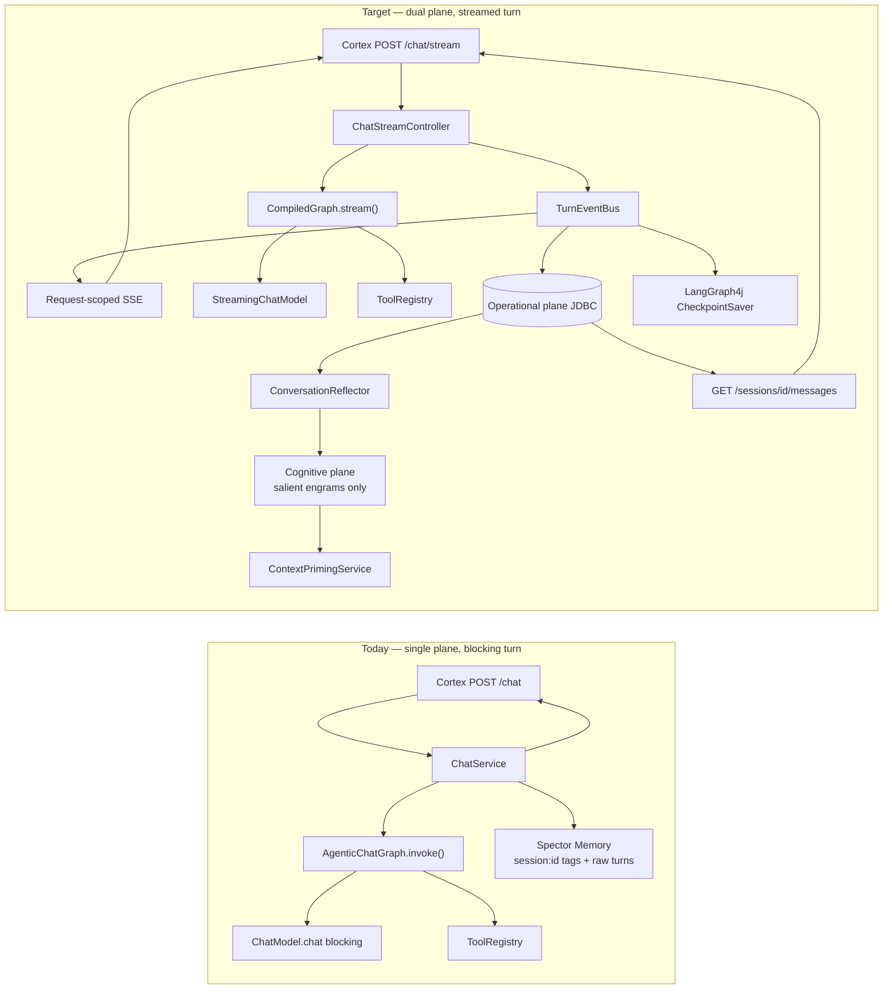
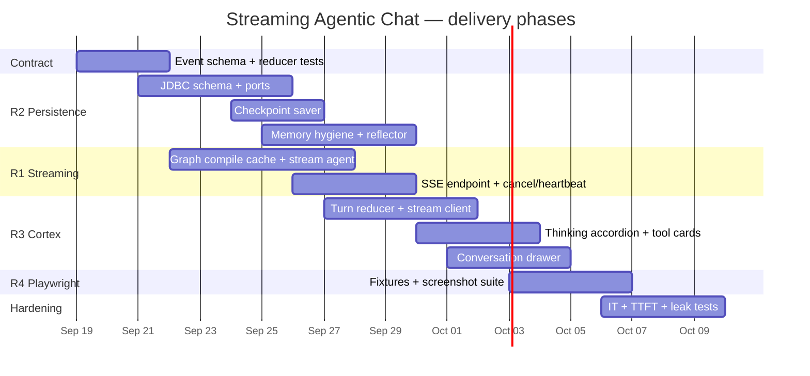
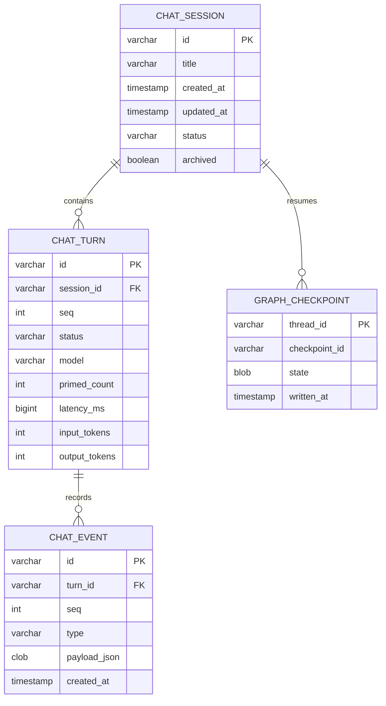
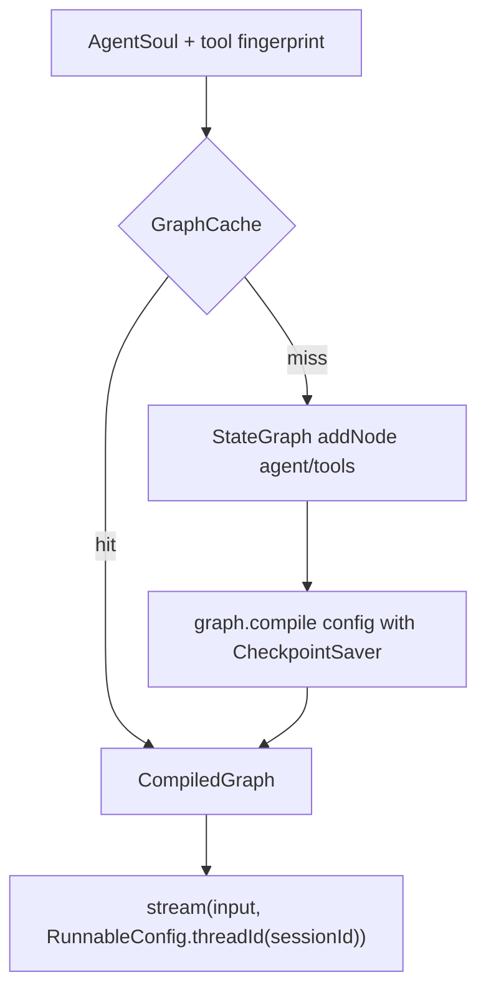
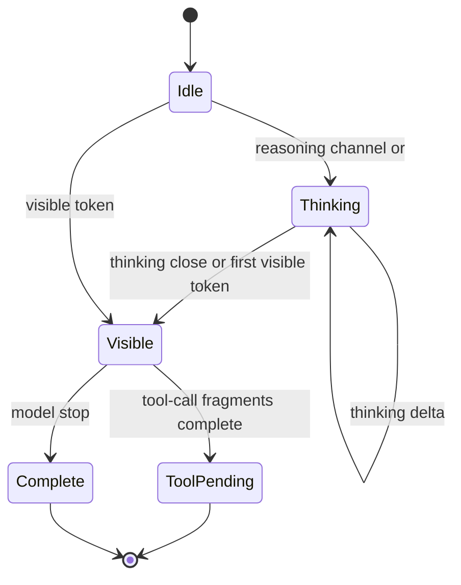
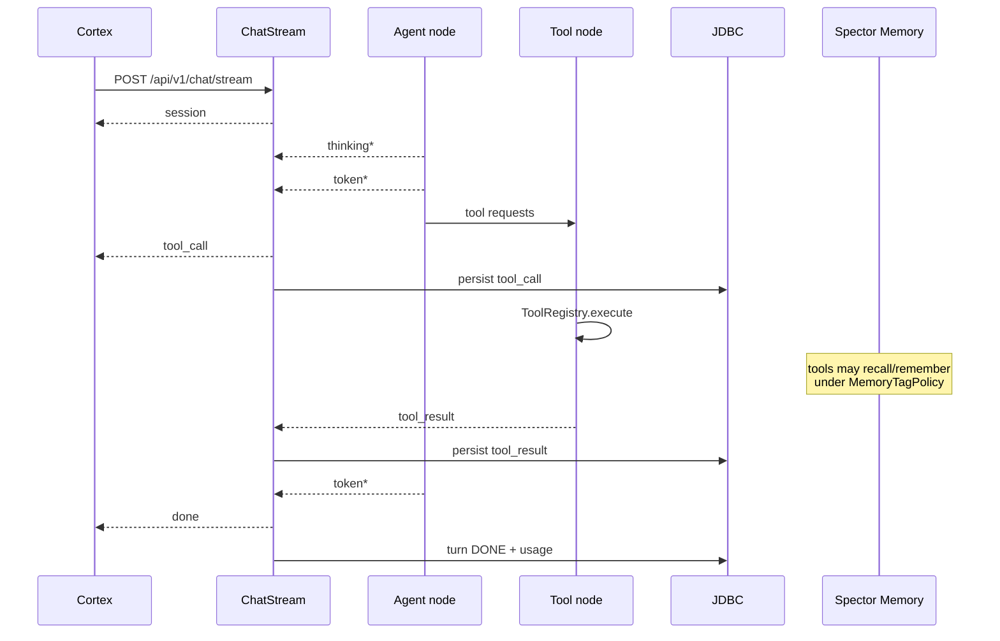
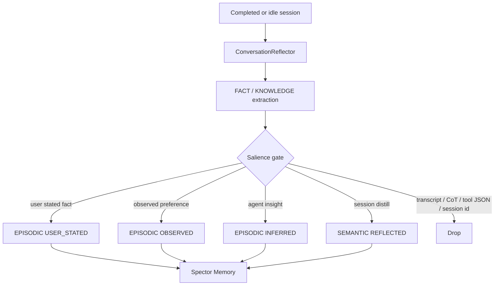
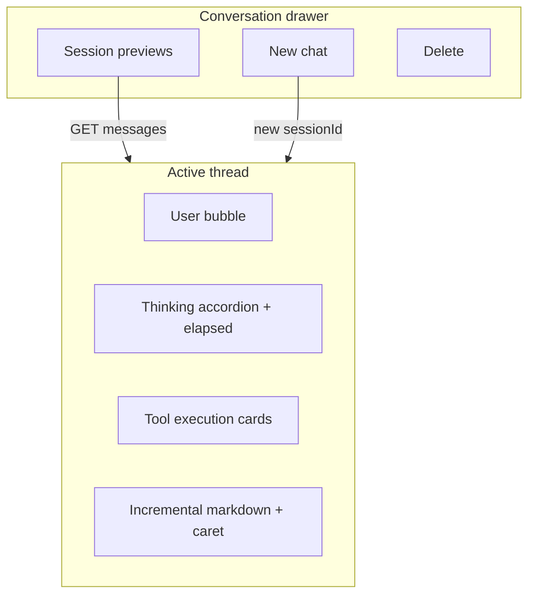

# Implementation Plan: Streaming Agentic Chat, Dual-Plane Persistence, Cortex Visualization, and Playwright Regression

| Field | Value |
|:---|:---|
| **Status** | Proposed |
| **Date** | 2026-09-19 |
| **Issue** | #263 (streaming + tool interleaving); extends #108, #114 |
| **ADR** | ADR-0084 (Dual-Plane Conversation Persistence) |
| **Modules** | `synapse/spector-synapse`, `cortex/spector-cortex` |
| **Integrity mode** | development |

---

## 0. Goal

Deliver end-to-end streaming agentic chat with tool-call interleaving, durable operational traces in Synapse JDBC, salient-only ingestion into Spector Memory, a first-class Cortex conversation UI, and deterministic Playwright visual coverage.

This plan assumes current `main` (`AgenticChatGraph.invoke()`, `POST /api/v1/chat` JSON, `SpectorMemoryChatAdapter` tagging `session:{id}`, Cortex without a conversation drawer).

---

## 1. Current vs target architecture



---

## 2. Non-negotiable contracts

### 2.1 SSE event envelope

Unify #108 (`content`) and this spec (`token`). Canonical event name is **`token`**. `#108` `content` is accepted as an alias for one release, then removed.

```text
event: <type>
id: <turnId>:<seq>
data: {json}

:keepalive
```

| `event` | When | `data` |
|:---|:---|:---|
| `session` | First event after accept | `{sessionId, turnId, isNew}` |
| `thinking` | CoT / reasoning delta | `{text, elapsedMs}` |
| `token` | Visible answer delta | `{text}` |
| `tool_call` | Model requested a tool | `{callId, name, arguments}` |
| `tool_result` | Tool finished | `{callId, name, status, preview, elapsedMs}` |
| `done` | Turn complete | `{sessionId, turnId, primedMemories, latencyMs, usage}` |
| `error` | Recoverable or fatal | `{code, message, retryable}` |

Every payload includes `sessionId`, `turnId`, `seq`, `tsEpochMs`.

Heartbeat: comment `:keepalive` every 15s while the graph is running (tighter than #108’s 30s to survive proxies).

Client disconnect: cancel the graph run, persist `turn.status = INTERRUPTED`, keep checkpoint.

### 2.2 History replay shape

`GET /api/v1/chat/sessions/{sessionId}/messages` returns **structured turns**, not `[{role, content}]`.

```json
{
  "sessionId": "01J...",
  "title": "Austin move checklist",
  "turns": [
    {
      "turnId": "01J...",
      "status": "DONE",
      "user": { "text": "..." },
      "thinking": { "text": "...", "elapsedMs": 1820 },
      "tools": [
        { "callId": "c1", "name": "memory_recall", "arguments": {}, "status": "success", "preview": "..." }
      ],
      "assistant": { "text": "..." },
      "usage": { "inputTokens": 812, "outputTokens": 240 },
      "primedMemories": 3
    }
  ]
}
```

Live SSE and history use the same Cortex reducer.

### 2.3 Dual-plane rules (see ADR-0084)

- Operational plane owns transcripts, traces, tool payloads, checkpoints, session CRUD.
- Cognitive plane owns salient episodes/facts only.
- Forbidden in Spector tags: `session:<id>`, `session_<id>`, `id:<sessionId>`.
- Forbidden in Spector payloads: raw tool JSON, CoT scratchpads, full assistant transcripts.

---

## 3. Workstreams and phases



Phases overlap on purpose: contract and JDBC land first so streaming and UI have something durable to write/read.

---

## 4. Phase 0 — Contract and fixtures (R1/R2/R3 shared)

**Why first.** UI, SSE, JDBC, and tests all consume one event log. If the envelope changes mid-flight, every layer churns.

### Deliverables

- `ChatStreamEvent` sealed types in `synapse/.../agent/chat/api/stream/`
- JSON schema + Jackson mixins
- Java unit tests for sequencing (`seq` monotonic per turn)
- TypeScript `ChatTurn` / `reduceChatEvents()` in Cortex (no Angular UI yet)
- Golden SSE fixtures under `cortex/spector-cortex/e2e/fixtures/`
  - `empty-suggestions.json`
  - `thinking-then-tokens.sse`
  - `tool-interleave.sse`
  - `error-mid-stream.sse`
  - `history-replay.json`

### Exit

Reducer tests pass in Java and TypeScript against the same fixtures.

---

## 5. Phase 1 — R2 operational plane (JDBC)

See ADR-0084 for the decision. This phase implements it.

### 5.1 Schema (Flyway, H2 default, Postgres-capable types)



`CHAT_SESSION.status`: `ACTIVE | IDLE | ARCHIVED`.
`CHAT_TURN.status`: `RUNNING | DONE | ERROR | INTERRUPTED`.
`CHAT_EVENT.type`: `user | thinking | token | tool_call | tool_result | done | error`.

### 5.2 Ports

Replace the overloaded `ChatMemoryPort` with two ports:

| Port | Implementation | Responsibility |
|:---|:---|:---|
| `ChatTranscriptPort` | `JdbcChatTranscriptAdapter` | sessions, events, list/rename/delete, load structured turns |
| `ChatCognitivePort` | `SpectorSalientMemoryAdapter` | prime + reflect only |
| `GraphCheckpointPort` | `JdbcCheckpointSaver` implements LangGraph4j `BaseCheckpointSaver` | resume interrupted turns |

Keep `ChatMemoryPort` as a deprecated facade for one release; `ChatService` should depend on the new ports.

### 5.3 Session APIs on `ChatController`

| Method | Path | Notes |
|:---|:---|:---|
| `GET` | `/api/v1/chat/sessions?limit=` | preview from first user event or title |
| `PATCH` | `/api/v1/chat/sessions/{id}` | `{title}` |
| `DELETE` | `/api/v1/chat/sessions/{id}` | delete session + turns + events + checkpoints; **do not** forget cognitive engrams |
| `GET` | `/api/v1/chat/sessions/{id}/messages` | structured turns |

### 5.4 Migration off Spector-as-transcript

1. Stop writing in `SpectorMemoryChatAdapter.saveToSession`.
2. Dual-write for one milestone if existing sessions must remain listable (read JDBC first, fall back to `browse(session:{id})`).
3. One-shot migrator: copy `type:turn` engrams into JDBC, then `forget()` those engrams.
4. Ban `session:` tag prefix in a `MemoryTagPolicy` guard used by all Synapse remember paths.

### Exit

- List/load/rename/delete work against H2 in `@SpringBootTest`.
- No new `session:` tags created in unit tests.
- `GET .../messages` returns thinking + tool events after a fixture turn is inserted.

---

## 6. Phase 2 — R1 graph streaming and tool interleaving

### 6.1 Compile once



`AgenticChatGraph.compile()` today runs on every `chat()` call. Cache key = `soul.id + soul.soulVersion + toolRegistry.fingerprint()`. Invalidate on soul or tool-set change.

### 6.2 Agent node becomes a streaming node

Use `LlmBridge.streamingModel(model)` (already exists) and LangGraph4j `StreamingChatGenerator` / `graph.stream()`.

Token splitter:



Rules:

- Qwen / DeepSeek native reasoning parts → `thinking` events.
- Fallback parse `<think>…</think>` (and provider-specific tags) in the splitter. Never emit CoT on `token`.
- Tool-call JSON/XML never enters the markdown buffer.

### 6.3 Listener is the bus, not a leftover

Extend `AgentChatListener`:

```text
onSession(sessionId, turnId)
onThinking(delta, elapsedMs)
onToken(delta)
onToolCall(callId, name, arguments)
onToolResult(callId, name, status, preview)
onDone(summary, usage)
onError(code, message)
```

`ChatService` wraps the listener:

1. Append `CHAT_EVENT` (async batch of 16 or 25ms, whichever first).
2. Push to the request `Flux` / `SseEmitter`.
3. Optionally publish coarse dashboard events on `EventPublisher` (`chat.thinking` start, `chat.done`) — **not** per-token.

`toolNode` must call `onToolCall` before execute and `onToolResult` after. Today it does neither.

### 6.4 Tool interleaving



Pause visible tokens between `tool_call` and `tool_result`. Multiple tool calls in one model step run concurrently only if they are independent; default is sequential to keep argument/result pairing trivial.

Preview on the wire: first 2 KiB of tool output, plus `truncated: true`. Full payload stays in JDBC.

### 6.5 SSE endpoint

```text
POST /api/v1/chat/stream
Accept: text/event-stream
Content-Type: application/json
Body: AgentChatRequest (same as today)
```

Keep `POST /api/v1/chat` as a compatibility aggregator: internally subscribe to the same event bus and return `AgentChatResponse` when `done`/`error` arrives.

Implementation notes:

- Spring WebMVC `SseEmitter` is acceptable if the graph runs on a Synapse virtual-thread executor (`ThreadPlane.VIRTUAL`).
- Prefer WebFlux `Flux<ServerSentEvent>` if the module already has a reactive stack; do not mix both in one controller.
- TTFT: emit `session` immediately after id allocation, before priming completes. Target first `thinking` or `token` < 500ms after that (measure excluding cold Ollama load).
- Idle heartbeat on the same emitter.

### Exit

- Integration test with a fake `StreamingChatModel` emits the fixture sequence.
- Tool pause/resume covered.
- Disconnect cancels the run (`Emitter.onCompletion/onTimeout/onError`).
- Graph is not compiled per request (assert cache hit).

---

## 7. Phase 3 — R2 cognitive plane hygiene

This is the memory half of ADR-0084.

### 7.1 Stop poisoning

| Current writer | Change |
|:---|:---|
| `SpectorMemoryChatAdapter.saveToSession` | delete write path |
| `AgentMemoryBridge.saveThought/Action/Observation` | do not call from chat; if other graphs need it, write WORKING only and never tag session ids |
| `ConversationReflector` via `memory_remember` | go through `ChatCognitivePort.ingestSalient(...)` with explicit `MemorySource` |

### 7.2 Allowlist / denylist



Tags allowed: domain vocabulary (`preference`, `people`, `project`, `decision`). Tags forbidden: any session/turn/model identifier.

### 7.3 Priming

`ContextPrimingService` reads **only** `ChatCognitivePort.recall(query)` with `RecallMode.OBSERVE`. Filter out any leftover `type:turn` during the migration window.

Working-memory scratch for the live turn stays in graph state + JDBC events, not in Spector WORKING, unless a future agent feature needs a bounded scratch pad without session tags.

### Exit

- Guard test: attempting `remember(..., "session:abc")` throws / strips and logs.
- Reflector test: fixture conversation produces facts with `USER_STATED`/`REFLECTED` and zero tool JSON.
- Recall priming test: raw turns never appear in `contextBlock`.

---

## 8. Phase 4 — R3 Cortex UI

### 8.1 Shared reducer

```ts
reduceChatEvents(prev: ChatTurnView, ev: StreamEvent): ChatTurnView
```

Same function hydrates history (`turns[]` flattened to events) and live SSE.

### 8.2 Stream client

Use `fetch` + `ReadableStream` (POST body required). Do not use `EventSource` unless a `GET` subscribe URL is added later.

On navigation away / new-chat: `AbortController.abort()` so the server cancels.

### 8.3 Visualization



- Thinking accordion: open while live, show elapsed from first `thinking` to last; auto-collapse when first `token` arrives unless user pinned it.
- Tool cards: name, formatted args, status chip (`running | success | failure`), output viewer (JSON highlight, truncate at 2 KiB with expand).
- Markdown: existing `markdown` pipe; buffer incomplete fences; keep auto-scroll unless user scrolled up.
- Empty state: keep current suggestion chips (Playwright baseline).
- Product copy can stay “one brain”; the drawer is an operational thread list, not a second memory.

### 8.4 Files to touch

- `cortex/spector-cortex/src/app/features/agent-chat/agent-chat.component.{ts,html,scss}`
- New: `chat-stream.client.ts`, `chat-turn.reducer.ts`, `conversation-drawer.component.ts`
- New presentational: `thinking-accordion.component.ts`, `tool-card.component.ts`

Remove the “No conversation sidebar” comment and the full-width-only layout.

### Exit

- Switching sessions renders thinking + tools from history.
- Live stream updates the same components.
- Mobile: drawer collapses; chat fills viewport.

---

## 9. Phase 5 — R4 Playwright

### Setup

- Add `@playwright/test` to `cortex/spector-cortex`.
- Script: `"test:e2e": "playwright test"`.
- `playwright.config.ts`: `chromium` + mobile viewport project, `toHaveScreenshot` with maxDiffPixelRatio ~0.02, animations disabled.

### Mock strategy

Route `**/api/v1/chat/stream` to fixture SSE. Route `**/api/v1/chat/sessions*` to fixture JSON. Never start Synapse or Ollama.

### Cases

| Test | Viewport | Assert |
|:---|:---|:---|
| empty chat + suggestions | desktop, mobile | `toHaveScreenshot` |
| streaming thinking open | desktop | accordion + elapsed + dots |
| interleaved tool cards | desktop | running then success card |
| sidebar expanded | desktop | session list + preview |
| sidebar collapsed | desktop + mobile | icon rail / overlay |
| history replay | desktop | prior thinking + tools visible |

### Exit

`npx playwright test` is 100% headless green locally and in CI with committed snapshots.

---

## 10. Testing matrix (backend)

| Layer | What | Command |
|:---|:---|:---|
| Unit | event serdes, tag policy, reducer, splitter | `mvn test -pl synapse/spector-synapse` |
| Slice | `ChatController` stream with fake graph | MockMvc / WebTestClient |
| IT | H2 transcript + checkpoint resume | `@SpringBootTest` + Testcontainers optional |
| Contract | Java fixtures == TS fixtures | shared JSON in `e2e/fixtures` |
| UI | Playwright | `npx playwright test` |
| Guard | no `session:` tags after chat IT | memory browse assertion |

Do not gate on live Ollama. Existing `ChatServiceLiveIT` stays optional/profiled.

---

## 11. File / class map

```text
synapse/spector-synapse
  agent/chat/api/ChatController.java          + stream, PATCH, DELETE
  agent/chat/api/stream/ChatStreamEvent.java  new
  agent/chat/api/stream/ChatStreamService.java new
  agent/chat/service/ChatService.java         use new ports, wrap listener
  agent/chat/service/ChatTranscriptPort.java  new
  agent/chat/service/ChatCognitivePort.java   new
  agent/chat/infrastructure/JdbcChatTranscriptAdapter.java
  agent/chat/infrastructure/JdbcCheckpointSaver.java
  agent/chat/infrastructure/SpectorSalientMemoryAdapter.java
  agent/chat/infrastructure/SpectorMemoryChatAdapter.java  deprecate writes
  agent/chat/policy/MemoryTagPolicy.java      new
  agent/cognitive/ConversationReflector.java  provenance + allowlist
  agent/graph/AgenticChatGraph.java           stream + cache + listener in nodes
  agent/graph/AgentChatListener.java          onToken + callId
  agent/AgentMemoryBridge.java                detach from chat path
  platform/events/EventPublisher.java         dashboard only

cortex/spector-cortex
  features/agent-chat/*                       drawer + live render
  e2e/*                                       Playwright
```

---

## 12. Risks and mitigations

| Risk | Mitigation |
|:---|:---|
| LangGraph4j streaming metadata incomplete (thought vs content) | Own splitter + listener; do not wait on upstream `HasMetadata` |
| TTFT > 500ms because priming is serial | Emit `session` first; run recall in parallel with first model tokens where soul prompt allows; cache compiled graph |
| H2 vs Postgres dialect | Flyway + ANSI types; no H2-only functions |
| Dual-write window doubles storage | Time-box migration; forget migrated `type:turn` engrams |
| Tool payloads contain secrets | Redact via existing PII interceptor before JDBC and SSE preview |
| Cortex “single brain” product tension | Drawer is operational; memory recall stays global |
| Event name drift (`content` vs `token`) | Alias for one release, tests assert `token` |

---

## 13. Acceptance checklist (from the spec, mapped to phases)

### Backend

- [ ] `POST /api/v1/chat/stream` emits `thinking`, `token`, `tool_call`, `tool_result`, `done`, `error` (Phase 2)
- [ ] TTFT < 500ms on warm JVM + warm model cache (Phase 2/6)
- [ ] Tool calls pause tokens, execute, resume (Phase 2)
- [ ] JDBC persists messages, thinking, tool calls/outputs, usage (Phase 1)
- [ ] No `session:<id>` tags or raw tool dumps in Spector Memory (Phase 3)
- [ ] `GET /sessions/{id}/messages` returns full turn metadata (Phase 1)
- [ ] `mvn test -pl synapse/spector-synapse` green (all phases)

### Cortex

- [ ] Drawer: create, list+preview, switch, delete (Phase 4)
- [ ] Live incremental markdown via SSE (Phase 4)
- [ ] Thinking accordion + elapsed (Phase 4)
- [ ] Tool cards with name/args/status/output (Phase 4)
- [ ] History switch replays thinking + tools (Phase 4)

### Playwright

- [ ] Headless 100% (Phase 5)
- [ ] Screenshots: empty, thinking, tools, sidebar states (Phase 5)
- [ ] Mocked SSE only (Phase 5)

