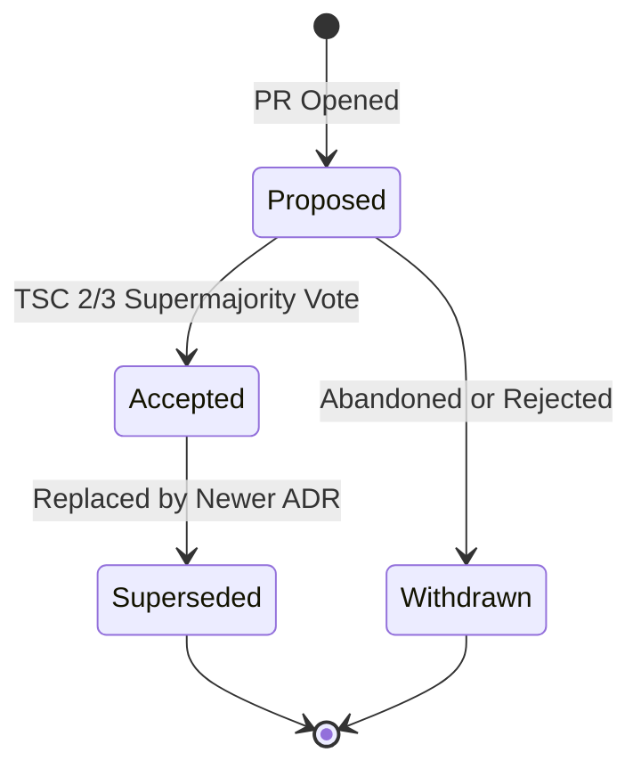

# Architecture Decision Records (ADRs)

Welcome to the **Spector Architecture Decision Record (ADR)** repository. This catalog records all architecturally significant decisions made throughout the evolution of Spector — capturing the context, options evaluated, trade-offs weighed, and ultimate rationale for each architectural choice.

Spector operates a **Living ADR Framework** governed under Linux Foundation / AAIF open governance standards. Architectural decisions are not static write-once documents; they reflect the current code reality of the engine and are maintained in sync with the codebase.

---

## 1. What is an Architecture Decision Record (ADR)?

An **Architecture Decision Record (ADR)** is a lightweight, version-controlled document that captures a single significant architectural decision, including:
- The context and problem statement.
- The forces and constraints driving the choice.
- The alternative designs and technologies considered.
- The decision outcome and rationale.
- The concrete code references and verification criteria.

ADRs preserve institutional memory, prevent architectural drift, onboard new contributors transparently, and explain *why* code is structured the way it is.

---

## 2. ADR Lifecycle & Statuses

Every ADR in Spector follows a formal lifecycle managed by the **Architecture Working Group (AWG)** and decided by the **Technical Steering Committee (TSC)**:



### Lifecycle Status Definitions

| Status | Definition | Meaning in Codebase |
|:---|:---|:---|
| **`Proposed`** | The decision is actively under review by the community and the Architecture Working Group. | An RFC discussion or draft PR is open; code has not yet been merged to `main`. |
| **`Accepted (Implemented)`** | The proposal has been formally approved by the TSC and verified against code on `main`. | Production code actively implements this architecture; classes and packages match verified specifications. |
| **`Superseded by ADR-XXXX`** | A previously accepted architecture has been replaced by a newer decision record (e.g., legacy multi-file layouts superseded by V4 bundles). | Historic record preserved for provenance; superseded code is removed or marked deprecated. |
| **`Withdrawn`** | The proposal was explored, researched, but ultimately rejected or abandoned without entering production. | No code implemented on `main`; archived for historical research context. |

---

## 3. When is an ADR Mandatory?

Not every code change requires an ADR. Routine bug fixes, minor refactorings, test improvements, and non-breaking internal optimizations do not require architectural records. 

An ADR is **strictly mandatory** for any change that impacts:

1. **Storage Layouts & Binary Serialization**:
   - Off-heap memory layouts (Panama FFM `MemoryLayout`, struct offsets, cache-line alignment).
   - Bundle formats, serialization headers, file descriptors, or index codecs (`.smkm`, `.hnsw`, `.ivf`).
2. **Network Protocols & Wire Contracts**:
   - Distributed cluster protocols, waterfall routing algorithms, leader leases, and fencing tokens.
   - REST/SSE wire formats, streaming chunker protocols, or Anthropic Model Context Protocol (MCP) tool schemas.
3. **Public APIs & Subsystem Boundaries**:
   - Additions or breaking changes to public interfaces in `nucleus/spector-commons`, `nucleus/spector-core`, or `memory/spector-kernel`.
   - New cognitive pathways (`Pathway<I, O>`), kernel shapes (`MemoryShape`), or accelerator SPIs (`ComputeAccelerator`).
4. **Major Dependencies & Platform Evolution**:
   - Java platform runtime upgrades (e.g., Project Valhalla, Panama Vector incubator updates).
   - Major framework introductions or replacements (Spring AI, Apache Camel, Armeria).
5. **Security, Privacy & Multi-Tenant Isolation Models**:
   - Differential privacy kernels, PII redaction engines, prompt injection filters.
   - Namespace boundary enforcement, cell-level isolation, or authentication/authorization mechanics.

---

## 4. How to Propose a New ADR

All architectural decisions originate from the open-source community. Follow this step-by-step workflow:

### Step 1: Open an RFC Discussion
Before drafting a full ADR, open a discussion in [GitHub Discussions](https://github.com/spectrayan/spector/discussions) under the **Architecture & RFCs** category. Summarize the problem, preliminary thoughts, and gather initial feedback from maintainers.

### Step 2: Copy the Official Template
Create a new branch from `main` and copy [`docs/adr/0000-template.md`](0000-template.md):
```bash
git checkout -b adr/my-new-architectural-decision
cp docs/adr/0000-template.md docs/adr/XXXX-my-new-architectural-decision.md
```
*Note: Replace `XXXX` with the next sequential canonical 4-digit number.*

### Step 3: Populate All Required Sections
Fill out the document completely:
- Prepend the standardized open-source metadata table:
  ```markdown
  | Field | Value |
  |:---|:---|
  | **Status** | Proposed |
  | **Date** | YYYY-MM-DD |
  | **Authors** | Spector Maintainers & Architecture Working Group |
  | **Deciders** | Spector Technical Steering Committee (TSC) |
  | **Supersedes** | None |
  | **Superseded By** | None |
  | **Last Verified** | YYYY-MM-DD |
  ```
- Strictly use **vendor-neutral open-source roles** (*Project Lead*, *Technical Lead*, *Architecture Working Group*, *TSC*, *Maintainers*, *Committers*). Never include corporate or commercial executive titles.
- Articulate the Problem Statement, Decision Drivers, Evaluated Options, Decision Outcome, and Concrete Code References.

### Step 4: Submit a Pull Request
Submit your PR against `main` targeting `docs/adr/XXXX-*.md`. Add the PR link to your RFC discussion.

### Step 5: TSC Review & Supermajority Vote
Per GOVERNANCE.md (`governance.md`), approving an Architecture Decision Record requires a **2/3 supermajority vote of the Technical Steering Committee (TSC)**. Once approved and the companion implementation is merged, the status transitions to `Accepted (Implemented)`.

---

## 5. Governance & Contribution Links

- **Project Governance Charter (`governance.md`)**: Open-source 4-tier contributor ladder, voting mechanics, and TSC stewardship.
- **Contributing Guide (`contributing.md`)**: Development setup, DCO sign-off (`git commit -s`), and code standards.
- **[Official ADR Template](0000-template.md)**: The standard AAIF-compliant proposal template.
- **[ADR Catalog Index](catalog.md)**: Master index of all canonical ADRs in Spector.
