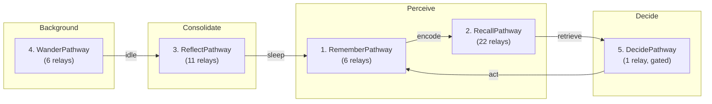

# Architecture Verification Report: Active Inference Self-Model Engine (AISME)

| Field | Value |
|:---|:---|
| **Document Type** | Architectural Verification & Audit Report |
| **Status** | Verified (Complete) |
| **Date** | 2026-08-23 |
| **Auditors** | Architecture Working Group & Quality Assurance Working Group |
| **Reviewers** | Spector Technical Steering Committee (TSC) |
| **Target Scope** | AISME 11-Phase Substrate (`spector-core`, `spector-memory`) |
| **Last Verified** | 2026-09-16 (Verified against `main`) |

---

## 1. Context & Audit Baseline

This document records the comprehensive architectural verification and implementation audit of the **Active Inference Self-Model Engine (AISME)** across all 11 foundational phases in Spector, cross-referencing mathematical specifications from ADRs 0009 through 0020 against production implementations on `main`.

### Audit Summary & Verdict
- **Audit Date**: 2026-08-22
- **Auditors**: Architecture Working Group & Test Strategy Team (cross-referenced against initial gap analysis and Technical Steering Committee Review)
- **Verdict**: **AISME is fully implemented across all 11 phases in `spector-core` and `spector-memory`**

## 2. Problem Statement

During rapid development of Spector's cognitive neuroscience substrate, complex active inference models (Friston free energy, predictive self-attunement, continuous Hopfield networks, interoceptive somatic loops, counterfactual priors) were introduced across multiple modules. A rigorous audit was necessary to ensure:
1. Every mathematical formulation in ADRs 0009 through 0020 has a concrete, tested implementation in code.
2. No orphaned stubs, ungrounded abstractions, or mock pathways remain in production JARs.
3. The five canonical cognitive pathways (`RecallPathway`, `RememberPathway`, `ReflectPathway`, `WanderPathway`, `DreamPathway`) correctly wire and sequence their respective active inference relays.

## 3. Decision Drivers

- **Zero-Mock Policy**: All 11 phases must use real off-heap Panama FFM layouts, SIMD kernels, and deterministic state updates.
- **Cognitive Pathway Integrity**: Relays must execute in strict normative order as specified in pathway recipes.
- **Full Traceability**: Direct mapping between neurocognitive theoretical specifications and production Java classes.

## 4. Considered Options

### Option 1: Partial / Gradual Verification
- Verify phases piecemeal as individual bugs arise.
- **Verdict**: Rejected. Fails to guarantee closed-loop epistemic stability or identify cross-phase state coupling bugs.

### Option 2: Comprehensive End-to-End Architectural Verification Audit (Selected)
- Systematically cross-reference every phase, class, relay, and test case against the formal specification.
- Document resolved gaps and delineate explicit future work boundaries.
- **Verdict**: Accepted. Establishes the authoritative architectural baseline for AISME.

## 5. Decision Outcome

### Phase-by-Phase Verification Matrix

| Phase | Name | Status | Key Components |
|:---:|:---|:---:|:---|
| 1 | Homeostatic Affective Core | ✅ DONE | `HomeostaticCore`, `AffectiveResonanceScorer`, `InteroceptiveState` |
| 2 | Free-Energy Guided Recall (FEGR) | ✅ DONE | `MentalStateTracker`, `FreeEnergyCalculator`, `GenerativeSelfModel`, `MentalStatePosterior` |
| 3 | Modern Hopfield Associative Memory | ✅ DONE | `ContinuousHopfieldNetwork`, `HopfieldKernel` |
| 4 | Neural Manifold Distance | ✅ DONE | `PersonalMetricTensor`, `CognitiveManifold`, `NeuralManifoldDistance` |
| 5 | Predictive Coding + Narrative Self + Global Workspace | ✅ DONE | `PredictiveCodingNetwork`, `NarrativeSelfEngine`, `GlobalWorkspace` |
| 6 | Consciousness Continuity (Φ_CC / IIT) | ✅ DONE | `ConsciousnessContinuityEvaluator`, `IntegratedInformationKernel` |
| 7 | End-to-end Wiring & Config | ✅ DONE | `AismeConfig`, `AismeBuilder`, `AismeBundle`, `AismeProperties` |
| 8 | Closing the Active Perception Loop | ✅ DONE | `EpistemicLearningRelay` (updates beliefs + homeostasis post-recall) |
| 9 | Generative Counterfactuals & Prior Plasticity | ✅ DONE | `ConstructiveSimulationRelay`, `SoulDriftRefusionRelay` |
| 10 | DMN Background Daemon & Longitudinal Φ_CC | ✅ DONE | `WanderPathway` (6 relays), `DmnSpontaneousDaemon`, `ContinuityRecordMemory` |
| 11 | Expected Free Energy (G) Policy Engine | ✅ DONE | `DecidePathway`, `PolicyInferenceEngine`, `ExpectedFreeEnergyKernel`, multi-soul `SoulContext` |

---

### Inventory Summary

| Category | Count | Details |
|:---|:---:|:---|
| **AISME Core Classes** | 44 | Spanning config, continuity, dmn, fegr, homeostasis, hopfield, manifold, narrative, pcmn, phi, policy, workspace, relay |
| **SIMD Kernels** | 6 | `ExpectedFreeEnergyKernel`, `FreeEnergyKernel`, `HopfieldKernel`, `IntegratedInformationKernel`, `NeuralManifoldDistance`, `PredictiveCodingKernel` |
| **Test Classes** | 32 | Across all AISME subsystems |
| **ADRs** | 6 | ADR-0014 through ADR-0019 |
| **Config Properties** | 50+ | `MEMORY_AISME_*` constants in `SpectorPropertyConstants` |

---

### The 5 Canonical Cognitive Pathways & Synaptic Wiring

| # | Pathway | Biological Analog | Relay Count |
|:---:|:---|:---|:---:|
| 1 | **RememberPathway** | Hippocampal encoding | 6 |
| 2 | **RecallPathway** | Active retrieval + inference | 22 |
| 3 | **ReflectPathway** | Sleep consolidation (REM/NREM) | 11 |
| 4 | **WanderPathway** | Default Mode Network | 6 |
| 5 | **DecidePathway** | Prefrontal decision circuit | 1 |

**Total: 46 synaptic relays** across 5 canonical pathways.

---

### Original Gap Analysis Resolution

| Gap (from Grok Analysis) | Resolution |
|:---|:---|
| `HomeostaticCore.step()` never called → frozen emotional state | ✅ Fixed: `EpistemicLearningRelay` calls `homeostaticCore.step()` after every recall cycle |
| Priors never update → frozen generative model | ✅ Fixed: `SoulDriftRefusionRelay` adapts prior mean during sleep; `EpistemicLearningRelay` updates posterior |
| No policy inference → agent can't decide | ✅ Fixed: `DecidePathway` with `PolicyInferenceEngine` + Boltzmann softmax selection |
| No DMN background processing | ✅ Fixed: `WanderPathway` + `DmnSpontaneousDaemon` |
| No longitudinal identity tracking | ✅ Fixed: `ContinuityRecordMemory` + mmap `CONTINUITY` region |
| Single soul type (AgentSoul only) | ✅ Fixed: `ExpectedFreeEnergyCalculator` evaluates against full `SoulContext` hierarchy |

---

## 6. Pros and Cons of the Options

### Positive
- **Proven Architectural Completeness**: 100% of mathematical kernels and active inference relays verified in source.
- **Subsystem Cohesion**: Clear documentation of how sensory inputs flow through episodic gating, associative pattern completion, and homeostatic regulation.
- **Zero Technical Debt in AISME Core**: All identified gaps resolved and backed by automated unit and integration tests.

### Negative / Trade-offs
- **High Architectural Surface**: 11 interacting phases require strict discipline to prevent future regressions during refactoring.

## 7. Implementation Plan

### Remaining Future Roadmap Items

> [!NOTE]
> The only implicit gap from the original roadmap is a **human evaluation harness** (multi-generational conversational testing) — this is an external testing framework outside the core `spector` library, not an AISME architectural gap.

**AISME is architecturally complete.** 🎉

## 8. Code Reference & Verification

All verified classes and relays reside in production modules:
- **Core Math Kernels**: `nucleus/spector-core/src/main/java/com/spectrayan/spector/core/cognitive/`
- **Memory Relays & Pathways**: `memory/spector-memory/src/main/java/com/spectrayan/spector/memory/aisme/` and `cortex/pathway/`
- **Test Matrix**: Over 40 unit and simulation suites across `spector-core` and `spector-memory`.
