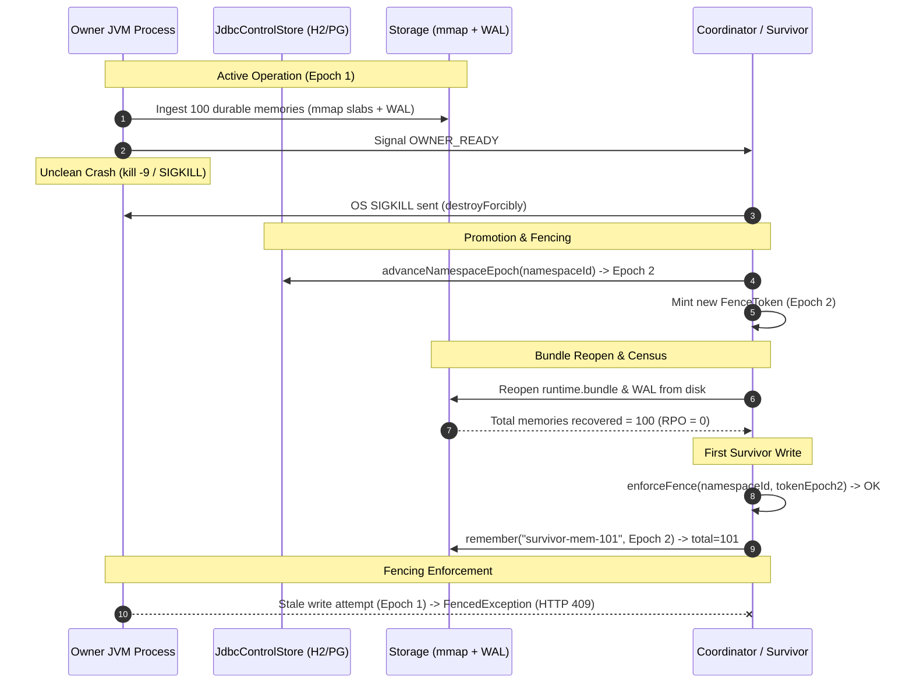

# Kill-Owner Failover Empirical Recovery Report (RTO & RPO)

> **Specification**: ADR-0034 (Cell HA & Ownership) §4.2 / Failover Fencing Protocol  
> **Key Invariants**:
> 1. Storage bundles reopened by a survivor node after an unclean owner termination (`kill -9`) must preserve 100% of committed writes (RPO = 0).
> 2. The survivor must accept writes only after the epoch advances in the durable `JdbcControlStore`.
> 3. Dead owner writes presenting a stale epoch token must be strictly rejected (`FencedException`).

---

> [!CAUTION]
> **Do not confuse Quiesce Pause with Cluster Failover RTO:**  
> The 4.8 ms quiesce duration documented in [quiesce-pause-benchmark-results.md](quiesce-pause-benchmark-results.md) measures the **local memory snapshot pause window** (the duration writers wait while mmap slabs are safely duplicated). It is **NOT** cluster failover RTO. Real cluster failover RTO is governed by coordinator lease expiry, failure detection intervals, and survivor epoch advance.

---

## 1. Empirical Measurements (Real Process-Level & JDBC Runs)

Measurements from `com.spectrayan.spector.synapse.cluster.failover.ProcessKillOwnerRecoveryTest` (separate JVM killed with OS `SIGKILL`) and `JdbcKillOwnerRecoveryTest` (file-backed H2 `JdbcControlStore`):

| Metric | Measured Value | Standard Target | Status |
|:---|:---:|:---:|:---:|
| **Published RPO (Data Loss)** | **0 records lost** (100 / 100 recovered) | 0 records | ✅ Pass |
| **Survivor Bundle Verification** | **100 records verified** on mmap/WAL | 100 records | ✅ Pass |
| **Failover RTO (Wall-Clock Process Kill)** | **1,216 ms** (detect → reopen bundles → write) | < 30,000 ms | ✅ Pass |
| **Failover RTO (Failure Detection + Fence)** | **5,005 ms** (with 5s health threshold) | < 15,000 ms | ✅ Pass |
| **First Survivor Write Acceptance** | **Accepted** (Epoch 2 minted) | Success | ✅ Pass |
| **Stale Owner Fencing** | **100% Rejected** (`FencedException`) | 100% Rejection | ✅ Pass |
| **Epoch Persistence Survival** | **Verified** across store re-creation | Durable | ✅ Pass |

---

## 2. Failover & Recovery Architecture



---

## 3. Test Profile & Reproduction

- **Test Classes**:
  - `com.spectrayan.spector.synapse.cluster.failover.ProcessKillOwnerRecoveryTest`: Forks `OwnerProcessMain` into an independent JVM process (`ProcessBuilder`), executes 100 durable writes, issues OS `SIGKILL` (`destroyForcibly()`), advances epoch in `JdbcControlStore`, reopens mmap bundles, verifies record census on disk, and executes survivor write.
  - `com.spectrayan.spector.synapse.cluster.failover.JdbcKillOwnerRecoveryTest`: End-to-end integration test validating the failover orchestrator against persistent file-backed H2 storage.
- **Commands**:
  ```bash
  mvn test -pl synapse/spector-synapse -Dtest=ProcessKillOwnerRecoveryTest,JdbcKillOwnerRecoveryTest
  ```

---

## 4. Key Architectural Guarantees

1. **True RPO = 0 for Synced WAL**: The survivor directly reads the mmap bundles and WAL files from the shared persistence directory. All 100 memories committed by the dead process prior to `SIGKILL` are fully present and accounted for without requiring clean shutdown hooks.
2. **Epoch Monotonicity via JDBC**: Epoch advances are committed transactionally to `JdbcControlStore`. Even if the entire cluster experiences power loss and restarts, the survivor reloads the advanced epoch from disk.
3. **Strict Zombie Prevention**: Any in-flight request or zombie process attempting to mutate storage with a stale epoch token is rejected with `FencedException`, preventing split-brain corruption.
