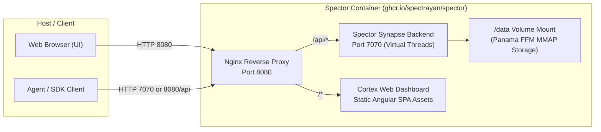

# ☁️ Deployment & Cloud Configuration

> **Production orchestration reference for deploying Spector across containerized, Kubernetes, and major public cloud infrastructures.** Covers Docker volume layouts, Helm chart parameters, kernel sysctl tuning, and multi-cloud Terraform modules.

---

## 1. Docker Container Architecture

The official Spector Docker container (`ghcr.io/spectrayan/spector:latest`) uses a dual-tier runtime architecture:



### Graceful Signal Draining

On `docker stop` or Kubernetes pod eviction (`SIGTERM`), `entrypoint.sh` traps the signal to guarantee zero data loss:
1. Nginx is ordered to quit (`nginx -s quit`), immediately closing external client ingress.
2. `SIGTERM` is forwarded to the Java PID, triggering Spector's internal JVM shutdown hook.
3. Spector finishes in-flight requests, flushes all dirty off-heap Panama memory pages (`vectors.mmap`), closes open WAL chunk files, and exits cleanly.

---

## 2. Docker Storage & Port Matrix

### Network Ports

| Container Port | Service | Host Binding Example | Purpose |
|:---|:---|:---|:---|
| `8080` | Nginx (Proxy + UI) | `-p 8080:8080` | Unified frontend endpoint: serves Cortex dashboard at `/` and proxies REST API at `/api/v1/*`. |
| `7070` | Spector Synapse API | `-p 7070:7070` | Direct backend API port for high-throughput headless agent SDKs. |

### Filesystem Volumes

| Container Mount Path | Mode | Description |
|:---|:---|:---|
| `/data` | Read-Write | Root persistent volume mount point. |
| `/data/memory` | Read-Write | Cognitive memory tier bundles, partitioned files (`semantic-xxx.mem`), and strength data. |
| `/data/identity` | Read-Write | Master key, tenant/user identity keystores, and credentials. |
| `/data/db` | Read-Write | Embedded metadata database (H2/catalog). |
| `/data/docs` | Read-Only / RW | Optional folder scanned by the batch document ingestion subsystem. |
| `/app/spector.yml` | Read-Only | Optional custom YAML configuration mounted to override default settings. |
| `/run/secrets/` | Read-Only | Docker secrets mount directory for encrypted API credentials. |

### Docker Run Example

```bash
docker run -d \
  --name spector \
  -p 8080:8080 \
  -p 7070:7070 \
  -v spector-data:/data \
  -v $(pwd)/spector.yml:/app/spector.yml:ro \
  -e SPECTOR_EMBEDDING_PROVIDER=ollama \
  -e SPECTOR_EMBEDDING_BASE_URL=http://host.docker.internal:11434 \
  -e SPECTOR_EMBEDDING_MODEL=nomic-embed-text \
  -e SPECTOR_EMBEDDING_DIMS=768 \
  ghcr.io/spectrayan/spector:latest
```

---

## 3. Kubernetes & Helm Configuration Reference

The official Helm chart is located under `deploy/helm/spector`. Below is the complete reference table for all configurable parameters in `values.yaml`:

| Parameter | Type | Default | Description |
|:---|:---|:---|:---|
| `replicaCount` | Integer | `1` | Number of Spector pod replicas. Note: Persistent disk persistence requires ReadWriteOnce or partition replication in cluster mode. |
| `image.repository` | String | `ghcr.io/spectrayan/spector` | Container image repository. |
| `image.tag` | String | `""` | Overrides image tag (defaults to `Chart.appVersion`). |
| `image.pullPolicy` | String | `IfNotPresent` | Kubernetes container image pull policy. |
| `serviceAccount.create` | Boolean | `true` | Create dedicated Kubernetes ServiceAccount. |
| `podSecurityContext.fsGroup` | Integer | `1000` | Group ID with filesystem permissions for `/data`. |
| `securityContext.runAsNonRoot` | Boolean | `true` | Enforces non-root container execution. |
| `securityContext.runAsUser` | Integer | `1000` | Spector service user ID. |
| `securityContext.readOnlyRootFilesystem` | Boolean | `false` | Read-only container root (`/data` remains writable). |
| `securityContext.capabilities.drop` | List | `["ALL"]` | Drops all elevated Linux capabilities. |
| `sysctl.enabled` | Boolean | `true` | Master toggle for Project Panama FFM kernel tuning. |
| `sysctl.useInitContainer` | Boolean | `true` | Uses a privileged `busybox` initContainer to set node sysctls (required on managed cloud clusters like EKS, GKE, AKS). |
| `sysctl.vmMaxMapCount` | Integer | `262144` | Virtual memory map limit for Panama off-heap files. |
| `sysctl.fsFileMax` | Integer | `1048576` | System-wide maximum open file descriptors. |
| `service.type` | String | `ClusterIP` | Kubernetes service type (`ClusterIP`, `NodePort`, `LoadBalancer`). |
| `service.ports.dashboard` | Integer | `7700` | Service port for Cortex UI dashboard. |
| `service.ports.api` | Integer | `7070` | Service port for Synapse REST API. |
| `ingress.enabled` | Boolean | `false` | Enable Kubernetes Ingress controller resource. |
| `ingress.className` | String | `""` | Ingress class (e.g. `nginx`, `alb`, `traefik`). |
| `ingress.hosts[0].host` | String | `spector.local` | Public ingress hostname. |
| `resources.requests.cpu` | String | `500m` | CPU compute request. |
| `resources.requests.memory` | String | `1Gi` | RAM allocation request. |
| `resources.limits.cpu` | String | `2000m` | Maximum CPU compute limit. |
| `resources.limits.memory` | String | `3Gi` | Maximum RAM allocation limit (tune based on vector count). |
| `persistence.enabled` | Boolean | `true` | Attach PersistentVolumeClaim for storage durability. |
| `persistence.accessMode` | String | `ReadWriteOnce` | PVC access mode. |
| `persistence.size` | String | `10Gi` | PVC storage allocation size. |
| `persistence.mountPath` | String | `/data` | Path inside container where PVC is attached. |
| `persistence.storageClass` | String | `""` | StorageClass name (empty string uses cluster default). |
| `persistence.createStorageClass` | Boolean | `false` | Whether Helm should provision a custom high-performance StorageClass. |
| `persistence.storageClassName` | String | `spector-high-perf` | Name for custom provisioned StorageClass. |
| `persistence.provisioner` | String | `ebs.csi.aws.com` | CSI driver provisioner for custom StorageClass. |
| `persistence.volumeBindingMode` | String | `WaitForFirstConsumer` | Delays volume binding until pod is scheduled to a specific node zone. |
| `env` | Map | *(See values.yaml)* | Key-value dictionary of environment variables injected into the container. |
| `secretRef.name` | String | `""` | Existing Kubernetes Secret containing sensitive API keys (`SPECTOR_EMBEDDING_API_KEY`, etc.). |
| `nodeSelector` | Map | `{}` | Node labels for pod scheduling. |
| `affinity` | Map | `{}` | Pod and node affinity / anti-affinity rules. |
| `tolerations` | List | `[]` | Node taints tolerated by the Spector pod. |

---

## 4. High-Performance StorageClasses for Vectors

Because Spector uses memory-mapped files (`vectors.mmap`) and synchronous WAL logging, selecting the correct StorageClass is critical for query latency and write throughput:

| Cloud Platform | Recommended StorageClass | CSI Provisioner | Performance Profile |
|:---|:---|:---|:---|
| **AWS EKS** | `gp3` (or `io2`) | `ebs.csi.aws.com` | Minimum 3,000 IOPS, 125 MB/s throughput; scale IOPS for $>1\text{M}$ vectors. |
| **GCP GKE** | `hyperdisk-balanced` / `pd-ssd` | `pd.csi.storage.gke.io` | Ultra-low read latency for vector page faults. |
| **Azure AKS** | `managed-csi-premium` (or `ultra-disk`) | `disk.csi.azure.com` | Premium SSD v2 or Ultra Disk with `WaitForFirstConsumer`. |
| **Bare-Metal** | Local NVMe (`no-provisioner`) | `kubernetes.io/no-provisioner` | Maximum throughput ($>500\text{K}$ IOPS), near-zero latency. |

---

## 5. Terraform Cloud Modules Reference

Spector includes native Terraform modules under `deploy/terraform/modules/` for automated infrastructure provisioning.

### AWS ECS Fargate Module

Located at `deploy/terraform/modules/aws-ecs`:

#### Input Variables

| Variable | Type | Default | Description |
|:---|:---|:---|:---|
| `name` | String | `spector` | Application and resource naming prefix. |
| `aws_region` | String | *(Required)* | AWS target region (e.g., `us-east-1`). |
| `cluster_id` | String | *(Required)* | ID of target AWS ECS cluster. |
| `subnets` | List(String) | *(Required)* | VPC subnets where Fargate tasks will be placed. |
| `security_groups` | List(String) | `[]` | Security group IDs attached to the ECS task. |
| `assign_public_ip` | Boolean | `false` | Assign public IP (useful for public subnets without NAT). |
| `image` | String | `ghcr.io/spectrayan/spector:latest` | Container image URI. |
| `cpu` | String | `1024` | Fargate CPU units (1024 = 1 vCPU). |
| `memory` | String | `2048` | Fargate RAM allocation in MB. |
| `dimensions` | Number | `384` | Cognitive memory vector dimensionality. |
| `embedding_provider` | String | *(Required)* | Provider type (`ollama`, `openai`, `google`, `anthropic`, etc.). |

#### Module Outputs

| Output Name | Description |
|:---|:---|
| `service_name` | The name of the provisioned ECS Service. |
| `task_definition_arn` | Full ARN of the generated ECS Task Definition. |
| `service_id` | Unique ID of the ECS Service. |

---

### GCP Cloud Run Module

Located at `deploy/terraform/modules/gcp-cloudrun`:

#### Input Variables

| Variable | Type | Default | Description |
|:---|:---|:---|:---|
| `project_id` | String | *(Required)* | GCP project identifier. |
| `region` | String | *(Required)* | GCP region (e.g., `us-central1`). |
| `service_name` | String | `spector` | Name of the Cloud Run service. |
| `image` | String | `ghcr.io/spectrayan/spector:latest` | Container image URI. |
| `cpu` | String | `2` | Number of vCPUs allocated. |
| `memory` | String | `2Gi` | Memory allocated to the container. |
| `min_instances` | Number | `1` | Keep 1 instance warm to prevent cold-start index reloads. |
| `max_instances` | Number | `10` | Auto-scaling ceiling. |
| `filestore_mount` | String | `""` | Optional Cloud Filestore NFS mount path for `/data`. |

#### Module Outputs

| Output Name | Description |
|:---|:---|
| `service_url` | Public HTTPS URL for the deployed Cloud Run service. |
| `service_name` | Unique Cloud Run resource identifier. |

---

### Azure Container Apps Module

Located at `deploy/terraform/modules/azure-aca`:

#### Input Variables

| Variable | Type | Default | Description |
|:---|:---|:---|:---|
| `resource_group_name` | String | *(Required)* | Azure resource group name. |
| `location` | String | *(Required)* | Azure data center location (e.g., `eastus`). |
| `container_app_environment_id`| String | *(Required)* | ID of target Container Apps Managed Environment. |
| `app_name` | String | `spector` | Name of the Container App. |
| `cpu` | Number | `1.0` | Container CPU cores. |
| `memory` | String | `2.0Gi` | Container memory. |
| `storage_account_name` | String | `""` | Storage account backing Azure Files volume for `/data`. |
| `azure_file_share_name` | String | `""` | Azure File share name mounted to `/data`. |

#### Module Outputs

| Output Name | Description |
|:---|:---|
| `fqdn` | Fully Qualified Domain Name of the container application. |
| `app_id` | Unique Azure Container App resource ID. |
