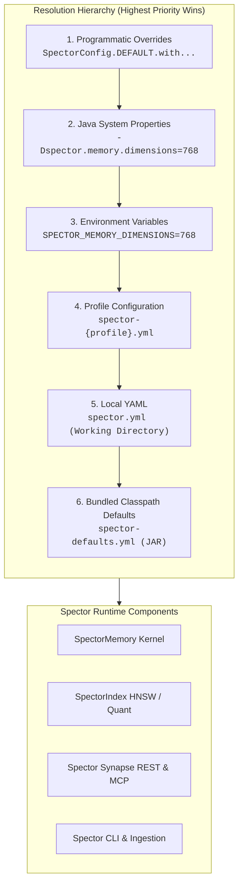

# ⚙️ Configuration Architecture & Precedence

> **Spector's unified configuration subsystem powers everything from microsecond embedded vector search to multi-tenant distributed cognitive memory clusters.** This guide outlines the 6-layer configuration hierarchy, profile activation, discovery paths, and runtime resolution mechanics.

<div class="grid cards" markdown>

-   :material-file-document-outline: **spector.yml Master Reference**

    ---

    Exhaustive dictionary of all 32 configuration domains, data types, constraints, and default values.

    [Explore YAML Reference ↗](spector-yml.md){ .md-button .md-button--primary }

-   :material-variable: **Environment Variables & Secrets**

    ---

    Canonical screaming snake_case mappings, short aliases, Docker secrets, and Panama FFM runtime flags.

    [View Environment Guide ↗](environment-variables.md){ .md-button }

-   :material-cloud-outline: **Deployment & Cloud Config**

    ---

    Docker container matrices, Helm `values.yaml` tuning, and Terraform modules for AWS, GCP, and Azure.

    [Explore Cloud Config ↗](deployment-config.md){ .md-button }

-   :material-api: **REST API & Runtime Parameters**

    ---

    HTTP headers, request payload schemas, query parameters, and cognitive modifiers across all endpoints.

    [Browse API Parameters ↗](api-parameters.md){ .md-button }

-   :material-tune: **Engine & Algorithmic Tuning**

    ---

    Programmatic Java builder API, HNSW graph parameters, quantization profiles, and retrieval weights.

    [Read Tuning Guide ↗](parameters.md){ .md-button }

</div>

---

## 🏛️ Configuration Architecture

Spector employs a layered, hierarchical configuration engine built in `nucleus/spector-config` centered on `SpectorConfigSource`. Under the hood, it layers multiple configuration sources using Apache Commons Configuration 2 with an `OverrideCombiner`. 

Higher layers take precedence over lower layers, allowing global defaults to be established in version control while environment-specific secrets, container volumes, and runtime flags selectively override individual keys.



---

## 🪜 The 6-Layer Resolution Order

| Priority | Layer | Source | Typical Use Case |
|:---|:---|:---|:---|
| **1 (Highest)** | **Programmatic Overrides** | `SpectorConfig.builder()` / Java API | Unit tests, embedded microservices, custom agent harnesses |
| **2** | **System Properties** | `-Dspector.*` JVM CLI options | One-off CLI overrides, JVM performance diagnostics |
| **3** | **Environment Variables** | `SPECTOR_*` OS environment | Kubernetes Pods, Docker containers, CI/CD runners, Docker Secrets |
| **4** | **Active Profile YAML** | `spector-{profile}.yml` | Environment profiles (`docker`, `production`, `bench`, `test`) |
| **5** | **Local YAML** | `spector.yml` (working dir) | Local developer workstations, custom host deployments |
| **6 (Lowest)** | **Classpath Defaults** | `spector-defaults.yml` (bundled) | Factory baseline defaults guaranteed by the JAR |

---

### Layer 1: Programmatic Overrides

When using Spector embedded as a Java library, code-level builder invocations override any external configuration files:

```java
import com.spectrayan.spector.config.SpectorConfig;
import com.spectrayan.spector.model.QuantizationType;

// Programmatic configuration completely overrides environment and YAML defaults
var config = SpectorConfig.DEFAULT
    .withDimensions(768)
    .withCapacity(1_000_000)
    .withQuantization(QuantizationType.SCALAR_INT4)
    .withRescore(3);
```

### Layer 2: Java System Properties

System properties passed on the command line via `-D` override environment variables and configuration files:

```bash
java \
  --enable-preview --add-modules=jdk.incubator.vector --enable-native-access=ALL-UNNAMED \
  -Dspector.memory.dimensions=1536 \
  -Dspector.provider.embedding.type=openai \
  -jar spector-synapse.jar
```

### Layer 3: Environment Variables & Secrets

Every dot-notation configuration property automatically maps to a screaming snake_case environment variable. Dots and hyphens are replaced with underscores, and the key is uppercased:

- `spector.memory.dimensions` $\to$ `SPECTOR_MEMORY_DIMENSIONS`
- `spector.hnsw.ef-construction` $\to$ `SPECTOR_HNSW_EF_CONSTRUCTION`
- `spector.provider.embedding.api-key` $\to$ `SPECTOR_PROVIDER_EMBEDDING_API_KEY`

For container convenience, Spector also supports short aliases (e.g. `SPECTOR_EMBEDDING_PROVIDER`) and Docker secrets (`/run/secrets/`). See the [Environment Variables & Secrets Guide](environment-variables.md) for the complete mapping table.

### Layer 4: Profile Configuration (`spector-{profile}.yml`)

Profiles allow you to package environment-specific configurations cleanly. When a profile is active, Spector loads `spector-{profile}.yml` and overlays it on top of `spector.yml`.

#### Activating a Profile

Profiles can be activated using either an environment variable or a command-line argument:

```bash
# Via Environment Variable
export SPECTOR_PROFILE=docker

# Via Spring / Synapse CLI argument
java -jar spector-synapse.jar --spector.profile=production
```

#### Common Profiles Bundled with Spector

- `spector-docker.yml` — Optimized for containerized environments (`/data/memory` persistence, `host.docker.internal` networking, reduced memory footprint).
- `spector-bench.yml` — Tuned for maximum recall benchmarks (uncompressed vectors, elevated $efSearch$, disabled background sleep consolidation).
- `spector-test.yml` — In-memory persistence (`MEMORY`), zero disk footprint, ephemeral test isolation.

### Layer 5: Local `spector.yml`

A `spector.yml` file placed in the application's working directory provides baseline project configuration. If present, it overrides the bundled defaults:

```yaml
spector:
  mode: MEMORY
  memory:
    persistence-mode: DISK
    persistence-path: ./data/memory
    dimensions: 768
  provider:
    embedding:
      type: ollama
      model: nomic-embed-text
```

### Layer 6: Classpath Defaults (`spector-defaults.yml`)

The JAR bundles `spector-defaults.yml` (located in `nucleus/spector-config/src/main/resources/spector-defaults.yml`). This file guarantees that Spector always has valid, production-hardened defaults for all 35 property groups even if no configuration files or environment variables are provided.

---

## 🔍 Discovery & File Search Paths

When bootstrapping via `SpectorConfigSource.load()`, Spector searches for YAML configuration files in the following sequence:

1. **Explicit Path**: If specified via `SpectorConfigSource.load(Path.of("/custom/path.yml"))` or `--spring.config.additional-location=file:/app/spector.yml`.
2. **Current Working Directory**: `./spector-{profile}.yml` then `./spector.yml`.
3. **User Home Directory**: `~/.spector/spector-{profile}.yml` then `~/.spector/spector.yml`.
4. **System Configuration Directory**: `/etc/spector/spector.yml` (on Linux / Unix systems).
5. **Classpath**: `classpath:spector-defaults.yml`.

---

## 🛡️ Validation & Error Handling

Configuration loading performs strict validation on initialization. If an invalid type, unparseable duration, or out-of-range value is encountered, Spector fails fast with clear diagnostic exceptions:

- `SpectorConfigNotFoundException` — Thrown when an explicitly required configuration file is missing from the file system.
- `SpectorConfigParseException` — Thrown when a YAML file contains malformed syntax, unescaped characters, or illegal indentation.
- `SpectorValidationException` (with `ErrorCode.INVALID_ARGUMENT`) — Thrown when a value violates semantic constraints (e.g. `dimensions <= 0`, unknown provider enum, or `decay-factor > 1.0`).

---

## 🚀 Next Steps

- Consult the [Master spector.yml Reference](spector-yml.md) for full configuration keys, ranges, and schema details.
- Review [Environment Variables & Secrets](environment-variables.md) for production container operations.
- Inspect [Deployment & Cloud Config](deployment-config.md) for Kubernetes Helm and Terraform setups.
