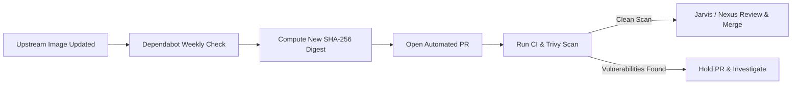

# 🛡️ Container Security & Base Image Pinning

> **Cryptographically pinned, non-root, multi-stage container images with automated vulnerability scanning and CVE patch workflows.**

Spector cognitive memory runs in security-critical environments where data integrity, low latency, and zero supply chain compromises are mandatory. To protect against malicious upstream image modifications, supply chain drift, and runtime privilege escalations, Spector enforces a defense-in-depth container security posture across all build and runtime targets.

---

## 1. Cryptographic Base Image Digest Pinning Strategy

### The Threat of Floating Tags
Standard Docker tags (such as `:latest`, `:25-jre`, or `:22-alpine`) are mutable pointers. Relying on floating tags creates two critical security hazards:

1. **Supply Chain Poisoning**: If an upstream repository or registry credential is compromised, malicious code or backdoored layers can be injected into production builds without modifying the Dockerfile.
2. **Non-Reproducible Builds**: Upstream maintainers regularly rebuild tags with updated OS packages. A build that succeeded yesterday may fail or introduce unforeseen regressions today due to untracked transitive package changes.

### Immutable `@sha256:` Digest Enforcement
To guarantee bit-for-bit build reproducibility and eliminate supply chain poisoning, all stages in `deploy/docker/Dockerfile` are pinned to immutable upstream cryptographic SHA-256 manifest list digests.

| Stage | Image Tag & Platform | Pinned SHA-256 Digest | Purpose |
|:---|:---|:---|:---|
| **Stage 1: Cortex Builder** | `node:22.22.3-alpine` (`--platform=$BUILDPLATFORM`) | `sha256:e58326d0d441090181ac150dc2078d3e2cf6a0d42e809aebba3ef5880935ffdd` | Compiles Angular 22 Cortex 3D neural dashboard |
| **Stage 2: Synapse Builder** | `maven:3.9-eclipse-temurin-25` (`--platform=$BUILDPLATFORM`) | `sha256:dd8e01b3be719853578c07b57ff8d9bbbbfe746f802226f05b19689420815221` | Compiles Java 25 reactor modules & packages fat JAR |
| **Stage 3: Gateway Builder** | `maven:3.9-eclipse-temurin-25` (`--platform=$BUILDPLATFORM`) | `sha256:dd8e01b3be719853578c07b57ff8d9bbbbfe746f802226f05b19689420815221` | Packages dedicated reactive ingress router JAR |
| **Stage 4: Gateway Runtime** | `eclipse-temurin:25-jre` | `sha256:bb036ed6cfdc57e3da7c22634d15f1b840d2caf76183861c80e81ca4b5104abb` | Lean JRE runtime for Cell Ingress Router (ADR-0081) |
| **Stage 5: Synapse Runtime** | `eclipse-temurin:25-jre` | `sha256:bb036ed6cfdc57e3da7c22634d15f1b840d2caf76183861c80e81ca4b5104abb` | Full Spector node runtime (Synapse + Cortex + Nginx) |

### Multi-Platform Manifest Lists
All pinned digests reference multi-architecture manifest lists (OCI image indexes) supporting both `linux/amd64` and `linux/arm64`. Using the index digest rather than an architecture-confined child digest ensures that:

- Host cross-compilation with `--platform=$BUILDPLATFORM` operates seamlessly.
- Target multi-platform builds produce native binaries for both Intel/AMD and Apple Silicon / AWS Graviton architectures without syntax changes.

```dockerfile
# Example from deploy/docker/Dockerfile
FROM --platform=$BUILDPLATFORM node:22.22.3-alpine@sha256:e58326d0d441090181ac150dc2078d3e2cf6a0d42e809aebba3ef5880935ffdd AS builder-cortex
FROM --platform=$BUILDPLATFORM maven:3.9-eclipse-temurin-25@sha256:dd8e01b3be719853578c07b57ff8d9bbbbfe746f802226f05b19689420815221 AS builder-synapse
FROM eclipse-temurin:25-jre@sha256:bb036ed6cfdc57e3da7c22634d15f1b840d2caf76183861c80e81ca4b5104abb AS runtime
```

---

## 2. Container Hardening Standards

Both the lean Gateway and the all-in-one Runtime targets implement defense-in-depth container hardening:

### 1. Non-Root Principle of Least Privilege

- Neither root nor the default cloud image user (`ubuntu`) is permitted to run processes.
- A dedicated service account `spector` (UID `1000`, GID `1000`) is provisioned with `/bin/bash` shell and no sudo privileges.
- Default users (`ubuntu`) and lingering dev binaries (`/usr/bin/pebble`) are stripped from the base image.
- Both `gateway` and `runtime` stages declare `USER 1000:1000`.

### 2. PID 1 Zombie Reaping with `tini`

- Java processes running directly as PID 1 do not properly reap orphaned child processes or route POSIX termination signals (`SIGTERM`, `SIGINT`).
- `tini` is installed and invoked as the container `ENTRYPOINT`:
  ```dockerfile
  ENTRYPOINT ["/usr/bin/tini", "--", "/app/entrypoint.sh"]
  ```

- This ensures clean shutdown sequences, flushing all in-flight off-heap slabs (`Arena.ofShared()`) and persisting partition summaries to disk before the container stops.

### 3. Attack Surface Reduction

- **Build Tool Segregation**: Compilers (`javac`, `mvn`, `npm`), header files, and source code remain isolated in intermediate builder stages and are absent from the runtime stages.
- **Apt Cleanup**: Package indexes (`/var/lib/apt/lists/*`) are purged immediately after utility installation to minimize footprint.
- **Package Patching**: Key utilities (`perl-base`, `gpgv`) are explicitly upgraded in the base layer to neutralize dormant base-image vulnerabilities.

### 4. Healthcheck Probes
Every runtime image defines an explicit container healthcheck:
```dockerfile
HEALTHCHECK --interval=10s --timeout=3s --start-period=20s --retries=3 \
    CMD curl -sf http://127.0.0.1:7070/actuator/health || exit 1
```
Orchestrators (Kubernetes, Docker Compose, ECS) automatically monitor service availability and route traffic away from degrading nodes.

---

## 3. Automated Dependabot Pin Maintenance Workflow

Pinning digests without automation risks image staleness, leaving container images vulnerable as security patches are published upstream. Spector automates base image pin maintenance using GitHub Dependabot.

### Dependabot Configuration (`.github/dependabot.yml`)
The repository includes a dedicated `docker` package ecosystem entry monitoring `/deploy/docker`:

```yaml
  - package-ecosystem: "docker"
    directory: "/deploy/docker"
    schedule:
      interval: "weekly"
    labels:
      - "dependencies"
      - "docker"
    open-pull-requests-limit: 5
```

### How the Automated Update Lifecycle Works



1. **Scheduled Scan**: Every Monday, Dependabot parses `deploy/docker/Dockerfile` and checks registry APIs for new digest releases on the referenced tags (`node:22.22.3-alpine`, `maven:3.9-eclipse-temurin-25`, `eclipse-temurin:25-jre`).
2. **Automated Pull Request**: When an upstream update is detected, Dependabot submits a PR updating the `@sha256:` digest string in place.
3. **CI Validation**: The PR automatically triggers:
    - Full reactor compilation and unit test passes.
    - `container-security.yml` building the image and executing Trivy vulnerability scanning.
    - `mvn license:check` verifying Apache 2.0 license compliance.
4. **Merge Protocol**: Once all quality gates pass without new security advisories, the PR is reviewed and merged into `main`.

---

## 4. Trivy CI Vulnerability Scanning Integration

All container modifications and weekly builds are subjected to automated static vulnerability scanning via Trivy.

### Workflow Specification (`.github/workflows/container-security.yml`)

- **Triggers**:
    - `push` to `main` modifying `deploy/docker/**`, `**/Dockerfile*`, or `pom.xml`.
    - `pull_request` targeting `main` touching container definitions.
    - Scheduled weekly scan every Monday at 04:00 UTC (`cron: '0 4 * * 1'`).
    - Manual trigger via `workflow_dispatch`.

### Scan Execution & Quality Gates

```yaml
- name: Scan Docker image with Trivy (Console & Step Summary)
  uses: aquasecurity/trivy-action@master
  with:
    image-ref: 'spector:scan-target'
    format: 'table'
    severity: 'CRITICAL,HIGH,MEDIUM,LOW'
    ignore-unfixed: true
    exit-code: '0'

- name: Generate Trivy SARIF Report
  uses: aquasecurity/trivy-action@master
  with:
    image-ref: 'spector:scan-target'
    format: 'sarif'
    output: 'trivy-results.sarif'
    severity: 'CRITICAL,HIGH,MEDIUM,LOW'
    ignore-unfixed: true

- name: Upload SARIF to GitHub Code Scanning
  uses: github/codeql-action/upload-sarif@v4
  if: always()
  with:
    sarif_file: 'trivy-results.sarif'
    category: 'container-docker'
```

- **Vulnerability Filtering**: Scans evaluate OS packages, Node dependencies, and Java runtime JARs. Unfixed upstream CVEs (`ignore-unfixed: true`) are filtered to avoid spurious build breaks while highlighting actionable patches.
- **Code Scanning Integration**: SARIF results are published to the repository's **Security > Code Scanning Alerts** dashboard, providing line-level attribution and historical tracking.

---

## 5. Emergency CVE Patch Policy

When a zero-day or high-severity CVE is disclosed affecting an upstream base image (such as an OpenSSL, glibc, or OpenJDK security advisory), Spector maintainers execute an accelerated emergency patch runbook.

### Severity Taxonomy & Target Fix Windows

In accordance with [SECURITY.md](https://github.com/spectrayan/spector/blob/main/SECURITY.md):

| Severity | CVSS v3.1 Range | Acknowledgment SLA | Target Fix Window | Escalation Channel |
|:---|:---:|:---:|:---:|:---|
| **Critical** | 9.0 – 10.0 | < 24 hours | **< 48 hours** (Emergency Fast-Track) | `@nexus` + `@jarvis` |
| **High** | 7.0 – 8.9 | < 48 hours | 7 calendar days | `@nexus` |
| **Medium** | 4.0 – 6.9 | < 48 hours | 14 calendar days | Next Dependabot cycle |
| **Low** | 0.1 – 3.9 | < 5 business days | Next scheduled release | Backlog |

### Emergency Patch Runbook

For Critical vulnerabilities (CVSS $\ge$ 9.0) in container base layers:

#### Step 1: Upstream Verification
Retrieve the new upstream digest published by Eclipse Adoptium or Docker Official Images:
```bash
# Example: Inspect upstream multi-arch index digest for Temurin 25 JRE
TOKEN=$(curl -s "https://auth.docker.io/token?service=registry.docker.io&scope=repository:library/eclipse-temurin:pull" | sed -E 's/.*"token":"([^"]+)".*/\1/')
curl -s -I -H "Authorization: Bearer $TOKEN" \
  -H "Accept: application/vnd.oci.image.index.v1+json" \
  "https://registry-1.docker.io/v2/library/eclipse-temurin/manifests/25-jre" | grep -i docker-content-digest
```

#### Step 2: Emergency Branch & Pin Update

1. Create hotfix branch: `git checkout -b hotfix/cve-<cve-id>-base-image`
2. Update the `@sha256:` digest in `deploy/docker/Dockerfile`.
3. Update this document (`docs/deployment/container-security.md`) with the new digest.

#### Step 3: Local Verification & Scanning
```bash
# Verify Dockerfile syntax and resolution
docker build --check -f deploy/docker/Dockerfile .

# Verify license compliance
mvn license:check

# Run local Trivy scan against the candidate build
docker build -t spector:hotfix-test -f deploy/docker/Dockerfile .
trivy image --severity CRITICAL,HIGH spector:hotfix-test
```

#### Step 4: Accelerated Review & Release

1. Submit PR with title `fix(docker): patch CVE-<year>-<id> by advancing <base-image> digest pin`.
2. Ensure commit carries DCO 1.1 sign-off (`git commit -s`).
3. Maintainers (`@nexus`, `@jarvis`) review and merge immediately upon passing CI gates.
4. CI publishes patched images to `ghcr.io/spectrayan/spector` and triggers release notifications.
