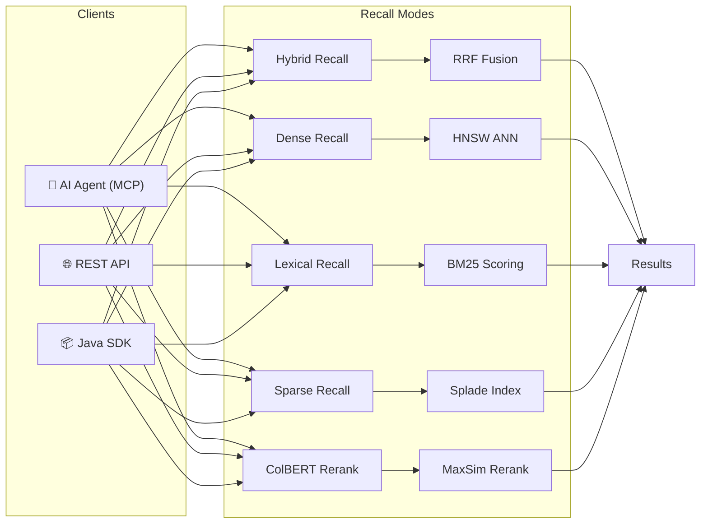

# 🌟 What is Spector?

> **The Zero-Overhead, Agent-Ready AI Memory Backbone.**
>
> Legacy AI architectures bolted memory onto stateless vector databases. Spector is designed from the ground up for modern AI — combining dense vector similarity, BM25 keyword matching, SPLADE learned sparse retrieval, Hebbian graph structures, and hybrid ranking in a single embeddable library with zero external dependencies. Connect any AI agent via the built-in MCP server, or embed directly in your application.

Spector is an open-source, high-performance cognitive memory system built entirely on modern Java 25. It's designed for developers who want sub-millisecond memory retrieval, native AI agent integration, and zero infrastructure complexity. Drop in a JAR, write a few lines of code, and you have production-grade cognitive memory with built-in agent support.

---

## 🎯 What It Does

Spector indexes documents with their vector embeddings and text content, then retrieves them using multiple strategies — directly from AI agents or your application code:

| Mode | Active Layers | How It Works | Best For |
|------|--------------|-------------|----------|
| **🧠 Dense Recall** | Dense Vector (HNSW) | HNSW approximate nearest neighbor graphs | Semantic similarity, conceptual queries |
| **📝 Lexical Recall** | BM25 only | SIMD-accelerated Lucene-style scoring | Exact term matching, error codes, IDs |
| **🧬 Hybrid Recall** | BM25 + Dense Vector | Parallel execution fused via RRF | General purpose, balanced quality |
| **📈 Sparse Recall** | SPLADE / Li-LSR | Neural term expansion with inverted indexing | Synonym-aware lexical search |
| **🚀 ColBERT Rerank** | Vector + BM25 + ColBERT | Late-interaction MaxSim token matching | Maximum precision, grounded context |
| **🏛️ SpectorIndex** | IVF-HNSW-SVASQ | Adaptive quantized hybrid index | Large scale index compression + recall |

---

## 💎 Key Differentiators

### 🤖 Agent-Native (MCP Protocol)

Includes a built-in [Model Context Protocol](https://modelcontextprotocol.io/) server with 16 tools. AI agents connect directly via JSON-RPC — no Python frameworks, no network round-trips.

| Feature | Python Vector DB MCP | **Spector MCP** |
|:---|:---|:---|
| Recall latency | 2–10ms | **0.13ms p50** (15–75× faster) † |
| Network overhead | HTTP/gRPC round-trip | **Zero** (in-process) |
| Concurrent queries | Limited by Python GIL | **61,000 QPS** † |
| Dependencies | Python framework stack | **Single JAR** |

† *Measured. See [Benchmarks](index.md#-benchmarks).*

> [!TIP]
> See the [MCP Server Guide](sdk-usage/mcp-server.md) to connect Claude Desktop, Cursor, or any MCP client in minutes.

### 📦 Pure Java, Zero Dependencies

Unlike most vector databases that rely on C++, Rust, or Python bindings, Spector is 100% Java. It uses the JDK's own Vector API for SIMD acceleration — no JNI, no native libraries, no external infrastructure.

> [!TIP]
> Add the JAR to your classpath and you're done. No Docker, no clusters, no ops.

### 🚀 Modern JVM Technologies

| Technology | Purpose |
|-----------|---------| 
| Java Vector API | SIMD-accelerated math (AVX2/AVX-512/NEON) |
| Panama FFM | Zero-copy memory-mapped storage, GPU interop |
| Virtual Threads | Millions of concurrent operations without thread pools |
| Structured Concurrency | Safe parallel task management |

### ⚡ Sub-Millisecond at Scale

**HNSW** at 100K documents (128 dimensions, top-10, M=16, efSearch=64):

| Recall Type | Average Latency | Throughput |
|-------------|----------------|------------|
| Dense | **0.13 ms** | 7,556 QPS |
| Lexical | **0.98 ms** | 1,019 QPS |
| Hybrid | **1.01 ms** | 994 QPS |

**SpectorIndex (IVF-HNSW-SVASQ)** at 10K documents (4096-dim real Qwen3 embeddings):

| Config | Average Latency | Throughput | Recall@10 |
|--------|----------------|------------|----------|
| nCentroids=128, nProbe=4 | **0.46 ms** | **2,173 QPS** | **1.0000** |
| nCentroids=64, nProbe=4 | **0.62 ms** | 1,601 QPS | **1.0000** |
| nCentroids=128, nProbe=16 | **1.26 ms** | 792 QPS | **1.0000** |

> [!NOTE]
> SpectorIndex achieves **perfect recall while searching only 3.1% of the data** (nProbe=4 out of 128 centroids). Ingestion is 28–160× faster than standalone HNSW. Numbers measured on 24-core x86, AVX2, Java 25, ZGC with Qwen3-embedding real vectors. For comprehensive, multi-centroid sweeps and adaptive HNSW shard promotion benchmarks, see the dedicated [Large-Scale Real-Embedding Benchmarks page](deep-dives/real-embedding-benchmarks.md).

### 🏠 Dual Deployment Modes

| Mode | Description | Best For |
|------|-------------|----------|
| **Embedded** | In-process library, zero network overhead | Microservices, desktop apps, edge |
| **Server** | REST API with CORS, auth, and metrics | Teams, multi-language clients |

### 🗜️ Advanced Quantization (SVASQ + IVF-PQ)

Spector offers two quantization paths:

- **SVASQ (Vectorized Affine Scalar Quantization):** Uses the Fast Walsh-Hadamard Transform to spread variance before INT8 quantization, achieving **4× compression with near-lossless recall** (~97–99.5%). Used inside SpectorIndex shards.
- **IVF-PQ (Product Quantization):** Provides **32× memory compression** for billion-scale datasets.

> [!IMPORTANT]
> SVASQ gives INT8 the precision of INT12–16 by rotating vectors before quantization. See the [SVASQ Deep Dive](deep-dives/svasq-deep-dive.md) for the full theory.

---

## 📊 How Spector Compares

### Latency Comparison (100K docs, 128-dim, top-10)

| Engine | Language | Vector Avg | Vector P99 |
|--------|----------|-----------|-----------| 
| **⚡ Spector** | **Java 25** | **0.13 ms** | **0.26 ms** |
| hnswlib | C++ | 0.1–0.5 ms | ~1 ms |
| FAISS | C++ | 0.2–0.8 ms | 1–2 ms |
| Lucene 9+ | Java | 1–5 ms | 5–10 ms |
| Elasticsearch 8+ | Java | 2–10 ms | 10–25 ms |
| Qdrant | Rust | 2–5 ms | 10–25 ms |
| Milvus | Go/C++ | 3–10 ms | 10–35 ms |

> [!NOTE]
> Spector's vector recall latency is competitive with native C++ implementations (hnswlib, FAISS) for in-process workloads. Numbers for external systems are from published benchmarks and ann-benchmarks.com. Hardware and configuration differences apply — these are directional comparisons, not controlled A/B tests.

### Feature Comparison

| Feature | Spector | Elasticsearch | Qdrant | Milvus | hnswlib |
|---------|---------|--------------|--------|--------|---------| 
| **Deployment** | Embedded + Server | Cluster only | Server only | Cluster only | Embedded only |
| **MCP Server** | ✅ Built-in (16 tools) | ❌ | ❌ | ❌ | ❌ |
| **Hybrid Recall** | ✅ RRF built-in | ✅ RRF | ✅ Sparse+Dense | ✅ RRF | ❌ |
| **Zero Dependencies** | ✅ JDK only | ❌ Heavy stack | ❌ Tokio runtime | ❌ etcd, MinIO, Pulsar | ✅ Header-only |
| **Virtual Threads** | ✅ Project Loom | ❌ Platform threads | N/A (Rust async) | N/A (Go goroutines) | N/A |
| **GPU Acceleration** | ✅ CUDA (Panama FFM) | ❌ | ✅ Vulkan (indexing) | ✅ CUDA (search + indexing) | ❌ |
| **Quantization** | ✅ Scalar INT8 + IVF-PQ | ✅ BBQ + Scalar + DiskBBQ (IVF) | ✅ Scalar + Binary | ✅ IVF-PQ + IVF-SQ | ❌ |
| **Re-ranking** | ✅ ColBERT v2 (FFM SIMD) | ✅ Elastic Rerank + Inference API | ✅ FastEmbed / ColBERT | ✅ vLLM Ranker + Cross-encoder | ❌ |
| **Distributed** | ✅ gRPC fan-out | ✅ Built-in sharding | ✅ Raft consensus | ✅ gRPC + etcd | ❌ |
| **SIMD Acceleration** | ✅ Java Vector API | ✅ simdvec (Panama) | ✅ Native SIMD | ✅ AVX/NEON | ✅ AVX/SSE |

> [!NOTE]
> This comparison reflects publicly available information as of May 2025. Feature availability may vary by version and deployment mode. All products are actively evolving.

---

## 🛠️ Use Cases

### 🤖 Agentic AI Memory

Connect AI agents (Claude, Cursor, custom) directly to Spector via the built-in MCP server. The agent autonomously ingests documents, searches for relevant context, and retrieves information — all with zero Python glue-code. *"Point your LLM at Spector's MCP port, and it instantly has mathematically-perfect long-term memory."*

### 🔍 Semantic Search & Recall Applications

Power product search, documentation recall, code search, or any application where meaning matters more than exact keywords.

### 💡 Recommendation Systems

Use similarity to find items similar to what users have engaged with. Sub-millisecond latency makes real-time recommendations practical.

### 🏢 Hybrid Enterprise Memory

Combine keyword precision (finding exact product SKUs, error codes) with semantic understanding (finding conceptually related documents).

### 📱 Embedded Analytics

Drop Spector into existing Java applications without infrastructure changes. Perfect for desktop applications, microservices, or edge deployments.

---

## ✅ When to Choose Spector

> [!NOTE]
> **Choose Spector when:**
> - You want AI agents to autonomously manage their memories (MCP integration)
> - You want sub-millisecond hybrid recall without infrastructure complexity
> - Your stack is Java/JVM and you want native integration
> - You need an embedded cognitive memory library with server-mode option
> - You want GPU acceleration without leaving the JVM
> - Zero external dependencies matters to your deployment

> [!WARNING]
> **Consider alternatives when:**
> - You need a managed cloud service with zero ops
> - Your team primarily works in Python/Rust/Go
> - You need built-in ML model serving

---

## 🚀 Next Steps

- [Getting Started](getting-started/quickstart.md) — Build and run your first recall in 5 minutes

- [MCP Server Guide](sdk-usage/mcp-server.md) — Connect an AI agent in 3 steps

- [Architecture Overview](architecture/overview.md) — Understand how it works under the hood

- [REST API Reference](api-reference/rest-endpoints.md) — Full API documentation

- [Core Concepts](architecture/core-concepts.md) — Deep dive into the algorithms
