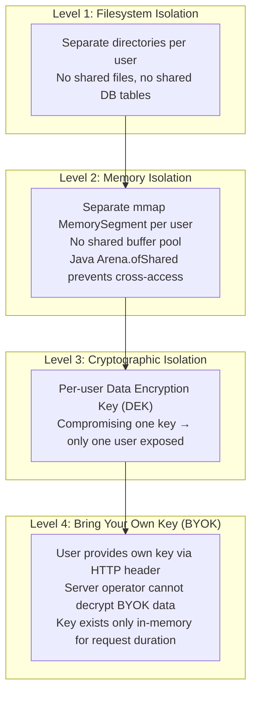
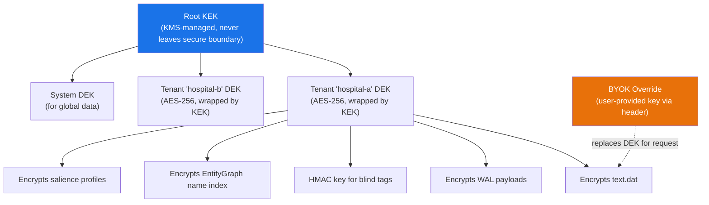
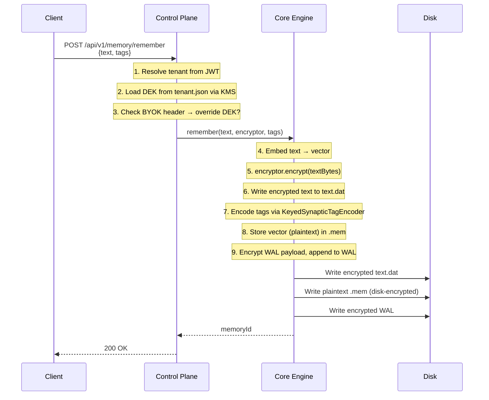
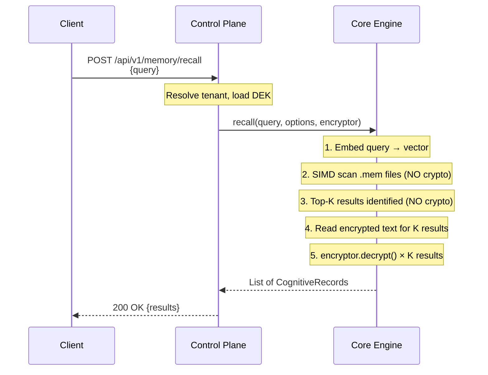

# :material-shield-lock: Data Encryption at Rest

> **TL;DR**: Spector encrypts all stored data using a four-tier architecture — AES-256-GCM for text and WAL, HMAC blind indexing for tags, and infrastructure-level encryption for vectors. Every user gets physically separate files with independent encryption keys, providing isolation that goes far beyond traditional database multi-tenancy.

---

## Overview

Spector stores sensitive cognitive memory data — conversations, documents, knowledge graphs, and metadata — across multiple on-disk file types. Each file type has different performance sensitivity, so Spector uses a **tiered encryption strategy** that matches the right encryption method to the right access pattern.

| Tier | Data | Encryption Method | Where It Happens | Performance Impact |
|---|---|---|---|---|
| **Tier 0** | WAL payloads | AES-256-GCM (per-tenant key) | Application layer | ~1µs per event |
| **Tier 1** | Raw text (`text.dat`) | AES-256-GCM (per-tenant key) | Application layer | Zero on search |
| **Tier 1b** | Entity graph name index | AES-256-GCM (per-tenant key) | Application layer | On save/load only |
| **Tier 1c** | Salience profiles | AES-256-GCM (per-tenant key) | Application layer | On save/load only |
| **Tier 2** | Synaptic tags | HMAC-SHA256 blind indexing | Application layer | Zero (same Bloom comparison) |
| **Tier 3** | Vector embeddings (`.mem`) | LUKS / BitLocker / EBS | OS / Infrastructure | <1% with AES-NI |

---

## Why Not Encrypt Everything at the Application Level?

The Spector engine achieves **microsecond-latency** vector search via a zero-copy architecture:

1. `.mem` files are memory-mapped via `FileChannel.map()` into `MemorySegment`
2. The OS page cache handles hot/cold data paging
3. SIMD scoring reads directly from these segments via the Panama Vector API

If vectors were encrypted at the application level, **every single vector** would need to be decrypted before the SIMD dot product could run:

```
100K memories × 768 dimensions = 300MB of vectors
AES-NI throughput: ~10 GB/s
Decryption overhead: ~30ms per query (added to a 20µs search)
→ Performance degradation: 1,500×
```

This is why vectors must be encrypted at the infrastructure layer (LUKS, BitLocker, EBS) where decryption happens transparently at the page-cache level via AES-NI hardware acceleration.

---

## Complete User Data Isolation

### The Problem with Traditional Multi-Tenancy

Most systems use **row-level security** — all tenants share the same database tables, separated by a `tenant_id` column:

```sql
-- Traditional: one shared table, logical isolation
SELECT * FROM memories WHERE tenant_id = 'hospital-a' AND user_id = 'dr-smith';
-- A single SQL injection or ORM bug exposes EVERY tenant's data
```

This creates fragile isolation:

- A `WHERE` clause bug leaks all data
- Database administrators see everything in plaintext
- Backups contain all tenants' data in one file
- One encryption key covers the entire database

### How Spector Is Different

Spector uses **physical, filesystem-level isolation** where each tenant and each user gets completely separate data files:

```
/data/namespaces/
├── tenant-hospital-a/
│   ├── dr-smith/                     ← Physically separate directory
│   │   ├── semantic.mem              ← Encrypted with Dr. Smith's key
│   │   ├── text.dat                  ← Encrypted with Dr. Smith's key
│   │   ├── wal/wal-000001.bin        ← Encrypted with Dr. Smith's key
│   │   ├── index.midx
│   │   └── hebbian.graph
│   ├── dr-jones/                     ← Completely separate files
│   │   ├── semantic.mem              ← Cannot read Dr. Smith's data
│   │   ├── text.dat                  ← Different encryption key
│   │   └── ...
│   └── shared-knowledge/            ← Team-wide knowledge base
│       └── ...
├── tenant-hospital-b/               ← Separate directory tree entirely
│   └── ...
```

### Four Levels of Isolation



### Comparison with Traditional Systems

| Isolation Aspect | Traditional DB (Row-Level) | Spector (File-Level) |
|---|---|---|
| Data separation | Logical (`WHERE tenant_id = ?`) | Physical (separate files on disk) |
| Key granularity | One key per database | One key per user/namespace |
| Admin visibility | DBA sees all plaintext data | Encrypted at rest, keys per user |
| Backup scope | Entire database | Per-user file set |
| Cross-tenant leak risk | SQL injection, ORM bugs | None — separate file handles |
| BYOK support | Typically DB-wide only | Per user/namespace |
| Selective deletion | `DELETE` (data remains in WAL/backups) | File deletion + secure erasure |
| Blast radius of key compromise | Entire database | Single user's data |

---

## Encryption Architecture

### Key Hierarchy



**Envelope encryption** separates key management from data encryption:

- **DEK (Data Encryption Key)** — AES-256, per-tenant, encrypts the actual data
- **KEK (Key Encryption Key)** — wraps/unwraps DEKs, managed by KMS (Vault, AWS KMS, Azure Key Vault, or local file)

This enables **key rotation without re-encrypting data**: rotate the KEK, re-wrap the DEK, and the data is untouched.

### Wire Format

All AES-256-GCM encrypted data uses this contiguous byte format:

```
[12B IV] [N bytes ciphertext] [16B GCM authentication tag]
```

- **IV**: 96-bit random nonce (NIST SP 800-38D recommended), fresh per encryption
- **Ciphertext**: AES-256-GCM encrypted payload
- **Tag**: 128-bit GCM authentication tag — tamper detection

### Tier 0: WAL Payload Encryption

The Write-Ahead Log records REMEMBER events with full payloads. Without encryption, a WAL file leak is a complete data breach.

```
Ingestion path:
  encryptedPayload = AES-GCM.encrypt(tenantDEK, quantizedVectorBytes)
  WAL.append(REMEMBER, memoryId, encryptedPayload, timestamp)

Replay path:
  plainPayload = AES-GCM.decrypt(tenantDEK, encryptedPayload)
  → feed plaintext vector into segment
```

### Tier 1: Text Envelope Encryption

`text.dat` stores plaintext UTF-8 content — conversations, documents, PII. The binary format naturally supports opaque byte payloads:

```
text.dat Binary Format (V2):
  Header: [4B magic "TXTD"] [4B version: 2] [4B count] [4B reserved]
  Entries: [1B tier] [4B id_len] [N id_bytes] [4B text_len] [N text_bytes]
                                                              ↑
                                                  Now encrypted with AES-256-GCM
```

!!! info "Zero Search Impact"
    Text is only accessed **after** the Top-K vector search completes (the cold path). Decrypting 10 results takes <10µs via AES-NI. The search itself (scanning vectors) has zero cryptographic overhead.

### Tier 2: HMAC Blind Indexing

Synaptic tags are stored as 64-bit Bloom filters in each memory's header. The standard encoder uses non-keyed MurmurHash, which is vulnerable to dictionary attacks:

=== "Standard (Open Source)"
    ```
    MurmurHash3("patient:john") → 64-bit Bloom filter
    ⚠️ Attacker can brute-force with a dictionary of common tags
    ```

=== "Keyed (Enterprise)"
    ```
    HMAC-SHA256(tenantKey, "patient:john") → MurmurHash3(hmac) → 64-bit Bloom
    ✅ Cannot brute-force without the tenant's HMAC key
    ```

The output is still a 64-bit `long`. The SIMD scan loop is completely unchanged — it compares `(record.tags & query.tags) == query.tags` regardless of how the bits were set.

### Tier 3: Volume-Level Encryption

Vectors in `.mem` files are encrypted at the OS/infrastructure layer:

=== "Linux"
    ```bash
    # LUKS2 / dm-crypt
    sudo cryptsetup luksFormat --type luks2 /dev/sdb1
    sudo cryptsetup open /dev/sdb1 spector-data
    sudo mount /dev/mapper/spector-data /var/spector/data
    ```

=== "Windows"
    ```powershell
    # BitLocker
    Enable-BitLocker -MountPoint "D:" -EncryptionMethod XtsAes256
    ```

=== "AWS"
    ```bash
    # EBS Encrypted Volume
    aws ec2 create-volume --encrypted --kms-key-id alias/spector-ebs --size 100
    ```

=== "Kubernetes"
    ```yaml
    # Encrypted PersistentVolume
    apiVersion: storage.k8s.io/v1
    kind: StorageClass
    metadata:
      name: spector-encrypted
    provisioner: ebs.csi.aws.com
    parameters:
      encrypted: "true"
      kmsKeyId: "alias/spector-ebs"
    ```

!!! tip "Performance with AES-NI"
    Modern CPUs decrypt at ~10 GB/s via AES-NI hardware instructions. When the OS page cache loads a page from an encrypted NVMe drive, decryption happens at the hardware level. Once in the page cache, `MemorySegment` reads plaintext — SIMD loops have **zero overhead**.

---

## Bring Your Own Key (BYOK)

Users can supply their own encryption key via the `X-Spector-Encryption-Key` HTTP header. This provides the strongest possible isolation — **the server operator cannot decrypt BYOK-protected data**.

=== "Passphrase Mode"
    ```bash
    curl -X POST http://localhost:7070/api/v1/memory/remember \
      -H "X-Spector-Encryption-Key: my secret passphrase" \
      -d '{"text": "sensitive patient data..."}'
    ```
    The passphrase is derived to AES-256 via **PBKDF2-HMAC-SHA256** with 600,000 iterations (OWASP 2024 recommendation). The salt is tenant-scoped, so the same passphrase produces different keys for different tenants.

=== "Raw Key Mode"
    ```bash
    curl -X POST http://localhost:7070/api/v1/memory/remember \
      -H "X-Spector-Encryption-Key: raw:K7gNU3sdo+OL0wNhqoVWhr3g6s1xYv72ol/pe/Unols=" \
      -d '{"text": "sensitive patient data..."}'
    ```
    Direct Base64-encoded 32-byte AES-256 key.

!!! warning "Key Responsibility"
    BYOK keys are **never stored** by Spector — they exist only in-memory for the duration of the request. If you lose the key, the data is unrecoverable. This is by design.

---

## Data Flow

### Ingestion (Writing Encrypted Data)



### Recall (Reading Encrypted Data)



!!! success "Key Insight"
    Steps 2-3 — the expensive SIMD vector search — involve **zero cryptographic operations**. Decryption only happens in step 5, limited to the K results (typically 5-20 records, each <1µs).

---

## KMS Provider Configuration

Spector supports pluggable Key Management Service providers:

=== "Local File (Development)"
    ```bash
    export SPECTOR_KMS_PROVIDER=local
    # Master KEK stored at <dataDir>/.keys/master.key
    ```
    !!! warning "Not for production — key is on the same disk as data"

=== "HashiCorp Vault"
    ```bash
    export SPECTOR_KMS_PROVIDER=vault
    export VAULT_ADDR=https://vault.internal:8200
    export VAULT_TOKEN=hvs.xxxxx
    export VAULT_TRANSIT_KEY=spector-enterprise
    ```

=== "AWS KMS"
    ```bash
    export SPECTOR_KMS_PROVIDER=aws
    export AWS_KMS_KEY_ARN=arn:aws:kms:us-east-1:123456:key/xxxxx
    export AWS_REGION=us-east-1
    ```

=== "Azure Key Vault"
    ```bash
    export SPECTOR_KMS_PROVIDER=azure
    export AZURE_KEYVAULT_URL=https://spector-kv.vault.azure.net/
    export AZURE_KEYVAULT_KEY_NAME=spector-enterprise
    ```

---

## Key Rotation

### KEK Rotation (No Data Re-encryption)

Envelope encryption enables KEK rotation without touching any data:

1. Rotate KEK in KMS → generates a new key version
2. Re-wrap each tenant's DEK: `KMS.rewrap(wrappedDek, keyName)` — re-encrypts the DEK with the new KEK without exposing the plaintext DEK
3. **No data re-encryption needed** — the DEK itself doesn't change, only its wrapping

### DEK Rotation (Requires Data Re-encryption)

When a tenant's DEK must be rotated (e.g., after a suspected compromise):

1. Generate a new DEK
2. Run the offline migration tool on the tenant's partition
3. Update `tenant.json` with the new wrapped DEK and incremented `dekVersion`

### Per-Tenant DEK Rotation API

Enterprise deployments expose a REST endpoint for programmatic key management:

| Endpoint | Method | Description |
|---|---|---|
| `/api/v1/enterprise/encryption/tenant/{tenantId}/keys` | `GET` | List active DEKs for a tenant |
| `/api/v1/enterprise/encryption/tenant/{tenantId}/keys/rotate` | `POST` | Generate new DEK and schedule re-encryption |
| `/api/v1/enterprise/encryption/tenant/{tenantId}/keys/status` | `GET` | Check re-encryption progress |

---

## Threat Model

| Threat | Mitigation | Status |
|---|---|---|
| Disk theft / file exfiltration | Volume encryption + application-level text/WAL encryption | :material-check: |
| Database dump | H2 AES encryption enabled by default | :material-check: |
| Tag brute-forcing | HMAC-SHA256 blind indexing with per-tenant keys | :material-check: |
| WAL replay attack | WAL payloads encrypted with tenant DEK | :material-check: |
| Cross-tenant data leak | Filesystem isolation + per-tenant DEKs | :material-check: |
| Cross-user data leak | Per-namespace DEKs + separate mmap segments | :material-check: |
| Operator accessing user data | BYOK — user's key never stored | :material-check: |
| Entity graph name leakage | AES-256-GCM encrypted name index | :material-check: |
| Salience profile leakage | AES-256-GCM encrypted profile storage | :material-check: |
| Vector embedding inversion | Infrastructure encryption + quantization noise | :material-alert: Defense-in-depth |
| Swap file leakage | Encrypted swap + memory pinning (`mlock`) | :material-alert: Operator config |
| Key compromise blast radius | Per-tenant/per-user DEKs limit exposure | :material-check: |

---

## Startup Encryption Audit

On every boot, Spector runs an encryption compliance audit:

```
╔══════════════════════════════════════════════════╗
║     Spector Enterprise — Encryption Audit        ║
╠══════════════════════════════════════════════════╣
  [P0] ✅ H2 Database Encryption — ENABLED
  [P0] ✅ Data-at-Rest Encryption — ENABLED (AES-256-GCM)
  [P1] ✅ KMS Provider — Connected: vault
  [P1] ✅ Volume Disk Encryption — ENCRYPTED (LUKS detected)
  [P2] ✅ JWT Secret — Custom secret configured
╠══════════════════════════════════════════════════╣
║  Result: 5/5 checks passed
╚══════════════════════════════════════════════════╝
```

In strict security mode (`SPECTOR_STRICT_SECURITY=true`), P0 failures block startup.

---

## Compliance Mapping

| Requirement | SOC 2 | HIPAA | GDPR | Spector Coverage |
|---|---|---|---|---|
| Encryption at rest (data) | Required | Mandatory | Art. 32 | :material-check: AES-256-GCM text + WAL |
| Encryption at rest (DB) | Required | Mandatory | Art. 32 | :material-check: H2 AES (default on) |
| Encryption at rest (vectors) | Required | Mandatory | Art. 32 | :material-check: Volume encryption |
| Key management (KMS/HSM) | Required | Required | Recommended | :material-check: Vault / AWS / Azure |
| Key rotation | Required | Required | Recommended | :material-check: KEK + DEK rotation |
| Audit logging | Required | Required | Required | :material-check: Startup audit + JDBC logger |
| Access control (RBAC) | Required | Required | Required | :material-check: JWT + API keys + scopes |
| Data isolation | Required | Required | Required | :material-check: File-level per-user |
| Right to forget | — | — | Art. 17 | :material-check: Secure erasure on `forget()` |
| BYOK | Recommended | Recommended | Art. 32 | :material-check: Per-request user key |

---

## Environment Variables

| Variable | Default | Description |
|---|---|---|
| `SPECTOR_DATA_ENCRYPTION` | `true` | Enable/disable data-at-rest encryption |
| `SPECTOR_DB_ENCRYPT` | `true` | Enable H2 AES database encryption |
| `SPECTOR_DB_ENCRYPT_KEY` | *(auto)* | H2 encryption key (auto-generated if not set) |
| `SPECTOR_KMS_PROVIDER` | `local` | KMS provider: `local`, `vault`, `aws`, `azure` |
| `SPECTOR_STRICT_SECURITY` | `false` | Block startup if encryption checks fail |

---

## Next Steps

- :material-flash: [**Dopamine — Surprise Detection**](../memory/dopamine.md) — how importance is computed
- :material-brain: [**Salience & Importance**](salience-importance.md) — personalized importance via salience profiles
- :material-tag: [**Synapse — Tags & Scoring**](../memory/synapse.md) — the 64-byte header where encrypted tags live
- :material-database: [**WAL Design**](../memory/wal-design.md) — write-ahead log internals
