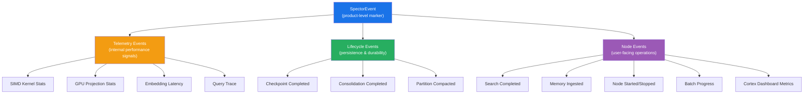
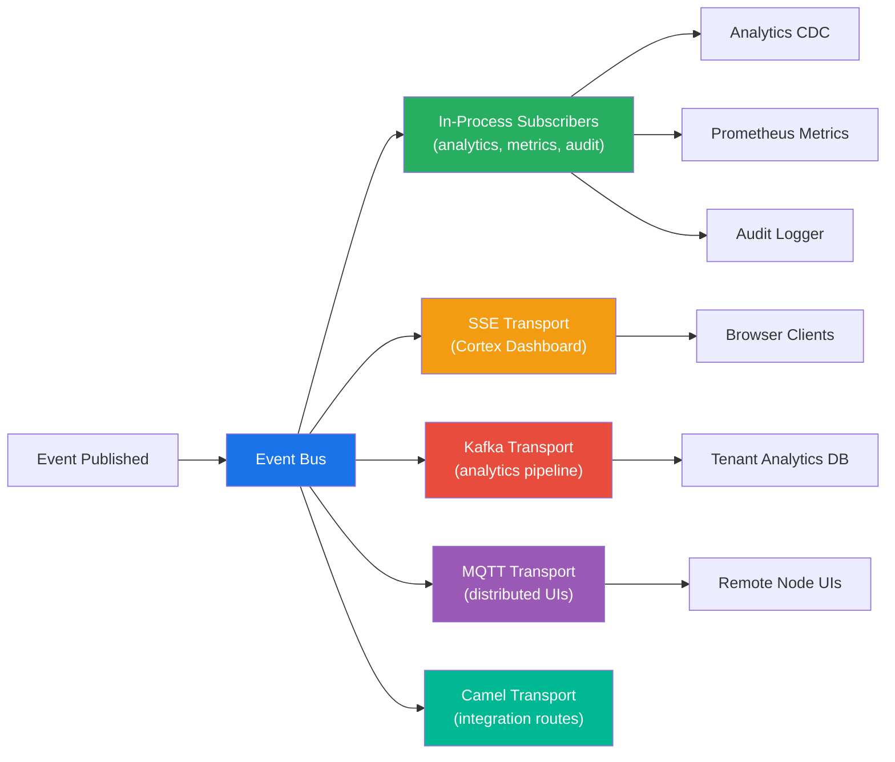
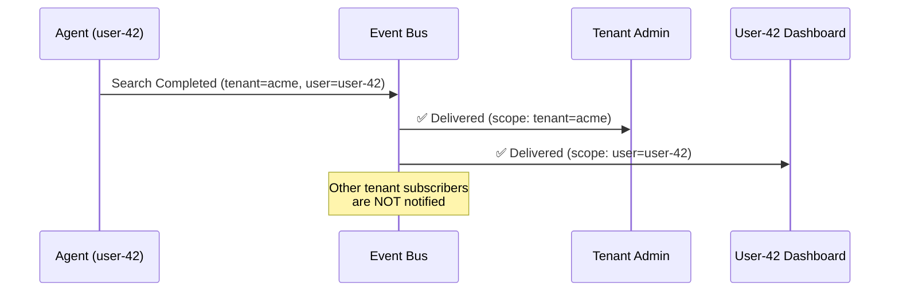
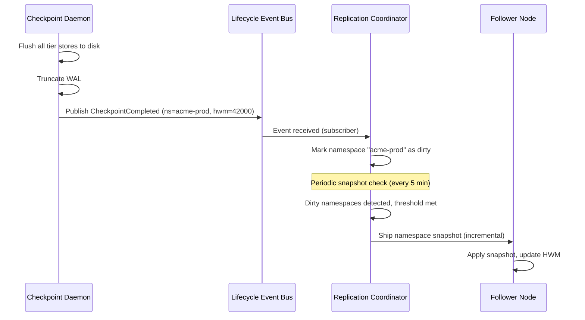

# :material-bell-ring: Event Notifications

> **TL;DR**: Spector emits structured events for every significant operation — memory checkpoints, search completions, ingestion milestones, SIMD kernel telemetry, and node lifecycle transitions. Events flow through a unified bus with pluggable transports, enabling real-time dashboards, analytics pipelines, and distributed coordination without polling.

---

## Overview

Every Spector deployment generates a continuous stream of operational events. Rather than relying on log scraping or periodic polling, Spector provides a first-class event notification system designed for:

- **Real-time UI dashboards** (Cortex) via Server-Sent Events (SSE)
- **Analytics pipelines** via Kafka, MQTT, or Apache Camel
- **Checkpoint-driven replication** — followers subscribe to lifecycle events
- **Observability** — Prometheus metrics, distributed tracing, audit logging

---

## Event Hierarchy

Spector events follow a three-level hierarchy, each serving a distinct audience:



### Telemetry Events

Internal performance signals emitted during search and ingestion. These events are scoped to the current request call stack and are only delivered when telemetry is active — zero overhead when disabled.

| Event | Emitted When | Key Data |
|---|---|---|
| SIMD Kernel Stats | After every vector distance computation | Kernel name, lanes, element count, cycle count |
| GPU Projection Stats | After CUDA projection completes | Grid/block dims, elements, kernel time |
| Embedding Latency | After embedding provider returns | Model name, dimensions, latency |
| Query Trace | After search completes | Mode, top-K, latency, tier breakdown |

### Lifecycle Events

Durability and persistence milestones. These events drive the replication system — enterprise followers subscribe to lifecycle events to know when new data is available for sync.

| Event | Emitted When | Key Data |
|---|---|---|
| Checkpoint Completed | After all tier stores are flushed to disk | WAL high-water mark, duration, bytes written |
| Consolidation Completed | After sleep consolidation cycle finishes | Memories promoted, demoted, pruned |
| Partition Compacted | After tombstone compaction completes | Partition ID, records before/after |

### Node Events

User-facing operational events — search results, ingestion progress, node health. These events power the Cortex real-time dashboard and SSE streams.

| Event | Emitted When | Key Data |
|---|---|---|
| Search Completed | After every search query | Result count, latency, search mode |
| Search Failed | When a search query fails | Error message, search mode |
| Memory Ingested | After each memory is stored | Memory ID, type, importance, tier |
| Node Started / Stopped | On server lifecycle transitions | Port, node ID, cluster mode |
| Batch Progress | During batch ingestion | Total, completed, failed, throughput |
| Cortex Dashboard | Periodically (configurable) | QPS, p50/p99 latency, memory counts |

---

## Multi-Transport Architecture

Events are delivered through a pluggable transport layer. A single event publication fans out to all registered transports simultaneously:



### Default Transport: In-Process

Every Spector deployment includes a local in-process transport. Subscribers receive events on the publishing thread (synchronous mode) or via a dedicated executor (asynchronous mode). This transport has zero network overhead and is used for:

- **Prometheus metrics** — increment counters on search/ingest events
- **Analytics CDC** — forward events to tenant-scoped analytics databases
- **Audit logging** — record all operations for compliance

### SSE Transport: Real-Time Dashboard

The Cortex dashboard connects via Server-Sent Events at `/api/v1/events/stream`. Each SSE client receives a filtered stream based on its identity scope — a tenant admin sees all tenant events, a user sees only their own.

### Distributed Transports

For multi-node deployments, distributed transports bridge events across the cluster:

- **Kafka**: High-throughput event streaming for analytics pipelines. Events are partitioned by tenant ID for ordered processing.
- **MQTT (EMQX)**: Lightweight pub/sub for remote UI clients and IoT-style event consumers.
- **Apache Camel**: Route events to any of Camel's 300+ connectors — email alerts, Slack notifications, webhook POST, S3 archival.

---

## Scope-Aware Delivery

Events carry identity context — tenant, user, session, namespace. Subscribers declare their scope, and the transport layer filters delivery automatically:



**Scope levels**:

| Scope | Receives | Use Case |
|---|---|---|
| **Broadcast** | All events, no filtering | System-wide metrics, audit log |
| **Tenant** | Events matching the subscriber's tenant | Tenant admin dashboard |
| **User** | Events matching the subscriber's user ID | Personal activity feed |
| **Session** | Events matching the subscriber's session | Current browser tab |

This design scales to millions of users across thousands of tenants — each subscriber only processes events relevant to their scope, regardless of total system event throughput.

---

## Checkpoint-Driven Replication

Lifecycle events are the backbone of Spector's replication system. When a checkpoint completes, the event triggers namespace snapshot synchronization to follower nodes:



This event-driven approach replaces the older WAL-streaming replication model, providing:

- **Reduced bandwidth**: Only changed namespaces are shipped, not individual WAL events
- **Simpler recovery**: Followers receive complete namespace snapshots — no gap-fill logic
- **Natural batching**: Checkpoints aggregate multiple mutations into a single sync trigger

---

## Framework Integration

Spector's event system is designed to integrate seamlessly with application framework event systems:

### Spring Boot

```java
// Bridge Spector events to Spring ApplicationEvent
@Component
public class SpectorEventBridge implements ApplicationListener<ContextRefreshedEvent> {

    @Autowired
    private ApplicationEventPublisher springPublisher;

    public void onSpectorEvent(SpectorNodeEvent event) {
        springPublisher.publishEvent(new SpectorApplicationEvent(event));
    }
}
```

### Micronaut

```java
// Bridge to Micronaut @EventListener
@Singleton
public class SpectorEventBridge {

    @Inject
    private ApplicationEventPublisher<SpectorNodeEvent> publisher;

    public void onSpectorEvent(SpectorNodeEvent event) {
        publisher.publishEvent(event);
    }
}
```

### Apache Camel

```java
// Route Spector events to any Camel endpoint
from("direct:spector-events")
    .filter(header("eventType").isEqualTo("CHECKPOINT_COMPLETED"))
    .to("kafka:spector-checkpoints?brokers=kafka:9092");
```

---

## Next Steps

- :material-sync: [**Sync — Persistence & Replication**](../memory/sync.md) — checkpoint-driven durability and distributed sync
- :material-chart-bar: [**Cortex Dashboard**](../cortex/index.md) — real-time monitoring powered by SSE events
- :material-cog: [**Distributed Mode**](distributed-mode.md) — multi-node cluster architecture
- :material-shield-lock: [**Encryption at Rest**](encryption-at-rest.md) — how events interact with encrypted data
