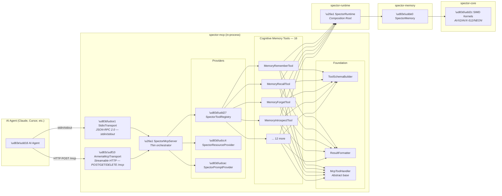
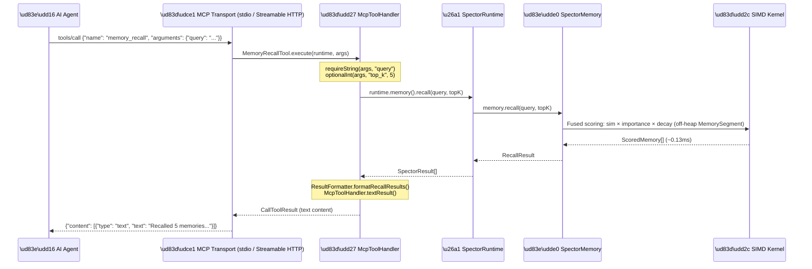

# 🤖 MCP Integration Architecture

> **Spector's built-in Model Context Protocol (MCP) server gives any AI agent instant, in-process access to SIMD-accelerated cognitive memory — with zero network overhead.**

---

## Overview

The [Model Context Protocol (MCP)](https://modelcontextprotocol.io/) is Anthropic's open standard for connecting AI agents to external data sources. Instead of writing custom glue-code with orchestration frameworks, agents connect directly to an MCP server via JSON-RPC and autonomously invoke tools.

**Spector's MCP server runs in-process.** When Claude Desktop or Cursor calls `memory_recall`, the request goes from JSON-RPC → Java method call → SIMD kernel — never touching a network socket. This makes Spector **23–113× faster than Python-based MCP servers** that route through HTTP/gRPC.

Spector supports **two MCP transports**:

- **Stdio** — JSON-RPC 2.0 over stdin/stdout, for CLI agents (Claude Desktop, Cursor)
- **Streamable HTTP** — JSON-RPC 2.0 over HTTP at `/mcp`, for remote/web agents (MCP 2025-03-26 spec)

---

## Architecture



### Data Flow



---

## Module Structure

```
spector-mcp/src/main/java/com/spectrayan/spector/mcp/
├── SpectorMcpServer.java          ← Thin orchestrator (assembly only)
├── SpectorMcpMain.java            ← CLI entry point
├── schema/
│   └── ToolSchemaBuilder.java     ← Type-safe fluent builder for JSON schemas
├── tools/
│   ├── McpToolHandler.java        ← Abstract base with timing, error handling
│   ├── SpectorToolRegistry.java   ← Tool discovery & registration
│   └── memory/                    ← 16 cognitive memory tools
│       ├── MemoryToolHandler.java     ← Memory-aware base handler
│       ├── MemoryRememberTool.java
│       ├── MemoryRecallTool.java
│       ├── MemoryScratchpadTool.java
│       ├── MemoryReinforceTool.java
│       ├── MemoryForgetTool.java
│       ├── MemoryStatusTool.java
│       ├── MemoryIntrospectTool.java
│       ├── MemorySuppressTool.java
│       ├── MemoryResolveTool.java
│       ├── MemoryReminderTool.java
│       ├── MemoryWhyNotTool.java
│       ├── MemoryComputeImportanceTool.java
│       ├── MemoryInspectTool.java
│       ├── MemoryExportTool.java
│       ├── MemoryBrowseTool.java
│       └── MemorySalienceTool.java
├── resources/
│   └── SpectorResourceProvider.java   ← Resource definitions & handlers
├── prompts/
│   └── SpectorPromptProvider.java     ← Prompt templates & handlers
└── util/
    └── ResultFormatter.java           ← Search result formatting utilities
```

---

## Tool Reference

The MCP server exposes **16 cognitive memory tools**. All are registered when cognitive memory is enabled (`spector.memory.enabled: true`). Memory tools embed text to store and recall memories, so an embedding provider (e.g., Ollama) must be configured.

| Tool | Key parameters | Description |
|:---|:---|:---|
| `memory_remember` | `text` (req), `tier`, `tags`, `source`, `interest`/`challenge`/`urgency`, `valence`, `arousal` | Store a memory with cognitive metadata (ID auto-generated) |
| `memory_recall` | `query` (req), `top_k`, `profile`, `synaptic_filter`, `min_importance`, `point_in_time` | Fused cognitive recall across all tiers |
| `memory_scratchpad` | `text` (req) | Quick-write a short-lived note to working memory |
| `memory_reinforce` | `memory_id` (req), `valence` (req) | Report a positive/negative outcome for a memory |
| `memory_forget` | `memory_id` (req) | Tombstone a memory by ID |
| `memory_status` | *(none)* | Memory tier counts and persistence info |
| `memory_introspect` | `topic` (req) | Metamemory self-analysis on a topic |
| `memory_suppress` | `memory_id` (req), `action` (req), `reason` | Suppress or unsuppress a memory from recall |
| `memory_resolve` | `memory_id` (req), `resolved` (req) | Mark a memory resolved/unresolved (Zeigarnik) |
| `memory_reminder` | `text` (req), `delay_seconds` (req), `tags` | Schedule a time-triggered reminder |
| `memory_why_not` | `memory_id` (req), `query` (req), `top_k` | Explain why a memory was not recalled |
| `memory_compute_importance` | `text` (req), `interest`/`challenge`/`urgency`, `valence`, `arousal` | Preview importance without storing |
| `memory_inspect` | `id` (req) | Full cognitive X-ray of a memory |
| `memory_export` | `format` | Bulk export of all live memories |
| `memory_browse` | `tags` (req) | Browse memories by tag (AND semantics, no vector search) |
| `memory_salience` | `operation` (req), profile fields | Inspect and tune the active salience profile |

---

## Extending the MCP Server

### Adding a New Tool

Every tool extends `McpToolHandler`, which handles timing, error handling, and argument parsing. You implement four methods:

```java
public abstract class McpToolHandler {
    abstract String name();
    abstract String description();
    abstract Map<String, Object> inputSchema();
    abstract CallToolResult execute(SpectorRuntime runtime, Map<String, Object> args);

    // Base class automatically provides:
    // - Timing wrapper (nanoTime → milliseconds)
    // - Structured error handling with logging
    // - Argument parsing: requireString(), optionalInt(), optionalString()
    // - Result factories: textResult(), errorResult()
}
```

Define the tool schema with `ToolSchemaBuilder`:

```java
var schema = ToolSchemaBuilder.object()
    .requiredString("query", "Natural language query for memory recall.")
    .optionalInt("top_k", "Number of results to return.", 5)
    .optionalString("profile", "Cognitive scoring profile preset.", "")
    .build();
```

Register the tool in `SpectorToolRegistry.handlers()` — one line per tool:

```java
handlers.add(new MemoryRememberTool(memory));
handlers.add(new MemoryRecallTool(memory));
// ... 14 more cognitive memory tools
// handlers.add(new YourNewTool(memory));  ← just add here
```

---

## Performance: Why In-Process Wins

### The Python MCP Tax

Python MCP servers introduce multiple layers of overhead:


> **Total: 2–10ms per query** (network + GIL + serialization)

### Spector's Zero-Copy Path


> **Total: 88µs p50 per query** (23–113× faster)

| Bottleneck | Python MCP | Spector MCP |
|:---|:---|:---|
| Network round-trip | 500–2,000µs | **0µs** (in-process) |
| JSON serialization | 100–500µs | **0µs** (direct Java objects) |
| Python GIL contention | Blocks concurrent queries | **0µs** (Virtual Threads) |
| GC pressure | Heap allocation per query | **0µs** (off-heap Panama) |
| Search computation | ~100µs (native C++) | **~100µs** (Panama SIMD) |
| **Total** | **2,000–10,000µs** | **88µs p50** |

---

## Security Considerations

> [!WARNING]
> Several tools mutate memory state — `memory_remember`, `memory_forget`, `memory_suppress`, `memory_reinforce`, `memory_resolve`, and `memory_scratchpad`. In production environments, consider:
> - Restricting write tools via OAuth 2.1 scopes (`memory:write`) — Spector Enterprise filters tools at `list_tools` time and enforces them per request
> - Implementing namespace/tenant-level access control
> - Rate limiting write operations
> - Auditing all write operations

---

## See Also

- [MCP Server Usage Guide](../sdk-usage/mcp-server.md) — Practical setup for Claude Desktop, Cursor, and custom agents
- [Architecture Overview](overview.md) — Full system architecture
- [Core Concepts](core-concepts.md) — HNSW, BM25, RRF deep-dives
