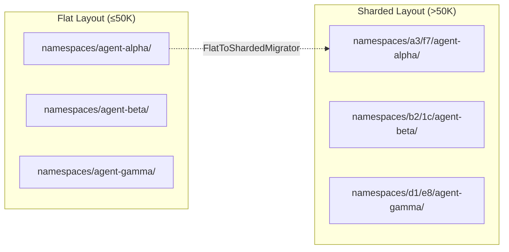
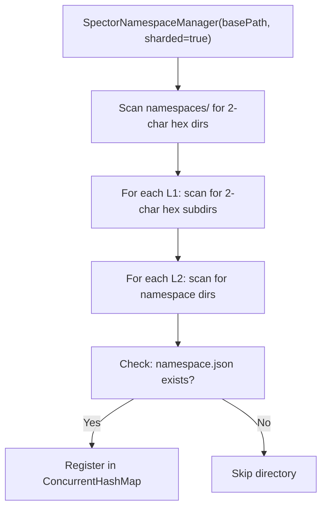
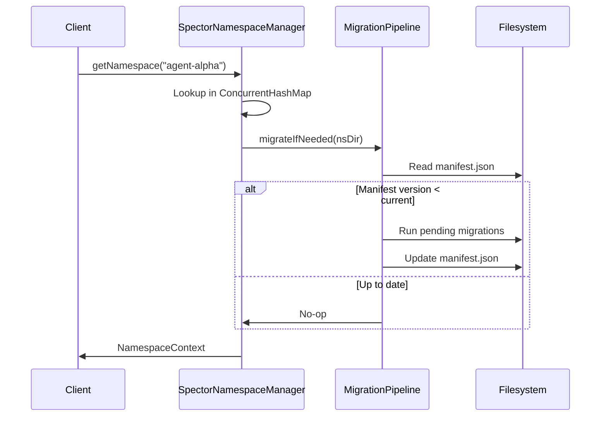

# 📂 Namespace Sharding & Migration

> **Problem**: Spector's per-user file isolation stores each namespace as a separate directory. At >50K namespaces, flat directory listing becomes an O(N) bottleneck on all filesystems. This design adds hash-based directory sharding and a lazy migration pipeline to scale namespace discovery.

---

## Design Overview



**Key decisions:**

- SHA-256 hash of the namespace ID provides uniform distribution
- 2-level directory hierarchy (256 × 256 = 65,536 buckets)
- Each bucket holds ~15 entries even at 1M namespaces
- Migration is in-place and non-disruptive (flat directories remain accessible during transition)

---

## Directory Sharding

### Path Resolution

The `StorageLayout` class provides two path resolvers:

| Method | Layout | Example |
|:-------|:-------|:--------|
| `namespaceDir(base, id)` | Flat | `namespaces/agent-alpha/` |
| `namespaceDirSharded(base, id)` | Sharded | `namespaces/a3/f7/agent-alpha/` |
| `tenantNamespaceDirSharded(base, tenant, ns)` | Tenant-scoped | `namespaces/xx/yy/acme-corp/agent-alpha/` |

### Hash Derivation

The shard path is derived from the first 4 hex characters of `SHA-256(namespaceId)`:

```
SHA-256("agent-alpha") → "a3f7e2b1..."
                           ↓  ↓
                          L1  L2
Path: namespaces/a3/f7/agent-alpha/
```

- **L1 bucket**: Characters 0-1 (256 possibilities)
- **L2 bucket**: Characters 2-3 (256 possibilities)
- **Total buckets**: 65,536

For tenant-scoped namespaces, the hash is derived from the **tenant ID** (not the namespace ID), ensuring all namespaces for a tenant are colocated:

```
SHA-256("acme-corp") → "xx yy ..."
Path: namespaces/xx/yy/acme-corp/agent-alpha/
Path: namespaces/xx/yy/acme-corp/user-alice/
```

### Scaling Properties

| Namespaces | Flat Dir Entries | Sharded Max per Bucket |
|:-----------|:-----------------|:-----------------------|
| 1,000 | 1,000 | ~1 |
| 50,000 | 50,000 | ~1 |
| 500,000 | 500,000 | ~8 |
| 1,000,000 | 1,000,000 | ~15 |

---

## Namespace Discovery

The `SpectorNamespaceManager` discovers namespaces at startup using one of two strategies:

### Flat Discovery

```
Scan: namespaces/*/namespace.json
Complexity: O(N) — single directory listing
```

### Sharded Discovery

```
Scan: namespaces/XX/YY/*/namespace.json
Complexity: O(N) — but each directory listing is O(1) since buckets are small
```



---

## Lazy Schema Migration

### MigrationPipeline

The `MigrationPipeline` runs schema migrations lazily — migrations execute on first access to a namespace, not at startup. This avoids holding up server startup when there are thousands of namespaces.



### ShardedNamespaceMigrator

Migrates existing flat namespace directories to the sharded layout in-place:

1. **Scan** flat `namespaces/` directory for namespace dirs
2. **Compute** SHA-256 shard path for each namespace
3. **Create** target shard directories (`namespaces/XX/YY/`)
4. **Move** namespace directory atomically via `Files.move()`
5. **Verify** all namespaces are accessible at new paths

!!! warning "Migration Safety"
    The migrator is designed to be **resumable** — if interrupted mid-migration, re-running it will pick up where it left off. Namespaces already at their shard path are skipped.

---

## Internal Data Model

### NamespaceConfig

Each namespace has a `namespace.json` with:

```json
{
  "id": "agent-alpha",
  "display_name": "Agent Alpha",
  "max_memories": -1,
  "max_partitions": -1,
  "max_storage_bytes": -1,
  "read_only": false,
  "created_at": "2026-06-17T00:00:00Z"
}
```

### NamespaceContext

Groups configuration, quota enforcement, and resolved paths:

| Field | Type | Description |
|:------|:-----|:------------|
| `config` | `NamespaceConfig` | ID, display name, quotas |
| `quotas` | `NamespaceQuotas` | Runtime quota tracker |
| `directory` | `Path` | Resolved path (flat or sharded) |

### Directory Contents

Each namespace directory contains the standard memory layout:

```
agent-alpha/
├── namespace.json          ← Configuration & quotas
├── global/
│   ├── working.mem         ← Working memory (TTL-based)
│   ├── checkpoint.meta     ← WAL high-water mark
│   ├── coactivation.tracker
│   └── wal/
│       ├── wal-000000.bin  ← WAL chunk files
│       └── wal-000001.bin
├── partitions/
│   └── 000_1781460634/     ← Colocated partition
│       ├── semantic.mem    ← Semantic tier (mmap'd)
│       ├── episodic.mem    ← Episodic tier
│       ├── procedural.mem  ← Procedural tier
│       ├── text.dat        ← Raw text (V2 mmap format)
│       ├── index.midx      ← Memory index
│       ├── hebbian.graph   ← Co-activation edges
│       ├── temporal.chain  ← Temporal links
│       └── entity.graph    ← Entity knowledge graph
└── cross/
    ├── hebbian-cross.graph ← Cross-partition edges
    └── entity-cross.graph  ← Cross-partition entities
```

---

## Configuration

| Property | Default | Description |
|:---------|:--------|:------------|
| `spector.namespaces.sharded` | `false` | Enable hash-based directory sharding |
| `spector.namespaces.migration.enabled` | `true` | Enable lazy schema migration on access |
| `spector.namespaces.migration.flat-to-sharded` | `false` | Auto-migrate flat layouts to sharded |

---

## See Also

- [Persistence & Replication](../memory/sync.md) — WAL and CRDT merge
- [Off-Heap Panama Design](../memory/panama-design.md) — mmap'd storage
- [Distributed Mode](distributed-mode.md) — search-layer sharding (different from namespace sharding)
