# 🏗️ Architecture Overview

> **Spector is a SIMD-accelerated AI memory backbone** with built-in MCP server, hybrid search, and biologically-inspired cognitive memory. This page covers the system architecture, data flows, threading model, and memory architecture that make sub-millisecond, agent-native search possible.

---

## System Architecture

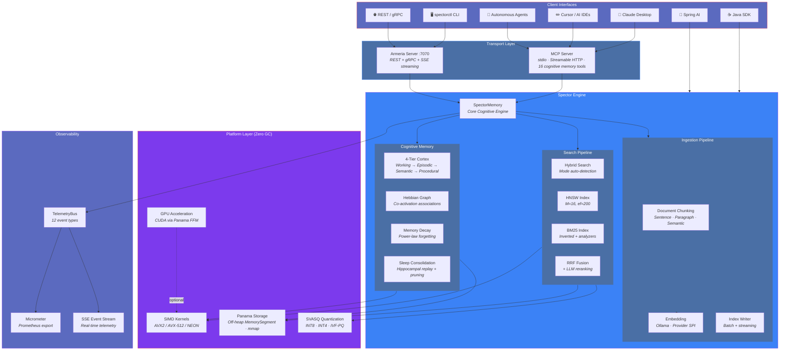

### High-Level Data Flow

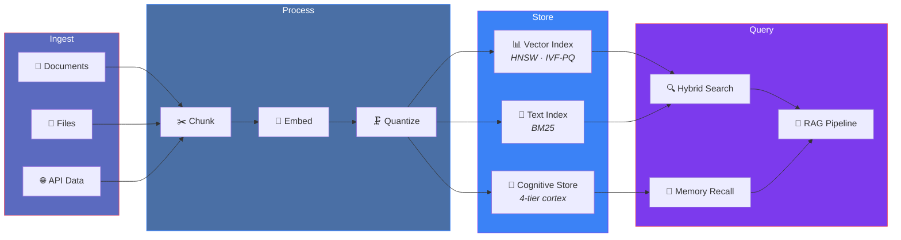

### Deployment Modes

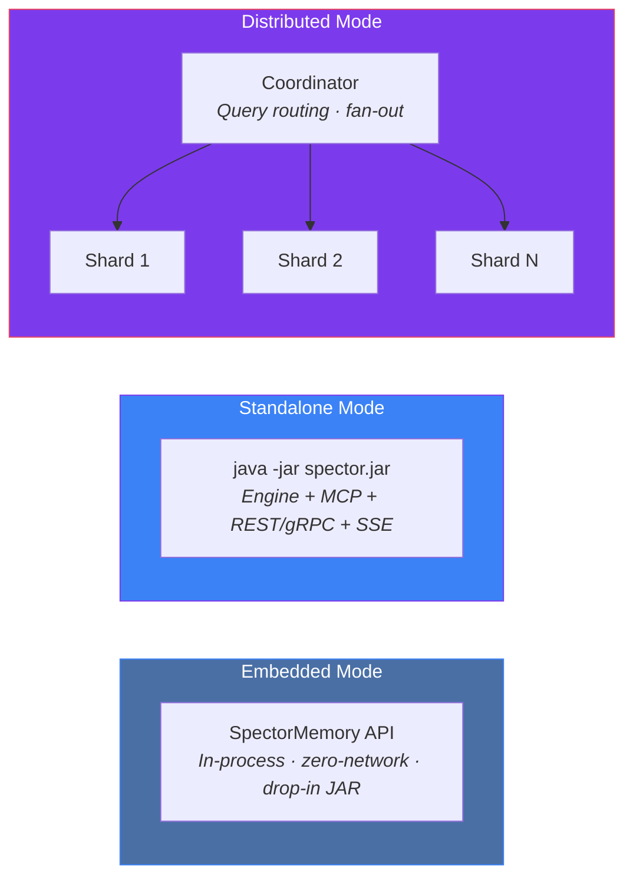

---

## 🤖 MCP Architecture — Agent-Native Engine

Spector's MCP server runs **in-process** — the agent's tool calls go directly into SIMD kernels with zero network hops, zero serialization, and zero GC pressure. This is the architectural advantage over adapters that wrap a database behind an HTTP API.

### Tool Registry

```mermaid
graph TB
    subgraph Agents["AI Agents"]
        claude["🤖 Claude Desktop"]
        cursor["✏️ Cursor / Windsurf"]
        cline["🔧 Cline / Aider"]
        custom["🦾 Custom Agents"]
    end

    subgraph MCP["MCP Server — Dual Transport · JSON-RPC 2.0"]
        transport["Transport Layer<br/><i>stdio (stdin/stdout) for CLI agents<br/>Streamable HTTP (/mcp) for remote agents</i>"]
        registry["SpectorToolRegistry<br/><i>16 tools · auto-registration</i>"]
        handler["McpToolHandler<br/><i>Base class · thread-safe · virtual threads</i>"]

        subgraph Mem["Cognitive Memory Tools — 16"]
            m1["memory_remember — Store with importance & tags"]
            m2["memory_recall — Fused SIMD scoring recall"]
            m3["memory_scratchpad — Working-memory scratch space"]
            m4["memory_reinforce — Outcome feedback +/-"]
            m5["memory_forget — Intentional forgetting"]
            m6["memory_status — Per-tier statistics"]
            m7["memory_introspect — Self-reflection"]
            m8["memory_suppress — Temporary suppression"]
            m9["memory_resolve — Mark resolved/unresolved"]
            m10["memory_reminder — Proactive reminders"]
            m11["memory_why_not — Explain recall misses"]
            m12["memory_compute_importance — Pre-ingestion scoring"]
            m13["memory_inspect — Full cognitive X-ray"]
            m14["memory_export — Bulk memory export"]
            m15["memory_browse — Browse by tag/tier"]
            m16["memory_salience — Tune salience profile"]
        end
    end

    subgraph Core["In-Process Engine — Zero Network Overhead"]
        runtime["SpectorMemory<br/><i>Engine + Memory + Ingestion</i>"]
        simd["SIMD Kernels<br/><i>AVX2/512 · ~100µs per search</i>"]
        panama["Panama Off-Heap<br/><i>Zero GC · mmap storage</i>"]
    end

    Agents -->|stdio / HTTP| transport --> registry --> handler
    handler --> Mem
    Mem --> runtime --> simd --> panama

    style Agents fill:#5b6abf,stroke:#e94560,color:#fff
    style MCP fill:#4a6fa5,stroke:#3b82f6,color:#fff
    style Mem fill:#7c3aed,stroke:#e94560,color:#fff
    style Core fill:#5b6abf,stroke:#e94560,color:#fff
```

### Agent Interaction Flow

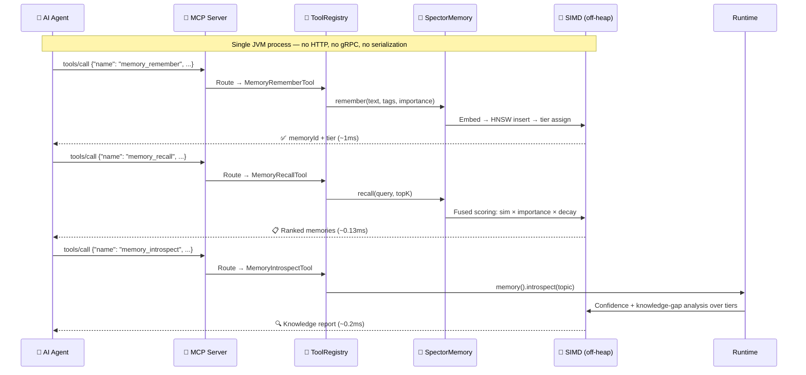

### Performance: MCP-Native vs. Adapter Pattern

| Metric | Spector (in-process) | Typical MCP adapter |
|:---|:---|:---|
| **Architecture** | Engine + MCP in one JVM | Python → HTTP → DB → HTTP → agent |
| **Search latency** | **88µs** (SIMD) | 5–50ms (network round-trip) |
| **Memory recall** | **0.13ms** (fused scoring) | 50–200ms (Mem0/Letta/Zep) |
| **Tools** | **16** (cognitive memory tools) | 3–5 basic CRUD |
| **GC pressure** | **Zero** (Panama off-heap) | Full GC overhead |
| **Deployment** | `java -jar spector.jar` | Python + pip + DB + config |

> [!TIP]
> For full MCP integration details, tool schemas, and Claude Desktop configuration, see the dedicated [MCP Integration](mcp-integration.md) page.

---

## 📦 Module Diagram

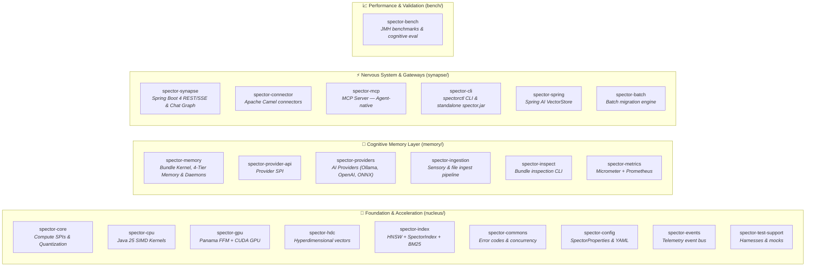

> [!NOTE]
> **Index implementations in `spector-index`:** `hnsw/` (graph-based ANN, Quantized HNSW), `spectrum/` (SpectorIndex, multi-tier sharding), `bm25/` (keyword scoring + analyzers), `splade/` (sparse neural representations).

---

## 🔗 Dependency Graph

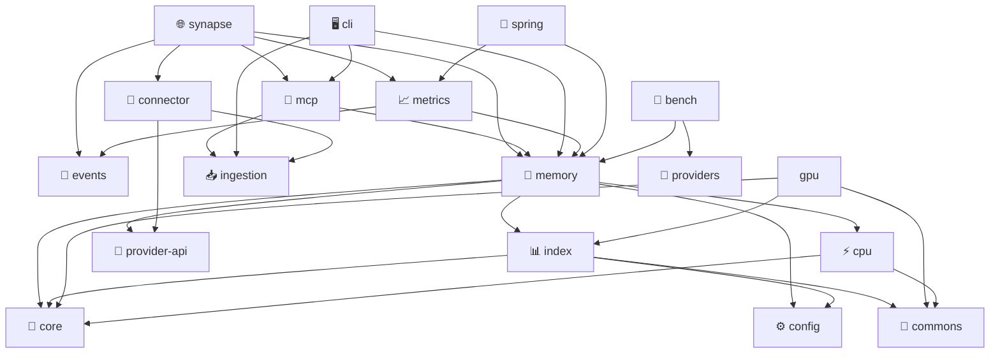

> **Legend:** Solid arrows = compile dependency. Dotted arrow (`bench`) = benchmark execution dependency.

**Dependency rules:**

| Path | Description |
|------|-------------|
| `runtime → memory + ingestion` | Composition root — wires all subsystems |
| `cli → runtime + client` | CLI with local batch (runtime) and remote (client) modes |
| `synapse → runtime` | Unified Armeria node: REST + gRPC + SSE + cluster coordination (incorporates former spector-node) |
| `mcp → runtime + ingestion` | MCP agent entry point (in-process, zero network) |
| `memory → ingestion` | Houses both `EngineIngestionTarget` and `CognitiveIngestionTarget` |
| `memory → index, events, commons` | Cognitive memory and HNSW/BM25 storage foundations |
| `synapse → cli, mcp, spring` | Integration layer (CLI, MCP, Spring AI) |

!!! important
    **No circular dependencies.** `spector-memory` contains both vector search and cognitive memory stores, keeping the API gateway (`spector-synapse`) decoupled from low-level storage.

---

## 📥 Data Flow: Ingest Path

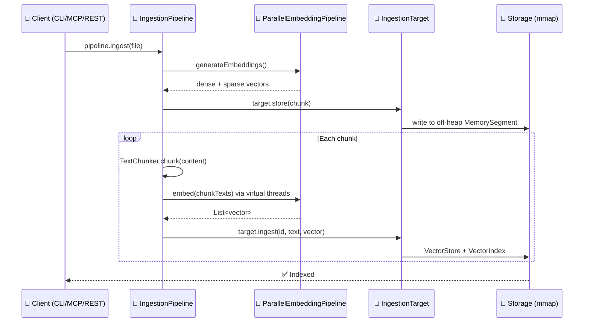

1. **Client** calls `pipeline.ingest()` — unified across CLI, MCP, and application code
2. **IngestionPipeline** handles chunking (from config) and parallel embedding
3. **IngestionTarget** receives pre-embedded chunks — storing directly in `SpectorMemory`
4. Downstream storage writes to off-heap memory and indexes with HNSW/BM25

> [!TIP]
> `FileDiscoveryService` can be used independently for file discovery without any engine dependency.

---

## 🔍 Data Flow: Search Path

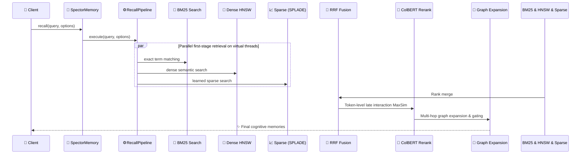

1. **Recall Pipeline** receives options (`TextSearchMode`, `RecallMode`, etc.)
2. **Dense Vector, BM25, and Sparse (SPLADE)** searches run in parallel on virtual threads
3. **RRF Fusion** merges the ranked lists using reciprocal rank scores
4. **ColBERT v2 Reranking** scores the top candidates using SIMD MaxSim operations
5. **Graph Expansion** traverses Hebbian/Entity/Temporal edges for neighbor expansion

---

## 🤖 Data Flow: MCP Agent Path

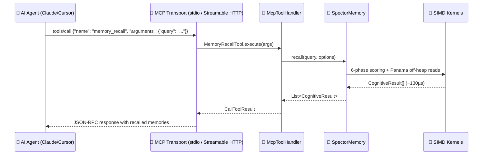

The MCP path operates directly against `SpectorMemory`. The MCP server wraps tool handler calls with JSON-RPC transport. There is **zero network overhead** because everything runs in the same JVM process.

> [!TIP]
> For full MCP architecture details, tool schemas, and design patterns, see the dedicated [MCP Integration](mcp-integration.md) page.

---

## 🧵 Threading Model: Virtual Threads

Spector is designed from the ground up for Java virtual threads:

> [!TIP]
> **No `synchronized` blocks** anywhere in the codebase. All coordination uses `ReentrantLock` to avoid virtual thread pinning.

| Operation | Threading Strategy |
|-----------|-------------------|
| REST request handling | One virtual thread per request |
| Hybrid search | Parallel BM25 + HNSW via `StructuredTaskScope` |
| Bulk ingest | Virtual thread per document |
| Embedding generation | Batched across virtual threads |
| HNSW construction (>10K) | Virtual threads per core for parallel insertion |
| Distributed fan-out | Virtual thread per shard query |

### 📈 Scaling Results

At 50K docs with hybrid search (384-dim, production-realistic):

| Virtual Threads | Throughput | Scaling |
|-----------------|-----------|---------|
| 1 | 3,739 ops/s | 1.0× |
| 4 | 10,317 ops/s | **2.8×** |
| 8 | 11,812 ops/s | **3.2×** |
| 16 | 14,022 ops/s | **3.7×** |

> [!NOTE]
> Scaling depends on vector dimensions and workload type. 384-dim shows ~3.7× at 16 threads due to higher per-query memory bandwidth. Individual HNSW queries are inherently sequential (graph traversal data dependencies) — scaling comes from concurrent queries sharing CPU cores.

---

## 💾 Memory Model: Panama Off-Heap

All vector data lives off-heap using the Panama Foreign Function & Memory API:

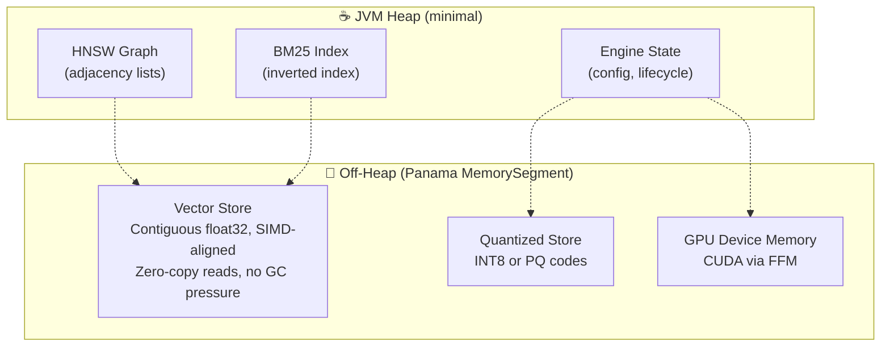

**Benefits:**

- ✅ **Zero GC pressure** — Vectors never touch the garbage collector

- ✅ **Instant startup** — Memory-mapped files load via `mmap` syscall, no deserialization

- ✅ **SIMD-friendly layout** — Contiguous float32 arrays ready for Vector API operations

- ✅ **Explicit lifecycle** — `Arena`-scoped memory with deterministic cleanup

- ✅ **Memory efficiency** — Store billions of vectors limited only by disk/address space

### 📊 Storage Types

| Store | Location | Use Case |
|-------|----------|----------|
| `InMemoryVectorStore` | Off-heap (Arena) | Development, small datasets |
| `MmapVectorStore` | Memory-mapped file | Production, persistence |
| `QuantizedVectorStore` | Off-heap (INT8) | Memory-constrained deployments |
| `IvfPqStore` | Off-heap (PQ codes) | Billion-scale (32× compression) |

---

## 🌐 API Layer

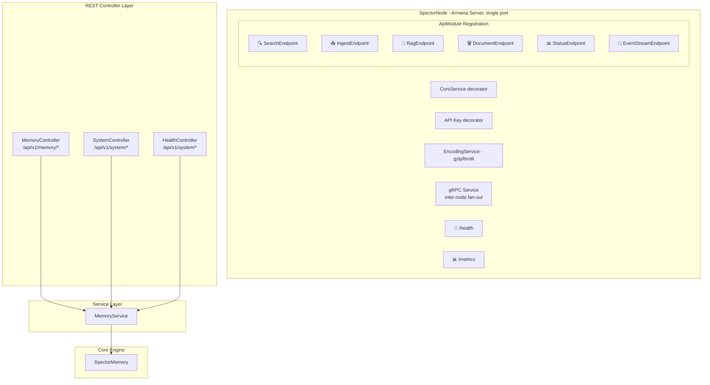

Every request runs on its own virtual thread. The Armeria server handles HTTP REST, gRPC, and SSE events on a single port. API endpoints are registered via the `ApiModule` factory pattern, enabling straightforward API versioning (`/api/v1`, `/api/v2`).

### Streaming via SSE

The `/api/v1/search/stream` endpoint uses Server-Sent Events to emit results progressively. The `/api/v1/events` endpoint provides a live event stream where clients can subscribe to search, ingest, cluster, MCP, and engine events with optional category filtering.

---

## 🔗 See Also

- [Core Concepts](core-concepts.md) — Algorithms and data structures in detail

- [Distributed Mode](distributed-mode.md) — Multi-node clustering architecture

- [GPU Acceleration](gpu-acceleration.md) — CUDA kernel integration via Panama

- [Performance Tuning](../operations/performance-tuning.md) — Optimizing for your workload
