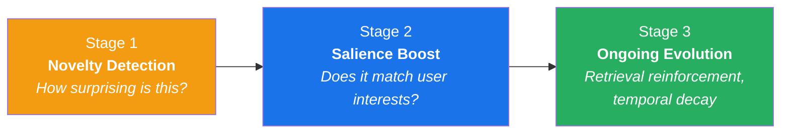
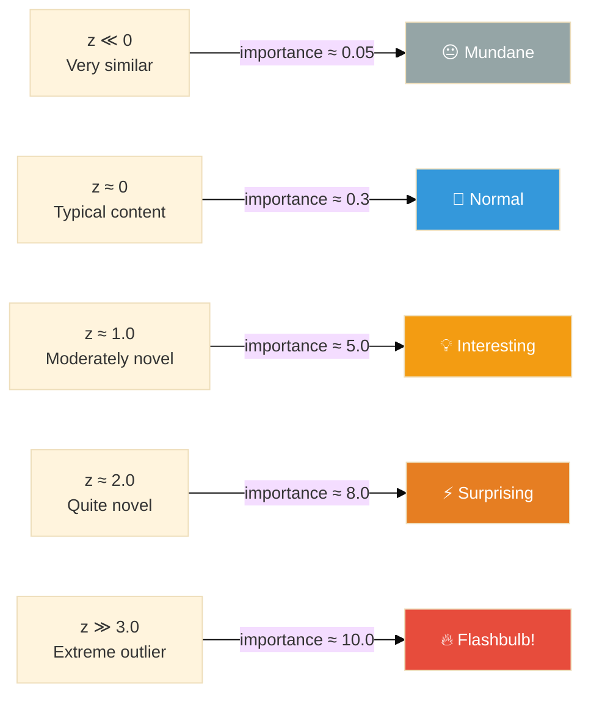
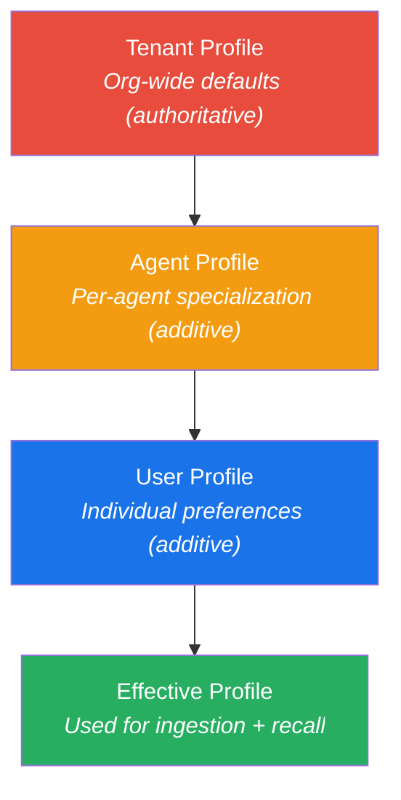
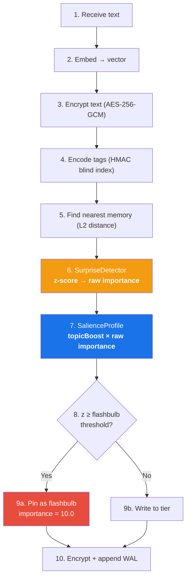

# :material-star-shooting: Salience & Importance

> **TL;DR**: Every memory gets an importance score (0.05–10.0) computed by an adaptive surprise detector. Users personalize importance via **salience profiles** — declaring interests and disinterests in natural language. The system merges profiles hierarchically (tenant → agent → user) and can re-score all existing memories when preferences change.

---

## Overview

Importance is the single most influential signal in Spector's recall ranking. A memory with importance 8.0 will surface far more readily than one with importance 0.3, even if both are semantically similar to the query.

The importance system has three stages:



---

## Stage 1: Novelty Detection

### The Dopamine Model

The **SurpriseDetector** is modeled after dopamine prediction error signaling in neuroscience:

!!! quote "The Biological Principle"
    The brain is a prediction engine. If you eat a normal breakfast, you forget it in an hour. If the toaster catches fire, a dopamine spike sears the event into your brain forever. Memory strength scales with **prediction error** — the gap between what was expected and what actually happened.

### How It Works

At ingestion time, Spector computes the **L2 distance** from the new memory's embedding to the nearest existing memory. This distance is scored against a running baseline using **Welford's online algorithm** for numerically stable mean/variance:

```
z-score = (distanceToNearest - μ) / σ
```

The z-score is mapped to importance via a **shifted sigmoid**:

$$\text{importance} = 0.05 + \sigma\!\left(1.2 \times (z - 1.0)\right) \times 9.95$$



!!! tip "Why a sigmoid instead of step function?"
    A step function (e.g., "z > 2 = important") collapses 95% of memories to the same value, making ranking meaningless. The continuous sigmoid produces **unique scores for every memory**, enabling fine-grained ranking.

!!! tip "Why z-scores instead of fixed thresholds?"
    Different embedding models produce vastly different distance ranges. `nomic-embed-text` (768-dim) has different L2 distributions than `all-MiniLM-L6-v2` (384-dim). Z-score normalization **adapts automatically** to any model.

### Dual Surprise: Spatial + Temporal

The V2 surprise detector adds **temporal novelty** — a recurrence after a long gap is itself surprising:

=== "First Occurrence"
    ```
    Memory: "Database crashed due to OOM"
    Spatial surprise: HIGH (never seen this before)
    Temporal surprise: N/A
    Combined importance: 7.5
    ```

=== "Same Day Recurrence"
    ```
    Memory: "Database crashed again"
    Spatial surprise: LOW (similar to recent memory)
    Temporal surprise: LOW (just saw this)
    Combined importance: 0.8
    ```

=== "6 Months Later"
    ```
    Memory: "Database crashed again"
    Spatial surprise: LOW (known topic)
    Temporal surprise: HIGH (6-month gap)
    Combined importance: 6.2
    ```

The dual signal uses configurable weights:

$$\text{combined}_z = \alpha \times \text{spatial}_z + \beta \times \text{temporal}_z$$

Default: α = 0.6 (spatial), β = 0.4 (temporal).

### Warmup Period

The surprise detector requires a minimum of **20 observations** before adaptive scoring activates. During warmup, all memories receive a default importance of 1.0 to prevent artificially extreme scores from an empty baseline.

### Flashbulb Memory

When the z-score exceeds the flashbulb threshold (default: 3.0), the memory receives special treatment:

- Importance set to **10.0** (maximum)
- **Pinned flag** set — exempt from temporal decay
- Routed to the **episodic tier** regardless of default routing
- Never a candidate for automatic consolidation or forgetting

!!! example "Use Case"
    An AI coding agent encounters `OutOfMemoryError` for the first time (z-score: 4.2). This triggers flashbulb encoding — the error memory is pinned at maximum importance and will always surface when the agent encounters memory-related issues.

---

## Stage 2: Salience Profiles

### What Is a Salience Profile?

A **SalienceProfile** declares what matters to an entity — a tenant, an agent, or a user. It modifies the raw importance score from Stage 1:

```java
var profile = SalienceProfile.builder()
    .interest("database performance", InterestLevel.CRITICAL)
    .interest("Kubernetes orchestration", InterestLevel.HIGH)
    .disinterest("meeting notes", InterestLevel.IGNORE)
    .icnuWeights(new IcnuWeights(0.40f, 0.10f, 0.40f, 0.10f))
    .alpha(0.5f)
    .beta(0.5f)
    .build();
```

### How Interests Work

Users express interests in **natural language**. The enterprise layer pre-computes embedding vectors when the profile is saved. At ingestion time, the engine computes **cosine similarity** between the memory embedding and each interest embedding:

```
Memory: "PostgreSQL query optimizer regression"

Interest: "database performance" (CRITICAL, multiplier=2.0)
  cosine("database performance", memory) = 0.82  → above threshold (0.5)
  boost = 2.0 × 0.82 = 1.64

Final importance = base_importance × 1.64
```

!!! success "Semantic, Not Keyword"
    "PostgreSQL query optimizer regression" matches "database performance" because their embedding vectors are close — **no keyword overlap needed**. This is fundamentally different from tag-based or keyword-based matching.

### Interest Levels

| Level | Multiplier | Effect |
|---|---|---|
| `CRITICAL` | 2.0× | Doubles importance of matching memories |
| `HIGH` | 1.5× | 50% boost |
| `NORMAL` | 1.0× | No change (neutral) |
| `LOW` | 0.5× | Halves importance (mild suppression) |
| `IGNORE` | 0.1× | Near-total suppression |

### Disinterests (Dampeners)

Disinterests work the same way but **reduce** importance:

```
Memory: "Notes from weekly standup meeting"

Disinterest: "meeting notes" (IGNORE, multiplier=0.1)
  cosine("meeting notes", memory) = 0.91  → above threshold
  dampen = 0.1 × 0.91 = 0.091

Final importance = base_importance × 0.091  → nearly suppressed
```

### Topic Boost Algorithm

```
boost = 1.0

for each interest:
    sim = cosine(memoryEmbedding, interest.embedding)
    if sim > similarityThreshold (default 0.5):
        boost = max(boost, level.multiplier × sim)

for each disinterest:
    sim = cosine(memoryEmbedding, disinterest.embedding)
    if sim > similarityThreshold:
        boost = min(boost, level.multiplier × sim)

return max(0.01, boost)   // floor prevents zero importance
```

Performance: O(N × dims) where N = number of interests. For 10 interests × 768 dims = 7,680 FLOPs — negligible.

---

## Hierarchical Merge

In multi-tenant deployments, salience profiles merge at three levels:



### Override Policies

The tenant controls what agents and users can customize:

| Policy | Topic Boosts | Topic Dampeners | ICNU Weights | α/β Scoring | Flashbulb |
|---|---|---|---|---|---|
| `TENANT_ONLY` | :material-close: | :material-close: | :material-close: | :material-close: | :material-close: |
| `ADDITIVE_TOPICS` | :material-check: add | :material-check: add | :material-close: | :material-close: | :material-close: |
| `FULL_OVERRIDE` | :material-check: all | :material-check: all | :material-check: | :material-check: | :material-check: |

### Merge Rules

- **Topics**: UNION semantics — child adds new topics. On conflict (same topic string), **tenant wins**.
- **ICNU weights**: Child replaces parent when policy allows. Otherwise tenant's weights are locked.
- **α/β scoring**: Child replaces parent when allowed.
- **Flashbulb threshold**: `MIN(tenant, child)` when allowed — the most sensitive setting wins.
- **Similarity threshold**: `MAX(tenant, child)` — the most restrictive wins.

### Example

=== "Tenant Profile (hospital-a)"
    ```yaml
    interests:
      - "patient safety" → CRITICAL
      - "HIPAA compliance" → HIGH
    icnuWeights: I=0.30, C=0.20, N=0.30, U=0.20
    flashbulbThreshold: 2.5
    policy: ADDITIVE_TOPICS
    ```

=== "Agent Profile (medication-checker)"
    ```yaml
    interests:
      - "drug interactions" → CRITICAL     # ✅ ADDED (new topic)
      - "patient safety" → HIGH            # ❌ BLOCKED (tenant wins)
    ```

=== "User Profile (dr-smith)"
    ```yaml
    interests:
      - "cardiology" → HIGH                # ✅ ADDED
    disinterests:
      - "administrative tasks" → LOW       # ✅ ADDED
    ```

=== "Effective (Merged)"
    ```yaml
    interests:
      - "patient safety" → CRITICAL        # from tenant (authoritative)
      - "HIPAA compliance" → HIGH          # from tenant
      - "drug interactions" → CRITICAL     # from agent (additive)
      - "cardiology" → HIGH               # from user (additive)
    disinterests:
      - "administrative tasks" → LOW       # from user
    icnuWeights: I=0.30, C=0.20, N=0.30, U=0.20  # from tenant (locked)
    flashbulbThreshold: 2.5                         # from tenant (locked)
    ```

---

## Stage 3: Ongoing Evolution

Importance is not static after ingestion:

### Retrieval Reinforcement
Every time a memory is recalled, its importance gets a small boost — **Hebbian "fire together, wire together."** Frequently useful memories become progressively easier to surface.

### Temporal Decay
Memories that are never recalled gradually lose importance during sleep consolidation cycles. This prevents the memory store from being dominated by old, unused memories.

### Co-activation Strengthening
Memories frequently retrieved together form **Hebbian associations** in the 3-layer cognitive graph. These associations create retrieval clusters — recalling one memory pulls related memories along with it.

---

## ICNU Fusion Weights

The final recall score combines four signals:

| Signal | Letter | Default | What It Measures |
|---|---|---|---|
| **I**mportance | I | 0.25 | Novelty/surprise from ingestion (this system) |
| **C**o-activation | C | 0.25 | Hebbian association strength |
| **N**ovelty | N | 0.25 | Freshness — how recently created |
| **U**rgency | U | 0.25 | User-specified priority flags |

Users override these via their salience profile:

```java
// A user who cares mostly about recency and importance:
.icnuWeights(new IcnuWeights(0.40f, 0.10f, 0.40f, 0.10f))
```

---

## Re-scoring Strategies

When a salience profile changes, existing memories may have stale importance scores. Three strategies handle this:

| Strategy | Behavior | Cost | Use Case |
|---|---|---|---|
| `RECALL_ONLY` | No re-score — new profile applies at recall time | Zero | Temporary experiments |
| `LAZY` | Re-score each memory on next access | Amortized | Gradual preference shifts |
| `BACKGROUND` | Full re-score in background thread | O(N) | Major preference changes |

Background re-scoring iterates all memories, dequantizes their vectors, recomputes `computeTopicBoost()`, and writes the updated importance back to the synaptic header. Multiple concurrent requests are coalesced — only one background re-score runs at a time.

---

## API Reference

### Salience Management Endpoints

| Endpoint | Method | Description |
|---|---|---|
| `/api/v1/salience/profile` | `GET` | Get effective merged profile |
| `/api/v1/salience/profile` | `PUT` | Update profile + trigger re-score |
| `/api/v1/salience/profile` | `DELETE` | Reset to neutral |
| `/api/v1/salience/rescore` | `POST` | Trigger manual background re-score |
| `/api/v1/salience/status` | `GET` | Check re-score progress |

### MCP Tools

Salience can also be managed via the MCP protocol:

```json
{
  "method": "tools/call",
  "params": {
    "name": "memory_compute_importance",
    "arguments": { "text": "PostgreSQL query optimizer" }
  }
}
```

---

## Full Ingestion Pipeline

Here's where importance fits in the complete ingestion flow:



---

## Next Steps

- :material-flash: [**Dopamine — Surprise Detection**](../memory/dopamine.md) — the biological model in detail
- :material-chart-bar: [**Importance Fusion (ICNU)**](../memory/importance-fusion.md) — the four-signal fusion
- :material-sleep: [**Hippocampus — Sleep Consolidation**](../memory/hippocampus.md) — how importance decays
- :material-shield-lock: [**Encryption at Rest**](encryption-at-rest.md) — how encrypted data interacts with importance
- :material-brain: [**Cognitive Profiles**](../memory/cognitive-profiles.md) — how profiles interact with importance
