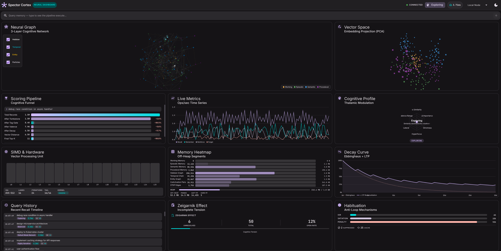
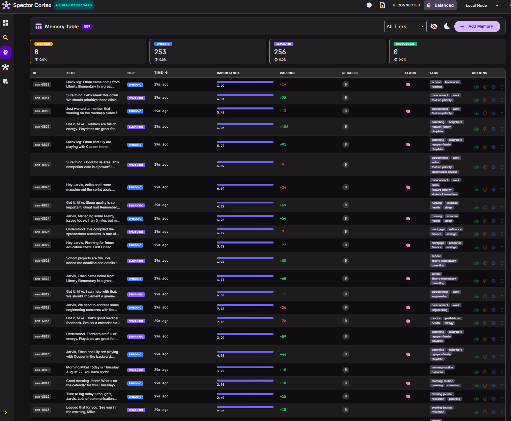

# 🧬 Spector Cortex — Neural Dashboard & Chat UI

!!! quote "The Vision"
    What if you could **watch your AI's brain think** and **talk to it at the same time?** Spector Cortex is a real-time neural dashboard *and* cognitive chat interface — from SIMD lanes firing to Hebbian edges strengthening to memories decaying along the Ebbinghaus curve. It's the difference between a black box and a living brain.

---

## Two Faces of Cortex

Cortex serves two purposes in the Spector ecosystem:

### 1. Neural Dashboard (Visualization)

The original Cortex — 12+ live cognitive panels for monitoring and debugging the memory engine:

| Panel | What It Shows |
|:------|:--------------|
| **Neural Graph** | 200-node cognitive network with Hebbian, temporal, and entity edges |
| **Vector Space** | 300-point PCA-projected embedding space with query dot and k-NN lines |
| **Scoring Pipeline** | The 6-phase cognitive scoring funnel animated in real time |
| **Live Metrics** | Real-time recall/remember/reinforce/forget rates |
| **Cognitive Profile** | 6-axis radar showing thalamic modulation parameters |
| **SIMD & Hardware** | 16-lane SIMD register visualization |
| **Memory Heatmap** | Off-heap memory segment utilization across all 4 tiers |
| **Decay Curve** | Ebbinghaus forgetting curve vs. LTP reconsolidation |
| **Habituation** | Anti-filter-bubble mechanism gauges |

### 2. Cognitive Chat Interface (Agent Interaction)

The new Cortex — a fully-featured chat interface powered by [Spector Synapse](../synapse/index.md):

| View | Description |
|:-----|:------------|
| **Chat** | Conversational interface with memory-primed responses, streaming, and context indicators |
| **Memories** | Browse, search, and manage cognitive memories with tier filtering and importance visualization |
| **Agents** | Create, configure, and manage autonomous agents with soul editing |
| **Connectors** | Set up and monitor data connector integrations |
| **Settings** | Configure providers, API keys, and system preferences |

---

## Technology Stack

| Layer | Technology |
|:------|:-----------|
| **Framework** | Angular 22 (standalone components, signals) |
| **Styling** | SCSS with Material Design 3 tokens |
| **3D Rendering** | THREE.js + Canvas API |
| **State Management** | Angular Signals |
| **HTTP** | `httpResource` + `HttpClient` |
| **Build** | Angular CLI 22, Vitest |

---

## Visual Showcase

### 🎥 Neural Graph in Action

<video controls width="100%" poster="spector-cortex-graph.png">
  <source src="https://github.com/spectrayan/spector/releases/download/assets-v1/spector-cortex-neural-graph.mp4" type="video/mp4">
  Your browser does not support the video tag.
</video>

*The 3D neural graph explorer — fly through the cognitive galaxy, explore Hebbian associations, temporal chains, and entity relationships as glowing star constellations.*

---

### 📊 Dashboard — 12+ Live Cognitive Panels



Real-time scoring pipeline, SIMD lanes, decay curves, vector space, Hebbian graph, cognitive profiles, and live metrics — all rendered in a single interactive dashboard.

---

### 🌌 Graph Explorer — 3D Neural Galaxy


Interactive 3D graph with glowing star nodes, Hebbian/temporal/entity edges, fly-to navigation, click-to-explore, and real-time topology stats.

---

### 🧠 Memory Table — Browse & Manage Memories



Full CRUD with tier filtering, importance bars, valence indicators, synaptic tags, recall counts, tombstone ratios, and bulk actions.

---

### 🔬 Memory Detail — Deep Cognitive Inspection


Identity card, cognitive state (importance/valence/arousal gauges), synaptic tags, and full relationship graph showing Hebbian associations, temporal chains, and entity links.

---

## What's Coming to Cortex

### Near-Term (In Progress)

- [ ] **Chat streaming UI** — real-time token rendering with typing indicators
- [ ] **Agent soul editor** — visual editor for agent personality and tools
- [ ] **Connector dashboard** — sync status, data volume, and health monitoring
- [ ] **Dark mode** — full dark theme with M3 design tokens
- [ ] **Mobile responsive** — responsive layouts for tablet and phone

### Medium-Term (Planned)

- [ ] **Conversation timeline** — visual timeline of agent-user interactions
- [ ] **Memory graph explorer v2** — filter by conversation, time range, or agent
- [ ] **Agent template marketplace** — browse and install community templates
- [ ] **Real-time collaboration** — multiple users in the same conversation
- [ ] **Accessibility** — WCAG 2.1 AA compliance

### Long-Term (Vision)

- [ ] **Voice interface** — speech-to-text chat with agent responses
- [ ] **Cognitive replay** — replay past cognitive states step by step
- [ ] **Comparative agent view** — side-by-side agent behavior comparison

---

## Building

```bash
cd spector-cortex

# Install dependencies
npm ci

# Development server (http://localhost:4200)
ng serve

# Production build
ng build --configuration production

# Run tests
ng test
```

---

## License

Spector Cortex is licensed under the **Business Source License 1.1** (BSL 1.1).

- **Change Date**: July 6, 2030
- **Change License**: Apache License, Version 2.0

See [LICENSE](https://github.com/spectrayan/spector/blob/main/spector-cortex/LICENSE) for full terms.
