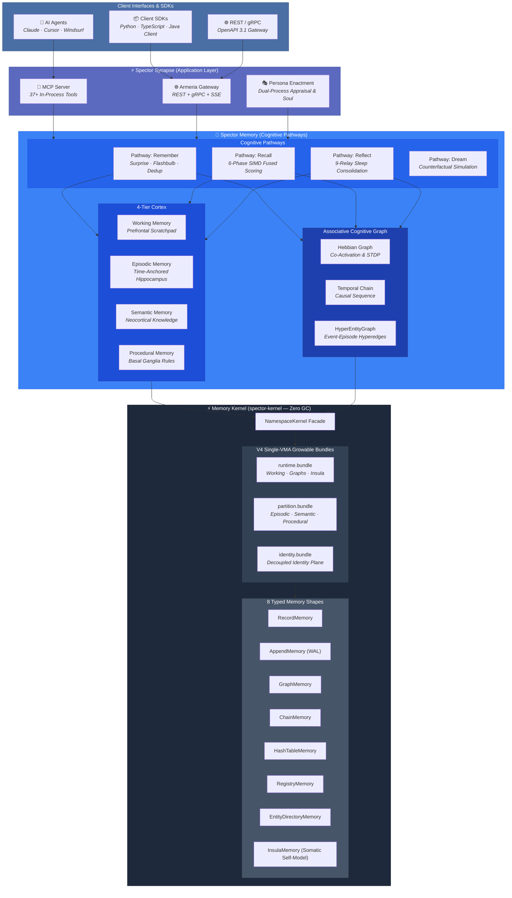

# ⚡ Spector — The AI Memory Backbone

> **Agent-ready cognitive memory that forms associations — sub-millisecond recall, zero infrastructure.**

Spector gives AI agents real memory: it **remembers, forgets, consolidates, and forms associations** across working, episodic, semantic, and procedural tiers, linked by Hebbian, temporal, and entity graphs. Retrieval fuses dense semantic search with hybrid lexical signals and 6-phase cognitive scoring for sub-millisecond recall.

Connect your agents through the **built-in MCP server** (Claude Desktop, Cursor, custom agents), call it over **REST/gRPC**, use the **Python, TypeScript, or Java Client SDKs**, or embed it directly in the JVM — no external database, no infrastructure to run. Every user, agent, or tenant is physically isolated in its own on-disk namespace. The **Sealed Memory Kernel (`spector-kernel`)** keeps it all off-heap via Java 25 Foreign Function & Memory (FFM) with zero GC pressure.

---

## 🚀 Quick Connect — Multi-SDK Client

Connect your agent or application to Spector in seconds:

=== "Python"

    ```python
    from spector_client import SpectorClient, MemoryTier

    # Connect to running daemon or local test instance
    client = SpectorClient.builder().with_rest("http://localhost:7070").build()

    # 1. Remember with affective & contextual metadata
    record = client.memory.remember(
        text="User is designing a low-latency RAG system with pgvector and Spector",
        tier=MemoryTier.SEMANTIC,
        tags=["rag", "architecture", "database"],
        interest=0.9,
        valence=1,
    )
    print(f"Memory recorded: {record.get('id', 'stored')}")

    # 2. Recall with associative cognitive scoring
    memories = client.memory.recall("database architecture preferences", top_k=3)
    for m in memories:
        print(f"[{m.id}] score={m.score:.4f} | {m.text}")
    ```

=== "TypeScript"

    ```typescript
    import { SpectorClient, MemoryTier } from '@spectrayan/spector-client';

    const client = SpectorClient.createDefault('http://localhost:7070');

    // 1. Remember with contextual tags
    const record = await client.memory.remember({
      text: 'User prefers dark mode, high contrast, and TypeScript examples',
      tier: MemoryTier.SEMANTIC,
      tags: ['preferences', 'ui'],
      interest: 0.85,
    });
    console.log(`Stored engram: ${record.id}`);

    // 2. Recall with 6-phase scoring
    const results = await client.memory.recall('user ui preferences', { topK: 5 });
    results.forEach(m => console.log(`[${m.id}] ${m.text}`));
    ```

=== "Java (Client SDK)"

    ```java
    import com.spectrayan.spector.client.SpectorClient;
    import java.util.List;

    // Lightweight client SDK — zero vector/Panama preview flags required
    try (var client = SpectorClient.builder().baseUri("http://localhost:7070").build()) {
        // 1. Remember
        var record = client.memory().store(
            "User prefers concise responses with architectural diagrams",
            List.of("preferences", "formatting")
        );
        System.out.println("Stored engram: " + record.getId());

        // 2. Recall
        var results = client.memory().recall("user formatting preferences", 5);
        results.forEach(m -> System.out.println(m.getText()));
    }
    ```

=== "cURL / REST"

    ```bash
    # 1. Remember
    curl -X POST http://localhost:7070/api/v1/memory/remember \
      -H "Content-Type: application/json" \
      -d '{
        "text": "User prefers dark mode and high-contrast syntax highlighting",
        "tier": "SEMANTIC",
        "tags": "preferences,ui",
        "interest": 0.9,
        "valence": 1
      }'

    # 2. Recall
    curl -X POST http://localhost:7070/api/v1/memory/recall \
      -H "Content-Type: application/json" \
      -d '{"query": "user ui preferences", "topK": 5}'
    ```

=== "CLI (`spector`)"

    ```bash
    # 1. Remember with cognitive metadata
    spector memory remember \
      --id "pref-dark-mode" \
      --text "User prefers dark mode and high-contrast syntax highlighting" \
      --tier SEMANTIC \
      --tags "preferences,ui" \
      --interest 0.9 \
      --valence 1

    # 2. Recall with 6-phase fused cognitive scoring
    spector memory recall "user ui preferences" --top-k 5 --profile BALANCED
    ```

---

## 🔥 Key Numbers

| Metric | Value | Architectural Significance |
|:---|:---|:---|
| 🧠 **Cognitive Recall** | **Ultra-low latency** | Hardware-accelerated in-process SIMD scoring |
| ⚡ **Scoring Loop** | **~200 cycles** | 6-Phase SIMD fused scan eliminating dead candidates early |
| 🚀 **Peak QPS** | **61,011** | Concurrent queries running lock-free across Virtual Threads |
| 🤖 **MCP Tools** | **37+ tools** | In-process stdio + Streamable HTTP Model Context Protocol |
| 🛡️ **Synaptic Tags** | **128-bit Bloom** | Offsets 24–39: 60× lower false-positive rate than 64-bit filters |
| 🗜️ **Compression** | **4×–32×** | SVASQ-8 to IVF-PQ SIMD quantization |
| 📦 **Storage Engine** | **V4 Bundles** | Single-VMA `runtime.bundle`, `partition.bundle`, `identity.bundle` |
| ⚙️ **Dependencies** | **Zero** | Pure Java 25 (JDK only) — no external databases, no Docker required |

---

## 💡 How It Works — Cognitive Architecture

Spector collapses the entire agent memory stack into **autonomous cognitive pathways** running directly on top of a sealed, off-heap memory-mapped kernel:



---

## 🗺️ Explore the Architecture

<div class="grid cards" markdown>

-   :material-memory:{ .lg .middle } **Sealed Memory Kernel**

    ---

    Java 25 Panama FFM off-heap storage, single-VMA V4 Bundles, 8 typed memory shapes, 64-byte pure encoding headers, and crash-resilient WAL recovery.

    [:octicons-arrow-right-24: Memory Kernel Guide](kernel/index.md)

-   :material-brain:{ .lg .middle } **Cognitive Pathways**

    ---

    Biologically-inspired Remember, Recall (6-phase SIMD scoring loop), Reflect (sleep consolidation), and Dream pathways across 4 memory tiers.

    [:octicons-arrow-right-24: Cognitive Memory](memory/index.md)

-   :material-robot:{ .lg .middle } **37+ Agent MCP Tools**

    ---

    In-process Model Context Protocol server for Claude Desktop, Cursor, and autonomous agents across memory, context, RBAC, and soul governance.

    [:octicons-arrow-right-24: MCP Server Guide](sdk-usage/mcp-server.md)

-   :material-code-tags:{ .lg .middle } **Multi-SDK Ecosystem**

    ---

    Lightweight client SDKs for Python, TypeScript, and Java Client, plus Spring AI starter, OpenAPI REST endpoints, and the standalone CLI.

    [:octicons-arrow-right-24: Quick Start](getting-started/quickstart.md)

-   :material-lightning-bolt:{ .lg .middle } **Spector Synapse**

    ---

    Application server and agentic gateway — persona enactment, dual-process cognitive appraisal, and multi-tenant namespace governance.

    [:octicons-arrow-right-24: Synapse Overview](synapse/index.md)

-   :material-eye:{ .lg .middle } **Cortex Dashboard**

    ---

    Angular 22 real-time neural visualization dashboard — 3D interactive galaxy visualizer, live SSE telemetry inspector, and namespace administration.

    [:octicons-arrow-right-24: Cortex Dashboard](cortex/index.md)

-   :material-speedometer:{ .lg .middle } **Vector Nucleus**

    ---

    Hardware SIMD acceleration (AVX2/AVX-512), SVASQ quantization (4×–32×), HNSW graphs, Okapi BM25, and learned sparse SPLADE indexing.

    [:octicons-arrow-right-24: Architecture Overview](architecture/overview.md)

-   :material-shield-lock:{ .lg .middle } **Physical Isolation & Security**

    ---

    True on-disk directory separation per namespace, AES-256-GCM encryption at rest, HMAC blind tags, BYOK encryption, and hierarchical soul contexts.

    [:octicons-arrow-right-24: Security & Encryption](architecture/encryption-at-rest.md)

</div>

---

## 🌟 Project Stats

| Technology | Specification | Details |
|:---|:---|:---|
| **Language & Runtime** | Java 25+ | Pure Java with Foreign Function & Memory (FFM) API |
| **Licenses** | Apache 2.0 & BSL 1.1 | Open-core foundation with commercial enterprise tier |
| **Modules** | 25 Maven Modules | Reactor architecture: nucleus, memory, synapse, sdks |
| **SIMD Acceleration** | AVX2 / AVX-512 / NEON | Java Vector API for zero-copy vectorized arithmetic |
| **Off-Heap Storage** | MemorySegment & Bundles | Zero-GC guarantees via single-VMA `mmap` containers |
| **MCP Integration** | 37+ Agent Tools | Stdio and Streamable HTTP JSON-RPC 2.0 |
| **Multi-Tenancy** | Physical Sharding | Cryptographically isolated directories with AES-256-GCM |

---

**Built with ⚡ by [Spectrayan](https://www.spectrayan.com/)** · [GitHub](https://github.com/spectrayan/spector) · [Apache 2.0](https://github.com/spectrayan/spector/blob/main/LICENSE) · [BSL 1.1](https://github.com/spectrayan/spector/blob/main/spector-memory/LICENSE)