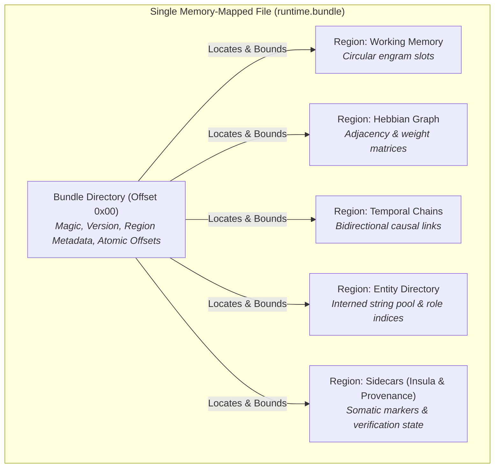
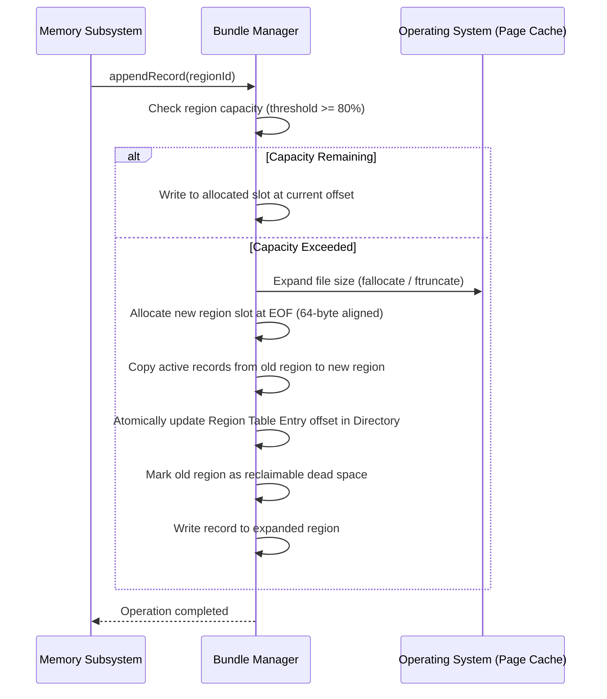

# 📦 Bundle Architecture & Storage Containers

> **Unified memory-mapped containers providing single-VMA virtual memory mapping, atomic region growth, and zero-fragmentation off-heap storage.**

---

## The Bundle Concept

Early memory storage designs allocated distinct operating system files for every memory tier, index structure, and graph table. At scale, this created hundreds of thousands of open file descriptors and severe Virtual Memory Area (VMA) fragmentation in the operating system kernel.

Spector resolves this through the **Bundle Architecture**: a unified container format where multiple logical memory regions are co-located within a single memory-mapped file (`mmap`).



---

## Key Benefits of Bundle Storage

| Dimension | Multi-File Architecture (Legacy) | Unified Bundle Architecture (Spector) |
|:---|:---|:---|
| **OS File Descriptors** | 15–20 open file descriptors per active namespace | **1–2 file descriptors** per namespace |
| **Virtual Memory Areas (VMAs)** | High fragmentation; risks hitting `vm.max_map_count` limits | **1 continuous VMA** mapping per bundle |
| **I/O Overhead** | Multiple `fstat`, `open`, and `close` system calls | Single atomic `mmap` call during namespace warm-up |
| **Cache Line Saturation** | Dispersed physical page tables | Contiguous 64-byte aligned slabs optimizing CPU prefetch |
| **Atomic Consistency** | Complex cross-file checkpoint coordination | Unified snapshotting and coordinated WAL high-water marks |

---

## Bundle Types in a Namespace

Every isolated cognitive namespace maintains three distinct types of bundles:

```
namespaces/{namespace_id}/
├── namespace.json                  # Tenant parameters, dimension vector size, creation flags
├── runtime.bundle                  # Hot working buffers, live graphs, and volatile state
├── identity.bundle                 # Agent persona, core values, system boundary rules
└── partitions/
    ├── 00000/
    │   └── partition.bundle        # Baseline partition: long-term semantic, procedural, strength
    └── 00001/
        └── partition.bundle        # Rolled partition: time-bounded episodic chunks
```

### 1. The Runtime Bundle (`runtime.bundle`)
The Runtime Bundle houses high-velocity, hot memory structures updated during active interaction. Because this state is frequently read and mutated, it is mapped into native memory as a unified segment.

**Hosted Regions**:
- **Working Memory**: Fixed-capacity circular buffer holding active conversation context.
- **Co-Activation Matrix**: Hash table storing pairwise engram co-retrieval frequencies.
- **Hebbian Associative Graph**: Synaptic connection weights between engrams.
- **Temporal Sequence Chains**: Chronological links tracking session context.
- **Temporal Facts**: Bi-temporal knowledge timestamps (valid time vs. assertion time).
- **Entity Directory & Names Pool**: Interned entity names and role registries.
- **Somatic Insula**: Agent self-state, uncertainty indicators, and urgency levels.
- **Continuity & Provenance**: Cross-turn session continuity checkpoints.

### 2. Partition Bundles (`partition.bundle`)
Partition bundles store long-term, time-partitioned engram traces. As memory grows, old episodic traces remain frozen in sequential partitions (e.g. `00000`, `00001`), while long-term semantic knowledge and learned procedural skills reside in indexed partition blocks.

**Hosted Regions**:
- **Episodic Memory**: Time-ordered event records and narrative history.
- **Semantic Memory**: Crystallized factual knowledge and concepts.
- **Procedural Memory**: Multi-step executable skills and behavioural protocols.
- **Strength Audit State**: Dedicated 96-byte mutable recall telemetry and ACT-R history.

### 3. The Identity Bundle (`identity.bundle`)
The Identity Bundle isolates core identity attributes, system guardrails, and cryptographic signatures from volatile memory operations. It remains protected from automated consolidation evictions and memory decay.

---

## Physical Container Layout

A bundle file consists of a fixed **Bundle Directory Header** followed by sequentially laid out, 64-byte-aligned data regions:

```
+------------------------------------------------------------------+
|                   Bundle Directory (Offset 0)                    |
|   - Magic Identifier (4 Bytes, 0x53504354: 'SPCT')              |
|   - Bundle Schema Version (2 Bytes)                              |
|   - Total Region Count (2 Bytes)                                 |
|   - Total Allocated Capacity (8 Bytes)                           |
+------------------------------------------------------------------+
|                   Region Table Entries                           |
|   For each region:                                               |
|     - Region Identifier (2 Bytes, e.g. WORKING, HEBBIAN, STRENGTH) |
|     - Schema Version (2 Bytes)                                   |
|     - Byte Offset from Start of File (8 Bytes, 64-Byte Aligned)   |
|     - Allocated Capacity in Bytes (8 Bytes)                      |
|     - Item Stride in Bytes (4 Bytes)                             |
|     - Active Item Count (4 Bytes)                                |
+------------------------------------------------------------------+
|                   Data Region 0 (64-Byte Aligned)                |
|   - Region Preamble (64 Bytes)                                   |
|   - Record / Stream Data Slabs                                   |
+------------------------------------------------------------------+
|                   Data Region 1 (64-Byte Aligned)                |
|   - Region Preamble (64 Bytes)                                   |
|   - Record / Stream Data Slabs                                   |
+------------------------------------------------------------------+
|                   ... Additional Regions ...                     |
+------------------------------------------------------------------+
```

---

## Dynamic Region Growth Protocol

A critical challenge in pre-allocated memory files is preventing data loss when a region approaches its configured capacity. Spector bundles implement a **Relocate-to-Tail Protocol** that enables dynamic growth without requiring process restarts:



1. **Capacity Monitoring**: Background monitoring monitors region utilization. When a region crosses 80% utilization, an alert is triggered.
2. **Tail Allocation**: When growth is required, the underlying bundle file is expanded, and a new, larger region slab is allocated at the end of the file.
3. **Atomic Pointer Switch**: Active records are copied, and the region table entry in the Bundle Directory at offset `0x00` is atomically updated to point to the new physical offset.
4. **Zero Downtime**: Reads continue seamlessly against mapped virtual memory without locking global access. Dead space left behind by relocated regions is reclaimed during background compaction or maintenance windows.
