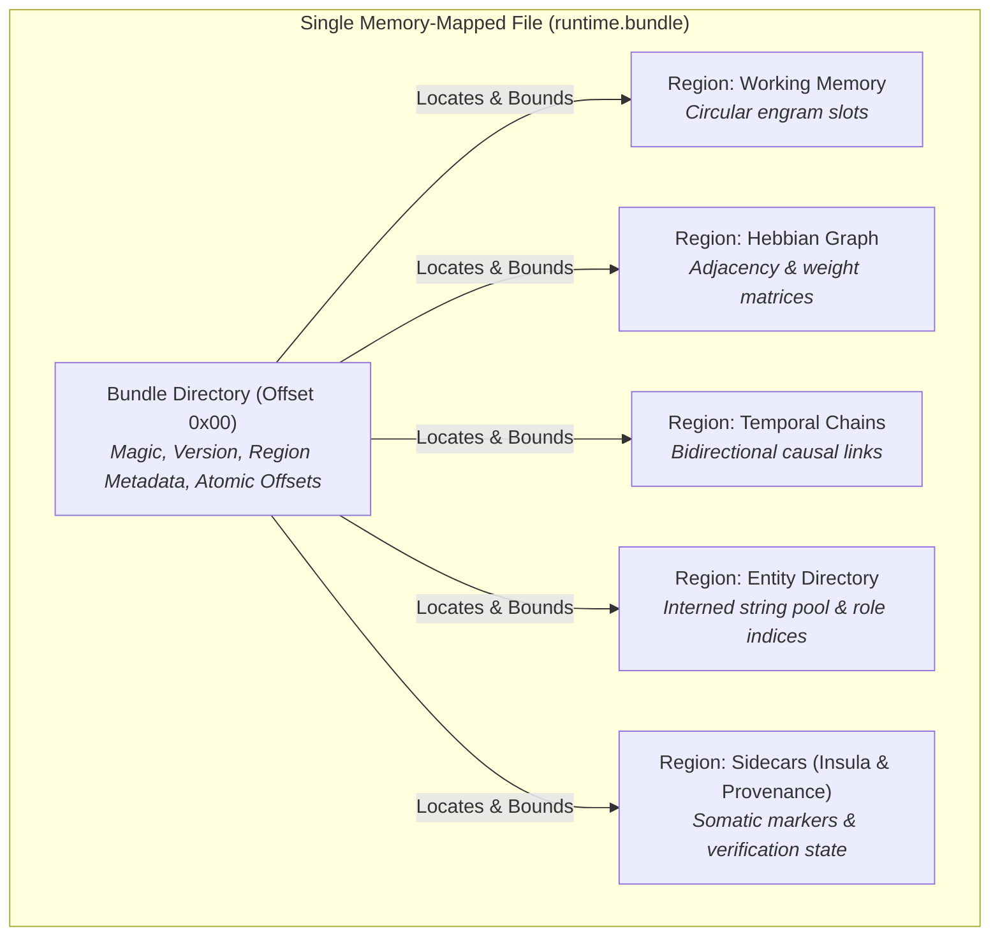
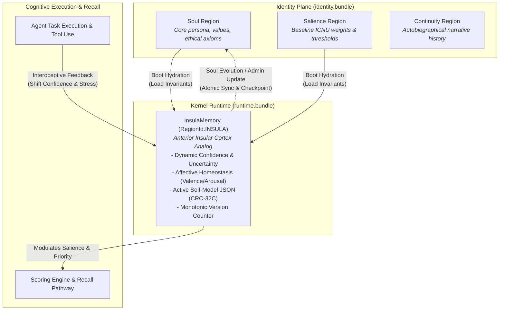
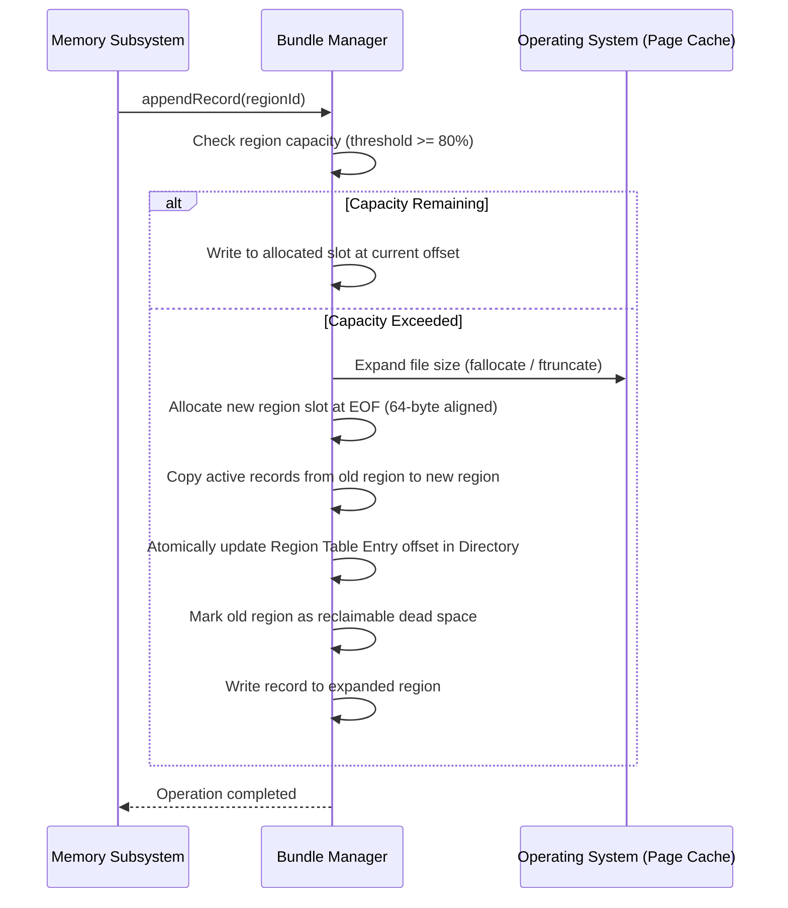

# 📦 Bundle Architecture & Storage Containers

> **Unified memory-mapped containers providing single-VMA virtual memory mapping, atomic region growth, and zero-fragmentation off-heap storage.**

---

## The Bundle Concept

Early memory storage designs allocated distinct operating system files for every memory tier, index structure, and graph table. At scale, this created hundreds of thousands of open file descriptors and severe Virtual Memory Area (VMA) fragmentation in the operating system kernel.

Spector resolves this through the **Bundle Architecture**: a unified container format where multiple logical memory regions are co-located within a single memory-mapped file (`mmap`).



---

## Key Benefits of Bundle Storage

| Dimension | Multi-File Architecture (Legacy) | Unified Bundle Architecture (Spector) |
|:---|:---|:---|
| **OS File Descriptors** | 15–20 open file descriptors per active namespace | **1–2 file descriptors** per namespace |
| **Virtual Memory Areas (VMAs)** | High fragmentation; risks hitting `vm.max_map_count` limits | **1 continuous VMA** mapping per bundle |
| **I/O Overhead** | Multiple `fstat`, `open`, and `close` system calls | Single atomic `mmap` call during namespace warm-up |
| **Cache Line Saturation** | Dispersed physical page tables | Contiguous 64-byte aligned slabs optimizing CPU prefetch |
| **Atomic Consistency** | Complex cross-file checkpoint coordination | Unified snapshotting and coordinated WAL high-water marks |

---

## Storage Hierarchy & Bundle Architecture

Spector physically decouples the high-throughput **Cognitive Memory Plane** (where memories and vector graphs reside) from the **Identity Plane** (where persistent personas, souls, and governance rules reside):

```
${SPECTOR_DATA_DIR}/
├── cognitive/
│   └── namespaces/{xx}/{yy}/{namespace_id}/
│       ├── namespace.json              # Tenant parameters, dimension vector size, creation flags
│       ├── runtime.bundle              # Hot working buffers, live graphs, and InsulaMemory
│       ├── wal.log                     # Write-Ahead Log for crash durability
│       └── partitions/
│           ├── 00000/
│           │   └── partition.bundle    # Baseline partition: long-term semantic, procedural, strength
│           └── 00001/
│               └── partition.bundle    # Rolled partition: time-bounded episodic chunks
└── identity/
    ├── accounts/{aa}/{bb}/{account_id}/
    │   └── identity.bundle             # User or Agent persona, salience profile, continuity
    └── tenants/{tt}/{uu}/{tenant_id}/
        ├── identity.bundle             # Tenant enterprise soul, compliance policies, org directory
        └── accounts/{aa}/{bb}/{account_id}/
            └── identity.bundle         # Tenant-scoped account persona
```

### 1. The Runtime Bundle (`runtime.bundle`)
The Runtime Bundle houses high-velocity, hot memory structures updated during active interaction. Because this state is frequently read and mutated, it is mapped into native memory as a unified segment.

**Hosted Regions**:
- **Working Memory**: Fixed-capacity circular buffer holding active conversation context.
- **Co-Activation Matrix**: Hash table storing pairwise engram co-retrieval frequencies.
- **Hebbian Associative Graph**: Synaptic connection weights between engrams.
- **Temporal Sequence Chains**: Chronological links tracking session context.
- **Temporal Facts**: Bi-temporal knowledge timestamps (valid time vs. assertion time).
- **Entity Directory & Names Pool**: Interned entity names and role registries.
- **Somatic Insula (`InsulaMemory`)**: Dynamic agent self-state, uncertainty indicators, and urgency levels.
- **Continuity & Provenance**: Cross-turn session continuity checkpoints.

### 2. Partition Bundles (`partition.bundle`)
Partition bundles store long-term, time-partitioned engram traces. As memory grows, old episodic traces remain frozen in sequential partitions (e.g. `00000`, `00001`), while long-term semantic knowledge and learned procedural skills reside in indexed partition blocks.

**Hosted Regions**:
- **Episodic Memory**: Time-ordered event records and narrative history.
- **Semantic Memory**: Crystallized factual knowledge and concepts.
- **Procedural Memory**: Multi-step executable skills and behavioural protocols.
- **Strength Region**: Dedicated 96-byte mutable recall telemetry and ACT-R history (`RegionId.STRENGTH`).

### 3. The Identity Bundle (`identity.bundle`)

The **Identity Bundle** isolates core persona definitions, ethical guardrails, compliance policies, and cryptographic signatures in the dedicated **Identity Plane** (`identity/`):
- **Stored Under Accounts & Tenants**: Identity bundles are not tied to an individual memory namespace. Instead, they reside under sharded account directories (`identity/accounts/{aa}/{bb}/{accountId}/identity.bundle`) or tenant hierarchies (`identity/tenants/{tt}/{uu}/{tenantId}/identity.bundle`).
- **Polymorphic Soul Models**: A single identity bundle format accommodates four distinct persona scopes:
    - **User Soul (`UserSoul`)**: Human user persona, communication preferences, and personalized salience weights.
    - **Agent Soul (`AgentSoul`)**: Autonomous AI agent persona, core values, system prompt baseline, ethical guardrails, and registered tools.
    - **Tenant Soul (`TenantSoul`)**: Enterprise organizational persona, compliance retention windows, and global security policies.
    - **Tenant Org Unit Soul (`OrgUnitSoul`)**: Departmental or team-level sub-souls stored within the tenant bundle's `ORG_DIR` region.
- **Dedicated File Descriptor & Zero LRU Eviction**: Maps outside the hot data plane, preventing persona definitions from competing with vector memory caches or being evicted during high-load namespace rotations.
- **Hierarchical Soul Stack**: When an agent runs in a namespace, the `IdentityPlane` resolves and stacks the applicable layers (`TenantSoul` $\to$ `OrgUnitSoul` $\to$ `AgentSoul` / `UserSoul`), ensuring organizational governance precedes individual behavior.

#### Hosted Regions in `identity.bundle`

The container allocates dedicated, 64-byte aligned off-heap slabs for five structural identity domains:

| Region | Identifier | Responsibility |
|:---|:---|:---|
| **Soul Context** | `SOUL` (`1`) | Agent/User/Tenant persona, core values, system prompt baseline, and ethical guardrails. |
| **Salience Profile** | `SALIENCE` (`2`) | Baseline ICNU weights (Interest, Novelty, Utility, Confidence) and cognitive modulation constants. |
| **Identity Continuity** | `CONTINUITY` (`3`) | Autobiographical narrative trajectory, identity checkpoints, and cross-session lineage. |
| **Governance Policy** | `POLICY` (`4`) | Tenant compliance rules, security floors, and organizational domain constraints. |
| **Org Directory** | `ORG_DIR` (`5`) | Organizational unit directory, team hierarchies, and sub-soul definitions. |

---

### The Symbiosis: `identity.bundle` vs. `InsulaMemory`

A common question in cognitive architecture is how an agent reconciles its **permanent identity** with its **moment-to-moment emotional and cognitive state**. Spector solves this through a clean separation between the **Identity Plane** and the **Somatic Self-Model**:



1. **Boot Hydration**: When a namespace starts up, the identity plane reads the immutable persona and baseline salience weights from `identity.bundle` to hydrate `InsulaMemory` in `runtime.bundle`.
2. **Dynamic Interoception in `InsulaMemory`**: Modeled after the human **Anterior Insular Cortex** (the brain's hub for self-awareness and interoception), `InsulaMemory` maintains a single, versioned JSON self-model. As the agent encounters uncertainty, solves problems, or interacts with users, it mutates its active confidence, arousal, and urgency markers directly within `runtime.bundle` with sub-microsecond latency.
3. **Integrity & Checkpoints**: Every update to `InsulaMemory` increments a monotonic version number, recomputes a hardware CRC-32C checksum, and writes an atomic state flag. When persona changes are explicitly authorized, the updated soul is validated and committed back to `identity.bundle`.

---

### Client Connectivity & Identity Management

Applications and autonomous agents inspect and manage identity state through Spector's multi-language Client SDKs and REST APIs:

=== "Python"

    ```python
    from spector import SpectorClient

    client = SpectorClient("http://localhost:7070", api_key="sk-spector-live")

    # Inspect the agent's active soul and somatic self-model
    soul = client.agents.get_soul()
    print(f"Agent Persona: {soul.name} (v{soul.soul_version})")
    print(f"Core Values: {soul.core_values}")

    # Update ethical guardrails and personality traits
    updated_soul = client.agents.update_soul(
        name="Nexus-Architect",
        personality="Precise, pragmatic, and safety-conscious systems engineer",
        ethical_guardrails=[
            "Never execute destructive shell commands without human signoff",
            "Maintain complete audit logging for privileged actions"
        ]
    )
    print(f"Soul successfully updated to version {updated_soul.soul_version}")
    ```

=== "TypeScript"

    ```typescript
    import { SpectorClient } from "@spectrayan/spector-client";

    const client = new SpectorClient({
      baseUrl: "http://localhost:7070",
      apiKey: "sk-spector-live"
    });

    // Inspect the agent's active soul and somatic self-model
    const soul = await client.agents.getSoul();
    console.log(`Agent Persona: ${soul.name} (v${soul.soulVersion})`);

    // Update ethical guardrails and personality traits
    const updated = await client.agents.updateSoul({
      name: "Nexus-Architect",
      personality: "Precise, pragmatic, and safety-conscious systems engineer",
      ethicalGuardrails: [
        "Never execute destructive shell commands without human signoff",
        "Maintain complete audit logging for privileged actions"
      ]
    });
    console.log(`Soul updated to version ${updated.soulVersion}`);
    ```

=== "Java Client"

    ```java
    import com.spectrayan.spector.client.SpectorClient;
    import com.spectrayan.spector.client.model.AgentSoul;
    import java.util.List;

    var client = SpectorClient.builder()
            .endpoint("http://localhost:7070")
            .apiKey("sk-spector-live")
            .build();

    // Inspect the agent's active soul and somatic self-model
    AgentSoul soul = client.agents().getSoul();
    System.out.println("Agent Persona: " + soul.name() + " v" + soul.soulVersion());

    // Update ethical guardrails and personality traits
    AgentSoul updated = client.agents().updateSoul(AgentSoul.builder()
            .name("Nexus-Architect")
            .personality("Precise, pragmatic, and safety-conscious systems engineer")
            .ethicalGuardrails(List.of(
                "Never execute destructive shell commands without human signoff",
                "Maintain complete audit logging for privileged actions"
            ))
            .build());
    System.out.println("Soul updated to version " + updated.soulVersion());
    ```

=== "cURL"

    ```bash
    # Inspect active agent soul
    curl -X GET "http://localhost:7070/api/v1/agents/soul" \
      -H "Authorization: Bearer sk-spector-live"

    # Update agent soul and ethical guardrails
    curl -X PUT "http://localhost:7070/api/v1/agents/soul" \
      -H "Authorization: Bearer sk-spector-live" \
      -H "Content-Type: application/json" \
      -d '{
        "name": "Nexus-Architect",
        "personality": "Precise, pragmatic, and safety-conscious systems engineer",
        "ethicalGuardrails": [
          "Never execute destructive shell commands without human signoff",
          "Maintain complete audit logging for privileged actions"
        ]
      }'
    ```

=== "CLI"

    ```bash
    # Inspect active soul configuration
    spector agent soul show

    # Update personality and guardrails via CLI
    spector agent soul set \
      --name "Nexus-Architect" \
      --personality "Precise, pragmatic, and safety-conscious systems engineer"
    ```

---

## Physical Container Layout

A bundle file consists of a fixed **Bundle Directory Header** followed by sequentially laid out, 64-byte-aligned data regions:

```
+------------------------------------------------------------------+
|                   Bundle Directory (Offset 0)                    |
|   - Magic Identifier (4 Bytes, 0x53504354: 'SPCT')              |
|   - Bundle Schema Version (2 Bytes)                              |
|   - Total Region Count (2 Bytes)                                 |
|   - Total Allocated Capacity (8 Bytes)                           |
+------------------------------------------------------------------+
|                   Region Table Entries                           |
|   For each region:                                               |
|     - Region Identifier (2 Bytes, e.g. WORKING, HEBBIAN, STRENGTH) |
|     - Schema Version (2 Bytes)                                   |
|     - Byte Offset from Start of File (8 Bytes, 64-Byte Aligned)   |
|     - Allocated Capacity in Bytes (8 Bytes)                      |
|     - Item Stride in Bytes (4 Bytes)                             |
|     - Active Item Count (4 Bytes)                                |
+------------------------------------------------------------------+
|                   Data Region 0 (64-Byte Aligned)                |
|   - Region Preamble (64 Bytes)                                   |
|   - Record / Stream Data Slabs                                   |
+------------------------------------------------------------------+
|                   Data Region 1 (64-Byte Aligned)                |
|   - Region Preamble (64 Bytes)                                   |
|   - Record / Stream Data Slabs                                   |
+------------------------------------------------------------------+
|                   ... Additional Regions ...                     |
+------------------------------------------------------------------+
```

---

## Dynamic Region Growth Protocol

A critical challenge in pre-allocated memory files is preventing data loss when a region approaches its configured capacity. Spector bundles implement a **Relocate-to-Tail Protocol** that enables dynamic growth without requiring process restarts:



1. **Capacity Monitoring**: Background monitoring monitors region utilization. When a region crosses 80% utilization, an alert is triggered.
2. **Tail Allocation**: When growth is required, the underlying bundle file is expanded, and a new, larger region slab is allocated at the end of the file.
3. **Atomic Pointer Switch**: Active records are copied, and the region table entry in the Bundle Directory at offset `0x00` is atomically updated to point to the new physical offset.
4. **Zero Downtime**: Reads continue seamlessly against mapped virtual memory without locking global access. Dead space left behind by relocated regions is reclaimed during background compaction or maintenance windows.
