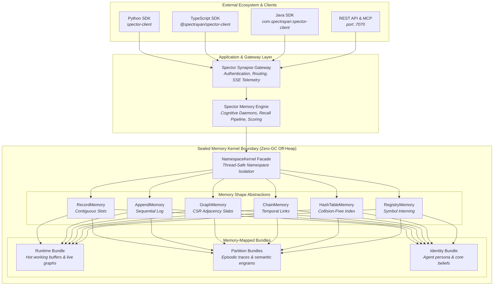

# ⚡ Memory Kernel — Architecture & Overview

> **The zero-GC, hardware cache-line-aligned storage backbone for AI cognitive memory.**

---

## What is the Memory Kernel?

The **Spector Memory Kernel** (`spector-kernel`) is the high-performance native storage engine powering Spector. Operating directly on off-heap memory via the Java 25 Foreign Function & Memory (FFM) API, the kernel delivers microsecond-level retrieval, high write concurrency, and strict multi-tenant data isolation.

Traditional AI databases store vector records on the JVM heap or delegate persistence to external network-attached databases. The Spector Memory Kernel takes a different approach: it manages structured off-heap byte buffers organized into memory-mapped bundles, eliminating garbage collection pauses and serialization overhead entirely.

---

## Core Architectural Tenets

### 1. Zero Garbage Collection Pressure
All cognitive memory records—including high-dimensional vector embeddings, associative graphs, 128-bit Bloom synaptic tags, and recall strength states—are held in off-heap memory segments. Because these buffers reside outside the managed JVM heap, the garbage collector never inspects, traces, or moves them, providing:
- **Predictable Latency**: Zero GC stop-the-world pauses, even under multi-gigabyte memory footprints.
- **Cache-Line Alignment**: Records are strictly aligned to 64-byte hardware cache lines, optimizing CPU prefetchers and memory bus saturation.
- **Direct OS Paging**: Operating system page cache mechanisms handle paging and eviction transparently through memory-mapped I/O (`mmap`).

### 2. Sealed Kernel Boundary
The Memory Kernel maintains a strict architectural seal. Native memory segments, raw virtual addresses, and arena lifecycles are fully encapsulated within `spector-kernel`. Higher cognitive layers (`spector-memory`) interact solely through typed memory shapes and domain value objects. This design:
- Prevents unsafe memory access or off-heap memory leaks across upper subsystems.
- Guarantees thread-safe resource scoping across concurrent Virtual Threads.
- Allows the underlying storage layout to evolve without impacting client APIs.

### 3. Pure Encoding Identity & Telemetry Separation
Every stored engram cleanly decouples its immutable creation metadata from high-frequency mutable recall dynamics:
- **Encoding Header (64 Bytes)**: Contains immutable properties recorded at memory formation (initial valence, arousal, base importance, timestamp, and 128-bit synaptic Bloom tags).
- **Strength State (96 Bytes)**: Resides in an independent recall audit region. Tracks mutable access counters, long-term potentiation cooldowns, storage strength, and ACT-R recall timestamp history.

This complete physical separation prevents CPU cache-line false sharing during parallel multi-threaded scans, ensuring read-heavy search loops remain uninhibited by concurrent memory recall updates.

---

## Physical Namespace Isolation

Every memory namespace (representing an individual user, an autonomous AI agent, or a dedicated workspace) receives its own dedicated directory on disk:

| Component | Path Pattern | Responsibility |
|:---|:---|:---|
| **Namespace Descriptor** | `namespaces/{id}/namespace.json` | Sizing configuration, vector dimensions, tenant isolation metadata |
| **Runtime Bundle** | `namespaces/{id}/runtime.bundle` | Hot working memory circular buffer, Hebbian graph, entity registries, insular somatic markers |
| **Partition Bundles** | `namespaces/{id}/partitions/{seq}/partition.bundle` | Time-partitioned episodic chunks, long-term semantic engrams, procedural skills, strength audit state |
| **Identity Bundle** | `namespaces/{id}/identity.bundle` | Agent persona, core values, system boundary rules, and cryptographic verification |

---

## Next Steps

Explore the architectural components of the Spector Memory Kernel:

-   :material-package-variant-closed: **[Bundle Architecture](bundles.md)**
    
    Learn how single-mmap bundle files organize memory regions with growable capacity and cache-line alignment.

-   :material-shape-outline: **[Memory Shapes](shapes.md)**
    
    Discover the seven typed shape abstractions providing clean access patterns across all memory stores.

-   :material-binary: **[Binary Record Layouts](layouts.md)**
    
    Examine the 64-byte pure encoding header, 128-bit Synaptic Bloom tags, and 96-byte strength state.

-   :material-shield-check-outline: **[WAL & Durability](wal-recovery.md)**
    
    Understand crash-resilient write-ahead logging, CRC-32 integrity verification, and recovery warming.

