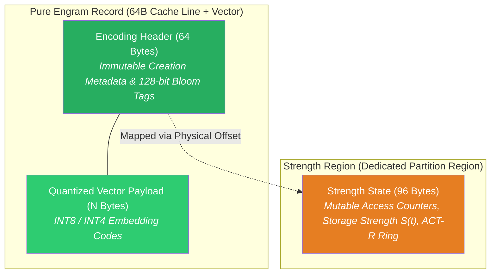
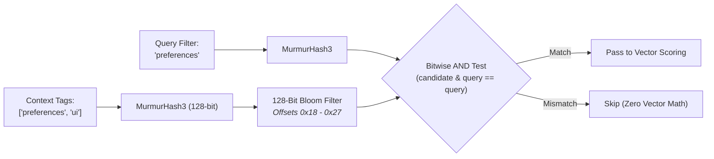

# 🧬 Binary Record Specifications & Synaptic Header

> **Hardware cache-line-aligned binary layouts optimizing CPU memory bus saturation, zero-false-sharing concurrency, and sub-microsecond candidate pre-screening.**

---

## Architectural Separation: Encoding vs. Strength

In biological memory, forming a memory (encoding) and recalling a memory (retrieval dynamics) involve distinct neurological processes. In a digital memory system, combining these two concerns into a single record layout causes severe concurrency bottlenecks:

- **The False Sharing Problem**: When multiple worker threads execute high-throughput vector similarity scans over thousands of memory records, any thread that mutates a recall counter or access timestamp on an engram invalidates the entire CPU cache line (`L1`/`L2`/`L3`) across all CPU cores.
- **The Spector Solution**: A physical split between immutable engram encoding metadata and mutable recall telemetry.



1. **Pure Encoding Identity**: The primary engram record contains only immutable or read-mostly attributes established during memory ingestion. It remains static during search operations.
2. **Strength Region**: All mutable metrics—including Bjork storage strength, explicit agent reinforcement counts, passive auto-LTP retrieval counts, and ACT-R recall timestamp history—are relocated to an independent 96-byte record within the dedicated **Strength Region** (`RegionId.STRENGTH`).

---

## 64-Byte Pure Encoding Header (V2)

The engram header is aligned to exactly one **64-byte CPU cache line**, ensuring that a sequential memory scan reads one complete header per memory bus burst with zero split-line penalties.

### Wire Diagram (64 Bytes)

```
 0                   1                   2                   3
 0 1 2 3 4 5 6 7 8 9 0 1 2 3 4 5 6 7 8 9 0 1 2 3 4 5 6 7 8 9 0 1
+-+-+-+-+-+-+-+-+-+-+-+-+-+-+-+-+-+-+-+-+-+-+-+-+-+-+-+-+-+-+-+-+
| ver(1B)|flg(1B)| val(1B)| aro(1B)|       importance (4B)       |  0x00
+-+-+-+-+-+-+-+-+-+-+-+-+-+-+-+-+-+-+-+-+-+-+-+-+-+-+-+-+-+-+-+-+
|                                                               |
+                      timestamp_ms (8B)                        +  0x08
|                                                               |
+-+-+-+-+-+-+-+-+-+-+-+-+-+-+-+-+-+-+-+-+-+-+-+-+-+-+-+-+-+-+-+-+
|          exact_norm (4B)       |  centroid (2B)|   pad0 (2B)  |  0x10
+-+-+-+-+-+-+-+-+-+-+-+-+-+-+-+-+-+-+-+-+-+-+-+-+-+-+-+-+-+-+-+-+
|                                                               |
+                   synaptic_tags_lo (8B)                       +  0x18
|                                                               |
+-+-+-+-+-+-+-+-+-+-+-+-+-+-+-+-+-+-+-+-+-+-+-+-+-+-+-+-+-+-+-+-+
|                                                               |
+                   synaptic_tags_hi (8B)                       +  0x20
|                                                               |
+-+-+-+-+-+-+-+-+-+-+-+-+-+-+-+-+-+-+-+-+-+-+-+-+-+-+-+-+-+-+-+-+
|consol(1B)|prof(1B)|alpha| beta |  soul_version | reserved_geo |  0x28
+-+-+-+-+-+-+-+-+-+-+-+-+-+-+-+-+-+-+-+-+-+-+-+-+-+-+-+-+-+-+-+-+
|       encoding_surprise (4B)   |     reserved block (12B)     |  0x30
|                                |                              |  0x38
+-+-+-+-+-+-+-+-+-+-+-+-+-+-+-+-+-+-+-+-+-+-+-+-+-+-+-+-+-+-+-+-+
```

### Field Specifications

| Offset | Size | Field Name | Type | Description |
|:---:|:---:|:---|:---|:---|
| `0x00` | 1B | `header_version` | uint8 | Encoding header version (Current: `2`). |
| `0x01` | 1B | `flags` | uint8 | Bitfield flags: tombstone, tier type, consolidated, pinned, resolved, modality. |
| `0x02` | 1B | `valence` | int8 | Signed emotional valence at ingestion ($-128$ to $+127$). |
| `0x03` | 1B | `arousal` | uint8 | Unsigned emotional intensity at ingestion ($0$ to $255$). |
| `0x04` | 4B | `importance` | float32 | Initial base importance score derived from intrinsic properties ($0.05$ to $10.0$). |
| `0x08` | 8B | `timestamp_ms` | int64 | Epoch milliseconds when the memory was initially encoded. |
| `0x10` | 4B | `exact_norm` | float32 | Unquantized L2 vector norm for exact cosine reconstruction. |
| `0x14` | 2B | `centroid_id` | int16 | Cluster centroid index for coarse inverted index (IVF) routing. |
| `0x16` | 2B | `_pad0` | bytes | Alignment padding. |
| `0x18` | 8B | `synaptic_tags_lo` | uint64 | Low 64 bits of the 128-bit Synaptic Bloom Filter. |
| `0x20` | 8B | `synaptic_tags_hi` | uint64 | High 64 bits of the 128-bit Synaptic Bloom Filter. |
| `0x28` | 1B | `consolidation_flags` | uint8 | Provenance bits (simulated, crystallized, dreamed, circadian-promoted). |
| `0x29` | 1B | `encoding_profile` | uint8 | Active cognitive profile identifier during ingestion. |
| `0x2A` | 1B | `encoding_alpha` | uint8 | Quantized associative attention weight ($0$ to $255$). |
| `0x2B` | 1B | `encoding_beta` | uint8 | Quantized contextual balance weight ($0$ to $255$). |
| `0x2C` | 2B | `soul_version` | uint16 | Monotonic generation counter of the agent persona configuration. |
| `0x2E` | 2B | `_reserved_geo` | bytes | Reserved for hyperbolic manifold coordinates. |
| `0x30` | 4B | `encoding_surprise` | float32 | Bayesian surprise $z$-score recorded upon creation. |
| `0x34` | 12B | `_reserved` | bytes | Zero-padded reserved block for future tensor invariants. |

---

## 128-Bit Synaptic Bloom Filter

Synaptic tagging is modeled after biological synaptic tagging and capture (Frey & Morris, 1997). When a memory is stored with tags (e.g. `preferences`, `ui`, `billing`), these strings are hashed into a compact bitset.



### Why 128 Bits Instead of 64 Bits?
- **Capacity**: A 64-bit filter begins experiencing severe false positive degradation beyond 3–4 tags. At 8 tags, a 64-bit filter exhibits a false positive rate exceeding $15\%$.
- **Precision**: Expanding the filter to 128 bits (16 bytes, spanning `synaptic_tags_lo` and `synaptic_tags_hi`) slashes the false positive probability by approximately **60×** across typical tag sets ($k=4$ hash functions).
- **Sub-Microsecond Screening**: During candidate retrieval, thousands of memories can be pre-screened using two 64-bit CPU register bitwise `AND` instructions. Non-matching engrams are discarded immediately without loading dense vector embeddings into SIMD registers.

---

## 96-Byte Strength State (Strength Region)

Mutable telemetry is isolated in an independent 96-byte record within partition bundles (`RegionId.STRENGTH`), aligned to 32 bytes to ensure atomic word updates across concurrent virtual threads:

### Wire Diagram (96 Bytes)

```
 0                   1                   2                   3
 0 1 2 3 4 5 6 7 8 9 0 1 2 3 4 5 6 7 8 9 0 1 2 3 4 5 6 7 8 9 0 1
+-+-+-+-+-+-+-+-+-+-+-+-+-+-+-+-+-+-+-+-+-+-+-+-+-+-+-+-+-+-+-+-+
|flags(1B)|prof(1B)|val(1B)|pad0 |   agent_recall_count (4B)     |  0x00
+-+-+-+-+-+-+-+-+-+-+-+-+-+-+-+-+-+-+-+-+-+-+-+-+-+-+-+-+-+-+-+-+
|   spector_recall_cnt (4B)      |   effective_importance (4B)   |  0x08
+-+-+-+-+-+-+-+-+-+-+-+-+-+-+-+-+-+-+-+-+-+-+-+-+-+-+-+-+-+-+-+-+
|   storage_strength (4B)        |   last_agent_hash (4B)        |  0x10
+-+-+-+-+-+-+-+-+-+-+-+-+-+-+-+-+-+-+-+-+-+-+-+-+-+-+-+-+-+-+-+-+
|                                                               |
+                      last_auto_ltp (8B)                       +  0x18
|                                                               |
+-+-+-+-+-+-+-+-+-+-+-+-+-+-+-+-+-+-+-+-+-+-+-+-+-+-+-+-+-+-+-+-+
|                                                               |
+                      last_recall_ts (8B)                      +  0x20
|                                                               |
+-+-+-+-+-+-+-+-+-+-+-+-+-+-+-+-+-+-+-+-+-+-+-+-+-+-+-+-+-+-+-+-+
|                                                               |
+               act_r_ring_buffer (8 × int32, 32B)              +  0x28
|                                                               |
+-+-+-+-+-+-+-+-+-+-+-+-+-+-+-+-+-+-+-+-+-+-+-+-+-+-+-+-+-+-+-+-+
|                   reconsolidation_delta (8B)                  |  0x48
+-+-+-+-+-+-+-+-+-+-+-+-+-+-+-+-+-+-+-+-+-+-+-+-+-+-+-+-+-+-+-+-+
|                      _reserved (16B)                          |  0x50
+-+-+-+-+-+-+-+-+-+-+-+-+-+-+-+-+-+-+-+-+-+-+-+-+-+-+-+-+-+-+-+-+
```

### Key Cognitive Dynamic Fields

1. **Storage Strength $S(t)$ (`storage_strength`, 4B float32)**:
   Models the Bjork & Bjork Two-Factor Memory Model. While retrieval strength decays rapidly, storage strength accumulates monotonically upon repeated, spaced recalls, slowing subsequent decay rates ($S(t) \in [1.0, 5.0]$).

2. **ACT-R Recall Timestamp Ring Buffer (`act_r_ring_buffer`, 32B)**:
   Stores the 8 most recent recall timestamps (expressed in relative delta seconds). Used by the scoring engine to evaluate the ACT-R power-law retention equation:
   $$A_i = \ln \left( \sum_{k=1}^{n} t_k^{-d} \right)$$
   where $t_k$ represents the elapsed time since the $k$-th retrieval and $d$ is the decay exponent.

3. **Dual Recall Counters**:
   - `agent_recall_count`: Incremented when an external agent or user explicitly reinforces an engram (`client.memory.reinforce(...)`).
   - `spector_recall_cnt`: Incremented passively by the system when the engram is retrieved as relevant context during a query, subject to cooldown timers to prevent runaway reinforcement loops.

---

## 32-Byte Insular Sub-Header Layout (`InsularLayout`)

The **Insular Sub-Header** (`InsularLayout`, identifier `0x494E534C` / `'INSL'`) governs the storage of the agent's dynamic self-model within `runtime.bundle` (`RegionId.INSULA`). It sits immediately after the standard 64-byte `RegionPreamble` (starting at byte offset `64`), establishing a 96-byte header boundary before the variable-length JSON self-model begins.

### Wire Diagram (32 Bytes at Offset 64)

```
 0                   1                   2                   3
 0 1 2 3 4 5 6 7 8 9 0 1 2 3 4 5 6 7 8 9 0 1 2 3 4 5 6 7 8 9 0 1
+-+-+-+-+-+-+-+-+-+-+-+-+-+-+-+-+-+-+-+-+-+-+-+-+-+-+-+-+-+-+-+-+
|          version (4B)         |        data_length (4B)       |  0x40 (rel 0x00)
+-+-+-+-+-+-+-+-+-+-+-+-+-+-+-+-+-+-+-+-+-+-+-+-+-+-+-+-+-+-+-+-+
|                                                               |
+                       updated_at (8B)                         +  0x48 (rel 0x08)
|                                                               |
+-+-+-+-+-+-+-+-+-+-+-+-+-+-+-+-+-+-+-+-+-+-+-+-+-+-+-+-+-+-+-+-+
|          checksum (4B)        |          flags (4B)           |  0x50 (rel 0x10)
+-+-+-+-+-+-+-+-+-+-+-+-+-+-+-+-+-+-+-+-+-+-+-+-+-+-+-+-+-+-+-+-+
|                         reserved (8B)                         |  0x58 (rel 0x18)
+-+-+-+-+-+-+-+-+-+-+-+-+-+-+-+-+-+-+-+-+-+-+-+-+-+-+-+-+-+-+-+-+
|                                                               |
+               Variable-Length UTF-8 JSON Payload              +  0x60 (rel 0x20)
|                                                               |
```

### Field Specifications

| Offset | Size | Field Name | Type | Description |
|:---:|:---:|:---|:---|:---|
| `0x00` | 4B | `version` | int32 | Monotonically increasing version counter incremented on every mutation or clear. |
| `0x04` | 4B | `data_length` | int32 | Byte length of the active UTF-8 JSON self-model payload. |
| `0x08` | 8B | `updated_at` | int64 | Epoch milliseconds timestamp when the self-model was last written. |
| `0x10` | 4B | `checksum` | int32 | CRC-32C checksum computed over the UTF-8 JSON payload bytes. |
| `0x14` | 4B | `flags` | int32 | Presence indicator: `0` = `FLAG_EMPTY` (no model), `1` = `FLAG_PRESENT`. |
| `0x18` | 8B | `_reserved` | bytes | Zero-padded reserved block for future interoceptive telemetry fields. |
| `0x20` | Var | `payload` | bytes | Raw UTF-8 JSON payload containing the active self-model and dynamic salience markers. |

### Data Integrity & Reentrant Protection

1. **Hardware CRC-32C Integrity**: Every write calculates a castagnoli CRC-32C checksum over the JSON payload. On read, the checksum is verified before decoding to guarantee corruption-free state recovery.
2. **Atomic Region Synchronization**: Upon updating the insular sub-header, the enclosing `RegionPreamble` item count and timestamp are atomically refreshed, and the underlying memory-mapped file slice is flushed (`force()`).
3. **Capacity Guardrails**: Payloads larger than the allocated region capacity (typically 512 KB in standard namespaces) are rejected immediately to protect contiguous bundle alignment.
