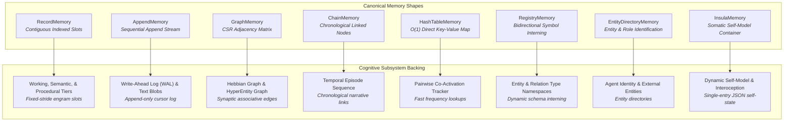

# 🔷 Typed Memory Shapes

> **Uniform physical access abstractions separating structural access patterns from concrete memory store semantics.**

---

## The Shape Principle

In low-level storage architectures, coupling the physical storage layout with domain logic creates brittle systems. For example, treating "Semantic Memory" as a completely unique data structure obscures the fact that at the byte level, it shares identical access patterns with "Working Memory" and "Procedural Memory".

The Spector Memory Kernel resolves this via **The Shape Principle**:

> **Memory Shapes define access patterns, not storage semantics.** Concrete cognitive subsystems name their domain content only (`SemanticMemory`, `HebbianGraph`, `StrengthLayout`), while the kernel executes operations through seven canonical **Memory Shapes**.

---

## Detailed Shape Specifications

### 1. `RecordMemory` (Contiguous Indexed Slots)
`RecordMemory` manages contiguous, fixed-stride off-heap byte slots indexed by sequential numerical identifiers.

- **Access Pattern**: Random read/write access via direct slot offset calculations: $\text{Offset} = \text{Base} + (\text{Index} \times \text{Stride})$.
- **Concurrency**: Lock-free concurrent reads across Virtual Threads using hardware atomic primitives (`VarHandle` compare-and-swap and volatile loads).
- **Backed Subsystems**:
  - `WorkingMemory` (circular buffer)
  - `SemanticMemory` (crystallized concepts)
  - `ProceduralMemory` (learned operational skills)
  - `StrengthMemory` (96-byte recall dynamics and Bjork storage strength)

---

### 2. `AppendMemory` (Sequential Append Stream)
`AppendMemory` provides an append-only stream of variable- or fixed-length records controlled by an atomic cursor pointer.

- **Access Pattern**: Unidirectional sequential appends with monotonic sequence counters.
- **Concurrency**: Single-writer or lock-coordinated sequential writes; concurrent non-blocking sequential reads.
- **Backed Subsystems**:
  - `WalMemory` (Write-Ahead Log event records)
  - `TextBlobMemory` (raw document text payloads)
  - `TemporalFactMemory` (bi-temporal assertion streams)

---

### 3. `GraphMemory` (Adjacency Matrices & Slabs)
`GraphMemory` implements a high-performance off-heap graph engine using Compressed Sparse Row (CSR) layouts combined with dynamic adjacency slabs.

- **Access Pattern**: Traversal of outgoing and incoming edges, weight adjustments, and neighbor queries without creating heap objects.
- **Concurrency**: Read-mostly graph traversals optimized for SIMD operations, with thread-safe atomic edge weight updates.
- **Backed Subsystems**:
  - `HebbianMemory` (associative synaptic connections between memory engrams)
  - `HyperGraphMemory` ($n$-ary hyperedges linking entities, roles, and contexts)

---

### 4. `ChainMemory` (Chronological Linking)
`ChainMemory` maintains ordered sequences of temporal events linking conversations, episodes, and cognitive checkpoints.

- **Access Pattern**: Forward and backward traversals along causal chains: "what happened immediately before?" and "what occurred next?".
- **Characteristics**: Compact pointer offsets linking prior and subsequent engram indices across session boundaries.
- **Backed Subsystems**:
  - `TemporalChainMemory` (episodic narrative sequencing)

---

### 5. `HashTableMemory` (Off-Heap Key-Value Map)
`HashTableMemory` is a low-level, collision-resilient hash table residing entirely in off-heap memory.

- **Access Pattern**: $O(1)$ key lookup and increment operations using open addressing with linear probing.
- **Characteristics**: Eliminates Java heap Map overhead (which typically incurs 32–48 bytes per entry in object headers and references).
- **Backed Subsystems**:
  - `CoActivationMemory` (tracks pairwise co-retrieval frequencies between engrams to dynamically reinforce associative bonds)

---

### 6. `RegistryMemory` (Symbol Interning)
`RegistryMemory` establishes a two-way mapping between variable-length string symbols and compact integer identifiers.

- **Access Pattern**: Fast bidirectional resolution: String $\rightarrow$ Integer ID and Integer ID $\rightarrow$ String.
- **Characteristics**: Enables open-schema architectures where new entity types, relation names, and tags are registered dynamically without storing repetitive string tokens across the hot off-heap memory path.
- **Backed Subsystems**:
  - `EntityTypeMemory` (interned entity categories: person, organization, location, etc.)
  - `RelationTypeMemory` (interned relationship predicates: causes, depends_on, works_at, etc.)

---

### 7. `EntityDirectoryMemory` (Entity Directory)
`EntityDirectoryMemory` coordinates global entity identifiers, alias tracking, and name pool mappings across a namespace.

- **Access Pattern**: Fast entity lookup, type resolution, and association mapping.
- **Backed Subsystems**:
  - Inter-agent entity resolution, cross-session participant identification, and structured hypergraph entity registries.

---

### 8. `InsulaMemory` (Somatic Self-Model Container)
`InsulaMemory` implements a dedicated single-entry container storing the agent's dynamic, real-time self-model and interoceptive somatic state.

- **Access Pattern**: Single-entry atomic read/write (`put()`, `get()`, `clear()`) of a variable-length JSON self-model payload.
- **Biological Analog**: The **Anterior Insular Cortex**, which in the human brain integrates visceral interoception, self-awareness, and emotional valence into a unified subjective feeling state.
- **Integrity & Concurrency**:
  - Sub-header tracks a monotonic version counter, payload byte length, epoch timestamp, and a hardware-computed CRC-32C checksum.
  - Concurrency is protected by a thread-safe write lock with zero-copy unaligned read semantics across concurrent Virtual Threads.
- **Backed Subsystems**:
  - `InsulaMemory` (active self-model, task confidence, interoceptive stress, and dynamic salience posture within `runtime.bundle` at `RegionId.INSULA`).

---

## Shape Comparison Summary

| Memory Shape | Record Length | Indexing | Primary Operations | Off-Heap Layout |
|:---|:---|:---|:---|:---|
| **`RecordMemory`** | Fixed stride | Numeric slot index | `readSlot()`, `writeSlot()`, `updateField()` | Contiguous cache-aligned array |
| **`AppendMemory`** | Variable / Fixed | Sequential byte offset | `append()`, `scanFrom()`, `readAt()` | Cursor-driven append log |
| **`GraphMemory`** | Fixed node/edge | Node identifier | `getNeighbors()`, `updateWeight()`, `traverse()` | Compressed Sparse Row + slab lists |
| **`ChainMemory`** | Fixed node | Link identifier | `next()`, `previous()`, `link()` | Bidirectional offset pointers |
| **`HashTableMemory`** | Fixed entry | Hash key | `get()`, `put()`, `increment()` | Open-addressing probing buffer |
| **`RegistryMemory`** | Variable | String hash & ID | `intern()`, `resolveId()`, `resolveName()` | String pool + ID lookup table |
| **`EntityDirectoryMemory`**| Composite | Entity identifier | `lookup()`, `register()`, `listEntities()` | Directory index + name buffer |
| **`InsulaMemory`** | Variable (1 slot) | Singleton self-model | `put()`, `get()`, `clear()` | 32-byte header + CRC-32C JSON payload |
