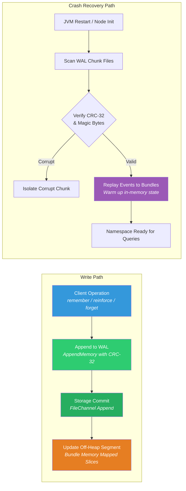
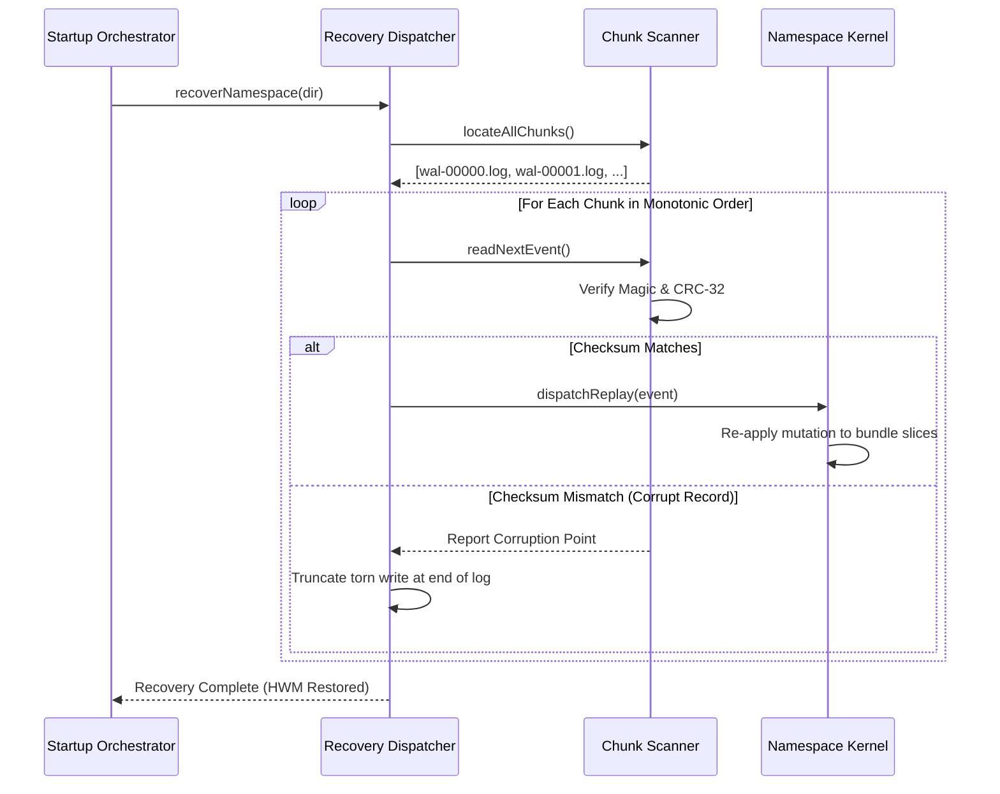

# 🛡️ Write-Ahead Log (WAL) & Durability

> **Crash-resilient append-only write-ahead logging guaranteeing data durability, state recovery, and distributed sync across off-heap memory segments.**

---

## Why a Write-Ahead Log?

In native memory architectures, mutable cognitive state (vector projections, synaptic tags, association edge weights, and recall telemetry) is held in off-heap memory segments. While the operating system dirty-page flushing mechanism eventually writes dirty pages back to disk, a sudden JVM crash or power interruption could result in partial writes or page tearing.

The **Spector Write-Ahead Log (WAL)** resolves this by enforcing a strict durability invariant:

> **No memory mutation is reflected in off-heap structures until its immutable event has been durably appended and validated in the Write-Ahead Log.**



---

## WAL File Architecture & Chunking

To prevent unbounded single-file growth and simplify point-in-time snapshots, the WAL utilizes a **Chunked File Model**:

```
namespaces/{namespace_id}/
├── wal/
│   ├── wal-00000000.log            # Archived chunk (frozen at 8MB)
│   ├── wal-00000001.log            # Archived chunk (frozen at 8MB)
│   └── wal-00000002.log            # Active write chunk (cursor appending)
```

1. **Monotonic Sequences**: Every WAL event is tagged with a strictly increasing 64-bit sequence counter ($1, 2, 3, \dots, N$), establishing a total global order across all operations in a namespace.
2. **Chunk Rolling**: When the active write chunk reaches the configured maximum file threshold (default: 8 MB), it is fsync-committed and closed. A new chunk is opened with the next sequential index.
3. **Compaction & Archival**: When an episodic partition bundle is sealed or when a baseline memory snapshot is saved, WAL chunks prior to the snapshot's high-water mark can be pruned or archived to cold object storage.

---

## Binary Event Record Format

Each event in the WAL is serialized as an immutable, self-contained binary frame:

```
 0                   1                   2                   3
 0 1 2 3 4 5 6 7 8 9 0 1 2 3 4 5 6 7 8 9 0 1 2 3 4 5 6 7 8 9 0 1
+-+-+-+-+-+-+-+-+-+-+-+-+-+-+-+-+-+-+-+-+-+-+-+-+-+-+-+-+-+-+-+-+
|                       record_length (4B)                      |
+-+-+-+-+-+-+-+-+-+-+-+-+-+-+-+-+-+-+-+-+-+-+-+-+-+-+-+-+-+-+-+-+
|                                                               |
+                    sequence_number (8B)                       +
|                                                               |
+-+-+-+-+-+-+-+-+-+-+-+-+-+-+-+-+-+-+-+-+-+-+-+-+-+-+-+-+-+-+-+-+
|  event_type (1B)              |       id_length (2B)          |
+-+-+-+-+-+-+-+-+-+-+-+-+-+-+-+-+-+-+-+-+-+-+-+-+-+-+-+-+-+-+-+-+
|                                                               |
+                    timestamp_epoch_ms (8B)                    +
|                                                               |
+-+-+-+-+-+-+-+-+-+-+-+-+-+-+-+-+-+-+-+-+-+-+-+-+-+-+-+-+-+-+-+-+
|                        crc32_checksum (4B)                    |
+-+-+-+-+-+-+-+-+-+-+-+-+-+-+-+-+-+-+-+-+-+-+-+-+-+-+-+-+-+-+-+-+
|                         payload_length (4B)                   |
+-+-+-+-+-+-+-+-+-+-+-+-+-+-+-+-+-+-+-+-+-+-+-+-+-+-+-+-+-+-+-+-+
|                                                               |
+                     variable_payload (NB)                     +
|                                                               |
+-+-+-+-+-+-+-+-+-+-+-+-+-+-+-+-+-+-+-+-+-+-+-+-+-+-+-+-+-+-+-+-+
```

### Event Types

| Opcode | Event Name | Payload Description |
|:---:|:---|:---|
| `0x01` | `REMEMBER` | New engram ingestion: text, tags, vector bytes, valence, arousal, importance. |
| `0x02` | `REINFORCE` | Synaptic reinforcement: target engram identifier, reinforcement boost, caller hash. |
| `0x03` | `FORGET` | Logical deletion: engram identifier, tombstone marker. |
| `0x04` | `RESOLVE` | Zeigarnik task completion: closure timestamp, task identifier. |
| `0x05` | `CONSOLIDATE` | Memory promotion: transition from episodic chunk to semantic tier. |
| `0x06` | `EDGE_UPDATE` | Hebbian associative link: source index, target index, adjusted weight. |
| `0x07` | `INSULA_UPDATE` | Interoceptive state shift: uncertainty, stress, valence markers. |

---

## Integrity & Crash Recovery

When a namespace is opened or reopened after a shutdown:



1. **Checksum Verification**: The scanner validates the CRC-32 hash of every record before evaluating the payload. A damaged record caused by sudden power loss mid-write is detected instantly.
2. **Torn Write Truncation**: If the final record in the active chunk is truncated due to a power loss, the recovery engine rolls back to the last valid verified record boundary, preventing corruption of pre-allocated bundles.
3. **State Re-establishment**: Events are re-applied to the bundle memory slices, restoring engram counts, graph weights, and the sequence counter.
4. **Warming Replay**: Frequently accessed vector segments and index pointers are touched during replay, warming the OS page cache before external client queries begin.
