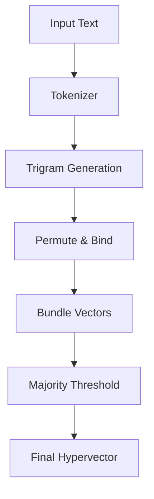

# 🧬 Hyperdimensional Computing (HDC)

The `spector-hdc` module is an experimental module providing the first purpose-built SIMD-native HDC library for the JVM. Module: `spector-hdc`, Issue: [#359](https://github.com/spectrayan/spector/issues/359), Status: Experimental.

!!! warning "Experimental"
    This module is under active development. APIs may change without notice.

## What is HDC?

Hyperdimensional Computing (HDC) uses high-dimensional binary vectors (typically 10,000+ bits). In this space, randomly chosen vectors are nearly orthogonal. 
The core operations include:
- **Bind**: XOR operation to combine vectors.
- **Bundle**: Majority vote to aggregate vectors.
- **Permute**: Cyclic shift to encode sequences.

These operations are based on the principles introduced by Pentti Kanerva, allowing robust representation and fast similarity computation.

## Quick Start

```java
import com.spectrayan.spector.hdc.*;

// Encode text to hypervectors
var encoder = new TextEncoder(10_000, 3);
Hypervector a = encoder.encode("the quick brown fox");
Hypervector b = encoder.encode("the fast brown fox");

// Compute similarity
double sim = HammingDistance.similarity(a, b);
System.out.println("Similarity: " + sim);

// High-level API
var hdc = new HdcSimilarity();
double score = hdc.similarity("hello world", "hello there");
```

## API Reference

| Class | Description |
|---|---|
| `Hypervector` | Represents a high-dimensional binary vector. |
| `TextEncoder` | Encodes text strings into `Hypervector` objects. |
| `HammingDistance` | Computes Hamming distance and similarity between vectors. |
| `HdcSimilarity` | High-level API for comparing sequences. |
| `VectorOperations` | Low-level operations like bind, bundle, permute. |
| `MemoryPool` | Manages off-heap allocation for hypervectors. |
| `BundleBuilder` | Assists in efficiently computing majority vote. |
| `ShiftRegister` | Helps in generating n-grams via permute operations. |

## SIMD Architecture

The module utilizes Java's Vector API for maximum throughput:

- **`LongVector.SPECIES_PREFERRED`**: Automatically selects the optimal vector shape for your hardware (e.g., AVX-512).
- **`VectorOperators.BIT_COUNT`**: Maps directly to hardware popcount instructions like `VPOPCNTDQ`.
- **Masked tail pattern**: Safely handles vector lengths that are not a multiple of the SIMD lane width without performance drops.
- **Off-heap Panama FFM**: Integrates with the Foreign Function & Memory API for efficient native memory management, bypassing JVM GC overhead.



## Core Operations

| Operation | Symbol | Implementation | Purpose |
|---|---|---|---|
| **Bind** | ⊗ | Bitwise XOR | Associates two hypervectors (e.g., Key-Value pair). |
| **Bundle** | ⊕ | Majority Vote (Add + Threshold) | Aggregates multiple hypervectors into a set. |
| **Permute** | ρ | Cyclic Bit Shift | Encodes order/sequence information. |

## Limitations

!!! info "Limitations"
    - **Lexical, not semantic**: HDC currently measures lexical overlap (like character n-grams) rather than deep semantic meaning.
    - **Experimental**: This is a labs feature and is not yet integrated into the core engine pipeline.

## Links

- **Issue tracker**: [#359: Hyperdimensional Computing Module](https://github.com/spectrayan/spector/issues/359)
- **Source code**: [`spector-hdc` module](https://github.com/spectrayan/spector/tree/main/spector-hdc)
