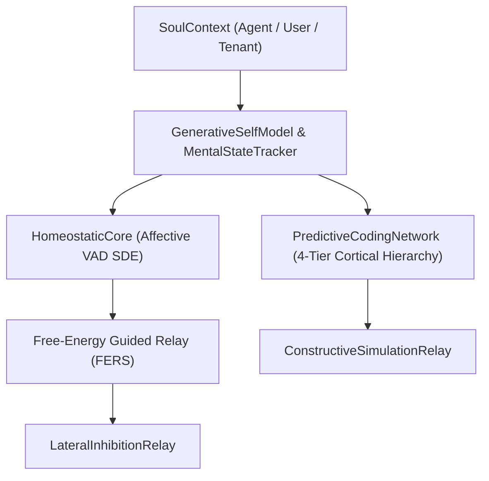

# Autonomous Identity & AISME

The **Artificial Intelligence Self-Model Engine (AISME)** provides Spector with autobiographical narrative identity, homeostatic affective tracking, and predictive coding capabilities across recall and consolidation pathways.

---

## 1. Core Architecture

AISME operates across 12 synchronized processing phases:

### 1.1 `SoulContext` Polymorphism
`SoulContext` provides immutable persona identities supporting:
- **Agent Soul:** Personality traits, core ethical constraints, and autobiographical narratives.
- **User Soul:** Interaction preferences, personalized memory salience, and custom ICNU parameters.
- **Tenant Soul:** Organizational isolation, RBAC governance flags, and compliance retention windows.

### 1.2 `GenerativeSelfModel` & `MentalStateTracker`
Tracks active beliefs, priors, and goals in embedding space. As new experiences are consolidated during sleep reflection, the autobiographical centroid adapts the generative prior mean with learning rate $\eta = 0.005$.

### 1.3 `HomeostaticCore`
Governs Valence-Arousal-Dominance (VAD) emotional dynamics via a continuous stochastic differential equation (SDE):

$$d\mathbf{v}_t = -\theta (\mathbf{v}_t - \mathbf{v}_{\text{baseline}}) dt + C \cdot \text{recall\_effect} + \sigma dW_t$$

Where mean-reverting drift ensures the persona returns to emotional baseline after intense events, while stochastic diffusion reflects spontaneous internal variance.

---

## 2. Relay Integration & Gating

AISME relays are registered in `RecallPathway` and `ReflectPathway`:

| Relay | Subsystem | Default Gated Condition |
|---|---|---|
| `FreeEnergyGuidedRelay` | Dynamic FERS scoring | `enableAisme && soulContext != null` |
| `ConstructiveSimulationRelay` | Recombination | `enableAisme && enableConstructiveSimulation` |
| `LateralInhibitionRelay` | Contradiction arbitration | `enableLateralInhibition` (default true) |
| `SoulDriftRefusionRelay` | Sleep restamping | `soulDriftRefusionEnabled` (default true) |
| `LifespanAdaptivePruningRelay` | Synaptic maintenance | `enableAisme` |

---

## 3. Engine Selection

Engine routing is governed by `spector.memory.recall.engine`:
- `auto`: Uses `PathwayEngine` when AISME, lateral inhibition, or dynamic regimes are active; falls back to legacy direct scan for zero-configuration throughput.
- `pathway`: Enforces full pipeline execution through `RecallPathway`.
- `direct`: Forces minimal direct scanner for microsecond benchmarks.
