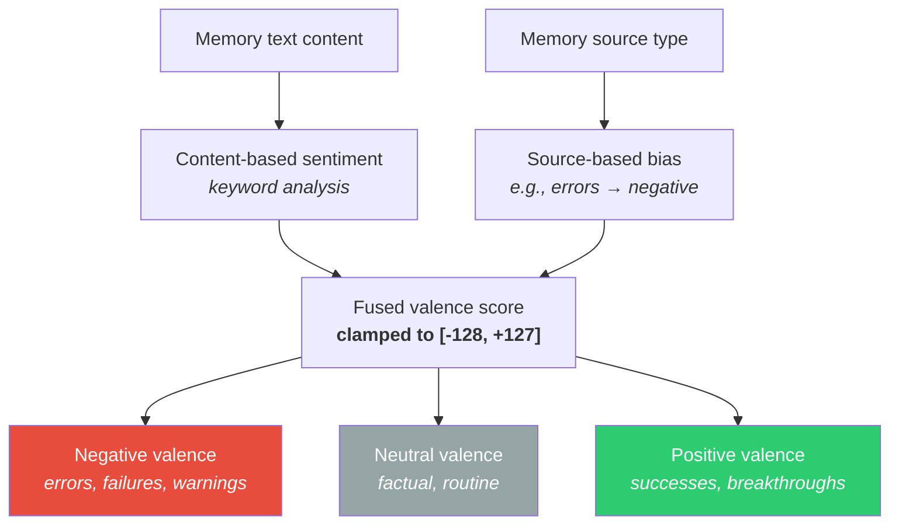
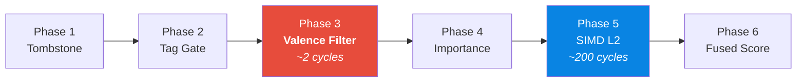

# 😱 Amygdala — Emotional Valence

> **Biological Analog**: The **amygdala** is the brain's emotional processor. It assigns emotional significance to experiences — fear, joy, anger, relief — which profoundly influences how memories are encoded, stored, and retrieved. Emotionally charged memories are remembered more vividly and last longer.

---

## The Concept

Every memory in Spector carries a **valence score** — a single byte (`-128` to `+127`) representing its emotional coloring:

| Range | Meaning | Examples |
|---|---|---|
| `-128` to `-50` | **Strongly negative** | Critical errors, data loss, security breaches |
| `-50` to `-10` | **Mildly negative** | Warnings, slow performance, minor bugs |
| `-10` to `+10` | **Neutral** | Factual information, routine operations |
| `+10` to `+50` | **Mildly positive** | Successful deployments, optimizations |
| `+50` to `+127` | **Strongly positive** | Major breakthroughs, user praise, goals achieved |

---

## How It Works

The valence tracker computes emotional coloring from two signals:



---

## Valence-Filtered Recall

The most powerful use of valence is in **recall filtering**. Agents can filter by emotional range to answer different types of questions:

### "What went wrong?" — Negative Memories

```
memory.recall("database connection",
    topK: 10,
    maxValence: -10,       // Only negative memories
    tags: ["database", "error"])
```

### "What worked well?" — Positive Memories

```
memory.recall("deployment strategy",
    topK: 5,
    minValence: +10,       // Only positive memories
    tags: ["deployment"])
```

### Full Emotional Range (Default)

By default, no valence filter is applied — the agent sees the full emotional spectrum. The valence still influences recall indirectly because the flashbulb policy pins emotionally intense memories at higher importance.

---

## Where It Fits in the Pipeline

Valence filtering happens at **Phase 3** of the 6-phase scorer — before the expensive SIMD vector math:



**Cost**: 2 CPU cycles — a single byte read and two comparisons. Records outside the valence range are eliminated before Phase 5's ~200-cycle SIMD computation.

---

## Storage

Valence is stored in the 64-byte synaptic header as a single signed byte:

```
Offset 30: [1B valence] — signed byte [-128 to +127]
```

This costs exactly **1 byte per memory** — negligible overhead for a powerful filtering dimension.

---

## Next Steps

- :material-link: [**Hebbian — Association Learning**](hebbian.md) — "neurons that fire together wire together"
- :material-head-cog: [**Dopamine — Surprise Detection**](dopamine.md) — auto-importance scoring
- :material-lightning-bolt: [**6-Phase Scoring Pipeline**](scoring-pipeline.md) — where valence filtering happens
