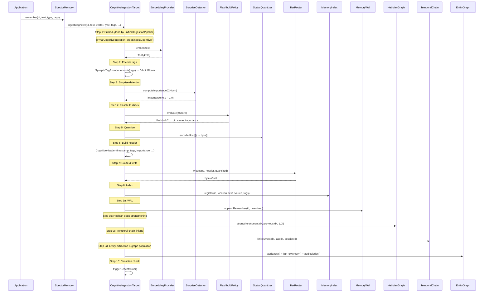
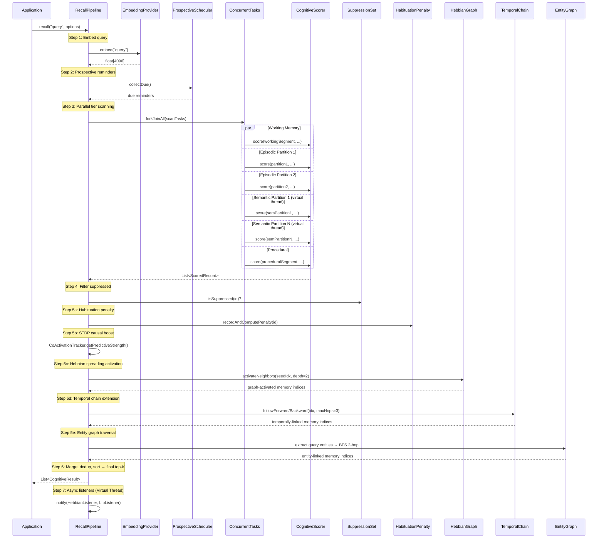
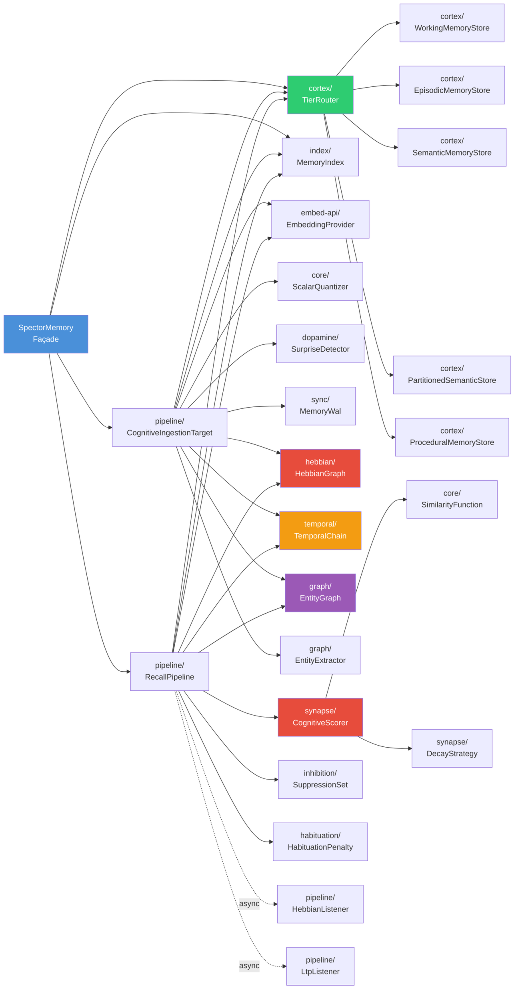

# System Architecture

Spector Memory is organized around a **biological metaphor** where each Java package corresponds to a brain region or cognitive mechanism. This isn't just naming — the architecture genuinely mirrors how biological memory systems interact.

---

## Extensibility

| Component | Extension point | What you can customize |
|---|---|---|
| `SpectorMemory` | Single entry point for all operations | Configure tiers, capacities, embedding providers |
| `TierStore` interface | Add new memory tiers | Implement the interface + register in `TierRouter` — no other changes needed |
| `AbstractTierStore` | Common tier lifecycle | Extend for new off-heap tier stores with Arena/segment management |
| `RecallListener` | Post-recall hooks | Add async listeners for co-activation tracking, logging, metrics |
| `CognitiveIngestionTarget` / `RecallPipeline` | Discrete processing steps | Each step is independently testable and replaceable |

---

## Data Flow: Ingestion

The ingestion pipeline is split across two layers:

- **`IngestionPipeline`** (in `spector-ingestion`) — handles step 1 (embed) and chunking for large documents
- **`CognitiveIngestionTarget`** (in `spector-memory`) — handles steps 2–9 (synaptic encoding → WAL)

> [!NOTE]
> When ingestion comes through the unified `IngestionPipeline` (e.g., file ingestion), embedding (step 1) is handled by the pipeline itself. `CognitiveIngestionTarget.ingest()` receives a pre-embedded vector and executes steps 2–9. When called via `SpectorMemory.remember()`, `CognitiveIngestionTarget.ingestCognitive()` handles embedding internally.

> [!NOTE]
> Steps 9b–9d are **gracefully degrading**: if any graph component is null (not configured) or throws, the step is skipped with a `log.warn()` and ingestion continues normally.

---

## Data Flow: Recall

The recall pipeline executes parallel tier scans using Virtual Threads:

---

## Package Dependency Graph

---

## The 64-Byte Cognitive Record

Every memory is stored as a fixed-size binary record in off-heap memory. The synaptic header occupies exactly **one CPU cache line** (64 bytes) for optimal sequential scan performance:

### Header Diagram

{ width="100%" }
{ width="100%" }

### Header Layout (64 bytes — 1× Cache Line)

| Offset | Field | Size | Type | Description |
|:---:|:---|:---:|:---:|:---|
| 0 | `header_version` | 1B | byte | Always `1` |
| 1 | `flags` | 1B | byte | Tombstone, memory type, consolidated, pinned, resolved |
| 2 | `valence` | 1B | signed byte | Emotional coloring (−128 to +127) |
| 3 | `arousal` | 1B | unsigned byte | Emotional intensity (0–255) |
| 4 | `importance` | 4B | float | Base importance score (0.05–10.0) |
| 8 | `timestamp_ms` | 8B | long | Unix epoch ms when memory was formed |
| 16 | `agent_recall_count` | 4B | int | LTP reinforcement counter (agent-explicit) |
| 20 | `exact_norm` | 4B | float | L2 norm of original float vector |
| 24 | `synaptic_tags` | 8B | long | 64-bit inline Bloom filter |
| 32 | `centroid_id` | 2B | short | IVF partition routing ID |
| 34 | `_pad0` | 2B | — | Alignment padding |
| 36 | `storage_strength` | 4B | float | Two-Factor Memory S(t) (Bjork & Bjork) |
| 40 | `spector_recall_cnt` | 4B | int | Auto-LTP passive recall counter |
| 44 | `_reserved_f1` | 4B | float | Reserved for future use |
| 48 | `last_auto_ltp` | 8B | long | Last auto-LTP timestamp |
| 56 | `_reserved_l1` | 8B | long | Reserved (future 128-bit tag upper half) |
| | | **64B** | | **= 1× cache line, 2× AVX2** |

!!! tip "Why 64 bytes?"
    **Cache-line alignment** eliminates split-line reads during sequential scans. When the scorer iterates over 1M records, each header read hits exactly one cache line — no partial line loads, no false sharing. The 16 bytes of reserved space prevent future migration costs when new fields are added.

After the header, the quantized vector payload follows immediately:

| Component | Size | Notes |
|:---|:---:|:---|
| Synaptic Header | 64B | Fixed, cache-line aligned |
| Quantized Vector | N bytes | INT8 values (1 byte per dimension) |
| **Total stride** | **64 + N** | At 768-dim: **832 bytes/record** |

---

## Next Steps

- :material-lightning-bolt: [**6-Phase Scoring Pipeline**](scoring-pipeline.md) — the SIMD hot-loop that makes it fast
- :material-share-variant: [**3-Layer Cognitive Graph**](hebbian.md) — Hebbian, Entity, and Temporal graphs
- :material-brain: [**Cortex — Tier Stores**](cortex.md) — the 4-tier memory architecture
- :material-memory: [**Off-Heap Panama Design**](panama-design.md) — zero-GC binary layout
