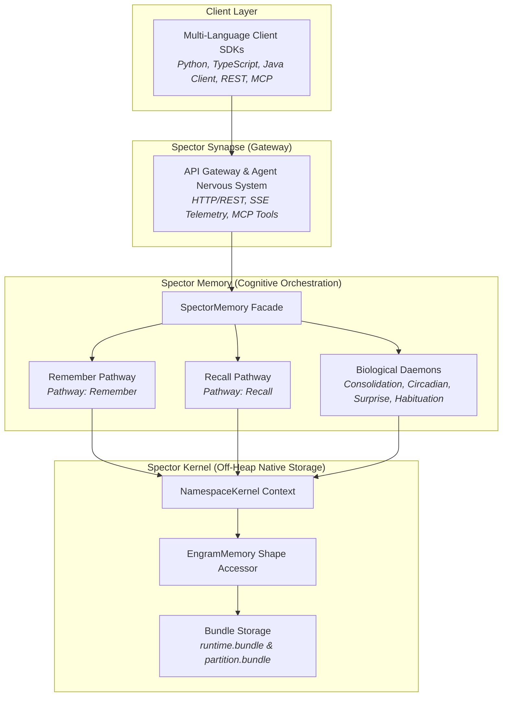
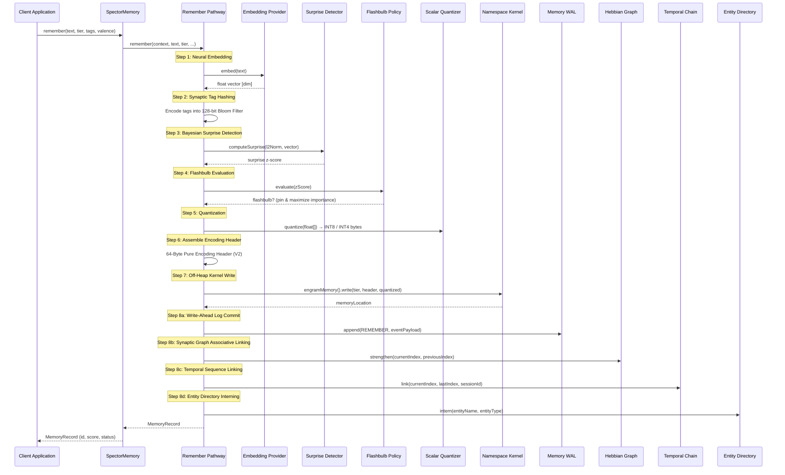
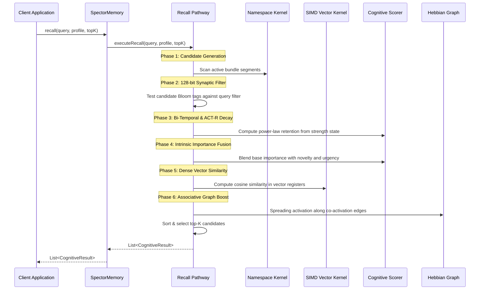

# 🏛️ System Architecture & Data Flow

> **Biologically-inspired cognitive architecture translating computational neuroscience mechanisms into zero-GC, low-latency off-heap systems.**

---

## Architectural Overview

Spector Memory organizes cognitive capabilities around biological neuroscience mechanisms:
- **Hippocampal Consolidation**: Sleep replay and episodic-to-semantic memory transfer.
- **Prefrontal Working Memory**: High-speed circular workspace for active reasoning.
- **Basal Ganglia**: Procedural memory for learned operational rules.
- **Hebbian Synaptic Plasticity**: Long-Term Potentiation (LTP) and co-activation graphs.
- **Dopaminergic Surprise**: Bayesian surprise detection triggering flashbulb memory consolidation.
- **Amygdala Valence**: Affective coloring influencing retention and decay rates.


```mermaid
graph TB
    subgraph "Client Layer"
        SDK["Multi-Language Client SDKs<br/><i>Python, TypeScript, Java Client, REST, MCP</i>"]
    end

    subgraph "Spector Synapse (Gateway)"
        SYN["API Gateway & Agent Nervous System<br/><i>HTTP/REST, SSE Telemetry, MCP Tools</i>"]
    end

    subgraph "Spector Memory (Cognitive Orchestration)"
        SM["SpectorMemory Facade"]
        REM["Remember Pathway<br/><i>Pathway: Remember</i>"]
        REC["Recall Pathway<br/><i>Pathway: Recall</i>"]
        DAE["Biological Daemons<br/><i>Consolidation, Circadian, Surprise, Habituation</i>"]
    end

    subgraph "Spector Kernel (Off-Heap Native Storage)"
        NK["NamespaceKernel Context"]
        ENG["EngramMemory Shape Accessor"]
        BUN["Bundle Storage<br/><i>runtime.bundle & partition.bundle</i>"]
    end

    SDK --> SYN
    SYN --> SM
    SM --> REM
    SM --> REC
    SM --> DAE
    REM --> NK
    REC --> NK
    DAE --> NK
    NK --> ENG
    ENG --> BUN
```

---

## Pathway: Remember

The Remember Pathway transforms unstructured text and metadata into an off-heap engram record through a sequence of cognitive stages:


```mermaid
sequenceDiagram
    participant App as Client Application
    participant SM as SpectorMemory
    participant RP as Remember Pathway
    participant EP as Embedding Provider
    participant SD as Surprise Detector
    participant FP as Flashbulb Policy
    participant SQ as Scalar Quantizer
    participant NK as Namespace Kernel
    participant WAL as Memory WAL
    participant HG as Hebbian Graph
    participant TC as Temporal Chain
    participant ED as Entity Directory

    App->>SM: remember(text, tier, tags, valence)
    SM->>RP: remember(context, text, tier, ...)
    
    Note over RP: Step 1: Neural Embedding
    RP->>EP: embed(text)
    EP-->>RP: float vector [dim]
    
    Note over RP: Step 2: Synaptic Tag Hashing
    RP->>RP: Encode tags into 128-bit Bloom Filter
    
    Note over RP: Step 3: Bayesian Surprise Detection
    RP->>SD: computeSurprise(l2Norm, vector)
    SD-->>RP: surprise z-score
    
    Note over RP: Step 4: Flashbulb Evaluation
    RP->>FP: evaluate(zScore)
    FP-->>RP: flashbulb? (pin & maximize importance)
    
    Note over RP: Step 5: Quantization
    RP->>SQ: quantize(float[]) → INT8 / INT4 bytes
    
    Note over RP: Step 6: Assemble Encoding Header
    RP->>RP: 64-Byte Pure Encoding Header (V2)
    
    Note over RP: Step 7: Off-Heap Kernel Write
    RP->>NK: engramMemory().write(tier, header, quantized)
    NK-->>RP: memoryLocation
    
    Note over RP: Step 8a: Write-Ahead Log Commit
    RP->>WAL: append(REMEMBER, eventPayload)
    
    Note over RP: Step 8b: Synaptic Graph Associative Linking
    RP->>HG: strengthen(currentIndex, previousIndex)
    
    Note over RP: Step 8c: Temporal Sequence Linking
    RP->>TC: link(currentIndex, lastIndex, sessionId)
    
    Note over RP: Step 8d: Entity Directory Interning
    RP->>ED: intern(entityName, entityType)
    
    RP-->>SM: MemoryRecord
    SM-->>App: MemoryRecord (id, score, status)
```

---

## Pathway: Recall

When an agent queries memory, Spector executes the associative **Recall Pathway**:


```mermaid
sequenceDiagram
    participant App as Client Application
    participant SM as SpectorMemory
    participant RP as Recall Pathway
    participant NK as Namespace Kernel
    participant SIMD as SIMD Vector Kernel
    participant SC as Cognitive Scorer
    participant HG as Hebbian Graph

    App->>SM: recall(query, profile, topK)
    SM->>RP: executeRecall(query, profile, topK)
    
    Note over RP: Phase 1: Candidate Generation
    RP->>NK: Scan active bundle segments
    
    Note over RP: Phase 2: 128-bit Synaptic Filter
    RP->>RP: Test candidate Bloom tags against query filter
    
    Note over RP: Phase 3: Bi-Temporal & ACT-R Decay
    RP->>SC: Compute power-law retention from strength state
    
    Note over RP: Phase 4: Intrinsic Importance Fusion
    RP->>SC: Blend base importance with novelty and urgency
    
    Note over RP: Phase 5: Dense Vector Similarity
    RP->>SIMD: Compute cosine similarity in vector registers
    
    Note over RP: Phase 6: Associative Graph Boost
    RP->>HG: Spreading activation along co-activation edges
    
    RP->>RP: Sort & select top-K candidates
    RP-->>SM: List<CognitiveResult>
    SM-->>App: List<CognitiveResult>
```

---

## Pure Encoding Header & Strength Separation

To prevent CPU cache-line false sharing during parallel multi-threaded scans, Spector separates immutable creation metadata from mutable recall telemetry:

```
Engram Storage Layout:
+-------------------------------------------------------------+-----------------------+
| Pure Encoding Header (64 Bytes, Cache-Line Aligned)         | Quantized Vector Byte |
| - Version: 2                                                | Slices (INT8/INT4)    |
| - Valence, Arousal, Base Importance, Formation Timestamp    |                       |
| - 128-Bit Synaptic Bloom Filter (Offsets 0x18 - 0x27)       |                       |
+-------------------------------------------------------------+-----------------------+

Strength Region (Independent 96-Byte Slices, RegionId.STRENGTH):
+-------------------------------------------------------------------------------------+
| Strength State (96 Bytes, 32-Byte Aligned)                                          |
| - Bjork Storage Strength S(t) in [1.0, 5.0]                                         |
| - ACT-R 8-Slot Relative Timestamp History Ring Buffer                                |
| - Agent Reinforcement Counter vs. Passive Retrieval Counter                         |
| - Auto-LTP Cooldown Timestamps                                                      |
+-------------------------------------------------------------------------------------+
```

For complete byte-level specifications, see [Binary Record Specifications & Synaptic Header](../kernel/layouts.md).

---

## Client SDK Integration

Client applications connect to the cognitive architecture through our multi-language client SDKs:

=== "Python"

    ```python
    from spector_client import SpectorClient, MemoryTier

    client = SpectorClient.builder().with_rest("http://localhost:7070").build()

    # Store memory
    client.memory.remember(
        text="Agent deployment target is AWS EKS us-west-2",
        tier=MemoryTier.SEMANTIC,
        tags=["infrastructure", "kubernetes"],
        interest=0.85,
    )

    # Associative Recall
    memories = client.memory.recall("Where is the agent deployed?", top_k=3)
    for mem in memories:
        print(f"[{mem.id}] score={mem.score:.3f} | {mem.text}")
    ```

=== "TypeScript"

    ```typescript
    import { SpectorClient, MemoryTier } from '@spectrayan/spector-client';

    const client = SpectorClient.createDefault('http://localhost:7070');

    // Store memory
    await client.memory.remember({
      text: 'Agent deployment target is AWS EKS us-west-2',
      tier: MemoryTier.SEMANTIC,
      tags: ['infrastructure', 'kubernetes'],
      interest: 0.85,
    });

    // Associative Recall
    const memories = await client.memory.recall('Where is the agent deployed?', {
      topK: 3,
    });
    for (const mem of memories) {
      console.log(`[${mem.id}] score=${mem.score} | ${mem.text}`);
    }
    ```

=== "Java"

    ```java
    import com.spectrayan.spector.client.SpectorClient;
    import java.util.List;

    try (var client = SpectorClient.builder().baseUri("http://localhost:7070").build()) {
        // Store memory
        var record = client.memory().remember(
            "Agent deployment target is AWS EKS us-west-2",
            "SEMANTIC",
            List.of("infrastructure", "kubernetes")
        );

        // Associative Recall
        var memories = client.memory().recall("Where is the agent deployed?", 3);
        for (var mem : memories) {
            System.out.printf("[%s] score=%.3f | %s%n", mem.getId(), mem.getScore(), mem.getText());
        }
    }
    ```

=== "cURL / REST"

    ```bash
    # Store memory
    curl -X POST http://localhost:7070/api/v1/memory/remember \
      -H "Content-Type: application/json" \
      -d '{
        "text": "Agent deployment target is AWS EKS us-west-2",
        "tier": "SEMANTIC",
        "tags": "infrastructure,kubernetes",
        "interest": 0.85
      }'

    # Recall memory
    curl -X POST http://localhost:7070/api/v1/memory/recall \
      -H "Content-Type: application/json" \
      -d '{
        "query": "Where is the agent deployed?",
        "topK": 3
      }'
    ```

---

## Next Steps

- :material-lightning-bolt: [**The 6-Phase Scoring Pipeline**](scoring-pipeline.md) — hot-loop scoring architecture
- :material-brain: [**Cortex — 4-Tier Memory**](cortex.md) — Working, Episodic, Semantic, and Procedural tiers
- :material-share-variant: [**Hebbian Associative Graph**](hebbian.md) — 4-layer cognitive graph architecture
- :material-memory: [**Memory Kernel**](../kernel/index.md) — sealed off-heap storage and bundle containers
