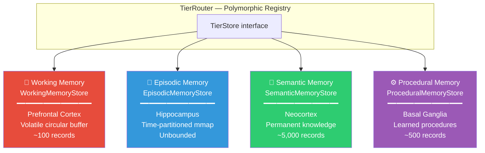
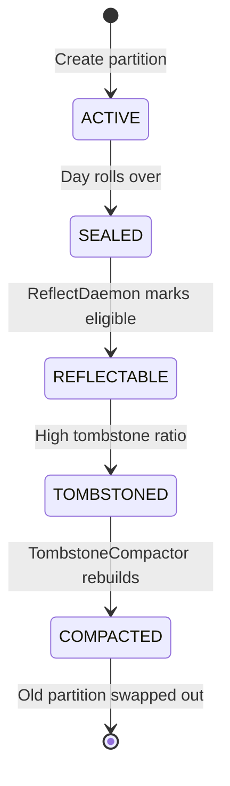

# 🧠 Cortex — Tier Stores

> **Biological Analog**: The **Cerebral Cortex** — the outer layer of the brain responsible for higher-order cognitive functions. Different cortical regions specialize in different types of memory.

---

## The 4-Tier Architecture

Human memory is not a single system. Cognitive science identifies distinct memory systems with different characteristics, durations, and purposes. Spector mirrors this with four tier stores:



---

## Polymorphic Tier Routing

All four stores implement a common `TierStore` interface. The `TierRouter` dispatches operations via an `EnumMap<MemoryType, TierStore>` — zero switch statements, fully polymorphic.

> Adding a new tier (e.g., `FLASH` for ultra-fast scratch memory) requires only: (1) implement `TierStore`, (2) register in `TierRouter`. No changes needed in `SpectorMemory`, `RecallPipeline`, or `CognitiveIngestionTarget`.

---

## 🧪 Working Memory (Prefrontal Cortex)

**Biological Analog**: The **Prefrontal Cortex** maintains a limited workspace for active processing. It holds ~7±2 items in biological systems.

| Property | Value |
|---|---|
| Storage | Volatile off-heap segment |
| Capacity | Configurable (default: 100) |
| Eviction | Circular buffer — oldest entries overwritten |
| Persistence | **None** — lost on JVM shutdown |
| Use case | Current task context, recent conversation |

Working memory operates as a circular buffer: when the buffer is full, the oldest entry is overwritten by the newest. This mirrors the human prefrontal cortex where only the most recent context is actively maintained.

**Special capability**: Synaptic tag search without vector math — Working Memory supports finding memories by tag alone using the 64-bit Bloom filter field, useful for fast context lookups without embedding the query.

---

## 📝 Episodic Memory (Hippocampus)

**Biological Analog**: The **Hippocampus** encodes autobiographical events as time-ordered traces. New events are appended rapidly (one-trial learning), and during sleep the hippocampus replays sequences for consolidation into cortical memory.

| Property | Value |
|---|---|
| Storage | Memory-mapped files (`FileChannel.map()`) |
| Capacity | Unbounded (1 partition per day, each up to 10,000 records) |
| Eviction | Tombstone + compaction |
| Persistence | **Full** — survives JVM restarts |
| Use case | "What error did we debug yesterday?", "What did the user say last week?" |

### Partition Lifecycle

Each episodic partition is a memory-mapped file with a 64-byte metadata header:

```
┌─── Partition File ─────────────────────────────────────────┐
│ [64B Metadata Header]                                       │
│   ├── 4B magic (0x45504943 = "EPIC")                       │
│   ├── 4B version (1)                                        │
│   ├── 4B count (live records)                               │
│   ├── 4B tombstoneCount                                     │
│   ├── 4B capacity                                           │
│   ├── 4B state (ACTIVE/SEALED/REFLECTABLE/TOMBSTONED/...)  │
│   ├── 4B stride                                             │
│   └── 36B reserved                                          │
├── [Record 0: 64B header + NB vector] ──────────────────────┤
├── [Record 1: 64B header + NB vector] ──────────────────────┤
│   ...                                                       │
└── [Record N-1]  ───────────────────────────────────────────┘
```

**Partition state machine**:



---

## 🧬 Semantic Memory (Neocortex)

**Biological Analog**: The **Neocortex** stores distilled, permanent world knowledge — facts, concepts, and generalized rules extracted from repeated experience.

### Partitioned Mode (default for DISK persistence)

| Property | Value |
|---|---|
| Storage | Rolling `semantic-NNN.mem` files |
| Capacity per partition | Configurable (default: 10,000 records) |
| Total capacity | Unbounded (new partitions roll automatically) |
| Eviction | Tombstone + per-partition compaction |
| Persistence | **Full** — mmap-backed files survive restarts |
| Recall | Parallel per-partition scan via virtual threads |
| Use case | "The user prefers dark mode", "Java uses garbage collection" |

```
.spector/memory/semantic/
  semantic-000.mem     ← partition 0 (10K records, oldest)
  semantic-001.mem     ← partition 1 (created when 0 fills up)
  semantic-002.mem     ← partition 2 (active — accepts writes)
```

**Concurrency model**:

- **Reads**: `CopyOnWriteArrayList` provides lock-free snapshot iteration. Each partition is searched independently on its own virtual thread
- **Writes**: `ReadWriteLock` — read lock for normal appends, write lock only when rolling to a new partition
- **Compaction**: Per-partition rebuild. Other partitions remain readable during compaction

**Creation**: Semantic memories are created either:

1. **Directly** by the user (`MemoryType.SEMANTIC`)
2. **By consolidation** — the `ReflectDaemon` clusters similar episodic memories during "sleep" and promotes the cluster centroid to semantic memory

**Migration**: Existing single-file stores are automatically migrated to the partitioned format on first startup.

### Single-File Mode (in-memory)

| Property | Value |
|---|---|
| Storage | Fixed-capacity off-heap slab |
| Capacity | Configurable (default: 5,000) |
| Use case | Small deployments or in-memory mode |

---

## ⚙️ Procedural Memory (Basal Ganglia)

**Biological Analog**: The **Basal Ganglia** stores learned motor programs and habitual behaviors — "how to ride a bicycle" type knowledge that operates below conscious awareness.

| Property | Value |
|---|---|
| Storage | Linear off-heap segment |
| Capacity | Configurable (default: 500) |
| Eviction | None (append-only) |
| Persistence | Via WAL replay |
| Use case | "Always use exponential backoff", "Format SQL with uppercase keywords" |

Procedural memories represent **rules and patterns** that the agent has internalized. They are typically higher-importance, persistent, and rarely forgotten.

---

## Next Steps

- :material-sleep: [**Hippocampus — Sleep Consolidation**](hippocampus.md) — how episodic memories are consolidated into semantic knowledge
- :material-flash: [**Synapse — Tags & Scoring**](synapse.md) — the 64-byte header and Bloom filter
- :material-lightning-bolt: [**6-Phase Scoring Pipeline**](scoring-pipeline.md) — the SIMD hot-loop
