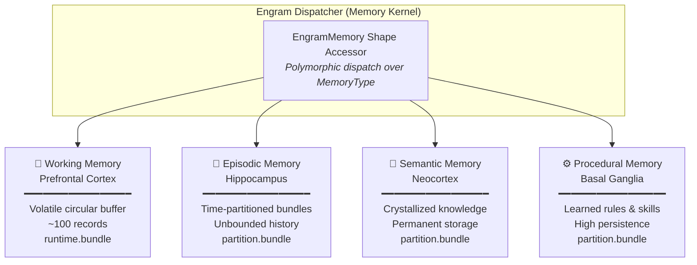
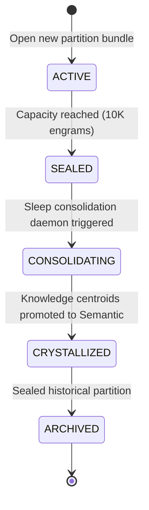

# 🧠 Cortex — 4-Tier Memory Architecture

> **Biological Analog**: The **Cerebral Cortex** — the outer layer of the brain responsible for higher-order cognitive functions. Different cortical regions specialize in distinct memory domains, durations, and consolidation dynamics.

---

## The 4-Tier Architecture

Human memory is not an undifferentiated flat vector store. Cognitive neuroscience identifies distinct memory systems with different characteristics, durations, and consolidation dynamics. Spector mirrors this with four biological memory tiers backed by the off-heap Memory Kernel:


```mermaid
graph TB
    subgraph "Engram Dispatcher (Memory Kernel)"
        direction TB
        DISP["EngramMemory Shape Accessor<br/><i>Polymorphic dispatch over MemoryType</i>"]
    end
    
    DISP --> WM["🧪 Working Memory<br/>Prefrontal Cortex<br/>━━━━━━━━━━━━━━━━━<br/>Volatile circular buffer<br/>~100 records<br/>runtime.bundle"]
    DISP --> EM["📝 Episodic Memory<br/>Hippocampus<br/>━━━━━━━━━━━━━━━━━<br/>Time-partitioned bundles<br/>Unbounded history<br/>partition.bundle"]
    DISP --> SE["🧬 Semantic Memory<br/>Neocortex<br/>━━━━━━━━━━━━━━━━━<br/>Crystallized knowledge<br/>Permanent storage<br/>partition.bundle"]
    DISP --> PR["⚙️ Procedural Memory<br/>Basal Ganglia<br/>━━━━━━━━━━━━━━━━━<br/>Learned rules & skills<br/>High persistence<br/>partition.bundle"]
```

---

## Tier Dispatch & Kernel Backing

All four memory stores are backed directly by the off-heap `spector-kernel`:
- **Working Memory**: Hosted in `runtime.bundle` as a contiguous circular buffer for active working context.
- **Episodic, Semantic, and Procedural Memories**: Hosted in sequential partition bundles (`partitions/{seq}/partition.bundle`) with dedicated 96-byte strength regions (`RegionId.STRENGTH`).
- **Engram Storage**: All tiers utilize the unified 64-byte pure encoding header with 128-bit Synaptic Bloom tags for fast candidate pre-screening.

---

## 🧪 Working Memory (Prefrontal Cortex)

**Biological Analog**: The **Prefrontal Cortex** maintains a limited workspace for active processing and immediate task execution. It holds transient context in biological systems ($7 \pm 2$ chunks).

| Property | Value |
|:---|:---|
| **Physical Storage** | Native memory buffer within `runtime.bundle` |
| **Capacity** | Configurable (default: 100 engrams) |
| **Eviction Policy** | Circular buffer — oldest entries automatically overwritten |
| **Persistence** | Session-scoped volatile workspace |
| **Primary Use Cases** | Active conversation context, current multi-step task parameters, immediate tool results |

Working memory operates as a high-speed circular buffer: when the allocated capacity is reached, new memories overwrite the oldest records. This provides low latency for active dialogue without bloating long-term indexes.

**Synaptic Tag Pre-Screening**: Working Memory supports sub-microsecond candidate filtering via the 128-bit Synaptic Bloom filter, enabling instant tag lookups prior to dense vector calculation.

---

## 📝 Episodic Memory (Hippocampus)

**Biological Analog**: The **Hippocampus** encodes autobiographical events as time-ordered traces. Events are appended rapidly (one-trial learning), and during consolidation phases, the hippocampus replays sequences for transfer into permanent cortical memory.

| Property | Value |
|:---|:---|
| **Physical Storage** | Memory-mapped partition bundles (`partitions/{seq}/partition.bundle`) |
| **Capacity** | Unbounded across sequential partition chunks (default: 10,000 engrams per partition) |
| **Eviction Policy** | Logical tombstoning with background compaction |
| **Persistence** | Full — durable across restarts via Write-Ahead Log (WAL) |
| **Primary Use Cases** | Temporal history ("What occurred in yesterday's session?", "How did the user resolve this error last week?") |

### Partition Lifecycle

Episodic memory partitions progress through a structured lifecycle:


```mermaid
stateDiagram-v2
    [*] --> ACTIVE: Open new partition bundle
    ACTIVE --> SEALED: Capacity reached (10K engrams)
    SEALED --> CONSOLIDATING: Sleep consolidation daemon triggered
    CONSOLIDATING --> CRYSTALLIZED: Knowledge centroids promoted to Semantic
    CRYSTALLIZED --> ARCHIVED: Sealed historical partition
    ARCHIVED --> [*]
```

1. **Active**: The current partition accepts sequential appends via the Write-Ahead Log.
2. **Sealed**: When the partition capacity threshold is reached, it is sealed as read-only, and the next partition is initialized.
3. **Consolidating**: The background consolidation daemon replays related episodic events, identifying common patterns.
4. **Crystallized**: Abstracted centroids are promoted to the permanent Semantic tier.

---

## 🧬 Semantic Memory (Neocortex)

**Biological Analog**: The **Neocortex** stores distilled, permanent world knowledge — generalized concepts, domain facts, and rules extracted from repeated experience.

| Property | Value |
|:---|:---|
| **Physical Storage** | Partition bundles (`partition.bundle`) |
| **Capacity** | Unbounded (scales across partition bundles) |
| **Eviction Policy** | Tombstoning with capacity-aware growth |
| **Persistence** | Full — persistent and durable |
| **Recall Method** | Parallel SIMD vector scan and hybrid keyword retrieval |
| **Primary Use Cases** | "User prefers dark mode", "Enterprise database port is 5432", "OAuth tokens expire in 3600 seconds" |

### Semantic Memory Creation

Semantic memories enter the system through two primary pathways:
1. **Remember Pathway**: Client applications directly store verified facts into the semantic tier (`tier: SEMANTIC`).
2. **Reflect Pathway (Sleep Consolidation)**: The hippocampal sleep consolidation engine analyzes clusters of repeated episodic memories, synthesizes generalized summaries, and promotes them to permanent semantic engrams.

---

## ⚙️ Procedural Memory (Basal Ganglia)

**Biological Analog**: The **Basal Ganglia** stores learned behavioral patterns, motor routines, and procedural protocols — operational skills that execute automatically.

| Property | Value |
|:---|:---|
| **Physical Storage** | Dedicated procedural region within `partition.bundle` |
| **Capacity** | Configurable (default: 5,000 engrams) |
| **Eviction Policy** | High persistence; protected from aggressive decay |
| **Persistence** | Full — durable across restarts |
| **Primary Use Cases** | "Always apply exponential backoff on HTTP 429", "Format generated code with 4-space indentation" |

Procedural memories represent actionable operational rules. Because procedural rules guide agent decisions under uncertainty, they possess higher baseline importance scores and resist temporal decay.

---

## Client SDK Usage

Client applications can target specific tiers or allow cognitive routing:

=== "Python"

    ```python
    from spector_client import SpectorClient, MemoryTier

    client = SpectorClient.builder().with_rest("http://localhost:7070").build()

    # Store in Semantic Memory
    client.memory.remember(
        text="The client application utilizes OAuth 2.0 PKCE authentication",
        tier=MemoryTier.SEMANTIC,
        tags=["auth", "security"],
        interest=0.9,
    )
    ```

=== "TypeScript"

    ```typescript
    import { SpectorClient, MemoryTier } from '@spectrayan/spector-client';

    const client = SpectorClient.createDefault('http://localhost:7070');

    // Store in Semantic Memory
    await client.memory.remember({
      text: 'The client application utilizes OAuth 2.0 PKCE authentication',
      tier: MemoryTier.SEMANTIC,
      tags: ['auth', 'security'],
      interest: 0.9,
    });
    ```

=== "Java"

    ```java
    import com.spectrayan.spector.client.SpectorClient;
    import java.util.List;

    try (var client = SpectorClient.builder().baseUri("http://localhost:7070").build()) {
        client.memory().remember(
            "The client application utilizes OAuth 2.0 PKCE authentication",
            "SEMANTIC",
            List.of("auth", "security")
        );
    }
    ```

=== "cURL / REST"

    ```bash
    curl -X POST http://localhost:7070/api/v1/memory/remember \
      -H "Content-Type: application/json" \
      -d '{
        "text": "The client application utilizes OAuth 2.0 PKCE authentication",
        "tier": "SEMANTIC",
        "tags": "auth,security",
        "interest": 0.9
      }'
    ```

---

## Next Steps

- :material-lightning-bolt: [**The 6-Phase Scoring Pipeline**](scoring-pipeline.md) — associative multi-tier retrieval
- :material-tag: [**Synapse — Tags & Scoring**](synapse.md) — 128-bit Bloom filters and affective tagging
- :material-sleep: [**Hippocampus — Sleep Consolidation**](hippocampus.md) — episodic to semantic transfer
- :material-memory: [**Memory Kernel**](../kernel/index.md) — off-heap storage and bundle containers
