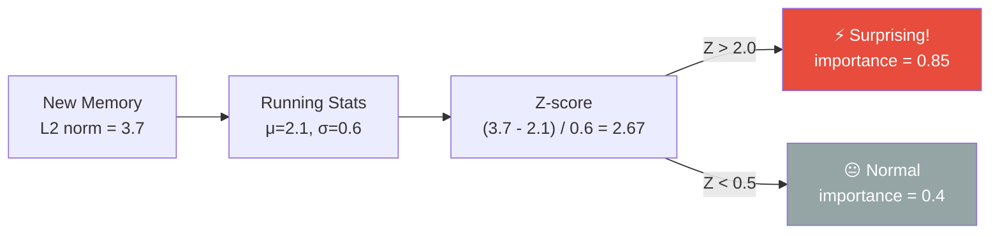
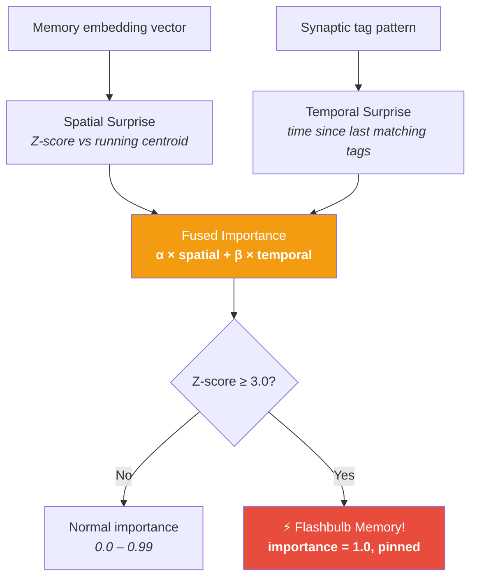
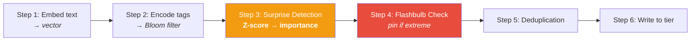

# ⚡ Dopamine — Surprise Detection

> **Biological Analog**: The **dopaminergic system** signals prediction error — the difference between what the brain expected and what actually happened. When a stimulus is surprising (high prediction error), dopamine release strengthens memory encoding. This is why we vividly remember surprising events (flashbulb memories) but quickly forget routine ones.

---

## The Problem

Without surprise detection, an AI agent treats all memories as equally important. A routine "code compiled successfully" gets the same importance as "production database corrupted." This leads to:

- Important memories drowning in noise
- Critical errors being forgotten as quickly as routine events
- No adaptive importance — every memory starts at the same baseline

---

## How It Works

The surprise detector maintains a running statistical model of "normal" memory vectors using **Welford's online algorithm** (numerically stable one-pass mean/variance). When a new memory arrives, its L2 distance from the running centroid is converted to a Z-score:

### Dual Importance Formula

Importance is computed from two independent surprise dimensions:

$$\text{importance} = \alpha \cdot \sigma\left(\frac{x - \mu}{\sigma}\right) + \beta \cdot \text{temporalNovelty}$$

Where $\sigma()$ is the sigmoid function, $\alpha = 0.6$, $\beta = 0.4$.

| Dimension | Signal | Weight |
|---|---|---|
| **Spatial surprise** | Z-score of L2 norm vs. running statistics | 0.6 (default) |
| **Temporal surprise** | Time since last memory with matching tags | 0.4 (default) |

!!! tip "Why Welford's Algorithm?"
    Naive variance computation (`Σ(x-μ)²/n`) requires two passes or suffers from catastrophic cancellation with floating-point arithmetic. Welford's algorithm maintains numerical stability with a single pass — critical for an always-running system that processes millions of memories over its lifetime.

---

## Flashbulb Memory — Extreme Surprise

**Biological analog**: **Flashbulb memories** are vivid, long-lasting memories formed during moments of extreme surprise or emotional intensity (e.g., hearing about a major world event). The amygdala signals the hippocampus to strengthen encoding.

When the Z-score exceeds a threshold (default: 3.0), the flashbulb policy activates:

**Effects**:

- Importance is set to **1.0** (maximum)
- The **pinned flag** is set — this memory is exempt from temporal decay in Phase 4 of the scoring pipeline
- The memory will persist indefinitely unless explicitly `forget()`'d

!!! example "Use Case"
    An AI coding agent encounters `OutOfMemoryError` for the first time (Z-score: 4.2). This triggers flashbulb encoding — the error memory is pinned at maximum importance and will always surface when the agent encounters memory-related issues.

---

## Where It Fits in the Pipeline

Surprise detection happens at **Step 3** of the ingestion pipeline:

---

## Next Steps

- :material-emoticon: [**Amygdala — Emotional Valence**](amygdala.md) — emotional coloring of memories
- :material-flash: [**Synapse — Tags & Scoring**](synapse.md) — the 64-byte header
- :material-sleep: [**Hippocampus — Sleep Consolidation**](hippocampus.md) — what happens to important memories
