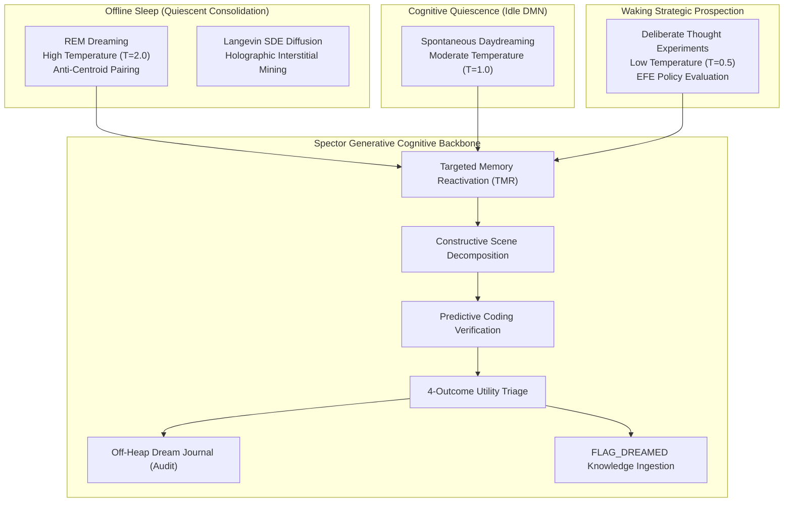
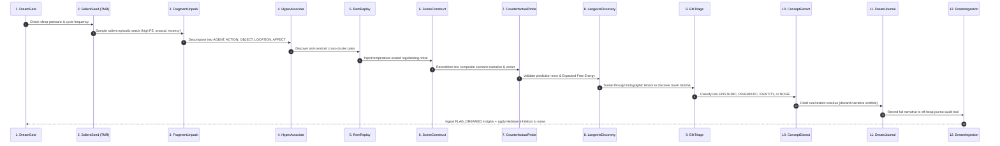
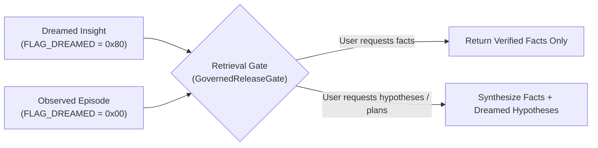

# Generative Dreaming & Thought Experiments

Memory in natural biological intelligence is not a passive recording device — it is an active **generative construction engine**. The human brain spends a third of its lifecycle in sleep states, executing offline memory replay, generative recombination, and stochastic exploration to prevent overfitting and extract latent cross-domain insights.

Spector's **DreamPathway** is the 7th canonical cognitive pathway, providing AI agents with autonomous **dreaming, counterfactual reasoning, and deliberate thought experimentation**.



---

## 1. Biological Foundations

The DreamPathway unifies four landmark discoveries across neuroscience and computational cognitive science:

### A. The Overfitted Brain Hypothesis (Hoel, 2021)
Dreams serve as biological regularization. By injecting structured, temperature-modulated noise into compressed episodic replays ($\sigma_{\text{dream}}$), dreaming prevents an agent's cognitive models from overfitting to daily observations and enables cross-context generalization.

$$\mathbf{v}_{\text{dream}} = \mathbf{v}_{\text{seed}} + \boldsymbol{\epsilon}, \quad \boldsymbol{\epsilon} \sim \mathcal{N}\left(0, \sigma^2_{\text{dream}} \mathbf{I}\right)$$

### B. Constructive Episodic Simulation (Schacter & Addis, 2007)
The brain does not replay intact video logs; it decomposes past memories into typed semantic primitives (Agents, Actions, Objects, Locations, and Affective tones) and recombines them into synthetic scenarios that never occurred.

### C. Anti-Centroid Hyper-Association (Lewis & Bendor)
While waking retrieval binds semantically close items within a cluster, REM dreaming intentionally pairs concepts that are **geometrically distant in latent space** but share **relational structural overlap and emotional resonance**.

### D. Langevin Stochastic Energy Diffusion
Spontaneous cortical fluctuations follow continuous Langevin dynamics over holographic associative memory landscapes, allowing the cognitive engine to tunnel across energy barriers and discover unmapped interstitial concept basins.

$$d\mathbf{v}_t = -\nabla_{\mathbf{v}} E(\mathbf{v}_t; \mathbf{T}) \, dt + \sqrt{2\mathcal{T}} \, d\mathbf{W}_t$$

---

## 2. Operating Modes

The generative cognitive engine operates across three distinct modes, sharing the same constructive machinery under different temperature and constraint regimes:

| Mode | Temperature | Constraint Level | Trigger Condition | Provenance Source |
|:---|:---:|:---|:---|:---|
| **REM Dream** | **$2.0$** (High) | Weak (Unconstrained exploratory recombination) | Offline sleep cycles via `DreamDaemon` | `MemorySource.DREAMED` |
| **Daydream** | **$1.0$** (Medium) | Moderate (Narrative continuity & predictive coding) | Cognitive idle periods via `DmnSpontaneousDaemon` | `MemorySource.DREAMED` |
| **Thought Experiment** | **$0.5$** (Low) | Strict (Expected Free Energy & multi-soul alignment) | Deliberate decision forks via `DecidePathway` | `MemorySource.THOUGHT_EXPERIMENT` |

---

## 3. The 12-Relay Cognitive Pipeline



### Pipeline Stages

1. **`DreamGateRelay`**: Evaluates circadian sleep pressure, reflection epoch frequency, and idle state to initiate the cycle.
2. **`SalientSeedRelay`**: Employs Targeted Memory Reactivation (TMR) to scan active and frozen partitions for high prediction error, emotional arousal, and unresolved Zeigarnik tensions.
3. **`FragmentUnpackRelay`**: Decomposes episodic traces into typed constituent semantic primitives with computed affective charges.
4. **`HyperAssociateRelay`**: Computes pairwise anti-centroid scores:
   $$P(A, B) = w_{\text{dist}} (1 - \cos(\mathbf{v}_A, \mathbf{v}_B)) + w_{\text{rel}} \text{relOverlap}(A, B) + w_{\text{aff}} \text{affRhyme}(A, B)$$
5. **`RemReplayRelay`**: Applies importance-scaled and temperature-modulated Gaussian noise to prevent model overfitting.
6. **`SceneConstructRelay`**: Synthesizes compositional scenario descriptions and blends latent vectors.
7. **`CounterfactualProbeRelay`**: Validates synthetic simulations against prior world models, calculating Expected Free Energy quality scores ($Q$).
8. **`LangevinDiscoveryRelay`**: Executes stochastic gradient diffusion over the distributed memory tensor to identify unmapped concept attractors.
9. **`EfeTriageRelay`**: Categorizes candidate simulations into four canonical outcomes:
   - **`EPISTEMIC`**: High information gain / rule discovery $\to$ Persist as high-value semantic concept.
   - **`PRAGMATIC`**: Goal-directed solution / strategy $\to$ Persist as procedural rule.
   - **`IDENTITY`**: Self-model continuity reinforcement $\to$ Low-weight background reinforcement.
   - **`NOISE`**: Incoherent simulation failure $\to$ Discard from memory and penalize connection.
10. **`ConceptExtractRelay`**: Distills the core structural insight (residue) while discarding the ephemeral working-memory narrative scaffold.
11. **`DreamJournalRelay`**: Serializes raw dream narratives and provenance metrics into off-heap audit storage.
12. **`DreamIngestionRelay`**: Persists verified insights tagged with `FLAG_DREAMED` and applies active Hebbian synaptic inhibition ($\Delta w < 0$) to failed fragment combinations.

---

## 4. Source Monitoring & Confabulation Protection

To prevent generative imagination from laundering into false factual certainty, Spector enforces strict **two-tier cognitive provenance**:



- **`FLAG_DREAMED` Bit (Byte 34, bit 7)**: Every dreamed, daydreamed, or Langevin-discovered record is indelibly tagged in its 64-byte synaptic header.
- **Recall Isolation**: Standard factual memory recall automatically filters out dreamed records unless the query context explicitly requests hypotheses, strategic ideas, or creative exploration.
- **Synaptic Downscaling on Noise**: Failed dream combinations actively receive negative Hebbian updates, ensuring the cognitive engine does not repeatedly explore unproductive associations.

---

## 5. Off-Heap Dream Journal Audit Trail

Every generated dream narrative, whether accepted or rejected, is permanently recorded in **`DreamJournalMemory`** — a zero-copy Panama Foreign Function & Memory (FFM) store.

- **Append-Only Isolation**: Journal records reside outside normal associative vector indexes to ensure clean separation between active memory and audit telemetry.
- **Traceability**: Persisted semantic insights contain backward links to their originating dream journal entries and constituent source memory IDs.
- **Inspection**: Audit trails can be analyzed for cognitive drift, creative trajectory analysis, and algorithm calibration.

---

## 6. Configuration Parameters

The dreaming engine is configured via standard Spector properties:

```yaml
spector:
  memory:
    dream:
      enabled: true                          # Master toggle for generative cognition
      noise-scale: 0.15                      # Base Hoel regularization noise (sigma)
      temperature:
        rem: 2.0                             # High temperature for REM exploratory search
        daydream: 1.0                        # Medium temperature for idle DMN wandering
        thought: 0.5                         # Low temperature for deliberate decision probing
      max-dreams-per-cycle: 5                # Maximum dream scenarios per sleep epoch
      persistence-threshold: 0.50            # Minimum quality score required for insight ingestion
      langevin:
        step-size: 0.01                      # Learning rate (eta) for stochastic diffusion
        steps: 100                           # Maximum diffusion steps per cycle
      novelty-radius: 1.5                    # Minimum distance from existing memories to declare discovery
      hebbian:
        inhibition-delta: -0.05              # Synaptic weight penalty applied to failed pairings
      journal-enabled: true                  # Append-only off-heap audit trail
      cycle-frequency: 3                     # Run dream cycle every N sleep consolidation epochs
```
