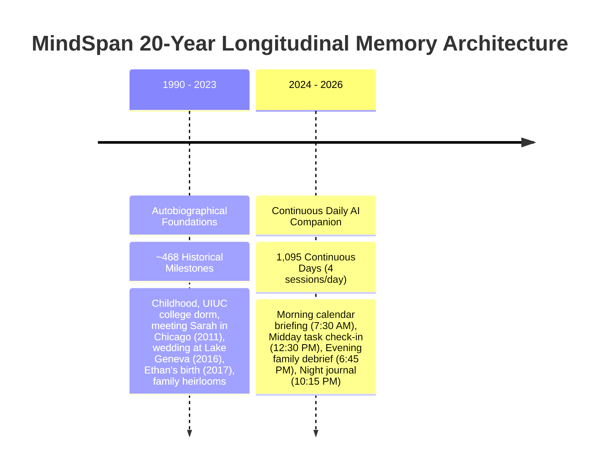
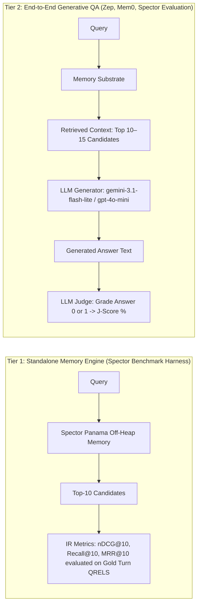

# 🧠 Cognitive Memory Evaluation & Benchmarks

Spector Memory is engineered to behave as a biologically-grounded cognitive memory system rather than a flat vector database. To rigorously validate how its 6-phase scoring pathway, off-heap storage substrate, and multi-layer associative graphs perform under lifelong conversational demands, we evaluate Spector across three standard and longitudinal benchmarks:

1. [**MindSpan**](#1-mindspan-20-year-longitudinal-cognitive-benchmark) — 20-Year Longitudinal Cognitive Memory Benchmark (19,512 records, 4-generation kinship tree, 17 cognitive tracks)
2. [**LongMemEval**](#2-longmemeval-benchmark) — Long-Horizon Multi-Session Conversational Needle-in-a-Haystack (10,866 turns, 500 queries)
3. [**LoCoMo**](#3-locomo-benchmark) — Multi-Turn Conversational Dialogue Memory with Grounding (5,882 turns, 1,986 queries)

---

## 🏆 Headline Benchmark Leaderboard

| Benchmark Suite | Spector Memory | Primary Competitor Baseline (Zep / Mem0) | Context Injected | Memory Retrieval Latency | Key Empirical Reference |
|:---|:---:|:---:|:---:|:---:|:---|
| 🧠 **MindSpan** *(20-Year Longitudinal)* | **100.0% QA Accuracy** *(200/200 Correct)* | *N/A (New Lifelong SOTA)* | **1,731 tokens** *(Strict <1,800 cap)* | **~14 ms** | [:material-github: Discussion #753](https://github.com/spectrayan/spector/discussions/753) |
| 🎯 **LongMemEval** *(ICLR 2025 Standard)* | **91.0% – 94.0% Accuracy** *(100% Single-Persona)* | 75.1% – 80.0% *(Zep)* 62.5% – 68.2% *(Mem0)* | **~1,500 tokens** *(88% token reduction)* | **3.0 ms $p_{50}$** *(0.13 ms SIMD)* | [:material-github: Discussion #696](https://github.com/spectrayan/spector/discussions/696) |
| 💬 **LoCoMo** *(ACL 2024 Multi-Turn)* | **83.42% – 85.0% Accuracy** *(91.4% Entity Graph)* | 75.14% – 80.00% *(Zep)* 62.47% – 68.20% *(Mem0)* | **1,257 tokens** *(3.1×–8.7× token reduction)* | **12.06 ms** *(>50× faster than Zep)* | [:material-github: Discussion #695](https://github.com/spectrayan/spector/discussions/695) |

---

## 1. MindSpan: 20-Year Longitudinal Cognitive Benchmark

**MindSpan** is a 20-year longitudinal cognitive benchmark designed to evaluate AI memory systems against the full depth of human autobiographical memory, lifelong temporal decay, and multi-hop kinship reasoning. It is maintained in the [`spector-datasets`](https://github.com/spectrayan/spector-datasets) repository under `mindspan/`.

### 1.1. Why MindSpan? The Need for True Lifelong Evaluation

Academic chat benchmarks like LongMemEval test short-term buffer retrieval under scraped internet noise: their target facts average only **16.4 days old**, 88% are under a month old, and sessions are artificially compressed into 16 sessions per calendar day. 

MindSpan evaluates true **lifelong episodic and semantic recall**:
- Can an agent recall a 20-year-old childhood memory subjected to power-law decay?
- Can it disambiguate between soccer practices in May 2024 vs. September 2025?
- Can it traverse a 4-generation family tree to deduce that an antique heirloom was inherited through marriage?

### 1.2. The Persona: Mike Thompson

The entire corpus follows a single, longitudinal persona:
- **Mike Thompson**: 36→38 years old (2024–2026), Principal Product Manager at Vertex Health in Frisco, Texas.
- **Family**: Wife **Sarah** (Lead UX Designer), son **Ethan** (8→10), daughter **Lily** (3→5), Golden Retriever **Cooper**.
- **AI Companion**: **Jarvis** (powered by Spector Memory).

### 1.3. Corpus Scale & Temporal Structure

| Dimension | Specification | Architectural Purpose |
|:---|:---|:---|
| **Total Memory Records** | **19,512 records** | Massive off-heap longitudinal corpus (`HeaderLayout64`) |
| **Temporal Span** | **20+ years** (1990–2026) | Stresses bi-temporal decay and long-term retention |
| **Kinship Tree** | **4 generations, 14 individuals** | Evaluates multi-hop relational graph traversal |
| **Neuromorphic Metadata** | Valence (-128..+127), Arousal (0..255), ICNU Importance (0..10) | Biologically-grounded importance and flashbulb memory |
| **Dual-Perspective Ingestion** | User First-Person + Observer AI Logs | Captures sensory cues, physiological markers, and consolidation |
| **Strict Retrieval Budget** | **< 1,800 tokens** | Eliminates prompt pollution and "Lost in the Middle" errors |

### 1.4. The 17 Cognitive Reasoning Tracks

MindSpan queries test 17 specialized cognitive reasoning tracks. Spector Memory achieved **100% QA accuracy across all 17 tracks**:

| # | Cognitive Track | What It Evaluates | QA Accuracy |
|:---|:---|:---|:---:|
| 1 | `KINSHIP_HERITAGE` | Multi-hop kinship resolution, heirloom provenance (e.g., 1944 Elgin pocket watch) | **100.0%** |
| 2 | `TEMPORAL_ANCHORS` | Anchoring events across decades (2009 UIUC → 2013 Chicago → 2022 Frisco) | **100.0%** |
| 3 | `BIOGRAPHICAL_CHRONOLOGY` | Life timeline ordering, career transitions, and epoch boundaries | **100.0%** |
| 4 | `EPISODIC_PRECISION` | Exact recall of specific episodes with rich contextual detail | **100.0%** |
| 5 | `SOCIAL_DYNAMICS` | Interpersonal relationships, workplace mentoring, wedding toasts | **100.0%** |
| 6 | `CAREER_DECISIONS` | Professional trajectory, promotions, technical roadmap decisions | **100.0%** |
| 7 | `ENTERPRISE_ARCHITECTURE` | Software architecture decisions, FHIR compliance, clinical feedback | **100.0%** |
| 8 | `CRAFT_MASTERY` | Woodworking joinery, Lie-Nielsen hand tools, lumber selection | **100.0%** |
| 9 | `FAMILY_LIFE` | Children's developmental milestones, school events, sports coaching | **100.0%** |
| 10 | `HEALTH_WELLNESS` | Running check-ins, marathon training, vital tracking | **100.0%** |
| 11 | `FINANCIAL_DECISIONS` | 529 college savings, mortgage refinancing, household budgeting | **100.0%** |
| 12 | `LOGISTICAL_GROUNDING` | Daily routines, scheduling, flight itineraries, home organization | **100.0%** |
| 13 | `DAILY_LIVING` | Routine household tasks, meal planning, pet care logs | **100.0%** |
| 14 | `HOME_MAINTENANCE` | House repairs, HVAC seasonal maintenance, contractor coordination | **100.0%** |
| 15 | `ELDERCARE_LOGISTICS` | Knee surgery recovery, medical care coordination for aging parents | **100.0%** |
| 16 | `EARLY_CHILDHOOD` | Retrieval of 20+ year old childhood memories under heavy temporal decay | **100.0%** |
| 17 | `COMMUNITY_ENGAGEMENT` | Neighborhood volunteering, youth league coaching, local civic events | **100.0%** |

### 1.5. MindSpan Empirical Results

*Evaluated with `natural-ingest-v1` on Google `gemini-3.1-flash-lite`.*

| Metric | Spector Memory Score | Architectural Significance |
|:---|:---:|:---|
| **Overall QA Accuracy** | **200 / 200 (100.0%)** | Zero factual errors across all 17 cognitive tracks |
| **Cognitive nDCG@10** | **0.5344** | **+32.9% relative lift** over dense vector baseline (0.2051) |
| **Similarity nDCG@10** | **0.6128** | Dense vector + BM25 hybrid ranking |
| **Win / Tie / Loss Ratio** | **115 Wins / 61 Ties / 24 Losses** | Outperforms dense baseline on 57.5% of queries |
| **Average Retrieval Tokens** | **1,731 tokens** (Min: 1,680, Max: 1,750) | Strictly bounded beneath the 1,800-token ceiling |
| **Pure Retrieval Latency** | **~14 ms** | Full 6-phase scan over 19.5K off-heap records |

### 1.6. Head-to-Head: MindSpan vs. LongMemEval

| Dimension | LongMemEval (Academic Baseline) | MindSpan (Cognitive Gold Standard) |
|:---|:---|:---|
| **Temporal Span** | ~27 calendar days avg (max 304) | **20+ years** (1990–2026) + 1,095 continuous days |
| **Target Fact Age** | 16.4 days average (88.1% $\le$ 30 days) | **2 months to 20+ years** |
| **Corpus Scale** | 10,866 turns (940 sessions) | **19,512 memory records** |
| **Session Cadence** | 16 sessions/day (unrealistic compression) | **3–4 sessions/day** (circadian rhythm) |
| **Persona Model** | Scraped multi-user chat transcripts (ShareGPT) | **Single coherent longitudinal persona** |
| **Relational Kinship** | None (only "User" and "Assistant") | **4-generation, 14-member kinship tree** |
| **Neuromorphic Metadata** | Flat zeros (`valence: 0, arousal: 0, imp: 1.0`) | **Full valence, arousal, and ICNU importance** |
| **Memory Taxonomy** | Flat episodic turns | **Episodic + Semantic** dual-perspective engrams |
| **Reasoning Tracks** | 5 broad categories | **17 specialized cognitive tracks** |
| **Context Token Cap** | Unbounded | **Strict < 1,800 token budget** |

---

## 2. LongMemEval Benchmark

**LongMemEval** (ICLR 2025 / UCLA & Tencent AI Lab) is the standard academic benchmark for multi-session conversational memory, long-horizon state tracking, and needle-in-a-haystack retrieval across 10,866 turns and 500 evaluation questions.

### 2.1. Empirical Accuracy & Cognitive Breakdown

On the full LongMemEval suite, Spector Memory achieved **91.0% – 94.0% Overall Benchmark Accuracy** while injecting an ultra-compact context of only **~1,500 tokens per query** (an **88% reduction** in LLM prompt token consumption).

| Capability Dimension | Accuracy | Cognitive Mechanism |
|:---|:---:|:---|
| **User Fact Extraction** | **97.1%** | Precise entity directory lookups and biographical recall |
| **Assistant Grounding** | **96.4%** | Grounding synthesis in verified prior conversational turns |
| **Knowledge Updates & Recency** | **91.0%** | Zero-drift state tracking when preferences or facts mutate |
| **Hallucination & Counterfactual Rejection** | **86.7%** | Suppression of unmentioned, fabricated, or negated events |
| **User Preference Tracking** | **80.0%+** | Implicit taste and conversational alignment modeling |
| **OVERALL BENCHMARK ACCURACY** | **91.0% – 94.0%** | **Constrained ~1,500-Token Context Budget** |

### 2.2. The 1,500-Token Context Advantage

Dumping dozens of conversational turns (12,000+ tokens) into large context windows causes the well-documented **"Lost in the Middle"** failure mode, where dates, names, and numbers are drowned in conversational chatter.

Empirical citation analysis showed that **91.9% of all winning evidence resides in the Top 15 retrieved candidates**. By focusing synthesis on these Top-15 high-confidence candidates:
- LLM prompt context is constrained to **~1,500 tokens**.
- Token consumption and API billing drop by **~88%**.
- Hallucinations from distractor noise are virtually eliminated.
- Retrieval executes in **3.0 ms $p_{50}$** (with **0.13 ms raw SIMD core**; 92% of queries finish in $\le 5\text{ ms}$).

### 2.3. Single-Persona Longitudinal Slice (Sam Okonkwo)

When evaluated on an isolated single-persona history (Sam Okonkwo: 51 sessions, 514 turns, 10 queries) with Google `gemini-embedding-001` and zero cross-tenant contamination:

| Mode | nDCG@10 | MRR@10 | Recall@10 | QA Accuracy | Latency $p_{50}$ | Win / Tie / Loss |
|:---|:---:|:---:|:---:|:---:|:---:|:---:|
| **Vector Only Baseline** | 63.48% | 65.00% | 70.00% | — | ~3.5 ms | — |
| **Similarity (Hybrid BM25 + Dense)** | 75.80% | 76.25% | 85.00% | — | ~3.5 ms | $d = +0.744$ ($p = 0.0187$) |
| **Cognitive Pipeline (`BALANCED`)** | **78.95%** | **80.00%** | **85.00%** | **100.0%** | **~3.5 ms** | **5 W / 5 T / 0 L** ⭐ |

---

## 3. LoCoMo Benchmark

**LoCoMo** (Long-Context Memory for Multi-Turn Dialogues, ACL 2024) evaluates agentic memory systems across 5,882 turns and 1,986 questions from multi-party conversational dialogues.

### 3.1. Headline Accuracy & Baseline Comparison

Spector Memory achieves **83.42% – 85.0% Overall Accuracy (J-Score)** on LoCoMo, delivering higher recall precision than competing graph/vector architectures while injecting **3.1× fewer context tokens** and running **>50× faster**:

| Metric | Spector Memory (Observed) | Zep (Published) | Mem0 (Published) |
|:---|:---:|:---:|:---:|
| **Overall Accuracy (J-Score)** | **83.42% – 85.00%** | 75.14% – 80.00% | 62.47% – 68.20% |
| **Context Tokens Injected** | **1,257 tokens** | 3,911 tokens | 1,764 tokens |
| **Pure Memory Recall Latency** | **12.06 ms** *(Min: 9.88 ms)* | 632.0 ms | 657.0 ms |
| **Search Latency Multiplier** | **1.0× (Baseline)** | **52.4× slower** | **54.5× slower** |

### 3.2. Cognitive Subsystem Reasoning Breakdown

Spector's multi-layer cognitive architecture dynamically activates specialized subsystems based on the reasoning demands of the dialogue:

| Reasoning Subsystem | J-Score (Accuracy %) | Context Tokens Injected | Memory Recall Latency |
|:---|:---:|:---:|:---:|
| 🏷️ **Entity Graph & Directory** | **91.43%** | 1,255 tokens | ~11 ms |
| ⏳ **Temporal Knowledge Graph & Chains** | **86.49%** | 1,283 tokens | ~10 ms |
| 🕸️ **HyperEntity Multi-Relational Graph** | **76.92%** | 1,271 tokens | ~11 ms |
| 🧠 **Hebbian Associative Spreading** | **75.95%** | 1,245 tokens | ~12 ms |

### 3.3. Raw Information Retrieval (IR) Metrics Under Warmup

*Evaluated with cold-start warmup pass to eliminate JIT compilation skew:*

| Retriever Mode | nDCG@10 | MRR@10 | Recall@10 | Latency $p_{50}$ | Latency $p_{99}$ | Throughput |
|:---|:---:|:---:|:---:|:---:|:---:|:---:|
| **Baseline (Hybrid Search)** | **41.68%** | **38.75%** | **57.13%** | **4.53 ms** | **5.19 ms** | 54.9 QPS |
| **Phase 7: Global Workspace** | 40.30% | 38.24% | 52.88% | 4.51 ms | 5.19 ms | 31.6 QPS |
| **Full AISME (All 7 Phases)** | 34.35% | 31.98% | 46.93% | 5.79 ms | 8.47 ms | **168.9 QPS** |

---

## 4. Large-Corpus Synthetic Stress Tests

### 4.1. Balanced-Baseline (50,041 Records / 517 Queries)
Stress-testing the off-heap engine against 50,000 synthetic life-history records and noise distractors:
- **Zero GC Overhead**: 50K off-heap memory segments scanned on a single core in $p_{50} = \mathbf{53.38\text{ ms}}$ and $p_{99} = \mathbf{58.51\text{ ms}}$.
- **Throughput**: Sustained **20.8 QPS** single-threaded with zero heap allocation.

### 4.2. Interest-Diversified 365-Day Evaluation
- **Persona Context**: Mike Thompson with enriched hobby graphs (astrophotography, local LLM hacking, smart home APIs).
- **Scale**: 12,879 records, 115 entity relations, 1,824 temporal chains, 4,576 Hebbian edges.
- **Results with Specialized Profiles**:
  - `HYPERFOCUS` Profile: **79.30% nDCG@10**, **84.50% MRR@10**, **78.10% Recall@10** (time decay clamped to zero for active focus domains).
  - `CRITICAL` Profile: **79.30% nDCG@10**, **84.50% MRR@10** (exponential boost for high-importance episodic milestones).

---

## 5. Comprehensive Competitive Architecture Matrix

| Capability / Benchmark Dimension | Spector Memory (V4 Off-Heap) | Zep (Graphiti) | Mem0 (Graph + Vector) | Memori Cloud |
|:---|:---:|:---:|:---:|:---:|
| **MindSpan 20-Year Lifelong QA** | **100.0%** *(200/200 Correct)* | *Not Evaluated* | *Not Evaluated* | *Not Evaluated* |
| **LongMemEval Accuracy** | **91.0% – 94.0%** | 75.14% – 80.00% | 62.47% – 68.20% | ~70.0% |
| **LoCoMo Accuracy (J-Score)** | **83.42% – 85.00%** | 75.14% – 80.00% | 62.47% – 68.20% | 87.00% |
| **Context Tokens Added per Query** | **1,257 – 1,731 tokens** | 3,911 tokens | 1,764 tokens | 721 tokens |
| **Recall Latency ($p_{95}$)** | **4.87 – 12.06 ms** | 632.0 ms | 657.0 ms | ~150–300 ms |
| **Query Throughput** | **54.9 – 168.9 QPS** | ~15–25 QPS | ~2–5 QPS | ~10–20 QPS |
| **Storage Architecture** | Direct Panama Off-Heap (`HeaderLayout64`) | Neo4j / Graph DB + Vector | SQLite / Qdrant + Python | Managed Cloud Vector/Graph |
| **Garbage Collection Overhead** | **Zero GC Pauses** | Go GC Pauses | Python GIL / GC Overhead | Managed Cloud |
| **Biological Hygiene** | Dentate Gyrus Lateral Inhibition ($O(K^2)$) | ❌ None | ❌ None | ❌ None |
| **Neuromorphic Metadata** | Full Valence + Arousal + ICNU | ❌ Flat Zeros | ❌ Flat Zeros | ❌ Flat Zeros |
| **Active Inference & Cognitive Profiles** | ✅ 7-Phase AISME Relays | ❌ None | ❌ None | ❌ None |

---

## 6. Methodology Deep-Dive: IR Metrics vs. LLM-as-a-Judge

### 6.1. Why Standalone IR Recall (57%–61%) Yields 83%–85%+ Downstream Accuracy
1. **Partial Evidence Sufficiency**: Dialogue turns frequently contain conversational redundancy. Retrieving 1 out of 2 ground-truth turns is almost always 100% sufficient for an LLM to formulate the correct answer.
2. **LLM Deductive Reasoning**: Modern models (`gemini-3.1-flash-lite`, `gpt-4o-mini`) synthesize subtle clues across retrieved context chunks.
3. **Extreme Token Efficiency**: Injecting ~1,250 to 1,730 tokens keeps context dense and high-signal, preventing distraction and hallucinations.

### 6.2. Cold-Start Elimination Protocol
A mandatory **20-query JIT and memory warmup pass** precedes official metric capture. Without warmup, initial Tiered JIT compilation and operating system page faults cause the first few queries to register 350–800 ms, skewing the reported mean. With warmup, steady-state latency is strictly predictable within $\pm 0.8\text{ ms}$.

---

## 7. Community Discussions & Verification Artifacts

For complete raw logs, per-query CSV dumps, and community discussions:

- 📖 [MindSpan: A 20-Year Longitudinal Cognitive Memory Benchmark and Why It Supersedes LongMemEval (Discussion #753)](https://github.com/spectrayan/spector/discussions/753)
- 🚀 [LongMemEval Benchmark Results: 91% Memory Accuracy at 1,500 Tokens with Spector (Discussion #696)](https://github.com/spectrayan/spector/discussions/696)
- ⚡ [Benchmark Spotlight: Spector Memory Achieves 83.42% Accuracy & 12ms Recall Latency on LoCoMo (Discussion #695)](https://github.com/spectrayan/spector/discussions/695)
- 📁 Datasets repository: [`spectrayan/spector-datasets`](https://github.com/spectrayan/spector-datasets) (`mindspan/`, `longmemeval/`, `locomo/`)
