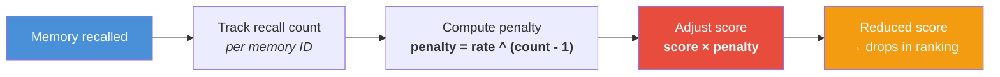
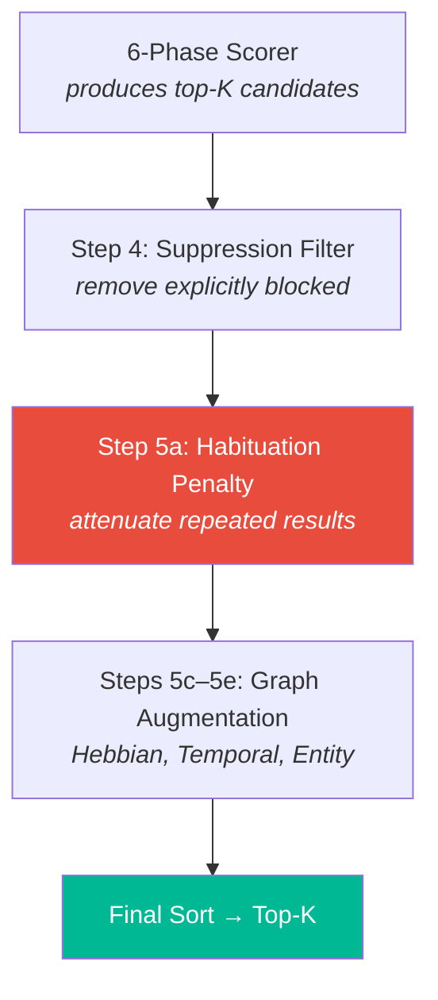

# 😴 Habituation — Anti-Filter Bubble

> **Biological Analog**: **Habituation** is the simplest form of learning — a decrease in response to a stimulus after repeated presentations. You stop hearing the ticking clock after a few minutes. The brain allocates attention to *novel* stimuli, not repeated ones. This prevents sensory overload and enables adaptation.

---

## The Problem

Without habituation, an AI agent repeatedly recalls the same "most relevant" memories — creating a **filter bubble**. If memory A has the highest similarity score, it dominates every recall, crowding out potentially useful but slightly-less-similar memories.

```
Query 1: "database issues" → [A, B, C, D, E]     ← A dominates
Query 2: "database issues" → [A, B, C, D, E]     ← Same results!
Query 3: "database issues" → [A, B, C, D, E]     ← Filter bubble
```

### With Habituation

```
Query 1: "database issues" → [A, B, C, D, E]     ← Fresh results
Query 2: "database issues" → [B, C, A, D, F]     ← A drops, F emerges
Query 3: "database issues" → [C, F, B, G, D]     ← New memories surface
```

---

## How It Works

The habituation system tracks recall frequency per memory ID and applies an exponentially increasing penalty:



$$\text{penalty}(n) = \text{rate}^{(n-1)}$$

Where $n$ is the number of times this memory has appeared in recall results and $\text{rate}$ is the configurable decay rate (default: 0.85).

### Penalty Curve

| Recall # | Penalty (rate=0.85) | Effect |
|---|---|---|
| 1st | 1.00 | Full score |
| 2nd | 0.85 | 15% reduction |
| 3rd | 0.72 | 28% reduction |
| 5th | 0.52 | Half score |
| 10th | 0.20 | 80% reduction |
| 20th | 0.04 | Nearly eliminated |

!!! info "Decay Rate Configuration"
    The default decay rate of 0.85 provides a balance between novelty and relevance. A higher rate (0.95) creates a gentler penalty — useful when the agent genuinely needs to recall the same memory frequently. A lower rate (0.70) aggressively surfaces new content.

---

## Where It Fits in the Pipeline

Habituation is applied **after** the 6-phase scorer produces results, but **before** final ranking:



**Key**: The penalty multiplies the `score` field — it doesn't modify the underlying memory. Habituation is a **recall-time** effect, not a storage-time effect.

---

## Interaction with Other Systems

| System | Interaction |
|---|---|
| **Reconsolidation** | Habituation reduces recall score, but reconsolidation *increases* the memory's durability. A frequently-recalled memory resists temporal decay (fewer buckets) but gets a lower score on repeated queries. |
| **Surprise Detection** | New, surprising memories start with high importance and no habituation penalty — they naturally dominate initial queries. |
| **Suppression** | If a memory is fully suppressed, habituation is irrelevant — it's excluded at Step 4 before habituation is applied. |

---

## Next Steps

- :material-cancel: [**Inhibition — Suppression**](inhibition.md) — explicit memory blocking
- :material-link: [**Hebbian — Association Learning**](hebbian.md) — how co-activation creates associations
- :material-lightning-bolt: [**6-Phase Scoring Pipeline**](scoring-pipeline.md) — the full recall pipeline
