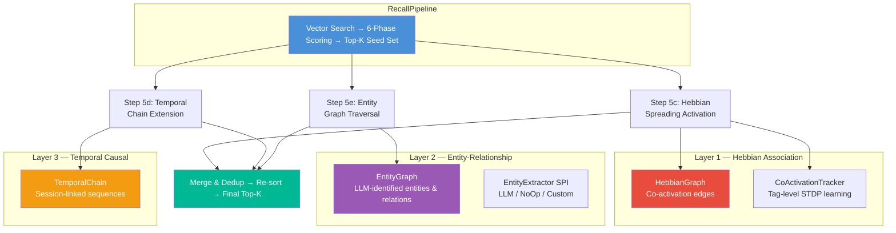
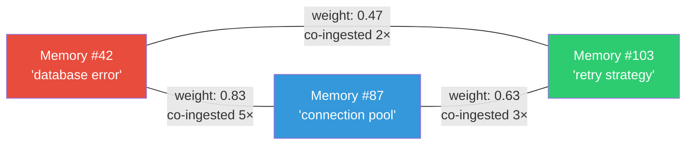
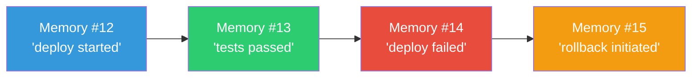

# 🧠 3-Layer Cognitive Graph

> **Biological Analog**: The brain doesn't retrieve memories by content similarity alone. It uses **associative networks** (neurons that fire together wire together), **temporal sequences** (what happened next?), and **semantic knowledge** (who manages what project?). Spector Memory implements all three as graph structures that augment vector recall.

---

## Architecture Overview



!!! tip "Graceful Degradation"
    Each graph step is **additive** — it can only ADD candidates to the result set, never remove. If a graph is null, empty, or throws an exception, the step is a no-op. Zero risk of regression.

---

## Layer 1: Hebbian Association Graph

> *"Neurons that fire together, wire together."* — Donald Hebb, 1949

### How It Works

The Hebbian graph stores **memory-to-memory edges** with association weights. When two memories are co-ingested within the same session, their edge is strengthened. During recall, the graph discovers associated memories that pure vector similarity might miss.



### Key Properties

| Property | Value |
|---|---|
| Max degree | 20 neighbors per memory |
| Edge weight | Float — strengthened on co-ingestion |
| Eviction | Weakest edge evicted when degree exceeds max |
| Decay | 0.9× multiplicative factor per consolidation cycle |
| Spreading activation | BFS with depth=2, attenuated by edge weight |
| Persistence | Binary file with chunked 64KB I/O |

### How It's Used

- **Ingestion**: When memories are co-ingested within the same session, the bidirectional edge between them is strengthened
- **Recall**: After the 6-phase scorer produces a seed set, the graph discovers associated memories via 2-hop BFS. These are added to the result set with 0.3× score attenuation

### CoActivationTracker — Tag-Level Associations

Beyond memory-to-memory edges, the `CoActivationTracker` tracks **tag co-occurrence patterns**:

- **Undirected co-activation counts**: How often two tags appear together in ingested memories
- **Directed STDP edges**: Spike-Timing Dependent Plasticity — if tag A is consistently recalled *before* tag B, the directed edge A→B is strengthened, creating predictive associations

!!! info "STDP — Spike-Timing Dependent Plasticity"
    This creates predictive associations: "when I think of A, I should also think of B." The listener runs after each recall on a Virtual Thread, updating STDP weights with zero impact on recall latency.

---

## Layer 2: Entity-Relationship Graph

> *"What was the budget of the project managed by the person who met with me yesterday?"*

The Entity Graph stores **typed entities and typed relations** extracted from ingested text. This enables **multi-hop knowledge traversal** that pure vector similarity cannot achieve.

### Entity Extraction

Entities are extracted at ingestion time via the `EntityExtractor` SPI:

| Mode | Description |
|---|---|
| `NONE` (default) | No extraction — entity graph features disabled |
| `LLM` | Uses an LLM with a structured prompt to identify entities and relations |
| `CUSTOM` | Any user-provided `EntityExtractor` implementation |

**Enable LLM entity extraction:**

```java
SpectorMemory.builder()
    .entityExtractionMode(EntityExtractionMode.LLM)
    .textGenerationProvider(provider)
    .build();
```

### Open-Schema Type System

Spector uses an **open-schema type registry** — unlike traditional NER systems with fixed type sets, the entity graph accepts **any type string** the LLM identifies. Well-known types are pre-seeded for backward compatibility, but novel types (e.g., `VEHICLE`, `REGULATION`, `RECIPE`) are automatically registered on first use.

**21 well-known entity types** (pre-seeded):

| Category | Types |
|---|---|
| People & Org | `PERSON`, `ORGANIZATION`, `TEAM`, `ROLE` |
| Projects | `PROJECT`, `PRODUCT`, `TASK` |
| Knowledge | `CONCEPT`, `TOPIC`, `SKILL`, `DECISION` |
| Technology | `TECHNOLOGY`, `TOOL`, `API`, `ARTIFACT` |
| World | `EVENT`, `LOCATION`, `DATE_TIME` |
| Process & Data | `PROCESS`, `METRIC`, `DOCUMENT` |
| Catch-all | `OTHER` |

**21 well-known relation types** (pre-seeded):

| Category | Types |
|---|---|
| People | `MANAGES`, `REPORTS_TO`, `KNOWS`, `ASSIGNED_TO`, `AUTHORED` |
| Work | `WORKS_ON`, `CREATED_BY`, `OWNS`, `IMPLEMENTS` |
| Structure | `PART_OF`, `CONTAINS`, `DEPENDS_ON`, `USES` |
| Causality | `CAUSES`, `BLOCKS`, `SUPERSEDES`, `PRECEDES`, `FOLLOWS` |
| Location | `LOCATED_AT` |
| General | `RELATED_TO`, `OTHER` |

!!! tip "Dynamic Types"
    If the LLM identifies an entity as `SOFTWARE` or a relation as `DEPLOYED_ON`, these are automatically registered in the type registry and stored as first-class types. No code changes or schema migrations required.

### How It's Used

- **Ingestion**: The LLM extracts entities from text → entities are added to the graph → entities are linked to their source memory (with weighted adjacency) → relations are added between entities
- **Recall**: Entities are extracted from the query → matched in the graph by name → 2-hop BFS traversal → memory references collected → added to result set with **0.25× attenuation per hop × fan factor** (1/√refCount, modeling ACT-R spreading activation dilution)
- **Consolidation**: Entity–entity edges decay over reflection cycles. Entity→memory adjacency weights decay via LTD (Long-Term Depression, 0.95× per cycle, pruned below 0.2). Similar entity names are merged via Levenshtein distance. Fragmented adjacency blocks are compacted.
- **Reinforcement (LTP)**: When a memory re-mentions an already-linked entity, the adjacency weight is reinforced by +0.2 (Long-Term Potentiation) instead of creating a duplicate link.

### Traversal

The entity graph supports typed BFS traversal with optional relation filtering:

| Method | Description |
|---|---|
| `traverse(startEntity, filter, maxHops)` | BFS with optional relation type filter |
| `collectMemories(startEntity, filter, maxHops)` | Collect all memory indices reachable within N hops |
| `findEntity(name)` | Case-insensitive entity lookup |
| `memoriesForEntity(entityId)` | All memory indices linked to an entity (unlimited) |
| `fanFactor(entityId)` | Returns 1/√(refCount) for spreading activation dilution |
| `memoryRefWeight(entityId, adjIdx)` | Read individual adjacency link weight |
| `decayAdjacencyWeights(factor, threshold)` | LTD decay: multiply all weights, prune below threshold |
| `compactAdjacency()` | Defragment adjacency segment, reclaim dead blocks |

### Off-Heap Layout

Entity nodes use a **fixed 64-byte** cache-line-aligned layout with a **separate adjacency segment** for entity→memory links:

```
Entity Node (64B):
  [type:4B][pad:4B][nameHash:8B]
  [adjOffset:4B][adjCount:4B][adjCapacity:4B][pad:4B]  ← pointer into adjacency segment
  [pad:4B][degree:4B][edgeStart:4B][pad:20B]

Adjacency Entry (8B):
  [memIdx:4B][weight:4B]    ← weighted link to a memory slot
```

This design allows **unlimited** entity→memory associations (no fixed cap), with amortized O(1) growth via block doubling. Each entity starts with 8 adjacency slots and grows as needed.

---

## Layer 3: Temporal Causal Chain

> *"What happened after the deployment failed?"*

The Temporal Chain links memories ingested within the same session into a **doubly-linked list**, enabling temporal navigation — both forward ("what happened next?") and backward ("what led to this?").



### How It's Used

- **Ingestion**: When a new memory is ingested within the same session, a bidirectional link is created to the previously ingested memory
- **Recall**: For each seed result, the chain follows forward (3 hops) and backward (3 hops) to discover temporally adjacent memories. Forward links get 0.8× score, backward links get 0.7×

| Method | Description |
|---|---|
| `followForward(startIdx, maxHops)` | "What happened next?" |
| `followBackward(startIdx, maxHops)` | "What happened before?" |
| `link(currentIdx, prevIdx, sessionId)` | Link two memories within a session |

---

## Persistence

All graph components persist alongside memory data in DISK mode:

| Component | File | Format |
|---|---|---|
| HebbianGraph | `hebbian.graph` | Binary with chunked 64KB I/O |
| CoActivationTracker | `coactivation.dat` | Pair table + edge table + hash→tag map |
| EntityGraph | `entity.graph` | Entity segment + edge segment + adjacency segment + name index |
| TemporalChain | `temporal.chain` | Raw linked-list segment |
| TypeRegistry | `entity-types.reg` / `relation-types.reg` | Type name ↔ ID mappings |

---

## Memory Budget

| Layer | Per-Node | At 100K memories | At 1M memories |
|---|---|---|---|
| Hebbian (L1) | 164B | 16.4 MB | 164 MB |
| CoActivation | ~1MB total | ~1 MB | ~1 MB |
| Entity (L2) | ~64B + edges + adj | ~8 MB | ~80 MB |
| Temporal (L3) | 16B | 1.6 MB | 16 MB |
| **Total** | | **~27 MB** | **~261 MB** |

This is small compared to the vector store (100K × 768-dim × 1B quantized = 75 MB).

---

## Why This Matters for AI Agents

Traditional vector search treats each query independently. The 3-layer graph creates **emergent intelligence**:

!!! example "Scenario: Multi-Signal Recall"
    1. Agent queries "why is the app slow?"
    2. **Vector search** → finds memory about "application latency"
    3. **Hebbian (Layer 1)** → that memory was co-ingested with "connection pool settings" → adds it to results
    4. **Temporal (Layer 3)** → follows the chain: connection pool → timeout config → retry backoff → adds all three
    5. **Entity (Layer 2)** → "connection pool" mentions entity "DatabaseService" → traverses DEPENDS_ON edge → finds "Redis cache config" → adds it

    The final result set contains memories that no single retrieval signal could have found alone.

---

## Next Steps

- :material-lightning-bolt: [**6-Phase Scoring Pipeline**](scoring-pipeline.md) — the SIMD hot-loop that produces the seed set
- :material-sleep: [**Habituation — Anti-Filter Bubble**](habituation.md) — preventing repetitive recall
- :material-head-cog: [**Dopamine — Surprise Detection**](dopamine.md) — auto-importance scoring
- :material-brain: [**Architecture**](architecture.md) — how graphs fit in the full pipeline
