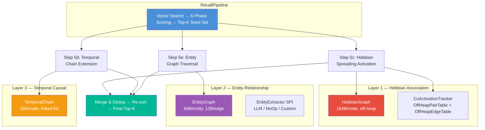
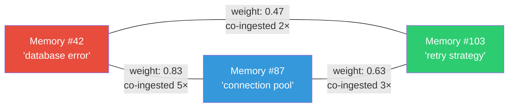

# 🧠 3-Layer Cognitive Graph

> **Packages**: `com.spectrayan.spector.memory.hebbian`, `.temporal`, `.graph`
>
> **Biological Analog**: The brain doesn't retrieve memories by content similarity alone. It uses **associative networks** (neurons that fire together wire together), **temporal sequences** (what happened next?), and **semantic knowledge** (who manages what project?). Spector Memory implements all three as off-heap graph structures that augment vector recall.

---

## Architecture Overview



!!! tip "Graceful Degradation"
    Each graph step is **additive** — it can only ADD candidates to the result set, never remove. If a graph is null, empty, or throws an exception, the step is a no-op. Zero risk of regression.

---

## Layer 1: Hebbian Association Graph

> *"Neurons that fire together, wire together."* — Donald Hebb, 1949

### HebbianGraph — Memory-Level Associations

The `HebbianGraph` stores explicit **memory-to-memory edges** with association weights in an off-heap adjacency list.



**Off-heap layout** (164 bytes per node):

```
┌──────────┬──────────────────────────────────────────────┐
│ degree   │ edges[0..19]: (neighborIdx:4B, weight:4B)    │
│ (4B)     │ = 20 × 8B = 160B                            │
└──────────┴──────────────────────────────────────────────┘
```

**Key properties:**

| Property | Value |
|---|---|
| Storage | Off-heap `MemorySegment` via Panama |
| Max degree | 20 neighbors per memory |
| Edge weight | Float — strengthened on co-ingestion |
| Eviction | Weakest edge evicted when degree exceeds MAX_DEGREE |
| Decay | 0.9 multiplicative factor per consolidation cycle |
| Spreading activation | BFS with depth=2, attenuated by edge weight |
| Persistence | `HGPH` magic header, chunked 64KB FileChannel I/O |

**Pipeline integration:**

- **Ingestion (Step 9b):** When memories are co-ingested within the same session, `HebbianGraph.strengthen(currentIdx, previousIdx, 1.0f)` strengthens the bidirectional edge.
- **Recall (Step 5c):** After the 6-phase scorer produces a seed set, `HebbianGraph.activateNeighbors(seedIdx, depth=2)` discovers associated memories. These are added to the result set with a 0.3× score attenuation.

### CoActivationTracker — Tag-Level Associations

The `CoActivationTracker` tracks **tag co-occurrence patterns** using two off-heap hash tables:

#### OffHeapPairTable — Undirected Co-Activation Counts

Tracks how often two tags appear together in ingested memories.

```
Slot layout (32 bytes):
┌───────────┬───────────┬──────────┬───────┐
│ keyHashA  │ keyHashB  │ count    │ flags │
│ 8 bytes   │ 8 bytes   │ 4 bytes  │ ...   │
└───────────┴───────────┴──────────┴───────┘
```

- Open-addressing hash table with linear probing
- FNV-1a 64-bit hashing for tag strings
- ~50% load factor for fast lookups

#### OffHeapEdgeTable — Directed STDP Edges

Tracks causal/predictive relationships between tags (Spike-Timing Dependent Plasticity):

```
Slot layout (40 bytes):
┌────────────┬────────────┬────────┬──────────┬───────────┬───────┐
│ sourceHash │ targetHash │ weight │ lastMs   │ actCount  │ flags │
│ 8 bytes    │ 8 bytes    │ 4 bytes│ 8 bytes  │ 4 bytes   │ ...   │
└────────────┴────────────┴────────┴──────────┴───────────┴───────┘
```

- Weight clamped to `[0.0, 1.0]`
- Temporal metadata for STDP learning rules
- Persistence via `COAX` magic header with hash→tag reverse map

!!! info "STDP — Spike-Timing Dependent Plasticity"
    If tag A is consistently recalled *before* tag B, the directed edge A→B is strengthened. This creates predictive associations: "when I think of A, I should also think of B." The `HebbianCoActivationListener` runs after each recall on a Virtual Thread, updating STDP weights with zero impact on recall latency.

---

## Layer 2: Entity-Relationship Graph

> *"What was the budget of the project managed by the person who met with me yesterday?"*

The `EntityGraph` stores **typed entities** (PERSON, PROJECT, ORG, ...) and **typed relations** (MANAGES, AUTHORED, PART_OF, ...) extracted from ingested text. This enables **multi-hop knowledge traversal** that pure vector similarity cannot achieve.

### Entity Extraction

Entities are extracted at ingestion time via the `EntityExtractor` SPI:

| Mode | Implementation | Description |
|---|---|---|
| `NONE` (default) | `NoOpEntityExtractor` | No extraction — graph features disabled |
| `LLM` | `LlmEntityExtractor` | Uses `TextGenerationProvider` with a structured prompt |
| `CUSTOM` | User-provided | Any custom `EntityExtractor` implementation |

```java
// Enable LLM entity extraction via Builder
SpectorMemory.builder()
    .entityExtractionMode(EntityExtractionMode.LLM)
    .textGenerationProvider(provider)
    .build();
```

### Type System

**22 Entity Types:**
`PERSON`, `ORGANIZATION`, `PROJECT`, `CONCEPT`, `EVENT`, `LOCATION`, `TOOL`, `SKILL`, `DOCUMENT`, `API`, `DATABASE`, `FRAMEWORK`, `PROTOCOL`, `METRIC`, `ROLE`, `TEAM`, `PRODUCT`, `SERVICE`, `WORKFLOW`, `DECISION`, `RISK`, `OTHER`

**21 Relation Types:**
`MANAGES`, `AUTHORED`, `ATTENDED`, `PART_OF`, `RELATED_TO`, `CAUSES`, `DEPENDS_ON`, `USES`, `CREATED`, `MENTIONS`, `MEMBER_OF`, `ASSIGNED_TO`, `REPORTED_BY`, `BLOCKED_BY`, `IMPLEMENTS`, `EXTENDS`, `TESTED_BY`, `DEPLOYED_TO`, `MONITORS`, `TRIGGERS`, `OTHER`

### Off-Heap Layout

**Entity Node (64 bytes, 8-byte aligned):**
```
[type:1B][pad:7B][nameHash:8B][memRef0:4B][memRef1:4B][memRef2:4B][memRef3:4B]
[refCount:4B][degree:4B][edgeStart:4B][pad:20B]
```

**Entity Edge (12 bytes):**
```
[targetId:4B][relationType:4B][weight:4B]
```

**Traversal:** BFS with typed edge filtering, max 32 edges per entity, max 4 memory references per entity.

**Pipeline integration:**

- **Ingestion (Step 9d):** Extract entities from text → `entityGraph.addEntity(name, type)` → `entityGraph.linkEntityToMemory(eid, memoryIdx)` → `entityGraph.addRelation(fromEid, toEid, relationType)`
- **Recall (Step 5e):** Extract entities from query → find in graph by name → 2-hop BFS → collect `memoriesForEntity(eid)` → add to result set with 0.25× attenuation per hop
- **Persistence:** `ENTG` magic header with on-heap nameIndex reconstruction on load

---

## Layer 3: Temporal Causal Chain

> *"What happened after the deployment failed?"*

The `TemporalChain` links memories ingested within the same session into a **doubly-linked list**, enabling temporal navigation.


### Off-Heap Layout (16 bytes per node)

```
┌──────────┬──────────┬───────────┬──────────┐
│ prevIdx  │ nextIdx  │ sessionId │ pad      │
│ 4 bytes  │ 4 bytes  │ 4 bytes   │ 4 bytes  │
└──────────┴──────────┴───────────┴──────────┘
```

`-1` is used as sentinel for "no link" (beginning or end of chain).

**API:**

| Method | Description |
|---|---|
| `link(currentIdx, prevIdx, sessionId)` | Links two memories within a session |
| `followForward(startIdx, maxHops)` | "What happened next?" → `List<Integer>` |
| `followBackward(startIdx, maxHops)` | "What happened before?" → `List<Integer>` |
| `save(Path)` / `load(Path)` | Persistence with `TPCH` magic header |

**Pipeline integration:**

- **Ingestion (Step 9c):** When a new memory is ingested within the same session, `temporalChain.link(currentIdx, lastIngestedIdx, sessionId)` creates the bidirectional link.
- **Recall (Step 5d):** For each seed result, `followForward(idx, 3)` and `followBackward(idx, 3)` discover temporally adjacent memories. Forward links get 0.8× score, backward links get 0.7×.

---

## Persistence

All graph components persist alongside episodic partitions in DISK mode:

| Component | File | Magic | Format |
|---|---|---|---|
| HebbianGraph | `hebbian.graph` | `HGPH` | 16B header + raw segment bytes |
| CoActivationTracker | `coactivation.dat` | `COAX` | 16B header + pair table + edge table + hash→tag map |
| EntityGraph | `entity.graph` | `ENTG` | 16B header + entity segment + edge segment + name index |
| TemporalChain | `temporal.chain` | `TPCH` | 16B header + raw segment bytes |

All use chunked 64KB FileChannel I/O to avoid `ByteBuffer` overflow on large segments.

---

## Error Framework

Graph operations use granular exceptions from the `SpectorGraphException` hierarchy:

```
SpectorMemoryException (SPE-310-xxx)
  └── SpectorGraphException (base)
      ├── SpectorHebbianException         (SPE-310-006)
      ├── SpectorTemporalChainException   (SPE-310-007)
      ├── SpectorEntityGraphException     (SPE-310-008)
      ├── SpectorCoActivationException    (SPE-310-009)
      ├── SpectorGraphPersistenceException(SPE-310-010)
      └── SpectorGraphDecayException      (SPE-310-011)
```

All pipeline catch sites use `catch(RuntimeException)` → create granular exception → `log.warn(ex.getMessage())`. No generic catches, no swallowed exceptions.

---

## Memory Budget

| Layer | Per-Node | At 100K memories | At 1M memories |
|---|---|---|---|
| Hebbian (L1) | 164B | 16.4 MB | 164 MB |
| CoActivation | ~1MB total | ~1 MB | ~1 MB |
| Entity (L2) | ~64B + edges | ~8 MB | ~80 MB |
| Temporal (L3) | 16B | 1.6 MB | 16 MB |
| **Total** | | **~27 MB** | **~261 MB** |

This is small compared to the vector store (100K × 768-dim × 1B quantized = 75 MB).

---

## Why This Matters for AI Agents

Traditional vector search treats each query independently. The 3-layer graph creates **emergent intelligence**:

!!! example "Scenario: Multi-Signal Recall"
    1. Agent queries "why is the app slow?"
    2. **Vector search** → finds memory about "application latency"
    3. **Hebbian (Layer 1)** → that memory was co-ingested with "connection pool settings" → adds it to results
    4. **Temporal (Layer 3)** → follows the chain: connection pool → timeout config → retry backoff → adds all three
    5. **Entity (Layer 2)** → "connection pool" mentions entity "DatabaseService" → traverses DEPENDS_ON edge → finds "Redis cache config" → adds it

    The final result set contains memories that no single retrieval signal could have found alone.

---

## Next Steps

- :material-lightning-bolt: [**6-Phase Scoring Pipeline**](scoring-pipeline.md) — the SIMD hot-loop that produces the seed set
- :material-sleep: [**Habituation — Anti-Filter Bubble**](habituation.md) — preventing repetitive recall
- :material-head-cog: [**Dopamine — Surprise Detection**](dopamine.md) — auto-importance scoring
- :material-brain: [**Architecture**](architecture.md) — how graphs fit in the full pipeline
