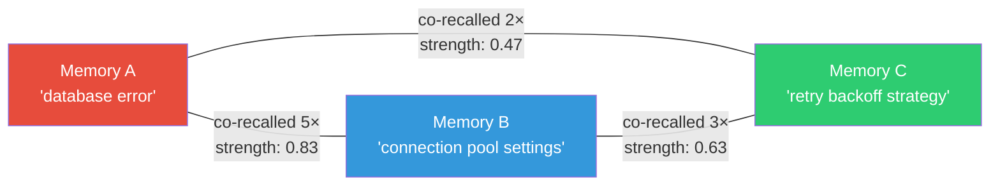

# 🔄 Hebbian — Association Learning

> **Package**: `com.spectrayan.spector.memory.hebbian`
>
> **Biological Analog**: **Hebbian Learning** (Donald Hebb, 1949) — *"Neurons that fire together wire together."* When two neurons are repeatedly activated at the same time, the synaptic connection between them strengthens. This is the fundamental mechanism of associative memory — why the smell of rain can trigger a childhood memory.

---

## The Mechanism

When memories are co-recalled (appear together in the same recall result set), their **association strength** increases. Future queries can then "spread activation" — if memory A is recalled, its strongly-associated memory B gets a relevance boost even if B isn't a direct semantic match.



---

## CoActivationTracker

The `CoActivationTracker` observes recall results and updates co-activation counts:

```java
public final class CoActivationTracker {
    
    private final ConcurrentHashMap<Long, Integer> coActivationCounts 
        = new ConcurrentHashMap<>();
    
    /**
     * Records co-activation for all pairs of tag patterns in the result set.
     * Uses synaptic tag fingerprints as lightweight proxy for memory identity.
     */
    public void recordCoActivation(List<CognitiveResult> results) {
        // Extract unique tag patterns
        var tagPatterns = results.stream()
            .flatMap(r -> r.synapticTags() != null 
                ? Arrays.stream(r.synapticTags()) 
                : Stream.empty())
            .collect(Collectors.toSet());
        
        // Record all pairwise co-activations
        var tagList = new ArrayList<>(tagPatterns);
        for (int i = 0; i < tagList.size(); i++) {
            for (int j = i + 1; j < tagList.size(); j++) {
                long pairKey = pairHash(tagList.get(i), tagList.get(j));
                coActivationCounts.merge(pairKey, 1, Integer::sum);
            }
        }
    }
}
```

### Synaptic Tag Co-Activation (Lightweight V1)

Instead of building a separate co-occurrence graph (expensive — doubles maintenance overhead), V1 piggybacks on the existing **synaptic tag infrastructure**:

```java
// Two memories co-recalled in 3 separate queries:
long tagsA = SynapticTagEncoder.encode("database", "error");      // bits 3, 12, 45
long tagsB = SynapticTagEncoder.encode("connection", "pool");     // bits 7, 12, 61
long overlap = Long.bitCount(tagsA & tagsB);                      // shared bits: 1 (bit 12)
float association = (float) overlap / Long.bitCount(tagsA | tagsB); // Jaccard: 1/5 = 0.2
```

**Bonus**: Co-activation can be merged back into the synaptic tags via bitwise OR:

```java
// After repeated co-activation, merge tag fingerprints
layout.mergeSynapticTags(segment, offsetA, tagsB);  // A gains B's context
layout.mergeSynapticTags(segment, offsetB, tagsA);  // B gains A's context
```

This means future queries for "database" will also match memories that were originally tagged only with "connection pool" — emergent associative recall.

---

## HebbianGraph

The `HebbianGraph` provides a more structured view of memory associations:

```java
public final class HebbianGraph {
    
    private final ConcurrentHashMap<String, Set<String>> adjacency 
        = new ConcurrentHashMap<>();
    
    /**
     * Records an association between two memory IDs.
     */
    public void associate(String id1, String id2) {
        adjacency.computeIfAbsent(id1, k -> ConcurrentHashMap.newKeySet())
            .add(id2);
        adjacency.computeIfAbsent(id2, k -> ConcurrentHashMap.newKeySet())
            .add(id1);
    }
    
    /**
     * Returns all memories associated with a given ID.
     */
    public Set<String> neighbors(String id) {
        return adjacency.getOrDefault(id, Set.of());
    }
    
    /**
     * Returns the number of associations in the graph.
     */
    public int edgeCount() {
        return adjacency.values().stream()
            .mapToInt(Set::size).sum() / 2;
    }
}
```

---

## HebbianCoActivationListener

The `HebbianCoActivationListener` implements `RecallListener` and is registered with the `RecallPipeline`:

```java
public final class HebbianCoActivationListener implements RecallListener {
    
    private final CoActivationTracker tracker;
    
    @Override
    public void onRecallComplete(List<CognitiveResult> results) {
        // Fire asynchronously on a Virtual Thread
        tracker.recordCoActivation(results);
    }
}
```

This runs **after** each recall, on a dedicated Virtual Thread — zero impact on recall latency.

---

## Why This Matters for AI Agents

Traditional vector search treats each query independently. Hebbian learning creates **emergent connections** between memories that are repeatedly co-retrieved:

!!! example "Scenario"
    1. Agent recalls "database timeout" → gets memories about connection pools, retry logic, and timeout settings
    2. After 5 such recalls, the co-activation tracker strengthens the association
    3. Future query "why is the app slow?" → connection pool memory gets a Hebbian boost, even though "slow app" doesn't directly mention "connection pool"

This creates an **associative memory network** — the agent develops intuitions about which concepts are related, beyond what pure vector similarity would capture.

---

## Next Steps

- :material-sleep: [**Habituation — Anti-Filter Bubble**](habituation.md) — preventing repetitive recall
- :material-head-cog: [**Dopamine — Surprise Detection**](dopamine.md) — auto-importance scoring
- :material-brain: [**Architecture**](architecture.md) — how Hebbian fits in the pipeline
