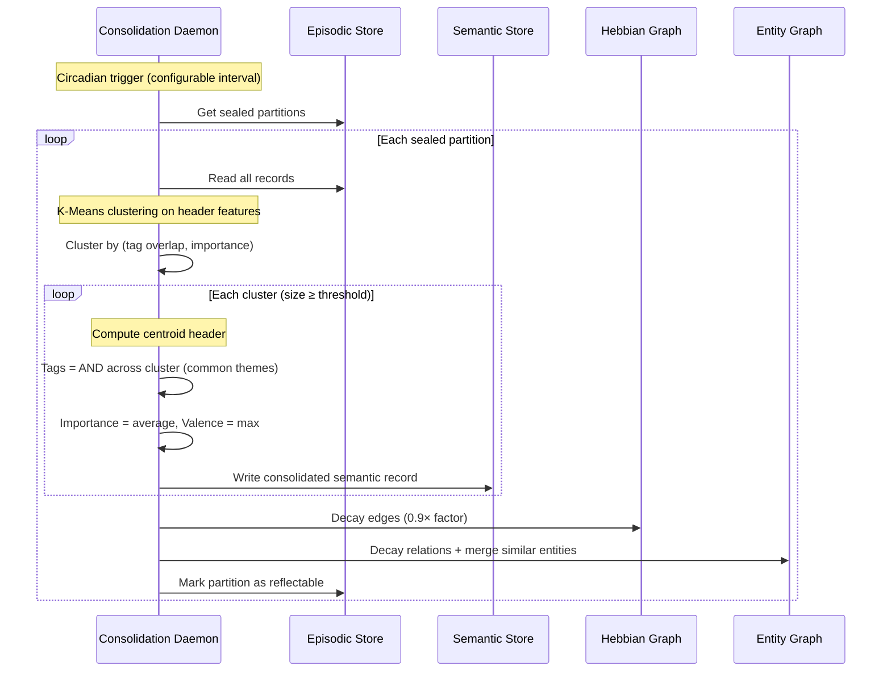
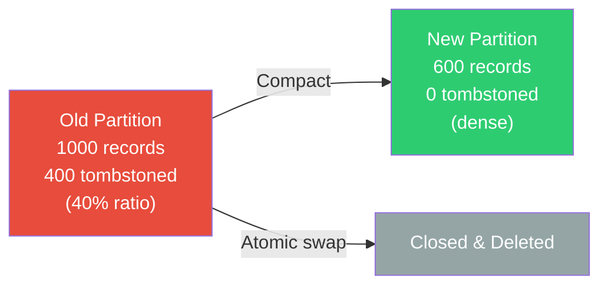
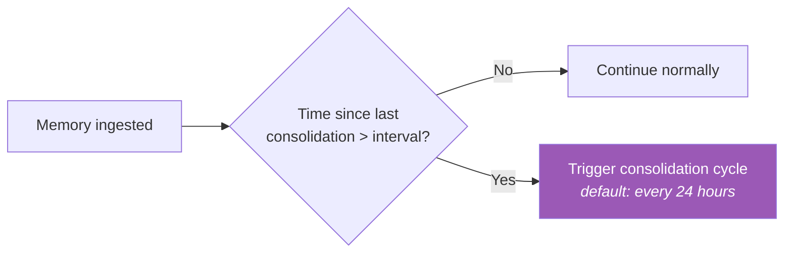
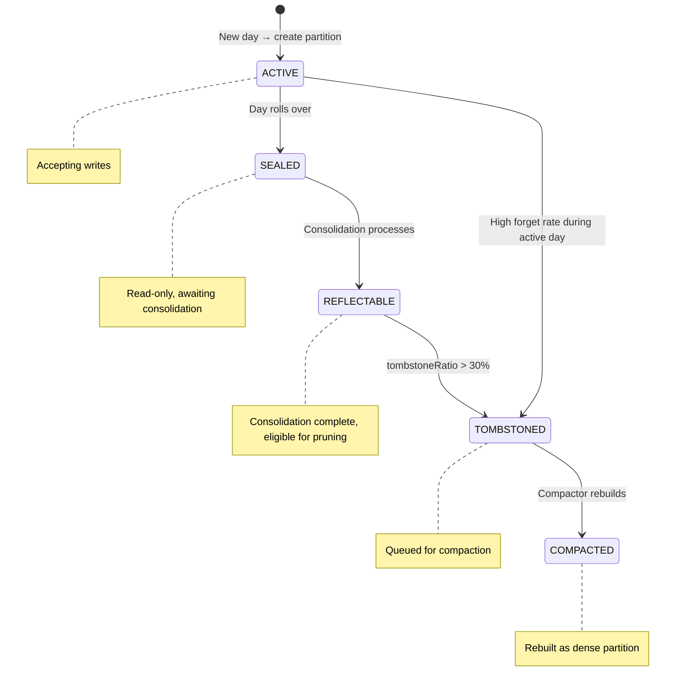

# 🛏️ Hippocampus — Sleep Consolidation

> **Biological Analog**: During sleep, the **hippocampus replays** episodic memory traces to the neocortex, gradually transferring knowledge from episode-specific to generalized semantic form. This is called **systems consolidation**. Simultaneously, **synaptic pruning** weakens unused connections — the brain's garbage collector.

---

## The Two Mechanisms

### 1. Sleep Consolidation — Episodic → Semantic Promotion

The consolidation daemon performs K-Means clustering on episodic memories to extract semantic knowledge:

**Key behaviors**:

- **Tag merging**: Uses bitwise AND across the cluster — only common tags survive, representing the shared theme
- **Importance averaging**: The consolidated memory inherits the mean importance of its source episodes
- **Minimum cluster size**: Small clusters (noise) are not promoted — only patterns are
- **Cross-layer promotion**: Strong Hebbian edges are promoted to Entity Graph relations
- **Entity maintenance**: Similar entities are merged (Levenshtein distance), stale relations decay

!!! example "Example: Consolidation in Action"
    An agent encounters 15 episodic memories tagged `[database, connection, error]` over a week. The consolidation daemon clusters them and promotes a single semantic memory: *"Database connection issues are recurring — check connection pool sizing and timeout settings."*

---

### 2. Tombstone Compaction — Synaptic Pruning

When memories are `forget()`'d, they are tombstoned (bit 0 of flags byte set to 1). The scorer skips them in Phase 1 (~1 cycle). But tombstoned records still consume disk space.

When the tombstone ratio in a partition exceeds a threshold (default: 30%), a **partition rebuild** is triggered:

**The rebuild process**:

1. Allocate a new partition file
2. Sequentially copy only live (non-tombstoned) records
3. Atomically swap the new partition in (CAS operation — readers see old or new, never torn)
4. Close and delete the old partition

!!! warning "Concurrent Safety"
    The swap uses a CAS (compare-and-swap) operation. Readers that are mid-scan on the old partition complete safely because the old memory segment remains valid until close. New scans use the compacted partition.

---

## Circadian Trigger

The consolidation daemon runs on a configurable schedule:

The default interval is 24 hours — matching the biological circadian cycle. For testing, it can be set to any duration.

---

## Partition State Machine

---

## Consolidation Report

Each consolidation cycle produces a report summarizing what happened:

| Metric | Description |
|---|---|
| **partitionsProcessed** | Number of sealed partitions scanned |
| **memoriesConsolidated** | Episodic records that matched a cluster |
| **semanticMemoriesCreated** | New semantic records written |
| **hebbianEdgesDecayed** | Hebbian edges weakened |
| **entitiesMerged** | Near-duplicate entities merged |
| **crossPromotions** | Hebbian → Entity promotions |
| **temporalNodesPruned** | Stale temporal chain nodes removed |
| **durationMs** | Total cycle time |

This can be logged, monitored, or exposed via the introspection API for observability.

---

## Next Steps

- :material-brain: [**Cortex — Tier Stores**](cortex.md) — the 4-tier architecture
- :material-flash: [**Synapse — Tags & Scoring**](synapse.md) — the 64-byte header
- :material-head-cog: [**Dopamine — Surprise Detection**](dopamine.md) — auto-importance scoring
