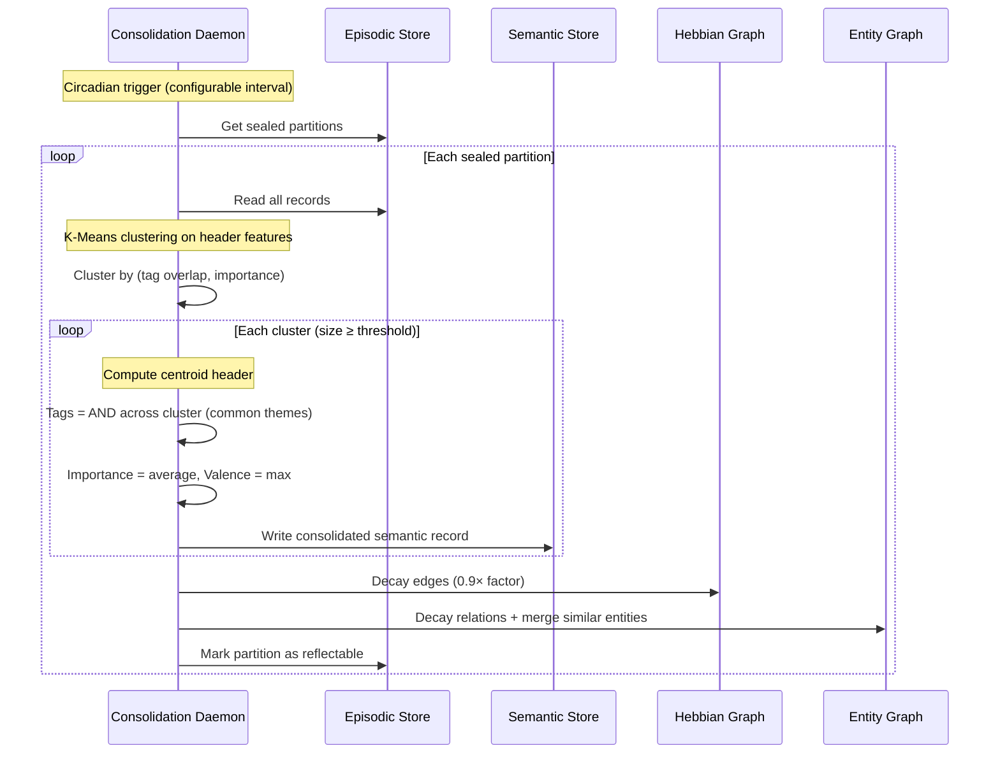
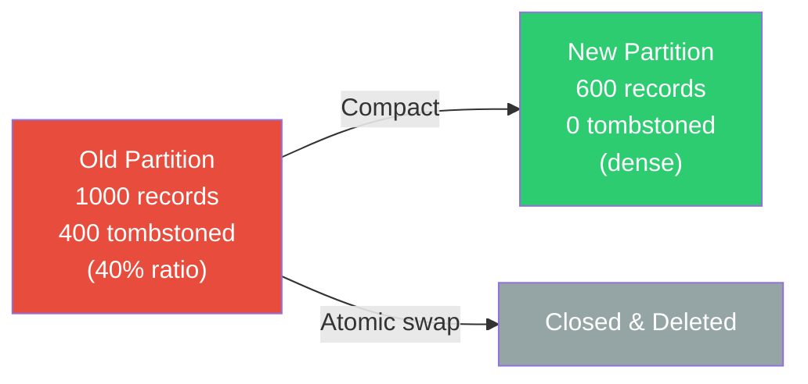
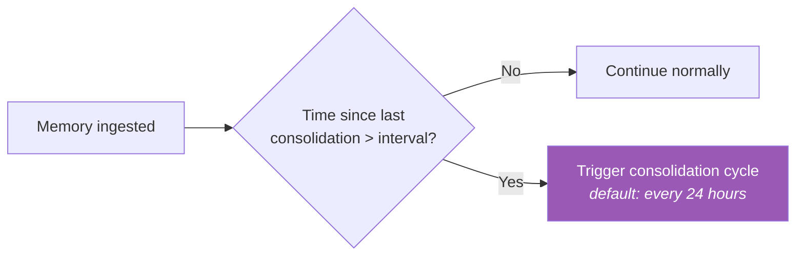
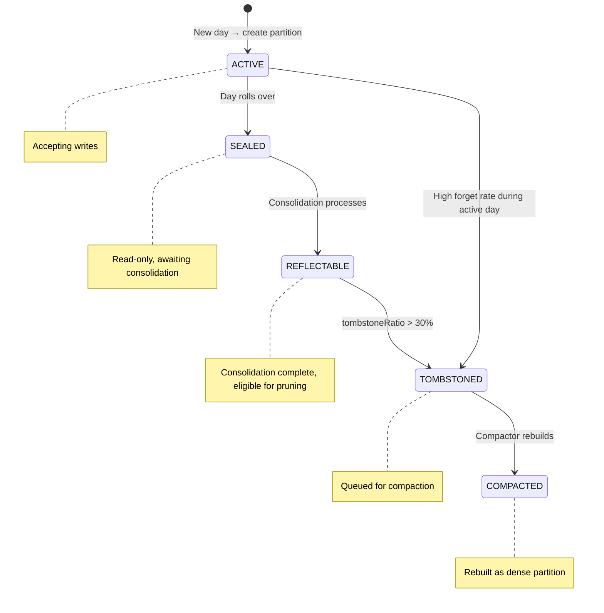

# 🛏️ Hippocampus — Sleep Consolidation

> **Biological Analog**: During sleep, the **hippocampus replays** episodic memory traces to the neocortex, gradually transferring knowledge from episode-specific to generalized semantic form. This is called **systems consolidation**. Simultaneously, **synaptic pruning** weakens unused connections — the brain's garbage collector.

---

## The Two Mechanisms

### 1. Sleep Consolidation — Episodic → Semantic Promotion

The consolidation daemon performs K-Means clustering on episodic memories to extract semantic knowledge:

```mermaid
sequenceDiagram
    participant RD as Consolidation Daemon
    participant EP as Episodic Store
    participant SE as Semantic Store
    participant HG as Hebbian Graph
    participant EG as Entity Graph

    Note over RD: Circadian trigger (configurable interval)
    RD->>EP: Get sealed partitions

    loop Each sealed partition
        RD->>EP: Read all records
        Note over RD: K-Means clustering on header features
        RD->>RD: Cluster by (tag overlap, importance)

        loop Each cluster (size ≥ threshold)
            Note over RD: Compute centroid header
            RD->>RD: Tags = AND across cluster (common themes)
            RD->>RD: Importance = average, Valence = max
            RD->>SE: Write consolidated semantic record
        end

        RD->>HG: Decay edges (0.9× factor)
        RD->>EG: Decay relations + merge similar entities
        RD->>EP: Mark partition as reflectable
    end
```

**Key behaviors**:

- **Tag merging**: Uses bitwise AND across the cluster — only common tags survive, representing the shared theme
- **Importance averaging**: The consolidated memory inherits the mean importance of its source episodes
- **Minimum cluster size**: Small clusters (noise) are not promoted — only patterns are
- **Cross-layer promotion**: Strong Hebbian edges are promoted to Entity Graph relations
- **Entity maintenance**: Similar entities are merged (Levenshtein distance), stale relations decay

!!! example "Example: Consolidation in Action"
    An agent encounters 15 episodic memories tagged `[database, connection, error]` over a week. The consolidation daemon clusters them and promotes a single semantic memory: *"Database connection issues are recurring — check connection pool sizing and timeout settings."*

---

### 2. Tombstone Compaction — Synaptic Pruning

When memories are `forget()`'d, they are tombstoned (bit 0 of flags byte set to 1). The scorer skips them in Phase 1 (~1 cycle). But tombstoned records still consume disk space.

When the tombstone ratio in a partition exceeds a threshold (default: 30%), a **partition rebuild** is triggered:

```mermaid
graph LR
    A["Old Partition<br/>1000 records<br/>400 tombstoned<br/>(40% ratio)"] -->|"Compact"| B["New Partition<br/>600 records<br/>0 tombstoned<br/>(dense)"]
    A -->|"Atomic swap"| C["Closed & Deleted"]

    style A fill:#e74c3c,color:white
    style B fill:#2ecc71,color:white
    style C fill:#95a5a6,color:white
```

**The rebuild process**:

1. Allocate a new partition file
2. Sequentially copy only live (non-tombstoned) records
3. Atomically swap the new partition in (CAS operation — readers see old or new, never torn)
4. Close and delete the old partition

!!! warning "Concurrent Safety"
    The swap uses a CAS (compare-and-swap) operation. Readers that are mid-scan on the old partition complete safely because the old memory segment remains valid until close. New scans use the compacted partition.

---

## Circadian Trigger

The consolidation daemon runs on a configurable schedule:

```mermaid
flowchart LR
    INGEST["Memory ingested"] --> CHECK{"Time since last<br/>consolidation > interval?"}
    CHECK -->|"No"| SKIP["Continue normally"]
    CHECK -->|"Yes"| REFLECT["Trigger consolidation cycle<br/><i>default: every 24 hours</i>"]

    style REFLECT fill:#9b59b6,color:white
```

The default interval is 24 hours — matching the biological circadian cycle. For testing, it can be set to any duration.

---

## Partition State Machine

```mermaid
stateDiagram-v2
    [*] --> ACTIVE: New day → create partition
    ACTIVE --> SEALED: Day rolls over
    SEALED --> REFLECTABLE: Consolidation processes
    REFLECTABLE --> TOMBSTONED: tombstoneRatio > 30%
    TOMBSTONED --> COMPACTED: Compactor rebuilds

    ACTIVE --> TOMBSTONED: High forget rate during active day

    note right of ACTIVE: Accepting writes
    note right of SEALED: Read-only, awaiting consolidation
    note right of REFLECTABLE: Consolidation complete, eligible for pruning
    note right of TOMBSTONED: Queued for compaction
    note right of COMPACTED: Rebuilt as dense partition
```

---

## ReflectPathway — 9-Relay Sleep Pipeline

Spector 1.3.0 consolidates all sleep reflection operations into a single composable `ReflectPathway` pipeline with 9 specialized relays:

```mermaid
graph LR
    subgraph "NREM Deep Sleep"
        R1["1. SynapticPruningRelay<br/><i>Downscaling & compaction</i>"]
    end
    subgraph "REM Dream Sleep"
        R2["2. EpisodicLogConsolidationRelay<br/><i>Session turn gist extraction</i>"]
        R3["3. SoulDriftRefusionRelay<br/><i>#503 Soul drift re-fusion</i>"]
        R4["4. ProactiveInterferenceRelay<br/><i>Near-duplicate decay</i>"]
    end
    subgraph "Synaptic Homeostasis & Maintenance"
        R5["5. HebbianHomeostasisRelay<br/><i>Edge decay</i>"]
        R6["6. TemporalPruningRelay<br/><i>Retention decay</i>"]
        R7["7. CrossLayerPromotionRelay<br/><i>Hebbian → Entity promotion</i>"]
        R8["8. EntityMaintenanceRelay<br/><i>Entity merge & graph decay</i>"]
    end
    subgraph "Durability"
        R9["9. WalJournalRelay<br/><i>WAL REFLECT checkpoint</i>"]
    end

    R1 --> R2 --> R3 --> R4 --> R5 --> R6 --> R7 --> R8 --> R9
```

### Soul-Drift Re-Fusion (#503)
When an agent's cognitive soul or personality configuration evolves, older memories retained with stale soul version stamps undergo re-fusion during REM sleep. The `SoulDriftRefusionRelay` identifies candidates with `header.soulVersion() < currentSoulVersion`, prioritizes candidates via a max-heap of encoding surprise z-scores, re-scores importance using current ICNU/salience parameters, and stamps updated headers in-place.

---

## Consolidation Report

Each consolidation cycle produces a structured `ReflectReport` summarizing the sleep cycle:

| Metric | Description |
|---|---|
| **consolidatedCount** | Number of episodic records / facts promoted to Semantic tier |
| **tombstonedCount** | Number of memories tombstoned during Deep Sleep pruning |
| **compactedPartitions** | Partitions rebuilt after exceeding the tombstone ratio |
| **temporalPrunedCount** | Stale temporal chain nodes pruned |
| **soulDriftedCount** | Count of memories detected with outdated soul version stamps |
| **soulRefusedCount** | Count of soul-drifted memories re-fused with updated importance |
| **averageImportanceDelta** | Average absolute importance delta after soul re-fusion |
| **logTurnsConsolidated** | Episodic log conversation turns distilled into semantic memories |
| **duration** | Total reflection cycle time |
| **graphHealth** | Graph health metrics snapshot |

This report is logged, monitored, and exposed via the introspection API and Micrometer metrics.

---

## Next Steps

- :material-brain: [**Cortex — Tier Stores**](cortex.md) — the 4-tier architecture
- :material-flash: [**Synapse — Tags & Scoring**](synapse.md) — the 64-byte header
- :material-head-cog: [**Dopamine — Surprise Detection**](dopamine.md) — auto-importance scoring
