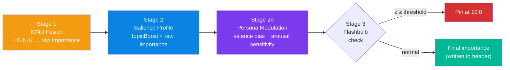
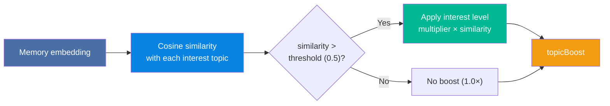
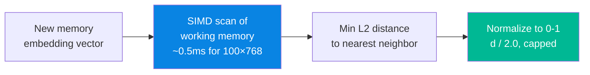

# Importance Fusion (ICNU)

The **ICNU Importance Fusion** system computes a memory's importance score at ingestion time by blending four signals: **Interest**, **Challenge**, **Novelty**, and **Urgency** — then applying **salience profile** topic boosts and **persona-based modulation**.

---

## The Problem

Without ICNU, importance is determined solely by the [Surprise Detector](dopamine.md) — a statistical outlier test based on how "surprising" a memory's embedding is relative to recent memories. This works well for detecting unusual information, but has blind spots:

- A memory about a user's **urgent deadline** might not be statistically surprising
- A memory about a **challenging technical problem** might have a common embedding
- A memory that the agent finds **interesting** has no way to signal that interest

ICNU adds three LLM-provided signals alongside the existing novelty signal, then layers salience profiles and persona traits on top to produce a richly personalized importance score.

---

## The Full Importance Pipeline



---

## Stage 1: ICNU Formula

$$
\text{rawImportance} = 0.05 + \left(\sum_{i \in \{I,C,N,U\}} w_i \cdot x_i\right) \times 9.95
$$

Where:

| Signal | Symbol | Range | Source |
|:---|:---:|:---:|:---|
| Interest | $x_I$ | [0, 1] | LLM-provided hint |
| Challenge | $x_C$ | [0, 1] | LLM-provided hint |
| Novelty | $x_N$ | [0, 1] | Computed from working memory scan |
| Urgency | $x_U$ | [0, 1] | LLM-provided hint |

The weights $w_i$ are configurable and auto-normalize to sum=1.0:

| Weight | Default | Rationale |
|:---|:---:|:---|
| $w_I$ (interest) | 0.30 | Agent engagement is a strong signal |
| $w_C$ (challenge) | 0.10 | Complexity is less important than novelty |
| $w_N$ (novelty) | 0.40 | Novelty is the strongest predictor of future usefulness |
| $w_U$ (urgency) | 0.20 | Time-sensitive information needs priority |

### Output Range

The formula maps to rawImportance ∈ **[0.05, 10.0]**:

- **0.05** — All signals zero (routine, uninteresting, familiar, non-urgent)
- **10.0** — All signals maximal (interesting, challenging, novel, urgent)

---

## Stage 2: Salience Profile Boost

After ICNU computes the raw importance, the [salience profile](salience-importance.md) applies a **topic boost** based on the user's declared interests and disinterests:

$$
\text{boostedImportance} = \text{rawImportance} \times \text{topicBoost}
$$

### How Topic Boost Works

The salience profile contains interest topics with pre-computed embeddings. At ingestion time, cosine similarity is computed between the memory and each interest:



### Interest Levels

| Level | Multiplier | Effect |
|---|---|---|
| `CRITICAL` | 2.0× | Doubles importance of matching memories |
| `HIGH` | 1.5× | 50% boost |
| `NORMAL` | 1.0× | No change (neutral) |
| `LOW` | 0.5× | Halves importance (mild suppression) |
| `IGNORE` | 0.1× | Near-total suppression |

### Example

```
Memory: "PostgreSQL query optimizer regression after upgrade"

Interest: "database performance" (CRITICAL, multiplier=2.0)
  cosine("database performance", memory) = 0.82  → above threshold
  topicBoost = 2.0 × 0.82 = 1.64

Disinterest: "meeting notes" (IGNORE, multiplier=0.1)
  cosine("meeting notes", memory) = 0.12  → below threshold
  → No dampening applied

Raw ICNU importance: 5.0
Boosted importance: 5.0 × 1.64 = 8.2
```

---

## Stage 2b: Persona Modulation

If the salience profile includes a [cognitive persona](salience-importance.md#stage-2b-persona-based-modulation), three additional traits modulate the importance:

| Trait | Effect on Importance |
|---|---|
| **Valence bias** | Shifts emotional baseline — pessimistic agents amplify threat memories |
| **Arousal sensitivity** | High-arousal events resist temporal decay more strongly |
| **Self-relevance boost** | Memories containing the persona's identity entities get extra importance |


See the [Salience & Persona Profiles](salience-importance.md#stage-2b-persona-based-modulation) page for full details on persona configuration.

---

## Novelty Computation

### How It Works

Novelty is computed using the **nearest-neighbor distance** in working memory — the minimum L2 distance between the incoming embedding and all existing working memory slots:



A high distance means the memory is genuinely novel — it's far from everything the agent has seen recently.

### Normalization

The raw distance is normalized to [0, 1] via:

$$
\text{noveltyNorm} = \min\left(\frac{d_{\text{nearest}}}{2.0}, 1.0\right)
$$

Where 2.0 is a configurable threshold representing "maximally novel."

---

## Ingestion Hints

The LLM provides hints at ingestion time with three signals:

| Hint | Range | Description |
|:---|:---:|:---|
| **interest** | [0, 1] | How relevant the agent finds this information |
| **challenge** | [0, 1] | Complexity or difficulty level |
| **urgency** | [0, 1] | Time sensitivity |

Novelty is computed automatically from working memory — the LLM does not provide it.

### Safety Features

- **Clamping**: All values are clamped to [0.0, 1.0] on input
- **Fallback**: When no hints are provided, the system falls back to novelty-only mode (backward compatible)
- **Gaming detection**: If all hints are maximal (I=1.0, C=1.0, U=1.0), a warning is logged

---

## Configuration

### ICNU Fusion Weights

Custom weights can be configured via the builder:

```
SpectorMemory.builder()
    .icnuWeights(interest: 0.4, challenge: 0.1, novelty: 0.3, urgency: 0.2)
    .build()
```

### Salience Profile Weights

Salience profiles can override ICNU weights per-user when the tenant policy allows:

```json
{
  "icnuWeights": { "I": 0.40, "C": 0.10, "N": 0.30, "U": 0.20 },
  "interests": ["database performance", "security"],
  "persona": {
    "valenceBias": -40,
    "arousalSensitivity": 1.8
  }
}
```

### Built-in Weight Presets

| Preset | I | C | N | U | Use Case |
|:---|:---:|:---:|:---:|:---:|:---|
| `DEFAULT` | 0.30 | 0.10 | 0.40 | 0.20 | General-purpose |
| `NOVELTY_ONLY` | 0.00 | 0.00 | 1.00 | 0.00 | Backward-compatible |

### Weight Auto-Normalization

Weights are automatically normalized on construction. For example, weights of (1, 1, 1, 1) become (0.25, 0.25, 0.25, 0.25).

---

## Worked Example

Agent ingests: *"User has a production outage — database connections exhausted"*

**Stage 1: ICNU Fusion**

| Signal | Value | Source |
|:---|:---:|:---|
| Interest | 0.7 | LLM hint — agent finds this relevant |
| Challenge | 0.5 | LLM hint — moderate complexity |
| Novelty | 0.9 | Working memory scan — nothing like this recently |
| Urgency | 1.0 | LLM hint — production outage |

With default weights:

$$
\text{weighted} = 0.30 \times 0.7 + 0.10 \times 0.5 + 0.40 \times 0.9 + 0.20 \times 1.0 = 0.81
$$

$$
\text{rawImportance} = 0.05 + 0.81 \times 9.95 = \mathbf{8.11}
$$

**Stage 2: Salience Profile Boost**

The user has a salience profile with "database performance" as a `CRITICAL` interest:

$$
\text{topicBoost} = 2.0 \times \cos(\text{memory}, \text{"database performance"}) = 2.0 \times 0.85 = 1.70
$$

$$
\text{boostedImportance} = \min(8.11 \times 1.70, 10.0) = \mathbf{10.0} \text{ (capped)}
$$

**Stage 2b: Persona Modulation**

The user has a pessimistic valence bias (−40) — this memory describes a failure/outage, so the negative valence aligns with the bias, providing an additional decay resistance boost.

**Final importance**: **10.0** — this memory will be pinned as a flashbulb event.

---

## MCP Integration

When using the MCP tools, importance fusion happens automatically if the ingestion tool provides hints:

```json
{
  "name": "memory_remember",
  "arguments": {
    "id": "outage-2024-01",
    "text": "Production database connections exhausted at 2AM",
    "tags": "production,database,outage",
    "hints": {
      "interest": 0.7,
      "challenge": 0.5,
      "urgency": 1.0
    }
  }
}
```

!!! note "Backward Compatibility"
    The `hints` field is optional. When omitted, importance is computed using novelty-only mode — identical to the pre-ICNU behavior. Salience profiles and persona modulation are applied regardless of whether hints are provided.

---

## Next Steps

- :material-star-shooting: [**Salience & Persona Profiles**](salience-importance.md) — topic interests, persona modulation, hierarchical merge
- :material-flash: [**Dopamine — Surprise Detection**](dopamine.md) — the biological novelty model
- :material-brain: [**Scoring Pipeline**](scoring-pipeline.md) — the 6-phase SIMD scoring engine
- :material-tag: [**Cognitive Profiles**](cognitive-profiles.md) — how profiles interact with importance
