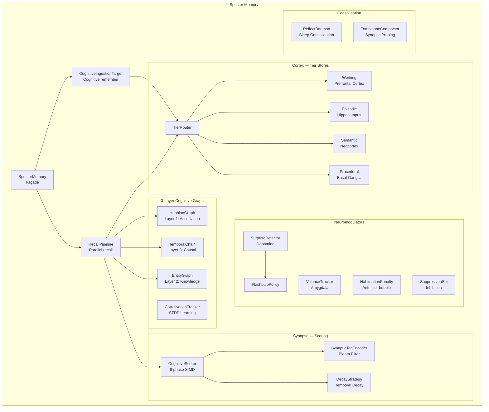

# 🧠 Cognitive Memory

!!! quote "The Vision"
    Legacy AI frameworks bolt memory onto flat vector databases. Spector Memory is designed from the ground up as a **cognitive memory engine** — a biologically-inspired system where memories have importance, emotions, temporal decay, and contextual tags. It's the difference between a filing cabinet and a brain.

---

## The 4-Tier Memory Architecture

Just as the human brain has distinct memory systems, Spector organizes memories into four cognitive tiers to match their biological functions:

=== "🧪 Working Memory"

    **Biological analog: Prefrontal Cortex**
    
    Volatile, limited-capacity buffer for the current task context. Operates as a circular buffer where the oldest entries are automatically evicted when capacity is reached.
    
    - **Capacity**: Configurable (default: 100 records)
    - **Storage**: In-memory segment (volatile)
    - **Use case**: "What was the user just talking about?"

=== "📝 Episodic Memory"

    **Biological analog: Hippocampus**
    
    Time-stamped event records representing autobiographical history. Partitioned by day and backed by memory-mapped files for persistence across restarts. Supports sleep consolidation into semantic memory.
    
    - **Capacity**: Unbounded (time-partitioned)
    - **Storage**: High-performance memory-mapped partitions (persistent)
    - **Use case**: "What error did we debug yesterday?"

=== "🧬 Semantic Memory"

    **Biological analog: Neocortex**
    
    Distilled, permanent world knowledge and facts. Created by consolidation (sleep cycles) from episodic clusters, or directly by the user. Supports two modes:
    
    - **Partitioned Mode** (default): Rolling partition files with parallel retrieval.
    - **Single-File Mode**: In-memory slab for light deployments.
    
    - **Capacity**: Unbounded in partitioned mode (configurable per-partition, default: 10,000 records)
    - **Recall**: Parallel scan across partitions using virtual threads
    - **Compaction**: Per-partition rebuilds performed live during operation
    - **Use case**: "The user prefers dark mode."

=== "⚙️ Procedural Memory"

    **Biological analog: Basal Ganglia**
    
    Learned procedures, rules, and behavioral guidelines. A small, append-only store for rules that shape the agent's reasoning.
    
    - **Capacity**: Configurable (default: 500 records)
    - **Storage**: In-memory segment (persistent via write-ahead log replay)
    - **Use case**: "Always use exponential backoff for retries."

---

## The Biological Metaphor

Spector Memory maps every major cognitive subsystem from neuroscience to a dedicated system package:

---

## What Makes This Different

Every AI memory solution today wraps a scripting layer around Postgres/pgvector or a standard vector database. They suffer from:

- **Network latency**: 50-200ms per query (HTTP → DB → HTTP)
- **Global Interpreter Lock**: Sequential embedding and scoring under a lock
- **Post-filtering trap**: Retrieve top-K by similarity, then filter by importance or time — losing old but critical memories

Spector Memory collapses the entire cognitive stack onto a **zero-overhead, off-heap memory store** with hardware-accelerated scoring. The result:

| Metric | Traditional Python Layer | **Spector Memory** |
|---|---|---|
| Query latency (1M memories) | 50-200ms | **0.13ms** † |
| GC pauses | Unpredictable | **≤0.01%** (100% off-heap) † |
| Scoring pipeline | Post-filter (lossy) | **Fused SIMD** (lossless) |
| Concurrent queries | Lock-limited | **61,000 QPS** (Virtual Threads) † |
| Memory per record | ~500B (Object wrappers) | **Compact binary header + vector** |

† *Measured on Intel Core Ultra 9 285K, Java 25, AVX2. See [Benchmarks](performance.md).*

---

## Explore the Documentation

-   :material-brain:{ .lg .middle } **System Architecture**

    ---

    Package hierarchy, data flow diagrams, and extensibility model

    [:octicons-arrow-right-24: Architecture](architecture.md)

-   :material-lightning-bolt:{ .lg .middle } **6-Phase Scoring Pipeline**

    ---

    Deep dive into the SIMD hot-loop: tombstone → tags → valence → importance → L2 → fused score

    [:octicons-arrow-right-24: Scoring Pipeline](scoring-pipeline.md)

-   :material-share-variant:{ .lg .middle } **3-Layer Cognitive Graph**

    ---

    Hebbian association, LLM-powered entity-relationship knowledge, and temporal causal chains — three graph structures that augment vector recall with multi-hop reasoning

    [:octicons-arrow-right-24: Cognitive Graph](hebbian.md)

-   :material-head-cog:{ .lg .middle } **Biological Systems**

    ---

    Each brain region mapped to code: Cortex, Hippocampus, Synapse, Dopamine, Amygdala, Habituation, Inhibition

    [:octicons-arrow-right-24: Start with Cortex](cortex.md)

-   :material-speedometer:{ .lg .middle } **Performance & SIMD**

    ---

    Benchmark results, SIMD kernel throughput, optimization techniques, virtual thread scaling

    [:octicons-arrow-right-24: Performance](performance.md)

-   :material-memory:{ .lg .middle } **Off-Heap Panama Design**

    ---

    Zero-GC architecture, MemorySegment lifecycle, mmap partitions, 64-byte CognitiveRecord binary format

    [:octicons-arrow-right-24: Panama Design](panama-design.md)

-   :material-chart-bar:{ .lg .middle } **Cognitive Evaluation**

    ---

    Detailed test methodology, evaluation results, statistical comparisons, and the Mike Thompson dataset

    [:octicons-arrow-right-24: Evaluation & Results](evaluation.md)

-   :material-api:{ .lg .middle } **API Reference**

    ---

    SpectorMemory.Builder, RecallOptions, CognitiveResult, MemoryType — full method signatures

    [:octicons-arrow-right-24: API Reference](api-reference.md)

