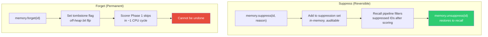
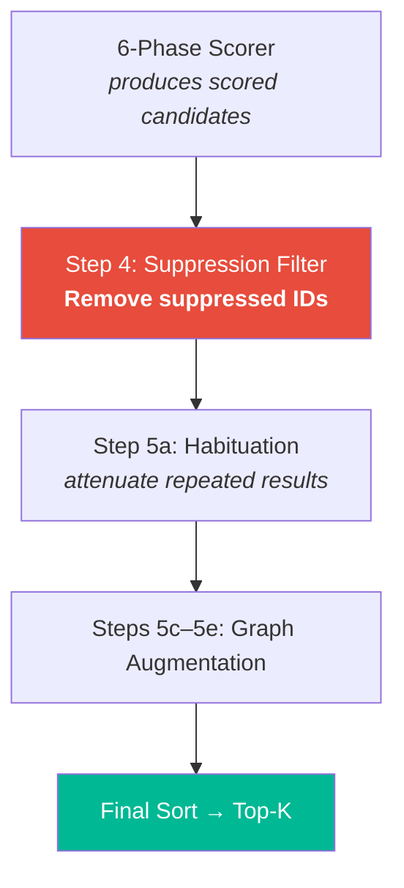

# 🚫 Inhibition — Suppression

> **Biological Analog**: **Retrieval-Induced Forgetting** (Anderson et al., 1994) — the brain actively suppresses competing memories during recall. When you try to remember where you parked today, your brain inhibits memories of yesterday's parking spot. This is an active process, not passive decay.

---

## The Concept

Suppression is different from forgetting:

| Operation | API | Effect | Reversible? |
|---|---|---|---|
| **Forget** | `memory.forget(id)` | Tombstones the record — permanently excluded from all scans | No |
| **Suppress** | `memory.suppress(id, reason)` | Adds to suppression set — excluded from recall results | **Yes** |

Tombstoning modifies the off-heap flags byte (bit 0 = 1). Suppression maintains a separate in-memory set — the underlying memory is untouched and can be un-suppressed later.

---

## How It Works



**Performance difference**: Tombstoned memories are skipped in Phase 1 of the scorer (~1 cycle). Suppressed memories go through the full 6-phase scoring pipeline and are only filtered afterward. For bulk removal, `forget()` is more efficient.

---

## Where It Fits in the Pipeline

Suppression is checked **after** the 6-phase scorer completes but **before** habituation:



---

## Use Cases

### 1. User Redaction

```
User: "Please forget what I said about project X"
→ memory.suppress("project-x-conversation-1", "User requested redaction")
→ memory.suppress("project-x-conversation-2", "User requested redaction")
```

### 2. Context Switching

```
Agent switching to backend work:
→ memory.suppress("frontend-task-context", "Switching to backend work")

Later, switching back:
→ memory.unsuppress("frontend-task-context")
```

### 3. Stale Data Quarantine

```
Data source under validation:
→ memory.suppress(staleIds, "Source under validation — suppressed until confirmed")
```

### 4. A/B Testing Memory Strategies

```
Suppress certain memories to test agent performance without them:
→ experimentGroup.forEach(id → memory.suppress(id, "A/B test: control group"))
```

---

## Next Steps

- :material-speedometer: [**Performance**](performance.md) — benchmark results and optimization techniques
- :material-sleep: [**Habituation — Anti-Filter Bubble**](habituation.md) — automatic score attenuation
- :material-brain: [**Architecture**](architecture.md) — where suppression fits in the pipeline
