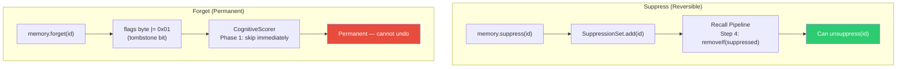

# 🚫 Inhibition — Suppression

> **Package**: `com.spectrayan.spector.memory.inhibition`
>
> **Biological Analog**: **Retrieval-Induced Forgetting** (Anderson et al., 1994) — the brain actively suppresses competing memories during recall. When you try to remember where you parked today, your brain inhibits memories of yesterday's parking spot. This is an active process, not passive decay.

---

## The Concept

Suppression is different from forgetting:

| Operation | Method | Effect | Reversible? |
|---|---|---|---|
| **Forget** | `memory.forget(id)` | Tombstones the record — permanently excluded from all scans | No |
| **Suppress** | `memory.suppress(id, reason)` | Adds to suppression set — excluded from recall results | **Yes** |

Tombstoning modifies the off-heap flags byte (bit 0 = 1). Suppression maintains a separate in-memory set — the underlying memory is untouched and can be un-suppressed later.

---

## SuppressionSet

```java
public final class SuppressionSet {
    
    private final ConcurrentHashMap<String, String> suppressed = new ConcurrentHashMap<>();
    
    /**
     * Suppresses a memory — it will be excluded from all future recall results.
     *
     * @param memoryId the memory to suppress
     * @param reason   human-readable reason (for auditability)
     */
    public void suppress(String memoryId, String reason) {
        suppressed.put(memoryId, reason != null ? reason : "");
    }
    
    /**
     * Removes suppression — the memory will appear in recall results again.
     */
    public void unsuppress(String memoryId) {
        suppressed.remove(memoryId);
    }
    
    /**
     * Checks if a memory is currently suppressed.
     * Called at Step 4 of the recall pipeline.
     */
    public boolean isSuppressed(String memoryId) {
        return suppressed.containsKey(memoryId);
    }
    
    /**
     * Returns the number of currently suppressed memories.
     */
    public int size() {
        return suppressed.size();
    }
}
```

---

## Integration with RecallPipeline

Suppression is checked at **Step 4** of the recall pipeline — after scoring but before habituation:

```java
// Step 4: Filter suppressed memories (inhibition)
allResults.removeIf(r -> suppressionSet.isSuppressed(r.id()));
```

**Timing matters**: Suppression is checked *after* the CognitiveScorer completes. This means suppressed memories still consume SIMD cycles during scoring. For high-frequency suppression scenarios, consider using `forget()` instead.

---

## Use Cases

### 1. User Redaction

```java
// User says: "Please forget what I said about project X"
memory.suppress("project-x-conversation-1", "User requested redaction");
memory.suppress("project-x-conversation-2", "User requested redaction");
```

### 2. Context Switching

```java
// Agent is switching tasks — suppress irrelevant context
memory.suppress("frontend-task-context", "Switching to backend work");

// Later, when switching back:
memory.unsuppress("frontend-task-context");
```

### 3. Stale Data Quarantine

```java
// A data source is known to be stale — suppress while validating
for (String id : staleSourceMemories) {
    memory.suppress(id, "Source under validation — suppressed until confirmed");
}
```

### 4. A/B Testing Memory Strategies

```java
// Suppress certain memories to test how the agent performs without them
experimentGroup.forEach(id -> 
    memory.suppress(id, "A/B test: control group"));
```

---

## Suppression vs. Tombstone



**Performance difference**: Tombstoned memories are skipped in Phase 1 of the scorer (~1 cycle). Suppressed memories go through the full 6-phase scoring pipeline and are only filtered at Step 4 of the recall pipeline. For bulk suppression, `forget()` is more efficient.

---

## Next Steps

- :material-speedometer: [**Performance**](performance.md) — benchmark results and optimization techniques
- :material-sleep: [**Habituation — Anti-Filter Bubble**](habituation.md) — automatic score attenuation
- :material-brain: [**Architecture**](architecture.md) — where suppression fits in the pipeline
