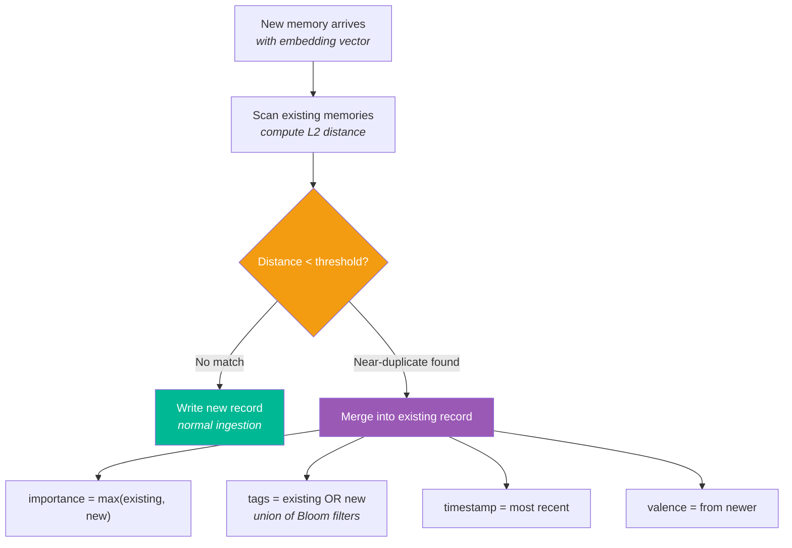
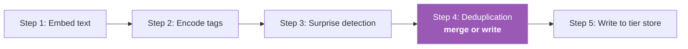

# 🔀 Interference — Deduplication

> **Biological Analog**: **Proactive interference** occurs when old memories interfere with new learning. If you move to a new city, your old address "interferes" when you try to recall the new one. The brain resolves this by strengthening the newer trace and weakening the old one.

---

## The Problem

Without deduplication, an agent remembering the same fact repeatedly creates redundant entries:

```
memory[0]: "User prefers dark mode"     importance=0.8
memory[1]: "User prefers dark mode"     importance=0.7
memory[2]: "The user likes dark mode"   importance=0.9  ← near-duplicate
```

These compete during recall, waste storage, and dilute the Hebbian co-activation signal.

---

## How It Works

The deduplication system detects near-duplicates by computing L2 distance between the new memory's vector and existing memories. When a match is found within a configurable threshold, it **merges** rather than creating a new record:



### Merge Rules

| Field | Strategy | Rationale |
|---|---|---|
| `importance` | `max(existing, new)` | Keep the highest importance signal |
| `synapticTags` | `existing OR new` | Union of Bloom filters — broader context |
| `timestamp` | Most recent | Memory is "refreshed" |
| `recallCount` | Preserved | Reconsolidation history maintained |
| `valence` | From newer | Most recent emotional assessment |

---

## Where It Fits

Deduplication runs during the **ingestion pipeline** — after embedding but before writing. If a merge occurs, no new record is created — the existing record is updated in-place:



---

## Next Steps

- :material-clock: [**Prospective — Future Intents**](prospective.md) — time-triggered reminders
- :material-brain: [**Architecture**](architecture.md) — where deduplication fits in the pipeline
