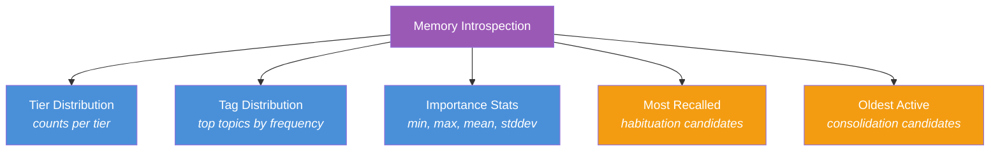
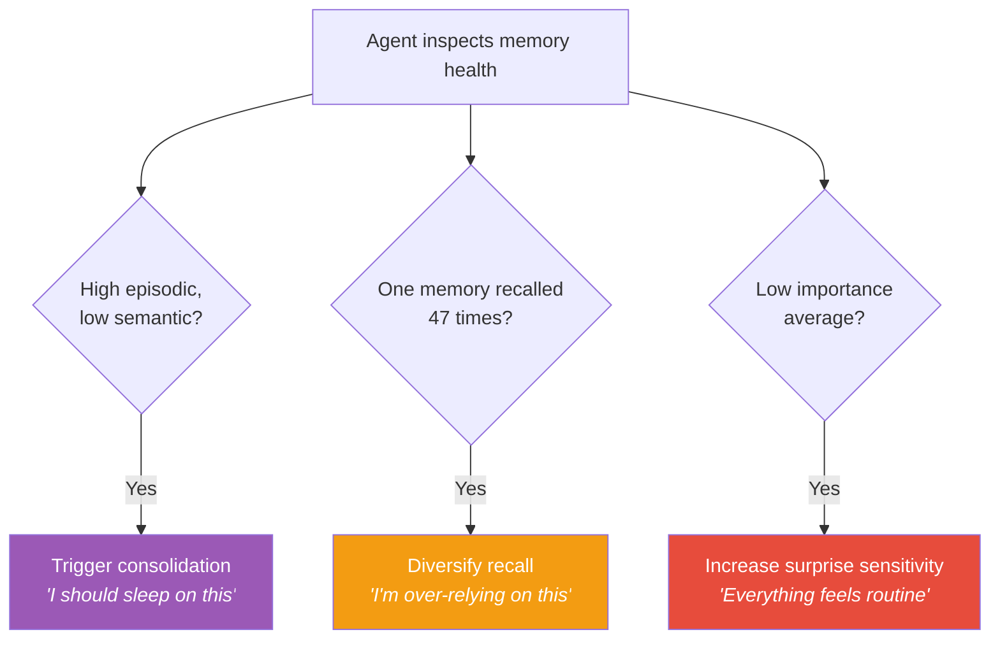

# 🪞 Metamemory — Self-Reflection

> **Biological Analog**: **Metamemory** is the awareness of one's own memory processes — "I know I'm forgetting things more often" or "I'm confident I remember this correctly." It's what enables humans to say "I need to write this down" or "Let me double-check that."

---

## The Concept

The introspection system provides analytics and health metrics for the memory system, enabling agents to **reason about their own memory state** and adapt their behavior accordingly.

---

## Available Insights

| Insight | What It Reveals | Actionable Signal |
|---|---|---|
| **Tier distribution** | Working: 50, Episodic: 12K, Semantic: 200 | Imbalance → trigger consolidation |
| **Tag distribution** | "database": 3K, "error": 2K, "deploy": 500 | Topic concentration → diversify or focus |
| **Importance stats** | mean: 0.45, stddev: 0.12 | Low mean → increase surprise sensitivity |
| **Most recalled** | Memory X recalled 47 times | Over-reliance → diversify or suppress |
| **Oldest active** | Memory Y is 6 months old, never promoted | Stale content → consolidate or forget |

---

## Adaptive Agent Behavior

An agent can use metamemory signals to self-optimize:

### Example Scenarios

| Observation | Agent Response |
|---|---|
| 90% episodic, 2% semantic | "I should consolidate — trigger a reflect cycle" |
| One memory dominates all queries | "I'm over-relying on this — increase habituation rate" |
| Average importance is 0.2 | "Most memories are routine — lower the surprise threshold" |
| 500 memories tagged "error" | "I'm seeing too many errors — escalate to the user" |

---

## Next Steps

- :material-sync: [**Sync — Persistence & Replication**](sync.md) — WAL and CRDT merge
- :material-brain: [**Architecture**](architecture.md) — system overview
