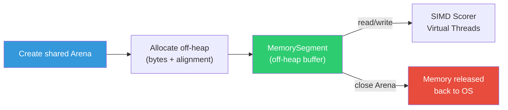
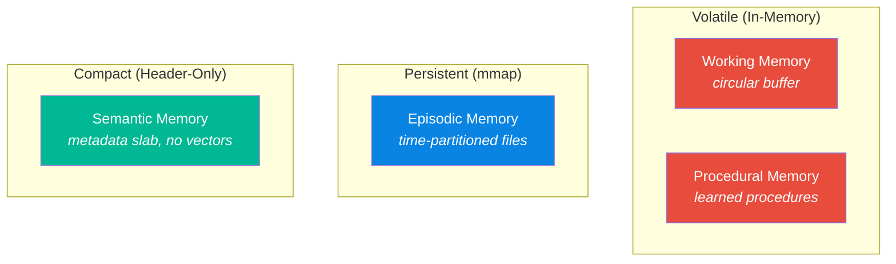
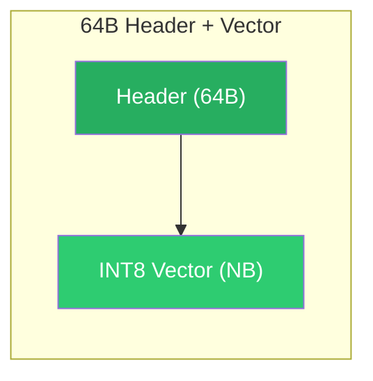

# 💾 Off-Heap Panama Design

Spector Memory achieves **zero garbage collection pressure** by storing all vector data and cognitive headers off-heap using Java Project Panama's Foreign Function & Memory API. No memory record ever touches the JVM heap.

---

## Why Off-Heap?

In a standard JVM application, objects live on the heap and are managed by the garbage collector. For AI memory workloads, this creates problems:

| On-Heap (Traditional)                           | Off-Heap (Panama)                                |
| ----------------------------------------------- | ------------------------------------------------ |
| GC pauses (10-100ms for large heaps)            | **Zero GC pauses** — data is invisible to GC     |
| Object overhead (16-24 bytes per object header) | **Zero overhead** — raw bytes, no object headers |
| Memory fragmentation over time                  | **Compact** — contiguous byte arrays             |
| Heap size limits JVM config                     | **System memory** — limited only by OS           |
| Serialization required for persistence          | **Direct mmap** — bytes are already on disk      |

---

## Panama Architecture

### MemorySegment — The Core Abstraction

Every memory record is stored in a `MemorySegment` — a contiguous off-heap byte buffer managed by an `Arena`. Fields are read and written directly at byte offsets — no Java objects are created, no deserialization occurs.

**Key properties**:

- **Shared Arena** — thread-safe for concurrent reads across Virtual Threads
- **64-byte alignment** — ensures SIMD-friendly access patterns and cache-line-aligned header reads
- **GC-invisible** — the garbage collector never sees this memory

### Arena Lifecycle



!!! warning "Lifetime Management"
    Unlike heap objects, off-heap memory is **not garbage collected**. You must explicitly close the `Arena` when done. `SpectorMemory` implements `AutoCloseable` and closes all arenas in its `close()` method. Always use try-with-resources.

---

## Three Storage Modes



### 1. Arena-Allocated (Working, Procedural)

Volatile, in-memory segments for transient data.

**Characteristics**:

- Fast allocation (~1µs)
- Lost on JVM shutdown
- No file I/O overhead
- Fixed capacity

### 2. mmap-Backed (Episodic)

Persistent, memory-mapped files for durable storage. The OS handles paging data between RAM and disk.

**Characteristics**:

- Persists across JVM restarts
- OS handles paging to/from disk
- Lazy loading — only mapped pages are in physical RAM
- Atomic flush for durability

### 3. Header-Only Slab (Semantic)

Compact metadata-only storage (no vectors).

**Characteristics**:

- Minimal memory footprint (64B per record vs. ~832B for full records)
- Fast metadata scans (tag match, importance, valence, arousal)
- No vector data — re-embed at query time if needed

---

## Binary Record Format

### Versioned Header Layout

The cognitive record format uses a **64-byte cache-line-aligned header** via the `HeaderLayout` sealed interface. The header occupies exactly one CPU cache line for optimal sequential scan performance. See [Synapse — Tags & Scoring](synapse.md) for the full byte-level specification.



### Layout (64 bytes) — Cache-Line Aligned

```
 0                   1                   2                   3
 0 1 2 3 4 5 6 7 8 9 0 1 2 3 4 5 6 7 8 9 0 1 2 3 4 5 6 7 8 9 0 1
+-+-+-+-+-+-+-+-+-+-+-+-+-+-+-+-+-+-+-+-+-+-+-+-+-+-+-+-+-+-+-+-+
| ver(1B)|flg(1B)| val(1B)| aro(1B)| importance (4B)            |  ← Offset 0
+-+-+-+-+-+-+-+-+-+-+-+-+-+-+-+-+-+-+-+-+-+-+-+-+-+-+-+-+-+-+-+-+
|                                                               |
+                      timestamp (8B)                           +  ← Offset 8
|                                                               |
+-+-+-+-+-+-+-+-+-+-+-+-+-+-+-+-+-+-+-+-+-+-+-+-+-+-+-+-+-+-+-+-+
|              agent_recall_count (4B)                          |  ← Offset 16
+-+-+-+-+-+-+-+-+-+-+-+-+-+-+-+-+-+-+-+-+-+-+-+-+-+-+-+-+-+-+-+-+
|              exact_norm (4B)                                  |  ← Offset 20
+-+-+-+-+-+-+-+-+-+-+-+-+-+-+-+-+-+-+-+-+-+-+-+-+-+-+-+-+-+-+-+-+
|                                                               |
+                    synapticTags (8B)                          +  ← Offset 24
|                                                               |
+-+-+-+-+-+-+-+-+-+-+-+-+-+-+-+-+-+-+-+-+-+-+-+-+-+-+-+-+-+-+-+-+
|  centroid_id (2B) |  _pad0 (2B) | storage_strength (4B)       |  ← Offset 32
+-+-+-+-+-+-+-+-+-+-+-+-+-+-+-+-+-+-+-+-+-+-+-+-+-+-+-+-+-+-+-+-+
|      spector_recall_cnt (4B)    |   _reserved_f1 (4B)         |  ← Offset 40
+-+-+-+-+-+-+-+-+-+-+-+-+-+-+-+-+-+-+-+-+-+-+-+-+-+-+-+-+-+-+-+-+
|                                                               |
+                    last_auto_ltp (8B)                         +  ← Offset 48
|                                                               |
+-+-+-+-+-+-+-+-+-+-+-+-+-+-+-+-+-+-+-+-+-+-+-+-+-+-+-+-+-+-+-+-+
|                                                               |
+                    _reserved_l1 (8B)                          +  ← Offset 56
|                                                               |
+-+-+-+-+-+-+-+-+-+-+-+-+-+-+-+-+-+-+-+-+-+-+-+-+-+-+-+-+-+-+-+-+
|                                                               |
+              Quantized Vector — INT8[N]                       +  ← Offset 64
|              (dequantize: float = byte × scale + min)         |
+-+-+-+-+-+-+-+-+-+-+-+-+-+-+-+-+-+-+-+-+-+-+-+-+-+-+-+-+-+-+-+-+
                  stride = 64 + N bytes per record
```

### Memory Cost

| Header | Stride (768-dim) | 1M Records | Alignment           |
| :----- | :--------------: | :--------: | :------------------ |
| 64B    |       832B       |  ~793 MB   | 1× cache line (64B) |

### Field Access Patterns

The header layout is designed for **sequential access** in the scoring hot-loop. Fields are ordered by access frequency:

```
Phase 1: flags        (offset 1,  1B)  — First check, highest skip rate
Phase 2: synapticTags (offset 24, 8B)  — Second check, eliminates 99%
Phase 3: valence      (offset 2,  1B)  — Third check (profile-dependent)
Phase 4: importance   (offset 4,  4B)  — Fourth check
Phase 4: timestamp    (offset 8,  8B)  — Read with importance
Phase 4: recallCount  (offset 16, 4B)  — Reconsolidation adjustment
Phase 4: arousal      (offset 3,  1B)  — Arousal-modulated decay
Phase 4: storageStr   (offset 36, 4B)  — Two-Factor S(t)
Phase 5: vector       (offset 64, NB)  — Only if all filters pass
```

!!! tip "Cache Line Optimization"
    The 64-byte header occupies exactly **one CPU cache line**. During sequential scans, each header read hits exactly one cache line — no split-line loads, no false sharing. The CPU prefetcher can pre-fetch the next record's header while the current one is being scored.

---

## Episodic Partition File Format

Each episodic partition file has a 64-byte metadata header:

```
Offset   Size   Field            Description
──────   ────   ─────            ───────────
  0       4B    magic            0x45504943 ("EPIC" in ASCII)
  4       4B    version          Format version (1)
  8       4B    count            Number of live records
 12       4B    tombstoneCount   Number of tombstoned records
 16       4B    capacity         Maximum records in partition
 20       4B    state            PartitionState ordinal
 24       4B    stride           Record stride in bytes
 28      36B    reserved         Future use (alignment padding)
```

**File naming**: `episodic-{yyyyMMdd}.mem` (e.g., `episodic-20260527.mem`)

**Partition capacity**: Default 10,000 records per partition. At 832 bytes/record (768-dim INT8), each partition file is ~8 MB.

---

## Thread Safety Model

| Component              | Thread Safety       | Mechanism                          |
| ---------------------- | ------------------- | ---------------------------------- |
| Shared Arena           | ✅ Concurrent reads | Built-in Panama support            |
| Segment reads          | ✅ Lock-free        | Direct memory access               |
| Segment writes         | ⚠️ Single writer    | Synchronized on partition append   |
| Reverse index          | ✅ Lock-free reads  | CAS-based updates                  |
| Partition metadata     | ⚠️ Single writer    | Metadata header writes serialized  |

**Recall**: Multiple Virtual Threads read different partitions concurrently — zero contention because each partition's `MemorySegment` is disjoint.

**Ingestion**: Writes are serialized per partition (one writer at a time) but different partitions can accept writes concurrently.

---

## Zero-Copy Data Path


> **No Java objects created. No serialization. No deserialization. No GC pressure.**

The entire data path from persistent storage to CPU computation operates on **raw bytes**. The JVM heap is used only for the top-K result set — typically 5-20 small result records.

---

## Next Steps

- :material-speedometer: [**Performance**](performance.md) — benchmark results
- :material-brain: [**Architecture**](architecture.md) — system design
- :material-lightning-bolt: [**6-Phase Scoring Pipeline**](scoring-pipeline.md) — the SIMD hot-loop
- :material-tag: [**Synapse — Tags & Scoring**](synapse.md) — versioned header byte maps, arousal decay, Bloom filter
- :material-flask: [**Labs — Research Roadmap**](../labs/roadmap.md) — Dynamic Quantization (SQ4), Two-Factor Memory
