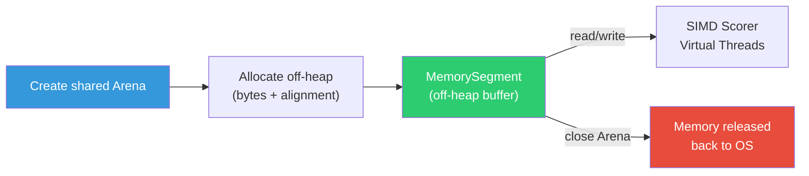
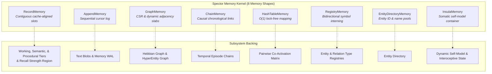
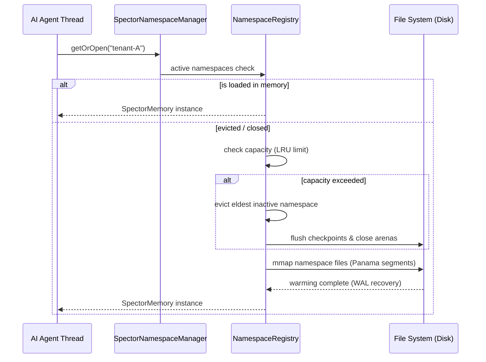
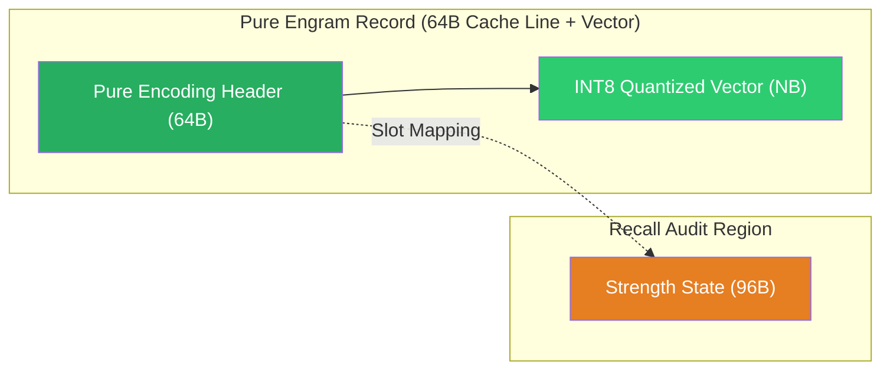

# 💾 Off-Heap Panama Design

Spector Memory achieves **zero garbage collection pressure** by storing all vector data and cognitive headers off-heap using Java Project Panama's Foreign Function & Memory API. No memory record ever touches the JVM heap.

---

## Why Off-Heap?

In a standard JVM application, objects live on the heap and are managed by the garbage collector. For AI memory workloads, this creates problems:

| On-Heap (Traditional)                           | Off-Heap (Panama)                                |
| ----------------------------------------------- | ------------------------------------------------ |
| GC pauses (10-100ms for large heaps)            | **Zero GC pauses** — data is invisible to GC     |
| Object overhead (16-24 bytes per object header) | **Zero overhead** — raw bytes, no object headers |
| Memory fragmentation over time                  | **Compact** — contiguous byte arrays             |
| Heap size limits JVM config                     | **System memory** — limited only by OS           |
| Serialization required for persistence          | **Direct mmap** — bytes are already on disk      |

---

## Panama Architecture

### MemorySegment — The Core Abstraction

Every memory record is stored in a `MemorySegment` — a contiguous off-heap byte buffer managed by an `Arena`. Fields are read and written directly at byte offsets — no Java objects are created, no deserialization occurs.

**Key properties**:

- **Shared Arena** — thread-safe for concurrent reads across Virtual Threads
- **64-byte alignment** — ensures SIMD-friendly access patterns and cache-line-aligned header reads
- **GC-invisible** — the garbage collector never sees this memory

### Arena Lifecycle

```mermaid
graph LR
    A["Create shared Arena"] --> B["Allocate off-heap<br/>(bytes + alignment)"]
    B --> C["MemorySegment<br/>(off-heap buffer)"]
    C -->|"read/write"| D["SIMD Scorer<br/>Virtual Threads"]
    C -->|"close Arena"| E["Memory released<br/>back to OS"]

    style A fill:#3498db,color:white
    style C fill:#2ecc71,color:white
    style E fill:#e74c3c,color:white
```

!!! warning "Lifetime Management"
    Unlike heap objects, off-heap memory is **not garbage collected**. You must explicitly close the `Arena` when done. `SpectorMemory` implements `AutoCloseable` and closes all arenas in its `close()` method. Always use try-with-resources.

---

## Spector Memory Kernel Shapes

Spector Memory maps high-level cognitive subsystems to a unified storage hierarchy managed by the Spector Memory Kernel (`spector-kernel`). Every off-heap native segment maps to one of eight canonical **Memory Shapes**:

```mermaid
flowchart TD
    subgraph "Spector Memory Kernel (8 Memory Shapes)"
        RM["RecordMemory<br/><i>Contiguous cache-aligned slots</i>"]
        AM["AppendMemory<br/><i>Sequential cursor log</i>"]
        GM["GraphMemory<br/><i>CSR & dynamic adjacency slabs</i>"]
        CM["ChainMemory<br/><i>Causal chronological links</i>"]
        HM["HashTableMemory<br/><i>O(1) lock-free mapping</i>"]
        YM["RegistryMemory<br/><i>Bidirectional symbol interning</i>"]
        EM["EntityDirectoryMemory<br/><i>Entity ID & name pools</i>"]
        IM["InsulaMemory<br/><i>Somatic self-model container</i>"]
    end

    subgraph "Subsystem Backing"
        RM_C["Working, Semantic, & Procedural Tiers<br/>& Recall Strength Region"]
        AM_C["Text Blobs & Memory WAL"]
        GM_C["Hebbian Graph & HyperEntity Graph"]
        CM_C["Temporal Episode Chains"]
        HM_C["Pairwise Co-Activation Matrix"]
        YM_C["Entity & Relation Type Registries"]
        EM_C["Entity Directory"]
        IM_C["Dynamic Self-Model & Interoceptive State"]
    end

    RM -.-> RM_C
    AM -.-> AM_C
    GM -.-> GM_C
    CM -.-> CM_C
    HM -.-> HM_C
    YM -.-> YM_C
    EM -.-> EM_C
    IM -.-> IM_C
```

For full details on the memory shapes, see [Typed Memory Shapes](../kernel/shapes.md).

## Namespace Management & Multi-Tenant Isolation

To manage resource boundaries for multiple concurrent AI agents/conversations, Spector uses the `NamespaceRegistry` and `SpectorNamespaceManager`:

```mermaid
sequenceDiagram
    participant Agent as AI Agent Thread
    participant Mgr as SpectorNamespaceManager
    participant Reg as NamespaceRegistry
    participant FS as File System (Disk)

    Agent->>Mgr: getOrOpen("tenant-A")
    Mgr->>Reg: active namespaces check
    alt is loaded in memory
        Reg-->>Agent: SpectorMemory instance
    else evicted / closed
        Reg->>Reg: check capacity (LRU limit)
        alt capacity exceeded
            Reg->>Reg: evict eldest inactive namespace
            Reg->>FS: flush checkpoints & close arenas
        end
        Reg->>FS: mmap namespace files (Panama segments)
        FS-->>Reg: warming complete (WAL recovery)
        Reg-->>Agent: SpectorMemory instance
    end
```

### LRU Eviction & Resource Protection
*   **Active Capacity Limits:** Defines the maximum number of concurrent active namespaces mapped in RAM.
*   **Lease Gating:** Threads call `.acquireLease()` when executing queries. Lease-locked namespaces are guaranteed **never** to be evicted mid-query, even if capacity is exceeded.
*   **Warming Cache Replay:** When a namespace is reopened, the kernel maps segments and processes the local WAL events via the `WalRecoveryDispatcher` to restore exact state before query dispatch.

---

## Binary Record Format & Telemetry Separation

The cognitive record format uses a **64-byte cache-line-aligned pure encoding header** paired with quantized vector data, while isolating all mutable telemetry into a dedicated 96-byte strength audit region:

```mermaid
graph LR
    subgraph "Pure Engram Record (64B Cache Line + Vector)"
        H["Pure Encoding Header (64B)"] --> V["INT8 Quantized Vector (NB)"]
    end
    subgraph "Recall Audit Region"
        S["Strength State (96B)"]
    end
    H -.->|Slot Mapping| S

    style H fill:#27ae60,color:white
    style V fill:#2ecc71,color:white
    style S fill:#e67e22,color:white
```

For complete byte-level offsets and specifications of the 64-byte encoding header, 128-bit synaptic Bloom tags, and 96-byte strength state, see [Binary Record Specifications & Synaptic Header](../kernel/layouts.md).

---

## Bundle Storage Containers
 
Rather than fragmenting data across dozens of flat files, Spector uses the unified **Bundle Architecture**:
- **`runtime.bundle`**: Single memory-mapped container within a cognitive namespace hosting working memory, live graphs, and the dynamic somatic self-model (`InsulaMemory`).
- **`partition.bundle`**: Time-partitioned bundles (`partitions/{seq}/partition.bundle`) hosting long-term semantic, procedural, and episodic engrams.
- **`identity.bundle`**: Resides in the decoupled Identity Plane (`identity/accounts/` and `identity/tenants/`), storing user, agent, tenant, and organizational unit personas (`SoulContext`) outside volatile memory churn.
 
For full architectural details, see [Bundle Architecture & Storage Containers](../kernel/bundles.md).

---

## Thread Safety Model

| Component              | Thread Safety       | Mechanism                          |
| ---------------------- | ------------------- | ---------------------------------- |
| Shared Arena           | ✅ Concurrent reads | Built-in Panama support            |
| Segment reads          | ✅ Lock-free        | Direct memory access               |
| Segment writes         | ⚠️ Single writer    | Synchronized on partition append   |
| Reverse index          | ✅ Lock-free reads  | CAS-based updates                  |
| Partition metadata     | ⚠️ Single writer    | Metadata header writes serialized  |

**Recall**: Multiple Virtual Threads read different partitions concurrently — zero contention because each partition's `MemorySegment` is disjoint.

**Ingestion**: Writes are serialized per partition (one writer at a time) but different partitions can accept writes concurrently.

---

## Zero-Copy Data Path

```mermaid
graph LR
    A["💾 Disk"] -->|mmap| B["MemorySegment"]
    B -->|"direct read"| C["SIMD Registers"]
    C --> D["✅ Score"]

    style A fill:#3498db,color:white
    style B fill:#2ecc71,color:white
    style D fill:#00b894,color:white
```

> **No Java objects created. No serialization. No deserialization. No GC pressure.**

The entire data path from persistent storage to CPU computation operates on **raw bytes**. The JVM heap is used only for the top-K result set — typically 5-20 small result records.

---

## Next Steps

- :material-speedometer: [**Performance**](performance.md) — benchmark results
- :material-brain: [**Architecture**](architecture.md) — system design
- :material-lightning-bolt: [**6-Phase Scoring Pipeline**](scoring-pipeline.md) — the SIMD hot-loop
- :material-tag: [**Synapse — Tags & Scoring**](synapse.md) — versioned header byte maps, arousal decay, Bloom filter
- :material-flask: [**Labs — Research Roadmap**](../labs/roadmap.md) — Dynamic Quantization (SQ4), Two-Factor Memory
